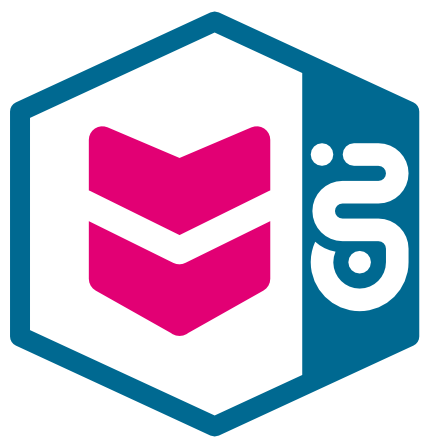
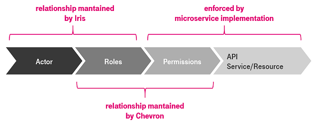
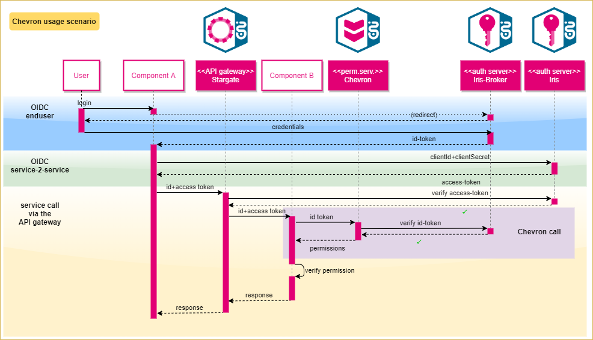
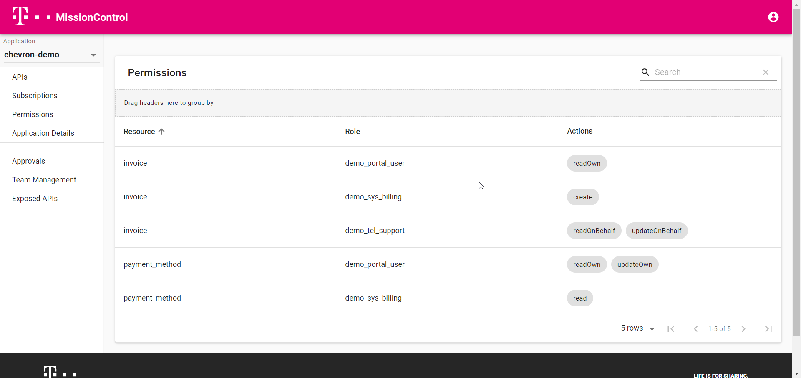
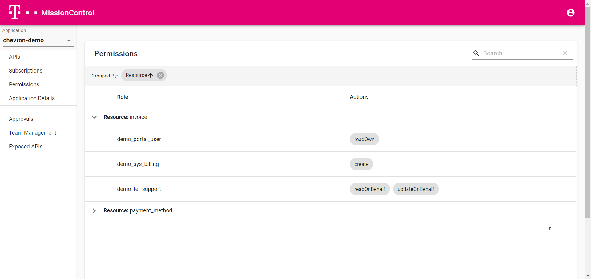
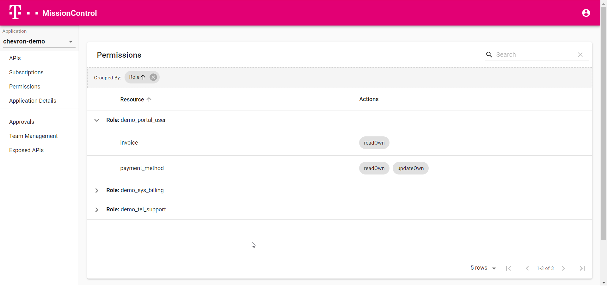

# Chevron

{ width="250" }

## Before you begin

Following abbreviation and names are used in the text below, and should be known to the reader:

|             |                                               |
|-------------|-----------------------------------------------|
| **ENI hub** | is the Service Hub Enterprise Integration |
| **T‧AR‧D‧I‧S** | is an internal product of ENI hub. The name stands for "Telekom architecture for decoupling and integration of services". It consists of infrastructure components supporting other teams in decoupling and integration of microservice-based applications. |
| **Iris-Broker** | is the Identity-Provider component of T‧AR‧D‧I‧S, which is currently based on [Keycloak](https://www.keycloak.org/) |
| **Stargate** | is the API-Gateway component of T‧AR‧D‧I‧S, which is currently based on [Kong](/https://konghq.com/kong/?itm_source=website&itm_medium=nav) |
| **system-cluster** | is a [Kubernetes](https://kubernetes.io/) cluster managed by the ENI hub, which is an important part of T‧AR‧D‧I‧S and is currently available on AWS and CaaS |

!!! info "Iris-Broker vs. Iris"
    There are two different instances of Iris in the system-cluster. One is called "Iris" and is responsible for machine-to-machine authentication and the other one is called "Iris-Broker", which is responsible for issuing ID- tokens and is connected to Telekom user management systems.  
    Chevron integrates with Iris-Broker, so in the following documentation we usually mean "Iris-Broker" when we talk about Iris.

## What is Chevron?

Chevron is a microservice that can be used to implement fine-grained access control for your applications.

It is deployed in the system-cluster and provides a REST-API for all T‧AR‧D‧I‧S customers.
Simplified, the Chevron-API can be described as follows:

- The application (microservice, BFF, UI...) asks Chevron *"What permissions does the role X have?"*
- Chevron answers with a list of permissions, where a permission is a tuple consisting of `{ actions, resource }` which describes one or more actions that are allowed for a certain resource

Of course, there are a few more details in the API like ability to filter for certain data or request different response formats that group the permissions by their resource.

The complete API can be viewed [here](https://developer.telekom.de/catalog/system/Eni/Chevron/2.0.0).

### Details

In a microservice architecture that supports *OpenID Connect* authentication, there are often a nested authorization structure.

- the *OAuth*-token contains a list of roles assigned to the resource owner
- each role is mapped to a concrete set of permissions
- the microservices enforce, that only a user with the proper permission is able to access the dedicated resource.

The first point is usually done by the IdP, which manages the users and their roles. In case of T‧AR‧D‧I‧S, this is done by Iris-Broker.
The last point must be implemented by the individual microservices.

In an agile project, the mapping of roles to permissions is a simple, standardized and schematic task, which however changes regularly, almost as often as the deployment of microservices. For this reason, it makes sense for this task to have its own reusable and configurable component that is part of the data plane.



## Example scenario

Let's imagine, a component A is talking REST to other component B. This can be for instance the backend-for-frontend service which calls an endpoint of another microservice.
In an OIDC microservice architecture, as used by T‧AR‧D‧I‧S, the component A sends an id-token identifying the original author of the request to the component B. Usually it is done in the HTTP-header `X-Auth-Identity`.

Now, the component B wants to verify, if the actor identified by the id-token is allowed to access the specified resource. In this case the component B calls the Chevron-API. In the simplest scenario, component B simply copies the `X-Auth-Identity` header to the Chevron-API call and receives a list of permissions in response. On this turn, Chevron also validates the id-token against the Iris.

Eventually the component B checks whether the resulting permissions correspond allows to perform the requested action.

The following sequence diagram shows a complete T‧AR‧D‧I‧S scenario for a synchronous REST call.
The use-case described above corresponds to the middle part titled "Chevron call".

{ width="80%" }

## Where to start?

In the **_playground_** environment of ENI hub, there is an Iris-Broker as well as Chevron installed, where you can try it out (after consulting your ENI contact person, of course).

!!! info "Demo only setup"
    The playground Iris-Broker installation is setup with some demo user accounts and is not connected to ADFS or any other productive system.  
    If you want to use Chevron integrated with ADFS login and CIAM roles, please head to the section [Integrate your application with Chevron](#integrate-your-application-with-chevron)

The connection parameters are:

| Name          | Value                                                              | Comment                                |
|---------------|--------------------------------------------------------------------|----------------------------------------|
| Iris-Broker endpoint | https://iris-broker-playground.live.dhei.telekom.de/auth           | *required to create id-token*          |
| Iris realm    | user-idp                                                           |                                        |
| Chevron API   | https://stargate-playground.live.dhei.telekom.de/eni/chevron/v2      | *required to call Chevron, must be subscribed to first*             |

!!! note "Subscribe to Chevron"
    In order to consume the Chevron API your applications needs to subscribe to it first, which can be done easily via [Rover](../rover/). 
    Subscriptions to Chevron will be auto-approved, so you can use it right away without waiting for our approval. If the Rover pipeline finished successfully you can verify that your application is now able to use Chevron in [MissionControl](../mission-control/)

## Working with the API

In the following example we will simulate the individual calls with `curl` in a bash. However, since these are simple REST calls, you can also use another common tool like `Postman/Newman` or `httpie`. Additionally we use `fx` to pretty-format the JSON-responses.

Let's save the Chevron Url to en environment variable first:

```bash
export CHEVRON_API="https://stargate-playground.live.dhei.telekom.de/eni/chevron/v2"
```

!!! note "Chevron API requires authentication"
    Since Chevron is an (System) API exposed via Stargate you will need to authenticate with it otherwise you will see an "Unauthorized" message.  
    How to get a valid access token is not part of this particular guide but you can use our postman collection that also contains everything you need in order to get an access token, see more [here](./postman/README.md).

## Get all permissions for an application

Let us get all configured permissions for our demo application first. All you need for this is an application identifier which is the same as your application's Client ID. You can find the right Chevron URL together with your Client ID in [MissionControl->Application details](https://missioncontrol-playground.live.dhei.telekom.de/application_details). The Client ID basically is built from your hub, team name and name of your application separated by "--", for example eni--io-chevron-demo.

**`GET`** `/api/v2/permissions?application=<Your client ID>`

Example:

```bash
curl -X GET $CHEVRON_API/permissions?application=eni--io--chevron-demo
```

Example output:

```json
{
  "filter": {
    "roles": [],
    "resources": []
  },
  "permissions": [
    {
      "actions": [
        "readOnBehalf",
        "updateOnBehalf"
      ],
      "resource": "invoice",
      "role": "demo_tel_support"
    },
    {
      "actions": [
        "create"
      ],
      "resource": "invoice",
      "role": "demo_sys_billing"
    },
    {
      "actions": [
        "readOwn"
      ],
      "resource": "invoice",
      "role": "demo_portal_user"
    },
    {
      "actions": [
        "read"
      ],
      "resource": "payment_method",
      "role": "demo_sys_billing"
    },
    {
      "actions": [
        "readOwn",
        "updateOwn"
      ],
      "resource": "payment_method",
      "role": "demo_portal_user"
    }
  ]
}
```

As you can see, we will get an JSON object as response that holds a list of permissions at the `permissions` key. The combination of the role and the resource makes each entry unique in the list.  
In this example we have three different roles `demo_portal_user`, `demo_sys_billing` and `demo_tel_support` that all have different permissions on the two resources `payment_method` and `invoice`.  

The `filter` field shows what filters has been set. Since we did not set any and asked for all permissions, the filter is empty - which will change in the next example.

## Get permissions that match specific roles

**`GET`** `/api/v2/permissions?application=<Your client ID>&role=<role>`

Example:

```bash
curl -X GET $CHEVRON_API/permissions?application=eni--io--chevron-demo&role=demo_portal_user
```

Example output:

```json
{
  "filter": {
    "roles": [
      "demo_portal_user"
    ],
    "resources": []
  },
  "permissions": [
    {
      "actions": [
        "readOwn"
      ],
      "resource": "invoice",
      "role": "demo_portal_user"
    },
    {
      "actions": [
        "readOwn",
        "updateOwn"
      ],
      "resource": "payment_method",
      "role": "demo_portal_user"
    }
  ]
}

```

!!! info "Special characters"
    If your role contains special characters, they'll need to be URL-encoded.

!!! tip "Advanced filtering"
    You can use the role query parameters multiple times, for example `?role=demo_portal_user&role=demo_tel_support`.  
    In this case you might also want to use `groupByResource=true` in order to group the permissions by their resource.

## Get permissions that match specific roles and resources

Chevron API allows you to narrow the query a bit more by requesting permissions for a certain resource only. This might come handy if you don't want to iterate over a big list of permissions when you only interested whether or not the user is allowed to access a certain resource for example.

**`GET`** `/api/v2/permissions?application=<Your client ID>&role=<role>&resource=<resource>`

Example:

```bash
curl -X GET $CHEVRON_API/permissions?application=eni--io--chevron-demo&role=demo_portal_user&resource=invoice
```

Example output:

```json
{
  "filter": {
    "roles": [
      "demo_portal_user"
    ],
    "resources": [
      "invoice"
    ]
  },
  "permissions": [
    {
      "actions": [
        "readOwn"
      ],
      "resource": "invoice",
      "role": "demo_portal_user"
    }
  ]
}
```

Similar to role filters you can also use the resource filter multiple times.

## Get permissions for an identity token

As mentioned in the example scenario, usually the component B already got an id-token from its downstream. In this case it does not need to parse the token and extract the role names. In this case instead of using role query parameters like in the previous examples we will just pass the token as a HTTP-header `X-Auth-Identity`.    
You can still use role and resource query parameter - if you do so while also providing the `X-Auth-Identity` header, roles from the query parameters will be merged with the roles from the token to form the query. 

!!! caution "Token with no roles"  
    If your token doesn't contain any roles and you also don't pass any role query parameters you will get an empty permissions array as response instead of all existing permissions.

Example:

```bash
curl -X GET --header 'X-Auth-Identity: Bearer eyJhbGci...' $CHEVRON_API/permissions?application=eni--io--chevron-demo
```

## Checking permissions

The Chevron API also provides an endpoint where you can send queries against to check whether a given permission is valid or not for a provided identity token or role. The endpoint will either return "true" or "false" but you can also differentiate the result by the HTTP status code. It's either 200 OK or 403 Forbidden.

**`POST`** `/api/v2/check?application=<Your client ID>`

Example:

```bash
curl -X POST \
--header 'X-Auth-Identity: Bearer eyJhbGci...' \
--header 'Content-Type: application/json' \
--data-raw '{
    "queries": [
        {
            "actions": [
                "create"
            ],
            "resource": "invoice"
        }
    ]
}' \
$CHEVRON_API/check?application=eni--io--chevron-demo
```

Example output (403 Forbidden):

```bash
false
```

Using the parameters almost works here as before expect that `resource` query parameters now will be ignored.
Instead of using an identity token, you can use `role` query parameters.

## Configuring permissions

If you already exposed an API via T‧AR‧D‧I‧S you are probably already familiar with Rover, which will also be your tool for configuring permissions for your applications. You won't need any new files, as you will see in the following you can just use your existing `rover.yaml` file for describing permissions.

### Configuring permissions via Rover

Here's the `rover.yaml` of the demo application (`eni--io-chevron-demo`) that we used above in the Chevron API examples:

```yaml
apiVersion: tcp.ei.telekom.de/v1
kind: Rover
metadata:
  name: chevron-demo
spec:
  zone: aws
  exposures:
  - basePath: /eni-io-chevron-demo
    upstream: http://chevron-demo.playground:8080
  subscriptions:
  - basePath: /eni/chevron/v2
  # This is the new part required for
  # configuring permissions:
  authorization:
  - resource: payment_method
    permissions:
    - role: demo_portal_user
      actions:
      - readOwn
      - updateOwn
    - role: demo_sys_billing
      actions:
      - read
  - resource: invoice
    permissions:
    - role: demo_portal_user
      actions:
      - readOwn
    - role: demo_sys_billing
      actions:
      - create
    - role: demo_tel_support
      actions:
      - readOnBehalf
      - updateOnBehalf
```

It's completely up to you what `resource` and `actions` is referring to.
For example a resource can be a REST endpoint but it does not necessarily needs to be an REST endpoint. The same goes for the actions that do not necessarily need to be valid HTTP verbs. It's up to your application when it comes to interpreting the permissions.

## Viewing permissions in MissionControl

All configured permissions can be viewed in MissionControl for the respective application.
It also allows to do full-text searches over the data and it is possible to group permissions either by their resource or role.  
Currently it's not possible to configure permissions via UI.

Permissions can be accessed by clicking on the "Permissions" navigation entry on the left:


By dragging the "Resource" column header to the grey bar you can group all permissions by resource:


The same applies to the "Role" column header for grouping by role:


## Integrate your application with Chevron

!!! caution "No Iris-Broker Self-Onboarding currently"
    Currently we don't provide a self-onboarding process to use Iris-Broker for human-to-machine communication. Therefore currently a manual step for configuring a new client for your application on Iris-Broker is involved. In future releases this step will be done automatically through rover.

For integrating your (frontend) application with Chevron you need to follow the following steps:

1. Order the respective AD (Active Directory) groups in MyIT for your roles in a self-service manner. This is a required step that must be done before creating any new CIAM roles for your application, since the AD groups must be connected to CIAM roles.
Please follow the steps described here: https://yam-united.telekom.com/pages/workplace-experience/apps/wiki/wiki/list/view/91a8584c-adda-46ab-ba50-53dbd93f32f8 
2. Subscribe to the Chevron API via `rover.yaml`
3. Contact T‧AR‧D‧I‧S [support](https://developer.telekom.de/docs/src/tardis_customer_handbook/support/) and provide the following information
    - environment you would like to use (non-prod or prod)
    - a name of your application, so that T‧AR‧D‧I‧S support can create and configure a new client on Iris broker for you. \
      The name should have the format *hub*--*team*--*appname* for example: `eni--io--my-app-ui`
    - redirect URL of your (frontend) application
    - list of existing CIAM roles you would like to use for your users
4. Integrate your application with Iris-Broker on Preprod or Prod environment by using the OpenID connect authorization code flow

!!! hint "Integration with Iris-Broker" You can integrate with Iris-Broker even before your CIAM roles has been successfully ordered. In that case you will be able to issue ID tokens but no CIAM role will show up in the ID token. This is because we need to get in contact with ADFS in order to pass the CIAM roles from ADFS to Iris-Broker. This is why we would need a list of CIAM roles from you.

### Available Iris-Broker instances

| Issuer URL      | Used for which T‧AR‧D‧I‧S environments? |
|----------|----------|
| https://iris-broker-preprod.live.dhei.telekom.de/auth/realms/adfs | Preprod, QA (av, cit2, cit4, frv, sit, rv, ...) |
| https://iris-broker.prod.dhei.telekom.de/auth/realms/adfs | Production |

!!! hint "Chevron client example application"
    If you need help to integrate with Iris-Broker and Chevron you can download our [example application](#appendix-2-chevron-client-example-application) that shows what to setup in a SpringBoot application.

## Appendix 1 - Playground environment credentials

To try out the guide described above, you will need some demo credentials. 
For instance to create a valid *OpenID Connect* id-token issued by Iris-Broker or trying out the Chevron API by using the "chrevon-demo" consumer.

Credentials for issuing an id-token:

| Username      | Password                                                                 |
|---------------|--------------------------------------------------------------------------|
| hans.beispiel | <details><summary markdown="span">Password</summary>*****</details>      |
| erika.muster  | <details><summary markdown="span">Password</summary>*****</details> |
| test1.user@example.telekom.de  | <details><summary markdown="span">Password</summary>*****</details>      |
| test2.user@example.telekom.de  | <details><summary markdown="span">Password</summary>*****</details>      |
| test3.user@example.telekom.de  | <details><summary markdown="span">Password</summary>*****</details>      |

Credentials for the Chevron demo consumer for issuing a valid access token:

| Client ID             | Client secret |
|-----------------------|---------------|
| eni--io--chevron-demo | <details><summary markdown="span">Secret</summary>*****</details>|

## Appendix 2 - Chevron Client example application

For developers we prepared an example application written in Java/Spring Boot that demonstrates how to integrate with Iris-Broker and the Chevron API in order to retrieve permissions for an ID token.  

You can find all relevant information here: [spring-boot-client-example](spring-boot-client-example/README.md)
