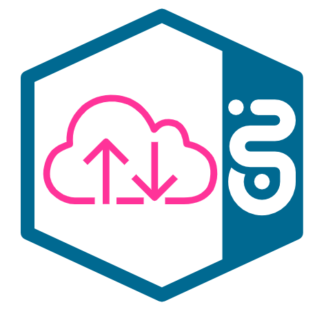

# CloudWalker

{ width=250 }

Your file transfer solution.

## Introduction

CloudWalker is event based asynchronous file transfer over the T‧AR‧D‧I‧S, respecting given gateway limitations.
It is located in T‧AR‧D‧I‧S universe behind the Stargate/Spacegate gateway, uses Iris for authentication, is configured via Rover and notifies customers via Horizon events. 


## What we provide

CloudWalker provides a service to safely transfer files between two or more applications. It delivers files internally and also to external parties. The transfer is resumable and can handle network issues, application downtimes and crashes. It also respects the rules and regulations introduced by the ENI Hub's API gateway. This includes the request payload size limitations.

CloudWalker is currently available in AWS and CaaS platform and is compliant for DE3 and DE4 applications. 

As a base, we provide API endpoints exposed in T‧AR‧D‧I‧S 
To simplify the integration we developed our own sender and recipients clients for almost effortless integration.
For customers in need of bit of customization, but avoiding necessity to start from scratch we offer SDK.

### The API

At its core, our service is an API exposed on the ENI Hub's API gateway. This gives you the most freedom to use CloudWalker in the way that best suits your needs. It also leaves you with a lot of work, as you have to write the integration yourself. Detailed implementation guide can be found [here](#detailed-implementation-guideline).

### The Client applications

To make things easier for you we developed client applications. These are standalone Java applications you can deploy beside your own application. To run clients, it is required to have at least JRE v11 installed in your environment. Set them up once, point them in the right direction and your files will be picked up and transferred automatically. [details](#Connect with the CloudWalker core services)

### The SDKs

In addition to the API and the Clients we provide SDKs, libraries written in Java. These should fill the gap between the client applications that may be too heavy and the API that may be too much work to use. The SDKs, for both the sender and recipient side were inspired by the Amazon SDK for S3. [details](#Connect with the CloudWalker core services)

### Features

The client applications use the SDKs internally, so every feature provided by the SDK is available in the client application as well.

#### Encryption

CloudWalker requires E2E encryption while using provided client application or SDK. The encryption logic is implemented in the SDKs and is in based on OpenPGP. Using encryption is mandatory, thus providing the key is unavoidable. Sender/publisher encrypts payload with public key(s) provided by subscribed recipients. Recipient(s) use their matching private key for decryption. We do not provide any tool for key pair creation.

##### Delivery notifications
As a **sender** you may receive file delivered notification as a confirmation the file has been successfully downloaded by recipient(s).
It is Horizon event triggered by our core service when recipient downloaded complete file. See the [Getting started](#getting-started) section for examples.

#### Compression

Although mandatory encryption comes hand in hand with compression, there might be need to compress data even more. The compression logic is implemented in the SDKs and uses modern compression algorithms. 

#### Custom metadata 

There might be need to send certain information before file transfer itself, to filter incoming communication or trigger different post processing of the file. We enable the option to append custom metadata to transferred file, so sender can attach various information, which will be delivered to recipient with first Horizon notification. Metadata are read from specified folder and need to be uploaded before upload of corresponding file. With current implementation we require a string with max. size of 65kB, which provides enough space and variability. 
Provided recipient client can enable metadata filter. Based on set key:value pair, recipient can filter incoming events. Only the ones matching filter will be downloaded.

#### Custom plugins

While integrating via SDK, we offer customers possibility to use their own custom plugins to either preprocess or post-process the data. 
On sender side, custom plugins will be called before our application logic and prepare the data before the upload. I.e. your application generates detailed logs, but you would like to not ship errors to your partner system. Your custom plugin can filter only relevant lines of the file and leave only this relevant content for upload.
Similar logic applies for recipient side. Our client can process data further after the download. For example move them to another location. Custom plugin will run after our application logic. 

As of version 1.6.0  also recipient client is capable of loading plugins. Plugin is a standalone jar file placed in predefined ${PLUGIN_DIRECTORY}. Client dynamically loads all classes that implements FileProcessor interface in provided folder to the JVM.

#### Customer's mAPI

There might occur a need to check the status of file transfer, or you can be simply curious, how your files are handled. For that case we created couple of endpoints for customers, where you can check the status of your files. Usage instructions, endpoints description and also prepared postman collections can be found [here](https://gitlab.devops.telekom.de/tardis/cloudwalker/-/tree/master/Management%20API).

#### Cloudwalker events

Our system is using events to notify the customers about important file transfer related moments. For example, you will be notified if there is a new file available for you, or someone downloaded your file and the transfer was successful. 
These events are sent via Horizon - the eventing system of T‧AR‧D‧I‧S There are two ways how events can be delivered. We call them delivery types and support *callbacks* and *server sent events*. You are free to choose which delivery type best fits your situation.
Throughout this document, you will find different examples of Cloudwalker events delivery types.

**Callback** - the events are delivered in the payload of an HTTP request made to the URL you specify. This URL needs to be publicly reachable.

**Server sent event** - you can get the events from an API endpoint provided to you in Mission control. You may find it under File type exposure or File type subscription.

Please see the Horizon documentation for more detailed explanation.

#### One application acting as sender and recipient

There is possibility to have one application in Mission Control acting as sender and as a recipient. It means, you can expose and subscribe to filetypes using one application's credentials. However, you still need two separated clients for upload and download. **Clients are not bidirectional.**
Respecting the declarative nature of onboarding, it means that only one rover file must be used for exposure and subscription. 

## How it works

[](img/CW_flow.png)

While writing the implementation, we were inspired by the [TUS](https://tus.io/) protocol. Implementation is no longer compatible, but the idea still stands. And the idea is very simple: take the file, divide it into reasonable parts, transfer the parts, put the file back together on the other side. 

CloudWalker FileVault consists of two core services. Our consumer service consumes data from sender application and our provider service provides data to recipients. 

Sender, as publisher of the files, is in control of all of his exposed filetypes. Sender approves subscription requests from recipients and also sets lifetime of files.
Once the file is uploaded to our FileVault, we store it on a cloud storage. Cloud storage differs based on platform. Successful upload to cloud triggers Horizon event, which sends new file notification to subscribed recipients. 

The recipient can decide if they want the file or not, based on the file metadata (name, extension, size, custom metadata...) sent with the new file notification. If they're interested, they can request the preparation of this file for downloading. Once we're ready to provide it for downloading, the recipient gets a file ready notification and a download link. The FileVault supports HTTP range requests as a way of downloading files.

When the file is downloaded, the sender might get a notification about this event, if subscribed to it.

## Getting started

Using CloudWalker is easy, but the onboarding can be a bit tricky.  One needs to enter T‧AR‧D‧I‧S universe to start using it's components, that's why some prerequisites need to be met. Read the guide below carefully and perform necessary steps for successful integration with us. Please verify, that communication between your applications and T‧AR‧D‧I‧S is enabled. Necessary T‧AR‧D‧I‧S FW clearances are mentioned here [IP addresses] (https://developer.telekom.de/docs/src/tardis_customer_handbook/support/ip-addresses-env/). Please open also port you set for CloudWalker (defaults are 9700 for recipient and 9500 for sender).

Initial step is same for everyone:

 - **register (create team) at Mission control and set up your Gitlab pipeline**

 Afterwards *sender* application needs to

- **define file type**
- **expose file type**

 *Recipient* application needs

- **subscribe for file type(s)**

Below the onboarding steps you may find an example scenario. 

### Register at Mission Control and setup Gitlab pipeline

To interact with products of the ENI Hub, you need to be able to access the API Gateway. API Consumer and Provider who wants to expose/consume any service available on Stargate/Spacegate needs to first create a Team. Please head over to [MissionControl](../mission-control/README.md) and follow their instructions.
For setting up Gitlab pipeline for using rover please follow the steps described in the [StarGate Tutorial](https://developer.telekom.de/docs/src/tardis_customer_handbook/StarGate/Stargate_Step-By-Step_Tutorial/#onboarding-via-mission-control). 
Externals coming from internet please use [Spacegate](../StarGate/Spacegate.md).  

### Sender/publisher exposing files

#### 1. Define file type
File type is a collection of files that you application wants to transfer or share or publish. Something similar to Horizon events. File types could be invoices, reports, billing data, vacation photos.. It does not mean only one type of file e.g. `*.txt` or `*.csv`. For example file type invoices can be collection of `*.txt`, `*.pdf`, `*.cvs` and `*.xml` files. Filetypes are unique per environment in whole T‧AR‧D‧I‧S, thatswhy one filetype can be published by only one sender, but one sender can publish multiple filetypes.

#### 2. Expose your file type

Once you have your file collection ready, you need to expose the filetype so interested recipient(s) are able to subscribe to it.
There are only three information needed for successful exposure:
* description/name of the file type you are publishing
* application name
* zone in which you are located 

If you're interested, you can get notifications when your file gets delivered. This optional **files.delivered** notification is sent, when file has been completely downloaded by a recipient. If you wish to expose the files also for recipients coming from Internet, you need to set visibility to world. 
You can learn more about Cloudwalker events, what they are and how they can be delivered to you in the [Cloudwalker events](#cloudwalker-events) section. 
Here an example of `rover.yaml` file, which you can adapt:

=== "single filetype sender, notifications via callback"

    ```yaml
    apiVersion: "rover.ei.telekom.de/v1"
    kind: "FileSpecification"
    metadata:
      name: "<name of your file type>"
    spec:
      type: "<name of your file type>"
      version: "1.0.0"
      category: "SYSTEM"
    
    ---
    
    apiVersion: tcp.ei.telekom.de/v1
    kind: Rover
    metadata:
      name:  <your sender app name>
    spec:
      zone: <aws, canis, cetus or space>
      exposures:
      - fileType: "<name of your file type>"
      fileDeliveredNotificationsUrl: "https://<HOST:PORT where sender is running>/files/notification-delivered"
      cloudwalkerEventDeliveryType: "callback"
      visibility: world
    ```

=== "single filetype sender, notifications via server sent events"

    ```yaml
    apiVersion: "rover.ei.telekom.de/v1"
    kind: "FileSpecification"
    metadata:
      name: "<name of your file type>"
    spec:
      type: "<name of your file type>"
      version: "1.0.0"
      category: "SYSTEM"
    
    ---
    
    apiVersion: tcp.ei.telekom.de/v1
    kind: Rover
    metadata:
      name:  <your sender app name>
    spec:
      zone: <aws, canis, cetus or space>
      exposures:
      - fileType: "<name of your file type>"
      cloudwalkerEventDeliveryType: "server_sent_event"
      visibility: world
    ```

=== "multiple filetype sender, notifications via callback"

    ```yaml
    kind: "FileSpecification"
    apiVersion: "rover.ei.telekom.de/v1"
    metadata:
      name: "<name of your first filetype>"
    spec:
      type: "<name of your first filetype>"
      version: "1.0.0"
      category: "SYSTEM"
    
    ---
    
    kind: "FileSpecification"
    apiVersion: "rover.ei.telekom.de/v1"
    metadata:
      name: "<name of your second filetype>"
    spec:
      type: "<name of your second filetype>"
      version: "1.0.0"
      category: "SYSTEM"
    
    ---
    
    apiVersion: tcp.ei.telekom.de/v1
    kind: Rover
    metadata:
      name: <your sender app name>
    spec:
      zone: <aws, canis, cetus or space>
      exposures:
      - fileType: "<name of your first filetype>"
        fileDeliveredNotificationsUrl: "https://<HOST:PORT where sender is running>/files/notification-delivered"
        cloudwalkerEventDeliveryType: "callback"
      - fileType: "<name of your second filetype>"
        fileDeliveredNotificationsUrl: "https://<HOST:PORT where sender is running>/files/notification-delivered"
        cloudwalkerEventDeliveryType: "callback"
    ```

=== "multiple filetype sender, notifications via server sent events"

    ```yaml
    kind: "FileSpecification"
    apiVersion: "rover.ei.telekom.de/v1"
    metadata:
      name: "<name of your first filetype>"
    spec:
      type: "<name of your first filetype>"
      version: "1.0.0"
      category: "SYSTEM"
    
    ---
    
    kind: "FileSpecification"
    apiVersion: "rover.ei.telekom.de/v1"
    metadata:
      name: "<name of your second filetype>"
    spec:
      type: "<name of your second filetype>"
      version: "1.0.0"
      category: "SYSTEM"
    
    ---
    
    apiVersion: tcp.ei.telekom.de/v1
    kind: Rover
    metadata:
      name: <your sender app name>
    spec:
      zone: <aws, canis, cetus or space>
      exposures:
      - fileType: "<name of your first filetype>"
        cloudwalkerEventDeliveryType: "server_sent_event"
      - fileType: "<name of your second filetype>"
        cloudwalkerEventDeliveryType: "server_sent_event"
    ```
 
Now, your file type(s) can be found in Mission control under Exposed FileTypes, where any interested recipients can subscribe for them. You are fully in control of your files, so when someone subscribes for them you will be notified and need to approve potential recipients.

### Recipient subscribing to files

You can start with opening Mission control Exposed FileTypes tab and finding the file types you are interested in. 
It is possible to subscribe to more than one file type from one or more publishers.
Again, there are three information needed for successful subscription:
* name of the file type you want subscribe to
* application name
* zone in which you are located 

CloudWalker uses Horizon notification to ensure asynchronous file transfer. Recipients are notified, that sender uploaded new file via **files.new** notification. Consequently, when recipient requests download of the file, he receives **files.ready** notification, which enables him to safely download file.
You can learn more about Cloudwalker events, what they are and how they can be delivered to you in the [Cloudwalker events](#cloudwalker-events) section.

Here an example of `rover.yaml` file, which you can use for subscription:

=== "recipient subscription for single filetype, Cloudwalker events via callback"
```yaml
apiVersion: tcp.ei.telekom.de/v1
kind: Rover
metadata:
  name: <your recipient app name>
spec:
  zone: <aws, canis, cetus or space>
  subscriptions:
  - fileType: "<name of file type you are subscribing to and getting events via callback>"
    fileNewNotificationsUrl: "https://<HOST:PORT where recipient is running>/api/v1/files/notification-new"
    fileReadyNotificationsUrl: "https://<HOST:PORT where recipient is running>/api/v1/files/notification-ready"
    cloudwalkerEventDeliveryType: "callback"
```

=== "recipient subscription for single filetype, Cloudwalker events via server sent events"
```yaml
apiVersion: tcp.ei.telekom.de/v1
kind: Rover
metadata:
  name: <your recipient app name>
spec:
  zone: <aws, canis, cetus or space>
  subscriptions:
  - fileType: "<name of file type you are subscribing to and getting events via server sent events>"
    cloudwalkerEventDeliveryType: "server_sent_event"
```

=== "recipient subscription for multiple filetypes, Cloudwalker events via callback"
```yaml
apiVersion: tcp.ei.telekom.de/v1
kind: Rover
metadata:
  name: <your recipient app name>
spec:
  zone: <aws, canis, cetus or space>
  subscriptions:
    - fileType: "<name of first file type you are subscribing to and getting events via callback>"
      fileNewNotificationsUrl: "https://<HOST:PORT where recipient is running>/api/v1/files/notification-new"
      fileReadyNotificationsUrl: "https://<HOST:PORT where recipient is running>/api/v1/files/notification-ready"
      cloudwalkerEventDeliveryType: "callback"
    - fileType: "<name of second file type you are subscribing to and getting events via callback>"
      fileNewNotificationsUrl: "https://<HOST:PORT where recipient is running>/api/v1/files/notification-new"
      fileReadyNotificationsUrl: "https://<HOST:PORT where recipient is running>/api/v1/files/notification-ready"
      cloudwalkerEventDeliveryType: "callback"
```

=== "recipient subscription for multiple filetypes, Cloudwalker events via server sent events"
```yaml
apiVersion: tcp.ei.telekom.de/v1
kind: Rover
metadata:
  name: <your recipient app name>
spec:
  zone: <aws, canis, cetus or space>
  subscriptions:
    - fileType: "<name of first file type you are subscribing to and getting events via server sent events>"
      cloudwalkerEventDeliveryType: "server_sent_event"
    - fileType: "<name of second file type you are subscribing to and getting events via server sent events>"
      cloudwalkerEventDeliveryType: "server_sent_event"
```

Publisher/sender of the files will be notified about the new subscription and needs to approve it before the actual file transfer is possible. 
You will be notified about approved subscription. 
**Suscriptions made to your own exposed filetypes are approved automatically. Sender and recipient are two different entities. One application can not be sender and recipient at the same time.**

### Connect with the CloudWalker core services

There are multiple options how to do this. As you may have read in the [What we provide](#what-we-provide) you may integrate with the API directly, use the SDKs in your application or use the standalone client application. Please see the [Downloads](#downloads) section for our products.

#### Sending files

##### The sender client application

The CloudWalker sender client application is a Java application that uploads files to the CloudWalker FileVault. It works by monitoring a directory and uploading all files in it. This means that you will have to deploy a standalone application and adjust your business so that the files you want to transport are placed into a directory accessible to this application. Additionally, if you're interested we can notify you through Horizon, the eventing system of T‧AR‧D‧I‧S, when your files are delivered to the recipients.

It works automatically, but requires some configuration. Please see the [Downloads](#downloads) section for more details.

##### The sender SDK

The CloudWalker sender SDK is a Java SDK that facilitates file uploading to the CloudWalker FileVault. It's a good solution when you don't want to or can't deploy a standalone application. Also, it can work with any file and doesn't need a dedicated directory as the client application.

It is easy to configure and use. Please see the [Downloads](#downloads) section for more details.

#### Receiving files

##### The recipient client application

The CloudWalker recipient client application is a Java application that downloads the files from the CloudWalker FileVault. This means that you will have to deploy a standalone application. Cloudwalker events, related to file transfer, will be delivered by Horizon, the eventing system of T‧AR‧D‧I‧S Also, you will need to adjust your business to pick up the files from a download directory.

The application works automatically, but requires some configuration. Please see the [Downloads](#downloads) section for more details.

##### The recipient SDK

The CloudWalker recipient SDK is a Java SDK that facilitates file downloading from the CloudWalker FileVault. It's a good solution when you don't want to or can't deploy a standalone application. It also gives you a a bit more freedom how to process the CloudWalker FileVault events (the file notifications).

It is easy to configure. As the download process is two phased, we recommend to make sure you understand it properly before using the SDK. Please see the [Downloads](#downloads) section for more details.

#### Detailed Implementation Guideline

Here is a specification when you are starting to implement the CloudWalker interface into your application. Apllication flow is described [here](https://gitlab.devops.telekom.de/tardis/cloudwalker/-/blob/master/Application%20flow%20for%20customers%20integrating%20via%20API/Application%20flow%20for%20customers%20integrating%20via%20API), please read carefully whole chapter.
Your messages need to be sent with a Bearer Token obtained from Iris.
If your message was sent successfully, CloudWalker will respond with an HTTP 2xx status code.
CloudWalker API consists of 2 microservices, for sending and receiving files.

##### CloudWalker as Consumer - files uploading

!!! note "API Specifications - Uploading files"
    Here you can find [CloudWalker Consumer API specification](https://developer.telekom.de/swagger-editor/?url=https://developer.telekom.de/docs/src/tardis_customer_handbook/CloudWalker/openapi/swagger-consumer.yaml) for files uploading.

1. Create a location where file will be stored:

2. Upload the file in chunks - maximum size of request body is limited to 4MB. Please note that the chunks need to be uploaded sequentially from the first to the last. In other words, Cloudwalker does not support parallel chunk upload.

3. (Optional) Receive file delivered notification. This is a Horizon event and the payload is in the example below. 
``` json
Header:
Content-Type: application/json
Body:
{
   "time":"datetime added by eventService",
   "id":"UUID",
   "source":"http://apihost/some/path/resource/1234",
   "specversion":"1.0",
   "type":"de.telekom.enihub.cfp.files.delivered.v1--(fileType)",
   "datacontenttype":"application/json",
   "dataref":"http://apihost/some/api/v1/resource/1234",
   "data":{
      "senderId":"(string) name of the application",
      "recipientId":"(string) whom was this file delivered",
	  "eventType":"fileDeliveredEvent",
      "fileId":"(uuid) if of the file",
      "name":"(string) name of the delivered file",
      "extension":"(string) extension of the delivered file",
      "size":"(long) size of the delivered file",
      "checksum":"(string) checksum of the delivered file",
      "date":"(localDateTime) when was the file delivered",
      "fileType":"(string) fileType of the delivered file"
   },
   "dataschema":"http://apihost/schema/definition.json"
}
```

##### CloudWalker as Provider - files downloading

!!! note "API Specifications - Downloading files"
    Here you can find [CloudWalker Provider API specification](https://developer.telekom.de/swagger-editor/?url=https://developer.telekom.de/docs/src/tardis_customer_handbook/CloudWalker/openapi/swagger-provider.yaml) for downloading files.

!!! important
    Events regarding files are broadcasted using Horizon component. Based upon notification, you can ask for file preparation and once file is prepared, you can download it.

1. Await a "file-new" notification. This is a Horizon event and the payload is in the example below.
``` json
Header:
Content-Type: application/json
Body:
{
   "time":"datetime added by eventService",
   "id":"UUID",
   "source":"http://apihost/some/path/resource/1234",
   "specversion":"1.0",
   "type":"de.telekom.enihub.cfp.files.new.v1--(fileType)",
   "datacontenttype":"application/json",
   "dataref":"http://apihost/some/api/v1/resource/1234",
   "data":{
	  "senderId":"(string) identification of sender of this file",
	  "eventType":"newFileEvent",
      "fileId":"(uuid) if of the new file",
      "name":"(string) name of the new file",
      "extension":"(string) extension of the new file",
      "size":"(long) size of the new file",
      "expirationDate":"(localDateTime) file is available to download until this time",
      "encrypted":"(boolean) flags if you need to decrypt the new file",
      "compressed":"(boolean) flags if you need to decompress the new file",
      "customMetadata":"(string) additional data provided by the sender of the new file",
      "fileType":"(string) fileType of the new file"
   },
   "dataschema":"http://apihost/schema/definition.json"
}
```

2. Request a download prepare

3. Await a "file-ready" notification. This is a Horizon event and the payload is in the example below.
``` json
Header:
Content-Type:   application/json
Body:
{
   "time":"datetime added by eventService",
   "id":"UUID",
   "source":"http://apihost/some/path/resource/1234",
   "specversion":"1.0",
   "type":"de.telekom.enihub.cfp.files.ready.v1--(fileType)",
   "datacontenttype":"application/json",
   "dataref":"http://apihost/some/api/v1/resource/1234",
   "data":{
	  "senderId":"(string) identification of sender of this file",
	  "eventType":"fileReadyEvent",
      "fileId":"(uuid) if of the ready file",
      "name":"(string) name of the ready file",
      "extension":"(string) extension of the ready file",
      "size":"(long) size of the ready file",
      "expirationDate":"(localDateTime) file is available to download until this time",
      "encrypted":"(boolean) flags if you need to decrypt the ready file",
      "compressed":"(boolean) flags if you need to decompress the ready file",
      "customMetadata":"(string) additional data provided by the sender of the ready file",
      "directDownloadLink":"(string) append this to the base recipient endpoint from mission control",
      "fileType":"(string) fileType of the ready file"
   },
   "dataschema":"http://apihost/schema/definition.json"
}
```

4. Download chunk of file using HTTP range requests - maximum size of request body is limited to 4MB.

5. Validate the checksum of the downloaded file using SHA256 algorithm.

### Example

So lets say that Alice and Bob are friends and they both develop applications at Telekom. At some point they decide they want to cooperate because Bob's application could really use the files that Alice's application creates. But how can they get the files from one app to the other? This is where CloudWalker comes into play. Let's get them started!

#### Register at Mission Control

No way around this. If you want to use ENI HUB stuff, you need access via [MissionControl](../mission-control/README.md).

#### File types exposure

Alice wants to **publish** files so she comes up with unique name for her files collection and expose those file types. The file she uses for her pipeline could look like this

```yaml
kind: "FileSpecification"
apiVersion: "rover.ei.telekom.de/v1"
metadata:
  name: "alice-awesome-reports"
spec:
  type: "alice-awesome-reports"
  version: "1.0.0"
  category: "SYSTEM"

---

apiVersion: tcp.ei.telekom.de/v1
kind: Rover
metadata:
  name:  alice-awesome-sender-app
spec:
  zone: aws
  exposures:
  - fileType: "alice-awesome-reports"
    fileDeliveredNotificationsUrl: "https://alices-application-host/files/notification-delivered"
    cloudwalkerEventDeliveryType: "callback"
```

Please note that the file.delivered notification is optional, depending on whether you want file delivery confirmations or not.
Alice is in complete control of her exposed file types and her approval is required every time someone subscribes for them. 
In this case Alice is choosing to have her Cloudwalker events delivered via callback and she specifies her publicly available endpoint, where she will receive them. Please see the [Cloudwalker events](#cloudwalker-events) section  for more information.

#### File types subscription

Bob wants to **receive** files so he checks in Mission control Exposed FileTypes produced by Alice and subscibes to them. The file he uses for his pipeline could look like this

```yaml
apiVersion: tcp.ei.telekom.de/v1
kind: Rover
metadata:
  name: bobs-epic-recipient-app
spec:
  zone: cetus
  subscriptions:
  - fileType: "alice-awesome-reports"
    cloudwalkerEventDeliveryType: "server_sent_event"
```
Alice is automatically notified that Bob subscribed to her file type and can approve or reject the subscription via Mission control. Bob gets notification about approval of his subscription.
The client application supports multiple ways of receiving Cloudwalker events. See the client documentation for details.
In this case, Bob decided he wants to get Cloudwalker events via the server sent event delivery type. Please see the [Cloudwalker events](#cloudwalker-events) section  for more information.

#### Connect with the CloudWalker FileVault

Now everything is set up for CloudWalker to transfer their files. Alice decides she wants to use the Sender SDK. So she integrates it into her application. Bob is comfortable with the CloudWalker recipient client application and so he deploys in beside his business application.
Now when Alice sends a file, Bob will receive it. 


## Downloads

=== "Sender"

	As a **Sender** you may find the

    * CloudWalker Sender Client Application (latest  released on 2023-06-26) [here](https://gitlab.devops.telekom.de/tardis/cloudwalker/-/tree/master/Upload%20Client),
    * CloudWalker Sender SDK [here](https://gitlab.devops.telekom.de/tardis/cloudwalker/-/tree/master/Upload%20SDK)
    
    **While upgrading the client to newer version, please ensure, that configuration file is adapted as well.**
     New readme containing examples with mandatory and optional configuration values can be found in dedicated folder per sender client. 
    In case of SDK, please refer to current documentation of SDK for provided examples
    Client and SDK can be found in Artifactory [here](https://artifactory.devops.telekom.de/ui/native/tardis-gradle/de/telekom/enihub/), please contact us for access rights. 

=== "Recipient"

    As a **Recipient** you may find the

    * CloudWalker Recipient Client Application (latest  released on 2023-06-26) [here](https://gitlab.devops.telekom.de/tardis/cloudwalker/-/tree/master/Download%20Client),
    * CloudWalker Recipient SDK [here](https://gitlab.devops.telekom.de/tardis/cloudwalker/-/tree/master/Download%20SDK).

    **While upgrading the client to newer version, please ensure, that configuration file is adapted as well.**
      New readme containing examples with mandatory and optional configuration values can be found in dedicated folder per recipient client.
    In case of SDK, please refer to current documentation of SDK for provided examples
     Client and SDK can be found in Artifactory [here](https://artifactory.devops.telekom.de/ui/native/tardis-gradle/de/telekom/enihub/), please contact us for access rights.

## Contact us

Please use our ticketing tool for any issues occurred during onboarding or use of our product [GARD for CloudWalker](https://jira.telekom.de/servicedesk/customer/portal/522/group/2776)

In case of any ideas, need of additional features or new requirements feel free to contact us at [team Deimos](mailto:DTIT_ENI_Hub_Team_Deimos@telekom.de).

