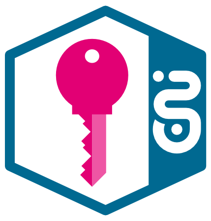
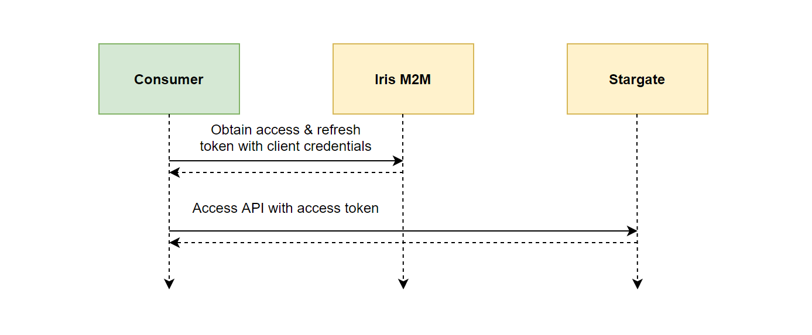
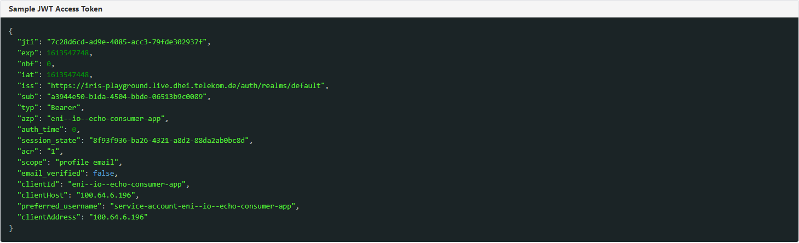
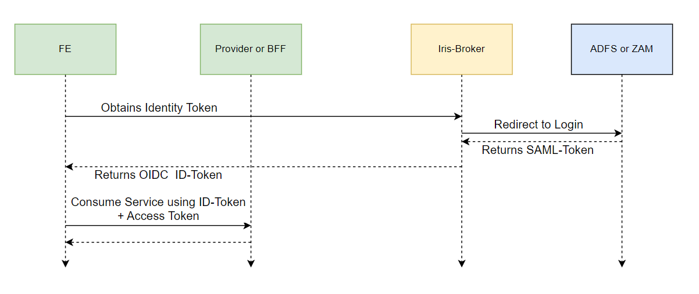

# IRIS



**OpenID Connect Identity Server based on Keycloak and customized for Enterprise use**

!!! info
   We provide IRIS in two flavors

## IRIS M2M (Machine 2 Machine)

IRIS enables Authentication and Authorization for published APIs on StarGate.

It's integrated with the Stargate and our customers don't need to do any special configuration here.

!!! attention
   As soon as you publish any API on StarGate, the API is automatically secured with OpenID Connect, and it can only be
   accessed through an Access Token (Client Credential Flow) by subscribed consumers.

To communicate via the Stargate API-gateway, a valid access token is required. These access tokens can be obtained by
requesting them through the "Client Credential Flow" (Machine-to-Machine use-case) at Iris (Keycloak IDP).

### Requirements:

To properly use the "Client Credential Flow" (Machine-to-Machine flow) for API communication, you need to go through the
following steps:

1. API Subscription Process: As a consumer, you need to subscribe to the API you want to access through the Stargate
   API-gateway. This subscription process typically involves registering your application or service with the API
   provider and obtaining necessary credentials, such as a client ID and client secret.

2. Configuration Flow: Once you have subscribed to the API, you will need to configure your application or service to
   use the "Client Credential Flow." This involves setting up the correct authentication mechanism to obtain access
   tokens from the Identity Provider (Iris or Keycloak IDP in this case) using the client credentials (client ID and
   client secret) obtained during the subscription process.

With the proper API subscription and configuration in place, your application or service will be able to request and
obtain valid access tokens through the "Client Credential Flow" and use them to communicate with the Stargate
API-gateway securely.



After obtaining access and refresh tokens, the access token can be utilized to perform requests to APIs exposed on
Stargate. However, the provided access token has a limited validity period. Once this time-frame elapses, a new (and
valid) access token must be obtained by using the refresh token.

For details refer to:

### Access Token Validation

!!! attention
   **Stargate** will perform the following validations for each request

- verify signature of access token
- verify if the access token is not expired by checking the 'exp' claim.
- verify issuer (iss claim) against trusted issuers
- verify if consumer (azp claim) is whitelisted in access control list on Stargate

More detailed information can be found on [AuthO](https://auth0.com/docs/flows/client-credentials-flow).



### Setting Access Token Scope

The OAuth specification isn't entirely precise when it comes to the "scope" attribute.
It says if scope is not set, the server either have to use a default value or
fail [RFC 6749](https://datatracker.ietf.org/doc/html/rfc6749#section-3.3).

Currently, the scopes are not used by T‧AR‧D‧I‧S However, in our tests we found, that some tools tend to send an empty
string as scope (eg `scope=""`).

For this reason we strongly recommend not sending the scope attribute if not required. (If it is not possible, please
use at least one of the predefined values `tardis` or `openid`)

Below is an example with curl.

!!! success "recommended usage"

    `curl -u "$CLIENT_ID:$CLIENT_SECRET" -X POST $IRIS_BASE_URL/protocol/openid-connect/token -d grant_type=client_credentials -d client_id=$CLIENT_ID -d client_secret=$CLIENT_SECRET`

!!! success "also accepted"

    `curl -u "$CLIENT_ID:$CLIENT_SECRET" -X POST $IRIS_BASE_URL/protocol/openid-connect/token -d grant_type=client_credentials -d scope=tardis -d client_id=$CLIENT_ID -d client_secret=$CLIENT_SECRET`

!!! failure "unsupported"

    `curl -u "$CLIENT_ID:$CLIENT_SECRET" -X POST $IRIS_BASE_URL/protocol/openid-connect/token -d grant_type=client_credentials -d scope="" -d client_id=$CLIENT_ID -d client_secret=$CLIENT_SECRET`

### Using Refresh-Token for `client_credential` Grant

According to the [OAuth2 specification, chapter 4.4](https://www.rfc-editor.org/rfc/rfc6749#section-4.4.3)
regarding `client_credential` grant the refresh token should not be included:
> If the access token request is valid and authorized, the authorization server issues an access token as described in
> Section 5.2. However, a refresh token SHOULD NOT be included.

Starting with the update from May 2022, we disabled the issuance of refresh tokens, following the recommendation by the
specification. However, to ensure a seamless transition for our customers, we provided this functionality as an option
for an interim period if a customer explicitly requested it.

## IRIS Broker H2M (Human 2 Machine)

IRIS Broker provides a federation towards IAM systems in Telekom.

IRIS Broker is integrated with:

- ADFS (Active Directory Federation Services) is a service that provides out-of-the-box login and CIAM (Customer
  Identity and Access Management) roles for Telekom in the EMEA1 and EMEA2 regions.
- ZAM (Zentrales Account Management) is a centralized account management system that provides user accounts for both
  internal and external users.
- AzureAD (Azure Active Directory) is a cloud-based identity and access management service, which will replace ADFS in time.

To access personal data, an identity token must be provided and verified. This identity token can be created using ADFS
login in the EMEA1 and EMEA2 regions and ZAM login. An example token is depicted below:



!!! note
   IRIS Broker is exclusively used to obtain an ID Token for an end user. The Frontend application still adheres to the
   Authorization Code flow to acquire an ID Token from IRIS Broker.

!!! Important
   ID tokens are not evaluated by StarGate. This means, when using StarGate, you are not required to provide any ID Token.

!!! Important
   Chevron is a service used to map or resolve Roles to Permissions based on the information present in the ID Token.

!!! Important
   To perform a ZAM login, a user account in ZAM and the dedicated 'tardis_user' role are required. To request a user
   account and order the role, please follow these [instructions](zam_instructions.md).

Identity Token derived from ADFS

```json
{
  "exp": 1691519671,
  "iat": 1691490871,
  "auth_time": 1691490727,
  "jti": "7e3f6580-bbec-4ab8-ab46-23464f1ab628",
  "iss": "https://iris-broker.prod.dhei.telekom.de/auth/realms/adfs",
  "aud": "eni--io--testclient",
  "sub": "5019c915-efcc-4a0f-9b7f-c7d7142f651c",
  "typ": "ID",
  "azp": "eni--io--testclient",
  "session_state": "199155c1-adda-433c-b1e1-4dfeabdff943",
  "at_hash": "LTHhr3D9W3mwlB_yhsGdUg",
  "sid": "199155c1-adda-433c-b1e1-4dfeabdff943",
  "email_verified": false,
  "roles": [
      "ROL_1234_role1",
      "role2",
      "role3"
  ],
  "name": "Konstantin Priluchnyi",
  "preferred_username": "emea2\\a113649xxx",
  "given_name": "Konstantin",
  "family_name": "Priluchnyi",
  "email": "konstantin.priluchnyi@telekom.com"
}
```

Identity Token derived from ZAM

```json
{
  "exp": 1691491241,
  "iat": 1691490941,
  "auth_time": 1691490400,
  "jti": "5d34d062-695b-4f9a-9dbc-874452283562",
  "iss": "https://iris-broker.prod.dhei.telekom.de/auth/realms/zam",
  "aud": "zam_test_client",
  "sub": "f:9f9a297e-8323-41a4-884d-22f684bc758c:Konstantin.Priluchnyi@telekom.com",
  "typ": "ID",
  "azp": "zam_test_client",
  "session_state": "76dd80d6-4d90-443a-a078-40b30cb574e7",
  "at_hash": "MAP7YwJQl5Imy-pSWRRdVw",
  "acr": "0",
  "sid": "76dd80d6-4d90-443a-a078-40b30cb574e7",
  "email_verified": false,
  "roles": [
      "cn=Rollen_tardis_user,ou=TARDIS,ou=Groups,o=t-online"
  ],
  "name": "Konstantin Priluchnyi",
  "location": "Thessaloniki",
  "company": "Deutsche Telekom Cloud Services Greece DTIT",
  "preferred_username": "konstantin.priluchnyi@telekom.com",
  "given_name": "Konstantin",
  "family_name": "Priluchnyi",
  "email": "konstantin.priluchnyi@telekom.com"
}
```

### Available Iris-Broker instances

| Issuer URL                                                               | Purpose                                                                                                                                           | 
|--------------------------------------------------------------------------|---------------------------------------------------------------------------------------------------------------------------------------------------|
| https://iris-broker-playground.live.dhei.telekom.de/auth/realms/user-idp | *Trying out the integration with Iris-Broker. This issuer is not connected to ADFS but comes with preconfigured dummy accounts (see hint below).* |
| https://iris-broker-preprod.live.dhei.telekom.de/auth/realms/adfs        | *Integrating any non-production application with Iris-Broker. Connected with production ADFS.*                                                    |
| https://iris-broker.prod.dhei.telekom.de/auth/realms/adfs                | *Integration of applications in production with Iris-Broker. Connected to production ADFS.*                                                       |

For integrating your (frontend) application with Iris-Broker you need to follow the following steps:

1. Contact T‧AR‧D‧I‧S [support](https://developer.telekom.de/docs/src/tardis_customer_handbook/support/) and provide the
   following information
    - the environment you would like to use (non-prod or prod)
    - the name of your application, so that T‧AR‧D‧I‧S support can create and configure a new client on Iris broker for
      you. \
      The name should have the format *hub*--*team*--*appname* for example: `eni--io--my-app-ui`
    - redirect URL of your (frontend) application
2. Integrate your application with Iris-Broker (either Preprod or Prod instance) by using the OpenID Connect
   authorization code flow and the following OIDC endpoints (can be tested with Postman):
    - Auth URL: `{Issuer URL}/protocol/openid-connect/auth`
    - Access Token URL: `{Issuer URL}/protocol/openid-connect/token`

!!! hint
   Trying out Iris-Broker Integration Locally: As a developer, you can easily experiment with integrating your
   locally-running application with Iris-Broker by utilizing the authorization code flow.
   Use `https://iris-broker-playground.live.dhei.telekom.de/auth/realms/user-idp` as the issuer, demo as the client-id,
   and `http://localhost:8080/` (or `http://localhost:3000/`) as the Callback-URL. Leave the client-secret empty. For demo
   accounts, refer to [## Appendix 1 - Iris-Broker demo accounts](#appendix-1---iris-broker-demo-accounts).

### Receiving CIAM roles in Iris-Broker token

In order to receive application-specific CIAM (Customer Identity and Access Management) roles in the ID-token, certain
preconditions must be met. Follow this guide to ensure the roles are properly configured, and Active Directory
whitelists the roles for T‧AR‧D‧I‧S:

1. Order the corresponding AD (Active Directory) groups in MyIT for your roles through the self-service portal. This is
   a necessary step to complete before creating any new CIAM roles for your application, as the AD groups must be
   associated with the CIAM roles.
   Please follow the steps described
   here: https://yam-united.telekom.com/pages/workplace-experience/apps/wiki/wiki/list/view/200b7d3c-9262-48d1-ac84-fd4616c13dd2
2. Contact T‧AR‧D‧I‧S [support](https://developer.telekom.de/docs/src/tardis_customer_handbook/support/) and provide the
   following information

- the environment you would like to use (non-prod or prod)
- your clientId as described in the previous paragraph (for example: `eni--io--my-app-ui`)
- the list of existing CIAM roles you would like to use for your users.

Demo accounts in playground already have some example roles.

!!! hint
   If the points mentioned above are met, and you have received a confirmation message regarding your T‧AR‧D‧I‧S-ticket, you
   can proceed to obtain an Identity-Token (e.g., using Postman) and inspect the token claims. Upon inspection, you should
   observe your roles displayed in a manner similar to the role "tardis.admin" as shown in the Identity-Token screenshot
   provided earlier.

## Appendix 1 - Iris-Broker demo accounts

Demo accounts pre-configured for Iris-Broker playground instance (user-idp realm):

| Username                      | Password                                                               | 
|-------------------------------|------------------------------------------------------------------------|
| hans.beispiel                 | <details><summary markdown="span">Password</summary>*****</details> |
| erika.muster                  | <details><summary markdown="span">Password</summary>*****</details> |
| test1.user@example.telekom.de | <details><summary markdown="span">Password</summary>*****</details>    |
| test2.user@example.telekom.de | <details><summary markdown="span">Password</summary>*****</details>    |
| test3.user@example.telekom.de | <details><summary markdown="span">Password</summary>*****</details>    |
