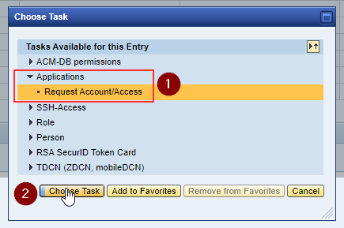

# ZAM instructions
## How to get ZAM account?
Open https://zam.telekom.de/pwd/registration.do and enter your email address to register in ZAM.
For Externals without ...@external.telekom.de email address, somebody inside DTIT must create the ZAM account.

## How to get tardis_user role?
After logging in to ZAM (https://zam.telekom.de/) select the "Manage/Verwaltung" tab and "Create/Anlegen" (note that the table must show "Approval-Requests/Anträge")

Select "Applications/Anwendungen" -> "Request Account/Access"/"Benutzerkennung/Berechtigung beantragen"

Now select "T‧AR‧D‧I‧S" -> "Rollen" -> "tardis_user"

