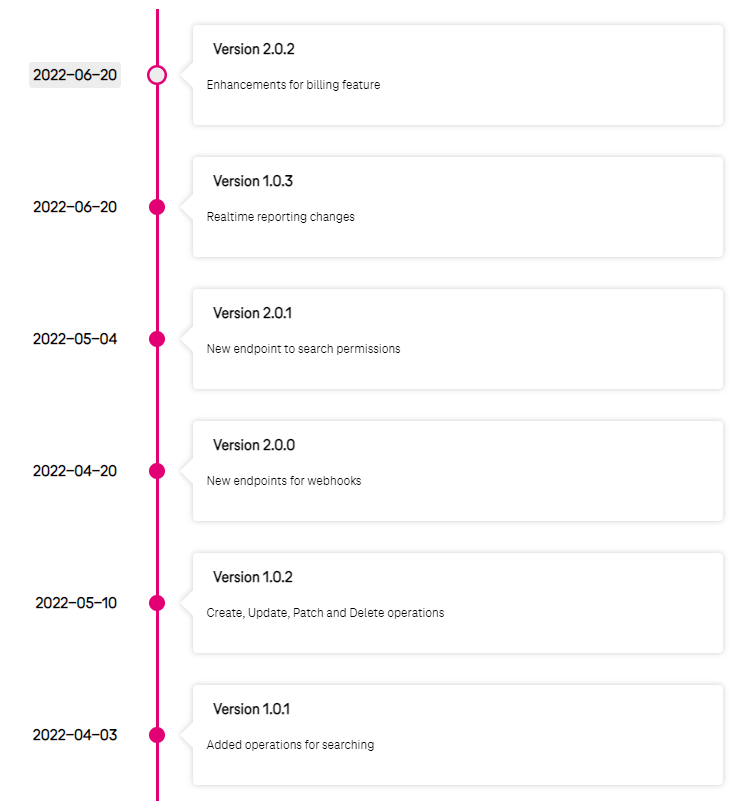

# API Changelog

## Overview

API changelog represents a log of all changes to the API and the versions.

This solution is based on Rover tool and requires additional steps to start using it.

### Step 1. Start using Rover

Before creating an API changelog you must provide your API using Rover tool. 

You can find Rover's documentation [here](../rover/README.md).

### Step 2. Create a `changelog.yaml`

To show API changelog you need to create a *changelog.yaml* file as follow:

```yaml
apiVersion: "rover.ei.telekom.de/v1"
kind: "ApiChangelog"
metadata:
  name: "eni-atlas-changelog-test"
spec:
  basePath: "/eni/atlas-changelog-test/v1"
  items:
    - date: "2022-06-20"
      version: "2.0.2"
      versionUrl: "https://developer.telekom.de"
      description: "Enhancements for billing feature"
    - date: "2022-06-20"
      version: "1.0.3"
      description: "Realtime reporting changes"
    - date: "2022-05-04"
      version: "2.0.1"
      description: "New endpoint to search permissions"
    - date: "2022-04-20"
      version: "2.0.0"
      versionUrl: "https://developer.telekom.de"
      description: "New endpoints for webhooks"
    - date: "2022-05-10"
      version: "1.0.2"
      description: "Create, Update, Patch and Delete operations"
    - date: "2022-04-03"
      version: "1.0.1"
      description: "Added operations for searching"    
```

| **Attribute**    |  **Required**  | **Description**                                                                                                                                                                         |
| -------------|-------------|-----------------------------------------------------------------------------------------------------------------------------------------------------------------------------------------|
| `name` | Yes | The name of your API changelog.                                                                                                                                                         |
| `basePath` | Yes | Base path in OAS Specification.                                                                                                                                                         |
| `items` | Yes | List of all changes to all APIs. Items count is not restricted at all.                                                                                                                  |
| `items.date` | Yes | Release date of API changes. Expected format `yyyy-MM-dd`. [See more](https://www.iso.org/iso-8601-date-and-time-format.html).                                                          |
| `items.version` | Yes | Release version of API changes. Expected format `MAJOR.MINOR.PATCH`. [See more](https://semver.org).                                                                                    |
| `items.versionUrl` | No | Link API changelog to external sites. If it is set then `items.version` will be clickable. *For example: URL to the site that describes changes more precisely*.                        |
| `items.description` | Yes | It serves for describing changes included in release version. `Description` doesn't have any restriction to size, but is rather pure free text without any support for text decoration. |

The `items` will be ordered automatically based on `date` and `version`. The newer `items` will be presented on portal always on the top.

The example of the changelog presented on portal below:


### Step 3.1. Remove the previous changelog

If you haven't provided a changelog yet just skip this step.

An API's changelog removal is similar to [removing any resources via Rover](https://developer.telekom.de/docs/src/tardis_customer_handbook/rover/#clearing).

Using your Rover's token for a specific environment execute the next command in your pipeline:

```shell
roverctl delete -f <absolute-path to changelog.yaml/>
```

### Step 3.2. Expose the new changelog

If a version of your API was changed (e.g. from `/.../v1` to `/.../v2`) please remove the previous changelog, change the base path inside the `changelog.yaml` and expose the new one.

An API's changelog exposing is similar to [exposing any resources via Rover](https://developer.telekom.de/docs/src/tardis_customer_handbook/rover/#expose).

Using your Rover's token for a specific environment execute the next command in your pipeline:

```shell
roverctl apply -f <absolute-path to changelog.yaml/>
```

!!! attention "Important"
    Rover validates the `items.date` and `items.version` formats from `changelog.yaml` file. Make sure the correct formats please see section **Step 2. Create a changelog.yaml**.

### Step 4. Wait for synchronization

Our portal synchronizes with Rover:
  - Using webhook. Portal is notified immediately after exposing API Spec.
  - Once a day. Synchronization is scheduled at the night.

Exposed multiple API changelogs on different environments will be shown on the portal based on environment priority.
The highest priority is `Production` and the lowest priority is `Playground`.

E.g., you exposed the changelog on `Production` and `Preproduction` -> `Production` is shown. Then you removed the changelog from `Production` -> `Preproduction` will be shown.
