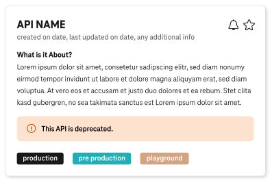
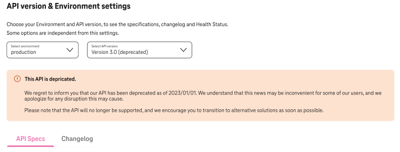

# API Deprecation

## Overview

When an API's version becomes out of support you are able to mark it's as deprecated.
All subscribers will be informed about this change via email.

### Step 1. Adjust your API specification

If you want to mark a specific API's version as deprecated you need to add additional tags into the specification.

Inside **`info`** section add the next two tags:

1. **`x-api-deprecated: "true"`**
2. **`x-api-deprecated-info: "Reason_and/or_contact_information"`**

**`x-api-deprecated: "true"`** is mandatory tag because by default APIs are not deprecated.

**`x-api-deprecated-info: "...""`** is optional. Here you are able to put some details, so subscribers will know why this API was deprecated, whom to contact for an explanation or what version should be used instead of deprecated one.

```yaml
swagger: "2.0"
info:
  title: "Deprecated API"
  description: "This API is deprecated."
  version: "1.0.0"
  x-api-category: "SYSTEM"
  x-api-deprecated: "true"
  x-api-deprecated-info: "There is a critical issue, please, use version v2 instead of v1. V1 is going to be disabled at 01.01.2024. For more details feel free to contact our team: DTIT_ENI_Hub_Team_Atlas@telekom.de"
host: "serverRoot"
basePath: "/eni/maverick-deprecated-api/v1"
```

### Step 2. Apply updated specification using Rover

Using your Rover's token for a specific environment execute the next command in your pipeline:

```shell
roverctl apply -f <absolute-path to api specification/>
```

### Step 3. Wait for changes to be applied in the portal

After the changes been applied on the portal your API will look differently.

If all versions of an API were deprecated, its tile on the main page will look like on the picture below:



If only a specific version of an API was deprecated, the detail page will look like:



!!! Note
    The info below the `This API is deprecated` title will be taken from the **`x-api-deprecated-info: "...""`** tag.
    If this tag was not added to the API specification a default message will be shown.
