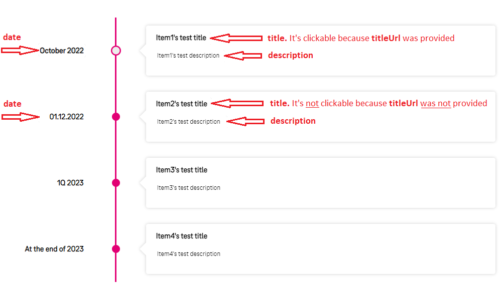

# API Roadmap

## Overview

API roadmap is a feature that allows API maintainers to provide a roadmap of upcoming updates.

This solution is based on Rover tool and requires additional steps to start using it.

!!! note "Demo"
    Demo API with Roadmap you can find here: https://developer.telekom.de/catalog/eni/eni-maverick-roadmap-test/system/preproduction/1.0.0

### Step 1. Start using Rover

Before creating an API roadmap you must provide your API using Rover tool. 

You can find Rover's documentation [here](../rover/README.md).

### Step 2. Create a `roadmap.yaml`

An example of *roadmap.yaml* is below:

```yaml
apiVersion: "rover.ei.telekom.de/v1"
kind: "ApiRoadmap"
metadata:
  name: "eni-atlas-roadmap-test"
spec:
  basePath: "/eni/atlas-roadmap-test/v1"
  items:
    - date: "October 2022"
      title: "Item1 test title"
      titleUrl: "https://developer.telekom.de/"
      description: "Item1 test description"
    - date: "01.01.2023"
      title: "Item2 test title"
      description: "Item2 test description"
    - date: "1Q 2023"
      title: "Item3 test title"
      titleUrl: "https://42.telekom.de/"
      description: "Item3 test description"
    - date: "At the end of 2024"
      title: "Item4 test title"
      description: "Item4 test description"
```
The roadmap will be shown on an API details page as seen on the image below:


The next fields are mandatory:

1. `metadata.name`
2. `spec.basePath`

If you have more than one API and want to show a roadmap for each of them you have to create separate `roadmap.yaml` files with unique `metadata.name` and `spec.basePath`.

We suggest using **`metadata.name`** based on **`spec.basePath`** to avoid duplicates. 

E.g. the base path is `/eni/atlas-roadmap-test/v1` and it would be better to set the **`metadata.name`** as `eni-atlas-roadmap-test` (just remove all slashes and version at the end).

The next fields are not mandatory but without them, we will not be able to show the roadmap correctly:

1. `spec.items.date`
2. `spec.items.title`
3. `spec.items.description`

For better showing we suggest restricting `spec.items.date` up to 20 and `spec.items.title` up to 200 characters.

If **`spec.items.titleUrl`** is set, the **`title`** will be clickable. It's convenient when you want to share with others a related epic/story/task in JIRA or a link to a documentation.

The items order is important. Please, provide the items in chronological order. The fields **`date`** are strings, we are not able to sort them. This also gives you flexibility to set date format as you wish `DD-MM-YYYY`, or `Q2 2038`, or `Christmas 2045`.

### Step 3.1. Remove the previous roadmap

If you haven't provided a roadmap yet just skip this step.

An API's roadmap removal is similar to [removing any resources via Rover](https://developer.telekom.de/docs/src/tardis_customer_handbook/rover/#clearing).

Using your Rover's token for a specific environment execute the next command in your pipeline:

```shell
roverctl delete -f <absolute-path to roadmap.yaml/>
```

### Step 3.2. Expose the new roadmap

If a version of your API was changed (e.g. from `/.../v1` to `/.../v2`) please remove the previous roadmap, change the base path inside the `roadmap.yaml` and expose the new one.

An API's roadmap exposing is similar to [exposing any resources via Rover](https://developer.telekom.de/docs/src/tardis_customer_handbook/rover/#expose).

Using your Rover's token for a specific environment execute the next command in your pipeline:

```shell
roverctl apply -f <absolute-path to roadmap.yaml/>
```

### Step 4. Wait for synchronization

Our portal synchronizes with Rover each two hours.

If you expose a roadmap with the same base path on different environments only one (the one from the highest priority environment) will be shown.

The priority is: Playground -> PreProduction -> Production
