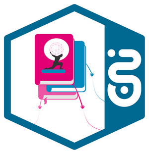
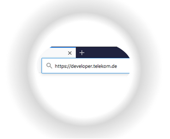
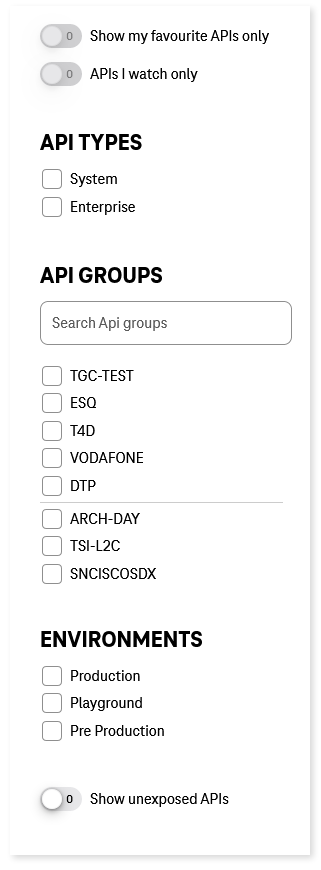
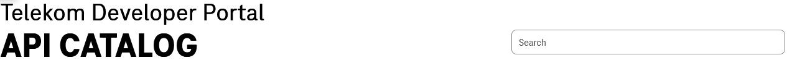
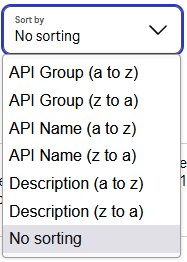
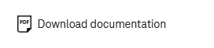
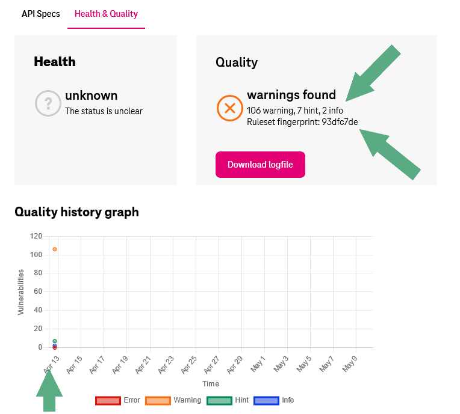
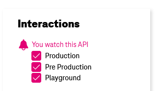

# Maverick

{ width=250 }

Maverick is our [**Developer Portal**](https://developer.telekom.de) and we are the [Atlas Team](mailto:DTIT_ENI_Hub_Team_Atlas@telekom.de) from the T‧AR‧D‧I‧S who is building it.

!!! Note
    You can give us [feedback](mailto:fmb_tardis_support@telekom.de) at any time.

!!! Note "Support"
    Support is done via Tickets, please refer to [Support Page](../support/README.md).

## Where I can find Developer Portal

- Use your laptop connected to the intranet or internet
- Use Firefox or Chrome or any other Browser.
- Simply type [https://developer.telekom.de](https://developer.telekom.de) in your Browser and hit Enter.

[](https://developer.telekom.de)

## Maverick parts

### Catalog

On a Catalog Page you have different API views:

- [X] Different [API Categories](https://developer.telekom.de/docs/src/api_standards_conventions/2_basics/api-categories/).
- [X] [Documentation only](https://developer.telekom.de/catalog?view=tile&page=1&limit=6&showUnexposed=true) APIs (with no active backends)
- [X] Show you [favorite](https://developer.telekom.de/catalog?showFavorites=true) or your [watched](https://developer.telekom.de/catalog?showWatched=true) APIs only.
- [X] Many more, simply visit our [Catalog](https://developer.telekom.de/catalog) with search and Filter Functions.

We build common Catalog for you, where you can filter your needed Information, or search for an API.



You can use Search to find relevant APIs in catalog:



Search starts from 3d symbol and will searching over different Fields with different Priority:

1. First you will see all APIs Specifications with matches in the API Title,
2. Then you will see all API Specifications with matches in the Description,
3. Finally you will see all API Specifications with matches in the link/contact part.

We also add Table view to make your portal experience better. 

You can sort whole catalog, or filtered and searched APIs by API Group, API Name or Description. Default is no sorting. 

#### How to bring my API to the Portal

Process is easy and fully automated via [Rover](../rover/README.md). You can upload any Specification that you need with command

```bash
roverctl apply -f <path to the OAS file>
```

#### What is Invalid API?

Invalid APIs Page is list of APIs that are not fulfilled basic technically Requirements to be imported to the Maverick, please read [more about](/docs/src/developer_portal_howtos/catalog/ApiCatalog/#what-are-mandatory-fields-or-why-my-api-is-on-invalid-page).

#### API Documentation and changelogs

If API owner provides API documentation as markdown or/and PDF and changelog you will find link to it near each particular API:   
You can write your own documentation, please use [following hints](/docs/src/developer_portal_howtos/catalog/Documentation/) to do it.

### Documentation

Our documentation is based on MkDocs solution, we are using a lot of [plugins and extensions](/docs/src/developer_portal_howtos/configuration/configuration/#plugins-and-extensions) as also [custom layout](https://developer.telekom.de/docs/src/developer_portal_howtos/configuration/configuration/#base-theme-and-options).

We will provide you pipeline soon.

Read more about how to bring you Documentation to the Portal in [Maverick Portal Documentation Page](/docs/src/developer_portal_howtos/Documentation/).

### Monitor any particular API from the Catalog

You can Monitor particular API from the Catalog by visiting API Page (swagger view) and clicking on a "Monitor this API" Button on the left. You will be redirected to our [Racoon](../raccoon/README.md) Service with corresponding Filters and see Status for a last 1 Hour.

### Trace any particular API from the Catalog

You can Trace particular API from the Catalog by visiting API Page (swagger view) and clicking on a "Trace this API" Button on the left. You will be redirected to our [Drax](../drax/doc_Drax_README.md) Service with corresponding Filters and see Tracing for a last 1 Hour.

### API Health

We are using [Heartbeat API](../heartbeat/README.md) to show information about current Service / Backends status of particular APIs. Status "unknown" is not something bad, but could be seen due to too less data, Service needs to have traffic in a last 5 minutes to calculate the status. Please refer to the [Heartbeat API](../heartbeat/README.md) Documentation.

### API Quality check

{ width=250 }

We introduced Spectral into the Portal, so that API consumers can have an overview of consumed APIs.

As depicted above you can see overview about ,  and  founds. Please use  Button to get last check logs in a JSON format to see what exactly was wrong.

#### Overal quality checks statistic

Overall quality checks statistic can be downloaded in a CSV format from our [Package Registry](https://gitlab.devops.telekom.de/dhei/teams/atlas/developer-portal/shared/oas-violation-statistic/-/packages). It is updated on a daily basis.

```
Will generate Statistic of violations. For more information check CSV Files. Found 237 OAS check results:
   Hits RuleName
   2353 response-mediatype-4xx-5xx-oas3
   1302 response-status-415
   1046 response-headers
    933 response-status
    839 operation-summary
    787 operation-description-format
    ...
```

#### What Ruleset was used to check OAS?

You can compare "Ruleset fingerprint" to be sure if check was performed against latest Ruleset, e.g.: "Ruleset fingerprint: 93dfc7de", where `93dfc7de` is a beginning of SHA-256 of currently active Ruleset.

!!! note
    We are not responsible for a Ruleset itself, it is in responsibility of corresponding Architects. Please refer to the [Linting Rules for G-APIs](/docs/src/api_standards_conventions/9_tools/linting/rules-gapi-v1/).

#### Why last check was done in a Past?

We are not performing checks daily, only if changes were applied.
We will execute new OAS checks only in one of two cases:

- OAS was updated or newly imported.
- Ruleset was updated.

We can also force recheck manually.

### Tooling

We are working hard together with other Hubs to give you better user experience. Following tools could be interesting for you:

1. CoF - [Code Factory](https://code-factory.devops.telekom.de/start-page)  

    - [X] Generate Template for particular API from the UI. Simply click on "Generate Source for API" on a swagger view.
    - [X] Upload custom API Specifications via UI.
    - [X] You can call CoF API directly from your command line.
    - [X] [Read more about CoF](https://docs.devops.telekom.de/documentation/code-factory/).

2. OAS 2 to 3 Converter. Simply convert your OAS v2 to v3 and it everything without leaving intranet. [Read more about converter](/docs/src/developer_portal_howtos/tools/OASConverter/)

3. Swagger Editor. You need to edit some API? We cleanup swagger editor from all external dependencies, your OAS will never leave our intranet. Try it under [https://developer.telekom.de/swagger-editor](https://developer.telekom.de/swagger-editor/). [Read more about Swagger Editor](/docs/src/developer_portal_howtos/tools/swagger/).

4. Cloud on-boarding. Do you need AWS, Azure, OTS, CaaS? Simply use [Cloud on- boarding](https://cloudsuite.telekom.de/).

5. [BASE64 Converter](/tooling/base64), so that you never expose your Secrets, work only in your Browser.

6. [JWT Web Token debugger](/tooling/jwt), similar as BASE64 converter - only in Browser, work with your JWTs.

7. [Kubernetes analysis](/tooling/kube-analysis), simple way to create K8S configurations even before pipeline and we will do basic checkup and give you few hints.

8. [JSON Path](/tooling/jsonpath), parse your JSON and use different filtering.

### Catalog URL Resource model

Our Catalog links are containing:

`../catalog/``/``/``/``/`

-  - could be HUB Name, or something else.
-  - we will generate it based on a base Path.
-  - you can set it in swagger file via `x-api-type`, please refer to the [API Categories](/docs/src/api_standards_conventions/2_basics/api-categories/).
-  - currently we do support Playground, PreProduction and Production.
-  in [SemVer format](https://developer.telekom.de/docs/src/api_standards_conventions/3_versioning/).

### Permalink

You need to share API with your Colleague, but you are afraid that when API changed link will be broken? Do not worry! We will open API Specification with the actual Version.

For example, you shared link https://developer.telekom.de/catalog/asf/asf-codeFactory/system/production/4.9.5 but there is no API with this version anymore. Portal will check whole API list and open actual one for you with following Priorities:

- Latest Production Version if presented, or
- Latest PreProduction Version if presented, or
- Latest Playground Version if presented, or this API does not exist anymore and you will see  page.

Minimum needed information to find your API is: `../catalog/``/``/`, e.g. this link https://developer.telekom.de/catalog/asf/asf-codeFactory/system will drive you to the latest Version of the API.

### Notifications

You can watch API updates and receive an Email notification, by clicking on :bell: Button. As soon as new API Version being released, existing modified or removed, you will receive a notification via E-Mail.

On an API view you can manage Environments, so that you can receive e.g., only notifications about Production changes.



## FAQ

Please refer to our [FAQ Section](/docs/src/tardis_faqs/Maverick/).

## Changelog

Yes, we have changelog for you with all latest updates. Please refer to [changelog Section](/docs/src/tardis_faqs/changelogs/Maverick/).
