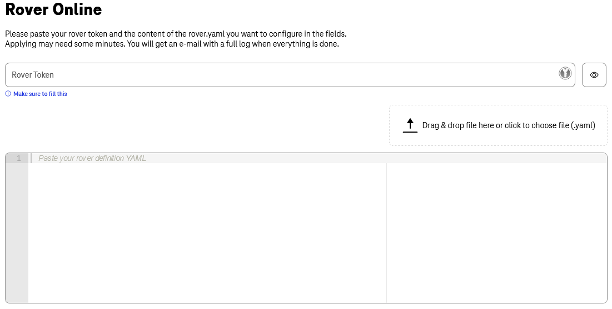
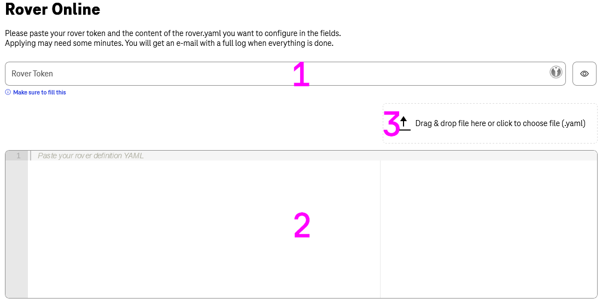

# Rover Online

The aim of [Rover Online](https://developer.telekom.de/tooling/rover-online) is to give the same experience via UI for users with limit CICD Access and beginners. We will download latest rover-ctl for you and execute.

!!! hint
    It is strongly recommended to user `rover-ctl` in your pipeline to have control over history, changes and approvals. We do not save history of your changes.

## How to use Rover Online?

### Rover Online Apply

!!! warning
    All resources will be overwritten with your current provided information, please double check it and refer to the [rover documentation](../rover/README.md).

!!! important
    As for `rover-ctl` we do not have history of your changes and will not be able to rollback it.

There are few points that you have to full fill like using it local or via CICD:

- User have to be authorized / logged in (we do log who execute changes and on what resource).
- User have to provide valid Token into Field 1. The *Environment* is coded into the Token.
  - User have to be listed in Team that owning this API with the same Email as logged in to the Portal. Otherwise, we will not be able to execute your changes.
- User have to provide valid `rover.yaml` or `oas.yaml` in the main window (Field 2) by typing it or drag-n-drop existing file into Field 3.
After you provide all needed information, click on **Apply** and we will execute latest `rover-ctl` with your changes.

!!! note
    In 99% of cases, you will see output directly in UI **and** get and Email with results.
    Execution of your request could take up to 2 minutes, but in any case, you will receive an Email with logs attached. Please provide those logs if you open a ticket to our [Support](../support/README.md).

### Rover Online Delete

!!! danger
    This action will **remove** all listed resources. In case of API it will also affect your subscribers and subscriptions. Please refer to the [Rover Documentation](../rover/README.md#clearing) and double check what you are doing.
    **We will not be able to rollback this action**.

Delete is quite important feature when you need to remove e.g., OAS from the rover / Catalog. You must provide information that you would like to remove and click on **Delete** button.

!!! warning
    We will not be able to rollback this action. Please refer to the [Rover Documentation](../rover/README.md#clearing).
