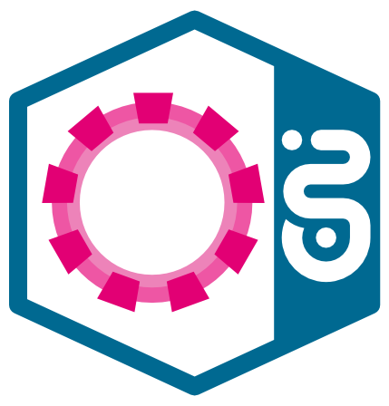
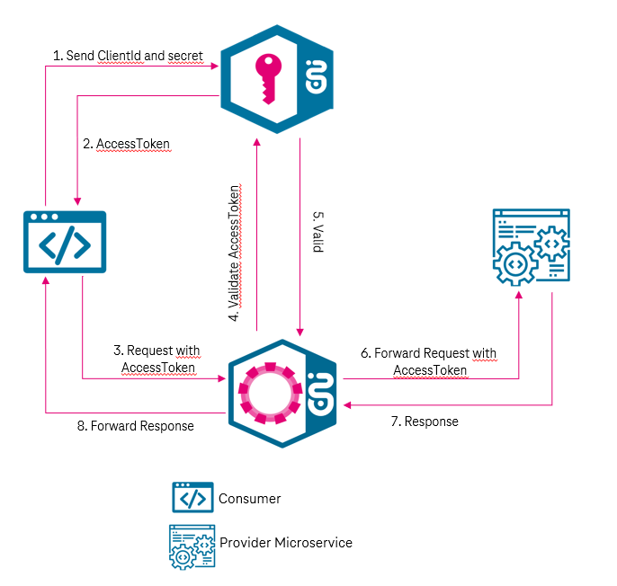
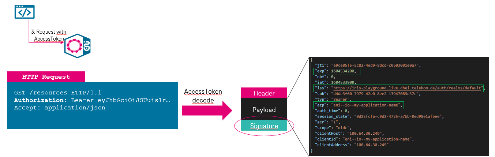
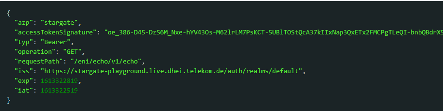

# StarGate

{ width="250" }

**StarGate is a managed gateway catering Hybrid API management in DT-IT**

Hybrid API management to support Multi Cloud strategy from DT-IT

## Features

- Gateway Mesh: StarGate provides Gateway Mesh functionality to flexibly manage APIs across cloud, on premise and hybrid mode. We offer seamless exposure and consumption of APIs across Cloud
This means a service exposed on AWS, CaaS (DE4 Env), AppAgile, Biere … can be seamlessly used across all those cloud environments with approved security.
- OAuth2 based communication: StarGate is integrated with IRIS (M2M IDP) to provide Authentication for published APIs.
- CI/CD driven deployment: To expose/subcscribe service on StarGate, we prodive a Rover Tool which can be used by customers via their CI/CD pipeline. The Rover ctl tool facilitates the automation of endpoint publishing and Subscription from CI/CD pipelines.
- Routing: Decouples API consumer & provider with managing routing to upstream service.
- Subscription Management: API Governance with Approval mechanism to control API usage via [MissionControl](./Stargate_Step-By-Step_Tutorial.md/#onboarding-via-mission-control)

!!! important
    Here is the link to Step-by-Step Tutorial [StarGate Step-by-Step Guide](./Stargate_Step-By-Step_Tutorial.md)

!!! Info
    We have StarGate running on AWS & CaaS

- Zone: AWS can be used by applications running on AWS
- Zone: CaaS can be used by applications running on CaaS, AppAgile, Biere, in Hitnet

!!! important
    Customers should always select a StarGate nearest to their application

!!! important
    Request message size on Stargate is limited to 4 MB. Also, the request headers size is limited to 16 KB (The **sum** of all header sizes cannot exceed this).
    In case you want to send larger files, please use [CloudWalker](https://developer.telekom.de/docs/src/tardis_customer_handbook/CloudWalker/)
    The gateway will timeout after 60 seconds. This will not be changed.

## Standard Headers set by Stargate
The following headers are set by Stargate automatically:

| Header                  | Value              | Further information |
| ----------------------- |:------------------:| -------------------:|
| X-Forwarded Information | Disclose information that is altered or lost when a proxy is involved in the path of the request | [Link](https://datatracker.ietf.org/doc/html/rfc7239) |
| X-B3-* ID's             | Trace IDs | [Link](https://zipkin.io/pages/instrumenting.html) |
| Realm                   | IDP Realm |
| Environment             | Environment of the API |
| X-Gateway-Token         | Gateway Token if the Enhanced variant is not used | [Link](https://developer.telekom.de/docs/src/tardis_customer_handbook/StarGate/#last-mile-security-gateway-token) |

!!! tip
    Other headers set by the consumer of an API will be passed through Stargate to the provider of an API.

## API Security on StarGate

!!! important
    The communication over StarGate is secured using standard OAuth2 protocol.

**A standard OAuth2 "Client credential flow" is used to secure the APIs exposed on the StarGate.**

### Communication between two services (Machine to Machine Communication)

As soon as you publish any API on StarGate, the API is automatically secured with OAuth2 and only accessible via Access Token (Client Credential Flow) for subscribed consumer.

In order to communicate via the Stargate API-gateway a valid access token is needed. Access tokens can be requested based on the "Client Credential Flow" (M2M use-case) at Iris (Keycloak IDP).

How does it look on runtime:



1. A consumer requests an access and refresh token at Iris by providing ClientID/Secret
2. The access and token needs to be temporarily stored at the client aka. Consumer
3. Every request needs to be performed with a valid access token
4. Access token gets verified by the Stargate
5. Validation result is used to allow access to resource
5. Token and payload gets forwarded to the resource implemented by a microservice.The token needs to verified again at the provider side.
6. Reponse to StarGate
7. Response gets forwarded to consumer service

#### Access Token Validation on StarGate

!!! attention
    *Stargate* API GW will perform the following validations for each request:
    - verify signature of access token
    - verify if access token is not expired (exp claim)
    - verify issuer (iss claim) against trusted issuers
    - verify if consumer (azp claim) is whitelisted in access control list on Stargate



### Last Mile Security (Gateway Token)

The Last Mile Security concept increases the microservice security as it allows the called application/microservice to check if the call originated from a trusted StarGate. If the StarGate is the only way to communicate with microservices of a given application, it is possible to do human ID or machine ID resolution at the entry point of the application and resolve the required parameters from the supplied tokens. In subsequent calls the resolved parameters can be supplied to the microservices via API parameters.

With this feature, StarGate sends a Gateway Token stored in the Authorization header field to the provider. It can be configured by setting the attribute **accessTokenForwarding: false** in the exposures section of the rover.yaml.

**Example** `rover.yaml` with configured Last Mile Security

```yaml
apiVersion: tcp.ei.telekom.de/v1
kind: Rover
metadata:
  name: petstore
spec:
  zone: caas
  exposures:
  - basePath: "/petstore/v1"
    upstream: "http://petstore.preprod.tif.telekom.de/petstore"
    approval: "SIMPLE"
    accessTokenForwarding: false
 subscriptions:
 - basePath: "/petstore/v1"

```

The Gateway Token looks like this:

**Example** `Gateway Token`

```json
{
  "clientId": "eni--hyperion--petstore",
  "sub": "pets",
  "azp": "stargate",
  "typ": "Bearer",
  "env": "preprod",
  "operation": "GET",
  "requestPath": "/petstore/v1/pets",
  "iss": "https://stargate-preprod.live.dhei.telekom.de/auth/realms/default",
  "exp": 1619099274,
  "iat": 1619098974
}

```

**Example** `Request with Gateway Token as Bearer Token in the Authorization header field`

```bash
GET https://stargate-host/eni/echo/v1
Header:
Authorization           Bearer {Gateway Token generated by StarGate but merged with accessToken from consumer}

```
!!! attention
    To validate the token, it is necessary to retrieve the JSON Web Key Sets ([jwks](https://developer.telekom.de/docs/src/tardis_customer_handbook/StarGate_Environment_Overview/#stargate-zone-aws_2)) from the issuers /certs endpoint. Many frameworks do this automatically and cache the content as it changes very rarely. In light of recent events, please make sure - especially if you implemented the token validation yourself - that the /certs endpoint is **NOT** called for every received API request, but cached instead.

### To Do For API Consumer

The Consumer party needs to implement OAuth2 client credential flow to generate Access Token from IRIS and send it along with the request towards StarGate.

The following sample code can boost up the implementation at your end.

!!! info
    SpringBoot OAuth Client to help application to get an access Token and forward access token with the request.
    
    [Oauth Client Sample Code]( https://gitlab.devops.telekom.de/tardis/samplecode/api-consumer-and-provider)
    

### To Do For API Provider
The Last Mile Security feature was introduced to prevent the forwarding and possible misuse of consumer access tokens therefore all API providers must be able to verify the Gateway Token (stored as Bearer Token in the Authorization header field) in the incoming requests.

#### Implement a check for Gateway token validation (Mandatory)

The Gateway token is generated by StarGate and always forwarded to the API provider (upstream service) as **Authorization** header field.

It is mandatory for service provider to check this field. We recommend to check the Gateway token to ensure only StarGate is allowed to call your endpoints.

!!! tip "Mandatory token validation steps"

    1. verify issuer (iss claim) against trusted issuer
    2. verify signature of token
    3. verify, if the token expired
    4. verify operation and requestPath

The check of operation and requestPath limits the consumer to call only the initially called resource with the initially used operation. It prevents the unwanted duplication of an API exposure with your upstream (in case someone got a hold of that), because the API basePath is unique and only controlled by the provider. So the provider application must know their own basePath and check the requestPath in the token to prevent abuse. Please note that the gateway token is created explicitly for a given basePath and operation.


Pseudocode implementation
```
gatewayBasePath := "/eni/petstore/v1/" // `/{MissionControlOrg}/{application}`
envClaimValue = request.jwtToken.claims.env
forwardedRequestPath = request.headers["X-Forwarded-Path"]
forwardedRequestPath = stripPrefixAway(envClaimValue, forwardedRequestPath)

if not trustedIss.verified(request.iss){
    return 401
}
if not jwt.verifyedSignature(request.jwtToken) {
    return 401
}
if time.milliseconds.now > request.jwtToken.exp{
    return 401
}
if request.operation != request.jwtToken.claims.operation{
    return 403
}
if !string.startsWith(forwardedRequestPath ,gatewayBasePath) or 
        !string.startsWith(request.jwtToken.claims.requestPath ,gatewayBasePath){
    return 403
}

if forwardedRequestPath  != request.jwtToken.claims.requestPath{
    return 403
}

// handle the request with your applicaion logic

```

##### Scenario with envClaimValue = cit2

| SourceCodeLine | envClaimValue | forwardedRequestPath |
|----------------|---------------|----------------------|
| 2 | cit2 |           |
| 3 |      | **/cit2**/eni/petstore/v1/ |
| 4 | cit2 | /eni/petstore/v1/ |

##### Scenario with envClaimValue = playground

| SourceCodeLine | envClaimValue | forwardedRequestPath |
|----------------|---------------|----------------------|
| 2              | playground    |           |
| 3              |               | /eni/petstore/v1/ |
| 4              | playground    | /eni/petstore/v1/ |

**Example**

```bash
GET https://stargate-host/eni/echo/v1
Header:
Authorization         Bearer {Gateway Token Generated by StarGate}
```
!!! info
    [To Protect API Sample Code]( https://gitlab.devops.telekom.de/tardis/samplecode/api-consumer-and-provider/)

#### Issuer for Last Mile Security Token

The issuer of the Gateway Token is the Stargate of your zone. So for example you expose an API on AWS, then the token issuer will be the AWS Stargate.

=== "Playground"

    | Zone | Issuer                          | 
    |-------------|-----------------------------------|
    | AWS         | https://stargate-playground.live.dhei.telekom.de/auth/realms/default |
    | CAAS        | https://stargate-playground.caas-t01.telekom.de/auth/realms/default |
    | SPACE       | https://playground.spacegate.telekom.de/spacegate/auth/realms/default |

=== "Preprod"

    | Zone | Issuer                          | 
    |-------------|-----------------------------------|
    | AWS         | https://stargate-preprod.live.dhei.telekom.de/auth/realms/default |
    | CAAS        | https://stargate-preprod.caas-t01.telekom.de/auth/realms/default |
    | SPACE       | https://preprod.spacegate.telekom.de/spacegate/auth/realms/default |

=== "Production"

    | Zone | Issuer                          | 
    |-------------|-----------------------------------|
    | AWS         | https://stargate.prod.dhei.telekom.de/auth/realms/default |
    | CAAS        | https://stargate.caas-p01.telekom.de/auth/realms/default |
    | SPACE       | https://api.telekom.de/spacegate/auth/realms/default |

=== "Virtual Environments"

    | Env | Zone | Issuer                          | 
    |--------|-------------|-----------------------------------|
    | av | AWS         | https://stargate.qa.dhei.telekom.de/auth/realms/av |
    | av | CAAS        | https://stargate-qa.caas-t01.telekom.de/auth/realms/av |
    | av | SPACE       | https://qa.spacegate.telekom.de/spacegate/auth/realms/av |
    | bond | AWS       | https://stargate.qa.dhei.telekom.de/auth/realms/bond |
    | bond | CAAS      | https://stargate-qa.caas-t01.telekom.de/auth/realms/bond |
    | bond | SPACE      | https://qa.spacegate.telekom.de/spacegate/auth/realms/bond |
    | frv | AWS         | https://stargate.qa.dhei.telekom.de/auth/realms/frv |
    | frv | CAAS        | https://stargate-qa.caas-t01.telekom.de/auth/realms/frv |
    | frv | SPACE        | https://qa.spacegate.telekom.de/spacegate/auth/realms/frv |
    | cit2 | AWS         | https://stargate.qa.dhei.telekom.de/auth/realms/cit2 |
    | cit2 | CAAS        | https://stargate-qa.caas-t01.telekom.de/auth/realms/cit2 |
    | cit2 | SPACE       | https://qa.spacegate.telekom.de/spacegate/auth/realms/cit2 |
    | cit4 | AWS         | https://stargate.qa.dhei.telekom.de/auth/realms/cit4 |
    | cit4 | CAAS        | https://stargate-qa.caas-t01.telekom.de/auth/realms/cit4 |
    | cit4 | SPACE       | https://qa.spacegate.telekom.de/spacegate/auth/realms/cit4 |
    | rv | AWS         | https://stargate.qa.dhei.telekom.de/auth/realms/rv |
    | rv | CAAS        | https://stargate-qa.caas-t01.telekom.de/auth/realms/rv |
    | rv | SPACE        | https://qa.spacegate.telekom.de/spacegate/auth/realms/rv |
    | sit | AWS         | https://stargate.qa.dhei.telekom.de/auth/realms/sit |
    | sit | CAAS        | https://stargate-qa.caas-t01.telekom.de/auth/realms/sit |
    | sit | SPACE        | https://qa.spacegate.telekom.de/spacegate/auth/realms/sit |


### Legacy Last Mile Security

!!! attention
    API providers, your action is required!
    The default behaviour for the last mile security feature will be changed successively on all environments until end of Q2/23.
    Please read through this section carefully, perform the described checks and - if needed - do the necessary changes in your provider apps.
    [Presentation of System-Demo 15.3](last-mile-security-changes.pptx)

**Timetable**
1. Playground: 12.04.23
2. av, bond, cit2, cit4, frv, rv, sit: 03.05.23
3. Preprod: 31.05.23
4. Production: 21.06.23

The old standard behaviour is as follows: if in the exposure section of your API(s) in your `rover.yaml` you have not set the attribute `accessTokenForwarding` or it is set to `true`, then you are receiving two tokens from the StarGate: the access token of your consumer (in the Authorization header) and the Gateway Token issued by the StarGate.

!!! info
    In the past, by default, the Gateway Token could be found in the header "X-Gateway-Token" and looks like below.


**Example**

```bash
GET https://stargate-host/eni/echo/v1
Header:
Authorization           Bearer {Token obtained from Iris}
X-Gateway-Token         Bearer {Gateway Token generated by StarGate}
```
##### Your ToDo

1. If you are an API provider, please check all of your applications `exposure` section in your rover.yaml(s)
2. If you already have the enhanced last mile security feature activated (`accessTokenForwarding: "false"`), congratulations: you are already using the recommended and future default setting - you don't have to change anything
3. If you are not using the enhanced last mile security (`accessTokenForwarding: "true"` or not set), the next step depends on which token you are currently checking:
    1. If you are currently validating the forwarded consumer access token (in the Authorization header): you are already checking the correct header field. However, when you set the accessTokenForwarding to false, then this header will contain the Gateway Token. The claims will look slightly different. But most importantly, the token issuer will change. The issuer will no longer be the Iris the consumer contacted to fetch the token, but now the issuer will be the StarGate. You can see a list of token issuers below. Please add the relevant token issuer to your list of trusted issuers. Depending on used frameworks, the validation of the Gateway Token will happen automatically. 
    2. If you are currently validating the Gateway Token (in the X-Gateway-Token header): you are already checking the future-proof token and can be sure that this token is not coming from a rogue provider. However, when you set the accessTokenForwarding to false, then the X-Gateway-Token header will disappear and the Gateway Token (with slightly changed claims as stated above) will be found in the Authorization header instead. To enable a zero-downtime switch your provider application would have to check both headers: first check if the X-Gateway-Token header is set and if yes, validate this one. If the X-Gateway-Token header is missing, validate the token in the Authorization header.
    3. In the unlikely case that you do not check any token: this is a serious security flaw. Set the accessTokenForwarding in your API exposure to false and implement the token check for the Gateway Token (in the Authorization header).

**Please make sure everything works as expected on the test environments, before you enable the enhanced last mile security in production.**
