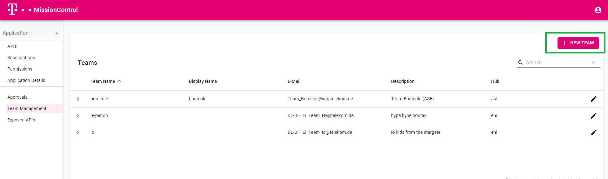
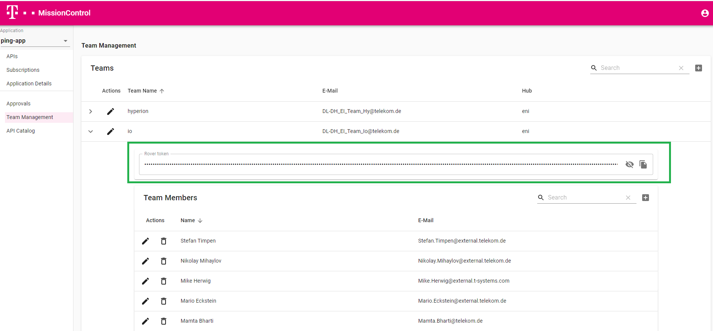
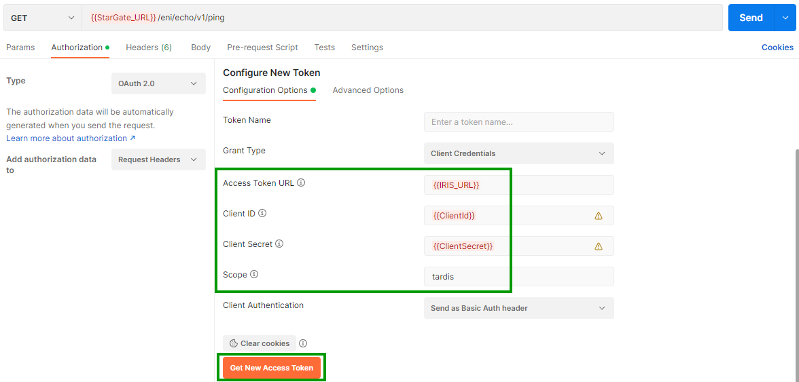
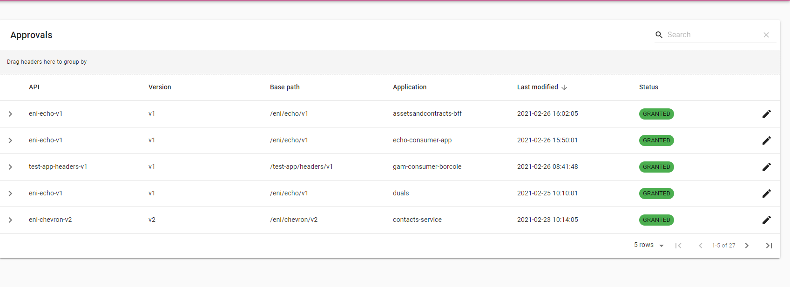

# StarGate Step-By-Step Tutorial

<!-- [[_TOC_]] -->

This tutorial will guide you through all the steps to consume and expose APIs via StarGate.

!!! important

    Please follow the steps as mentioned and provide us a [Feedback](mailto:T.Ganter@telekom.de?Subject=StarGate Step-By-Step Tutorial).

    You can also address your questions, feature request or improvements towards.

!!! info
    If you need support or have found a bug, then  please use our [Support](https://developer.telekom.de/docs/src/tardis_customer_handbook/support/) channel.

Video Tutorial in Progress!

## Onboarding via Mission Control

### Step 1. Use Mission Control to Onboard your team on T‧AR‧D‧I‧S

*Login to MissionControl->Teams->Click NEW TEAM-> Provide your team details and select a Hub associated with the Team*



!!! info
    Use Windows credential for login to Mission Control

!!! note
    Search for your Hub. If it is missing then simply create the Hub by typing the Hub name in the Hub section.

!!! note ""
    Don't scroll! You can simply type to find the Hubs already listed on StarGate

| Environment | Mission Control                   | Purpose|
|-------------|-----------------------------------|--------------------|
| playground  | <https://missioncontrol-playground.live.dhei.telekom.de> | APIs overview in Playground |
| preprod     | <https://missioncontrol-preprod.live.dhei.telekom.de> | APIs overview  in Preprod |
| prod        | <https://missioncontrol.prod.dhei.telekom.de> | APIs overview in Production |

### Step 2. Grab Rover Deployer Token Associated with your Team

*MissionControl-> TeamManagement-> Select your team-> Expand the team info-> Copy the Deployer Token*

!!! note
    Rover Deployer Token is needed to execute Rover via your pipeline. This is your credentials (token) to authenticate yourself to Rover.

The deployer token associated to the team is created after the team has been listed on Mission Control.



### Step 3. Add members to your team

Under Teams you can add members to your team.

!!! note
    Only listed members can view the APIs / Applications associated to the team on Mission Control

## Setup your Gitlab Pipeline for using Rover

!!! info
    If you have never used Gitlab/Pipelines before, you may want to check out our Gitlab guide. It covers the basics of using Rover via a pipeline. Get it from [here](./../gitlab/getting-started.md).

### Step 1: Download our sample Rover Pipeline

**Sample** `.gitlab-ci.yml`

```yaml
variables:
  RESOURCE_PATH: "$CI_PROJECT_DIR/resource"
  ROVER_TOKEN: "$ROVER_TOKEN"
  
stages:
  - expose
  - subscribe
  - cleanup
  
default:
  image: "mtr.devops.telekom.de/tardis-customer/roverctl:playground"
  tags: [ "run_sysbox" ]
    
Expose-Dummy-API:
  stage: expose
  when: manual
  script:
    - roverctl apply -f "expose"
    
Subscribe-to-Dummy-API:
  stage: subscribe
  when: manual
  script:
    - roverctl apply -f "subscribe"

Delete-API:
  stage: cleanup
  when: manual
  script:
    - roverctl delete -f "expose"

Delete-Subscription:
  stage: cleanup
  when: manual
  script:
    - roverctl delete -f "subscribe"
```

### Step 2: Pull Rover Docker Image

The next step is to configure your secrets in Gitlab. After configuring them you need to define the Rover Docker Image you want to use.

You can find the Rover Docker image here: **<mtr.devops.telekom.de/tardis-customer/roverctl>**

Regarding the MTR service account for pulling the image, this json must be inserted into your **DOCKER_AUTH_CONFIG** CICD Variable.

```json
{
    "auths": {
        "mtr.devops.telekom.de": {
            "auth": "dGFyZGlzLWN1c3RvbWVyK2VuaV9jdXN0b21lcjpDT1dRSDdQNjE5NFIyNzNFU0dQMUFaSEZJS0ZYSFoxMFpMVkY0MUtZMVM1VldWRTRVRERZSDU4TTJSODI0U01S",
            "email": ""
        }
    }
}
```

Looking at the sample `.gitlab-ci.yml`:

```yaml
default:
  image: "mtr.devops.telekom.de/tardis-customer/roverctl:playground"
  tags: [ "run_sysbox" ]
```

The following Tags are available:

- playground
- preprod
- prod

### Step 3: Create the CI/CD Variables for your pipeline

The following variables need to be adapted:

| **Configuration variable**      | **Description**           |
| ------------- |-------------|
|**ROVER_TOKEN**|Your token to authenticate using Rover. This token is provided after the onboarding process (deployer token which you downloaded in Step 2 of onboarding section|
|**RESOURCE_PATH**|The basepath to your resources (`-f` initial directory) *(optional)*|

Looking at the sample `.gitlab-ci.yml`:

```yaml
variables:
  RESOURCE_PATH: "$CI_PROJECT_DIR/resource"
  ROVER_TOKEN: "<your rover token/>"
```

!!! info
    Your pipeline is set now to subscribe or expose an API via Rover

## Consume an API via StarGate (sample echo service)

We have registered a sample API which can be used by anyone on Playground. Feel free to use it for the rest of the tutorial.

### Step 1: Prepare a Rover yaml

Login to Mission Control--> Exposed APIs-->Search for API--> Type "echo"

You can copy and use this example YAML below for subscription via Rover pipeline and store it as a `.yaml`-file in your resource/subscribe folder of your project.

```yaml
apiVersion: tcp.ei.telekom.de/v1
kind: Rover
metadata:
  name: *replace-with-your-application-name*
spec:
  zone: aws
  subscriptions:
  - basePath: /eni/echo/v1

```

`replace-with-your-application-name` can be replaced with your specific application name you want to choose. Everything should be in **lower-case** and **seperated-with-dashes**.

### Step 2: Execute **Subscribe-to-Dummy-API** in your pipeline

!!! success
    Hurray "you have your first subscription via Rover"

### Step 3:  Check your subscription status

*Mission Control-> Select the application name your stored in Rover yaml from the left drop down panel-> Go to Subscription-> Expand section* **eni-echo-v1**

You can see the status of your subscriptions.

### Step 4: Get StarGate Invocation URLs

Copy the StarGate URLs to call the API.

Mission Control-> Select the application name your stored in Rover yaml from the left drop down panel-> Go to Subscription-> Expand section eni-echo-v1

### Step 5: Get ClientID/Secret for your Application

Application Details section to get the IRIS URL and the Client ID/Secret for your application.

### Step 6: Test against the subscribed API

Download the Postman collection and set the Client ID/Secret collected in Step 5.

#### Postman Collection for Echo-API on *playground* environment

#### StarGate Zone AWS

This folder contains a Postman collection showing how to use the Echo API

Download: [EchoService.postman_collection.json](EchoService.postman_collection.json)

To use this collection in the *playground* environment following environment variables should be configured in Postman

| variable        | value                                                           | comment                                               |
|-----------------|-----------------------------------------------------------------|-------------------------------------------------------|
| IRIS_URL  | https://iris-playground.live.dhei.telekom.de/auth/realms/default/protocol/openid-connect/token           | *used for issuing an Access Token*                        |
| StarGate_URL |   https://stargate-playground.live.dhei.telekom.de                                                    | StarGate URL                                                      |
| clientId        | *ClientID associated to your application*                                                            | *see MissionControl->Application details*             |
| clientSecret    | *ClientSecret associated to your application*                                                             | *see MissionControl->Application details*  |
| scope    | openid                                                           | do not send the scope attribute if not required or set an available scope like openid or tardis  |

You can view and change the collection-scoped variables by clicking the button with the three dots at your collection and choosing "Edit".  
Note, that these variables will overwrite environment variables.


#### StarGate Zone: CaaS

To use this collection in the *playground* environment following environment variables should be configured in Postman

| variable        | value                                                           | comment                                               |
|-----------------|-----------------------------------------------------------------|-------------------------------------------------------|
| IRIS_URL  | https://iris-playground.caas-t01.telekom.de/auth/realms/default/protocol/openid-connect/token            | *used for issuing an Access Token*                        |
| StarGate_URL |  https://stargate-playground.caas-t01.telekom.de                                                     | StarGate URL                                                      |
| clientId        | *ClientID associated to your application*                                                            | *see MissionControl->Application details*             |
| clientSecret    | *ClientSecret associated to your application*                                                             | *see MissionControl->Application details*     |
| scope    | openid                                                           | do not send the scope attribute if not required or set an available scope like openid or tardis   |

### Step 8: Testing your API

Get Access Token and then send the request with the Access token



| HTTP Error  |  Error Message                                                      | Reason *Remedy*                                            |
|-----------------|-----------------------------------------------------------------|-------------------------------------------------------|
| 401 | Unauthorized         | *Token not send with Request or invalid*                   |
| 403 | You cannot consume this service                                                     | The consumer doesn’t have subscription for the service *Check your subscription*                                                     |
| 404        | No Route matched with those values                                                             | The resource doesn’t exist on StarGate, *Checked the URI being called*           |
|                                                                                                                               |

## Expose your API on StarGate

!!! important
    It is no longer possible to expose **new** Enterprise APIs. You can still expose your available Enterprise API. 
    Updating/uploading the Enterprise API-specification is currently disabled. If you need to update your specification file, please contact us!

### Step 1: Upload Open API Specification of your API

Prepare your OAS making sure it fulfills the following conditions:

 1. Add [API category](https://developer.telekom.de/docs/src/api_standards_conventions/2_basics/api-categories/) to the API Specification File, e.g. **x-api-category: G-API** under info Section into your API Specification
 2. The major version must be set as a suffix. This must be mapped to the major Version defined in the info.version section
 3. Make sure the basePath in OAS Spec has Hub Name as prefix:

    Pattern for BasePath: `/{HubName}/[serviceName]/[majorVersion]`

    *HubName*: Please use value as used for while creating the Team`

    Example:  `/eni/echo/v1`

#### Example API OAS 2.0

```yaml
swagger: '2.0'
info:
  title: Test Service
  description: telekom.de account and password management
  version: 1.0.0
  # API is of Category "G-API"
  x-api-category: G-API
  license:
    name: Deutsche Telekom AG
host: localhost
# where "eni" is the hub name
basePath: /eni/servicemanagement/v1
schemes:
- https
```

#### Example API OAS 3.0

```yaml
openapi: '3.0.0'
info:
  title: Test Service
  description: telekom.de account and password management
  version: 1.0.0
  # API is of Category "G-API"
  x-api-category: G-API
  license:
    name: Deutsche Telekom AG
# where "eni" is the hub name + url without "https://serverRoot" part will be used as basePath
servers:
- url: https://serverRoot/eni/servicemanagement/v1
```

To upload the API-Specification file you can use the following command:

```bash
apply -f <absolute-path to api specification/>
```

**Example** `.gitlab-ci.yml`

```yaml
  apply-api-spec:
    stage: apply-application
    when: manual
    script:
      - roverctl apply -f "apispec"
```

### Step 2: Run Rover.yaml to expose your API

To subscribe/expose an API you need to create a `rover.yaml` file for each of your applications that wants to expose or subscribe an API.  Here you can manage all meta-information as well as the subscriptions and exposures, as you can see in the following example of a `rover.yaml` File.

| **Attribute**      | **Description**           |
| ------------- |-------------|
|**name**|The name of your Application|
|**zone**|The zone in which the service in running (e.g. aws, caas) If your service is running in HITNET/CNTDTAG env as OTC or AppAgile or Severfarm then please select zone as CaaS|
|**exposures**|A list of APIs that you want to expose. It is only possible to expose the entire API. It is not possible to expose a single resource. Therefore, every exposure needs the API Base Path which you can find in the Open API Specification File of your API and the upstream URL.
|**basePath:**|basePath should always contain Hub Name as prefix. Also, BasePath should match the path defined in OAS spec.
|**upstream:**| service backend|
|**subscriptions**|A list of APIs that you want to subscribe. After an API is successful subscribed, you are able to use the API. It is only possible to subscribe to the entire API. It isn´t possible to subscribe only to a single resource.|

!!! important
    Rover validates the API from `rover.yaml` file against the API specification uploaded above. To ensure that Rover be able to assign the API specification, the basepath of the exposed API must match the basepath in the API specification.

**Layout** `rover.yaml`

```yaml
apiVersion: tcp.ei.telekom.de/v1
kind: Rover
metadata:
  name: "Put your application name"
spec:
  zone: caas | aws
  exposures:
  - basePath: "Provide the base path as defined in OAS specification"
    upstream: "Provide the backend endpoint for the service"

```

**Example** `rover.yaml`

```yaml
apiVersion: tcp.ei.telekom.de/v1
kind: Rover
metadata:
  name: testapp
spec:
  zone: caas
  exposures:
  - basePath: /eni/systemTest/v1
    upstream: https://upstreamhost
    
```

!!! important
    The above `rover.yaml` should be stored in resource/expose folder of your project

With the `rover.yaml` in place, execute the exposure in your pipeline:

**Example** `.gitlab-ci.yml`

```yaml
 apply-rover-yaml:
   stage: apply-application
   when: manual
   script:
     - roverctl apply -f "rover.yaml"
```

!!! success
    Hurray "You have your first exposure on StarGate via Rover"

### Step 3: Check your exposed API on Mission Control

>Mission Control-> Select the application name your stored in Rover yaml from the left drop down panel-> Go to APIs-> You will see your exposed API

You can also get a list of consumers associated with your APIs.
More details can be found in the Mission Control chapter of the T‧AR‧D‧I‧S Customer Handbook.

## Subscribe to your exposed API

Append the Subscriptions to your existing `rover.yaml` and re-run the above pipeline.

**Layout** `rover.yaml`

```yaml
apiVersion: tcp.ei.telekom.de/v1
kind: Rover
metadata:
  name: *Put your application name*
spec:
  zone: caas | aws
  exposures:
  - basePath: "Provide the base path as defined in OAS specification"
    upstream: "Provide the endpoint for the service"
  subscriptions:
  - basePath: BasePath as provided in the exposure

```

**Example** `rover.yaml`

```yaml
apiVersion: tcp.ei.telekom.de/v1
kind: Rover
metadata:
  name: testapp
spec:
  zone: caas
  exposures:
  - basePath: /eni/systemTest/v1
    upstream: https://upstreamhost
  subscriptions:
  - basePath: /eni/systemTest/v1
```

*Mission Control-> Select the application name you stored in Rover yaml from the left drop down panel-> Go to Subscriptions-> You will see your subscription*

### Subscription Management

*Mission Control-> Approvals-> Select an API for approval and then you can do necessary actions.*

The Approvals tab visualizes all incoming subscriptions to APIs correlating to the selected application.




!!! note
    The approvals associated with your exposed APIs would be reflected under this section.

## Providing and consuming APIs through the internet

Make API available to the internet [Here](https://developer.telekom.de/docs/src/tardis_customer_handbook/rover/#expose-api-to-spacegate)

Susbcribe to API for external usage [Here](https://developer.telekom.de/docs/src/tardis_customer_handbook/rover/#subscribe-to-api-for-external-usage)
