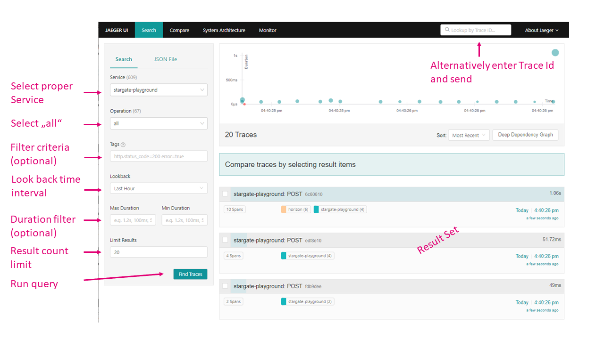
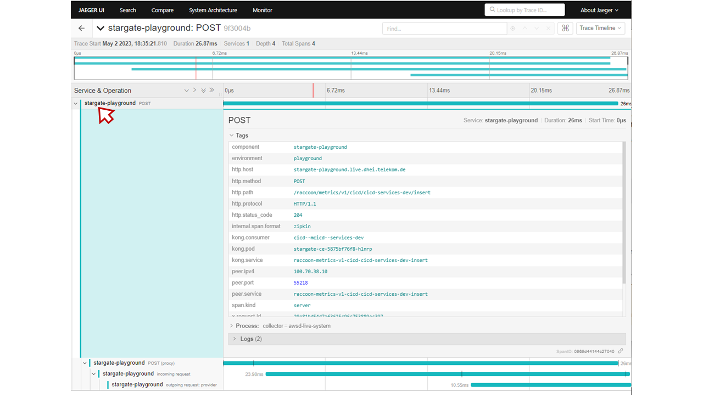
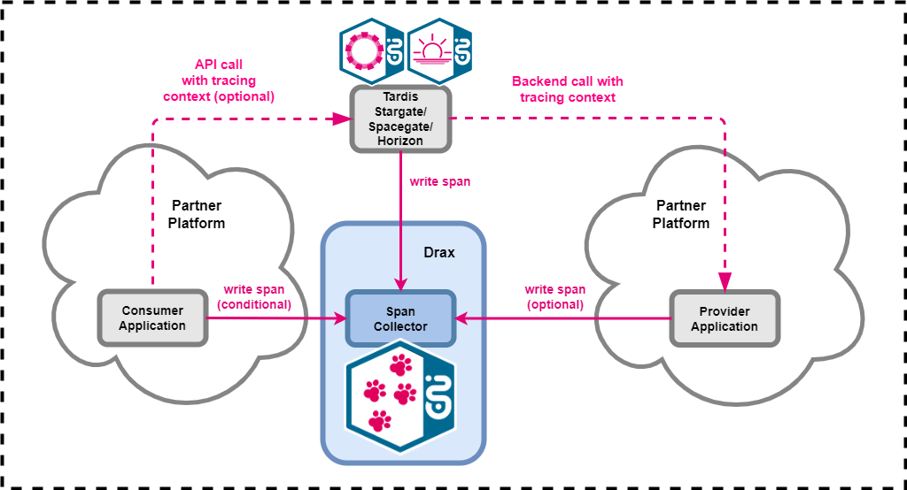

# Drax Tracing


## What it is
Tracing is meant to help locate, where in a distributed processing chain an issue - increased latency or error - is occurring. 
Having identified the sore spot, one can then delve into the logs of the respective component to find the cause of its malfunction.

* Drax Tracing lets you view the processing of your API-invocation via Stargate or Spacegate to the provider. 
You can use the Jaeger-UI (URL look-up for each environment: [Environment Overview](https://developer.telekom.de/docs/src/tardis_customer_handbook/StarGate_Environment_Overview/#drax-jaeger-ui)).
Everybody holding an EMEA or ZAM account can freely access all environments.
 
* In addition to the traces generated by the T‧AR‧D‧I‧S gateways, spans may also be contributed by consumer and provider applications, simply by writing them to the provided Drax endpoint URLs using the Zipkin, Jaeger or OpenTelemetry protocols (see [Environment Overview](https://developer.telekom.de/docs/src/tardis_customer_handbook/StarGate_Environment_Overview/#drax-jaeger-collector)).


## How to find my T‧AR‧D‧I‧S traces via the Drax UI

You need to have key information available to find your traces. 
The simplest way is to search by `Trace ID`, if you happen to know it. 
In any other case you can search by `Service`, `Operation` and any set of `Tags`. 
Select **"stargate/spacegate-\<environment\>"** with \<environment\> matching your situation. 
If you send your own spans, your own `Service` should also be available for selection. 
For a list of useful `Tags` that go along with the **stargate/spacegate...** `Service` see the below table:

| filter criteria     | value                                                   |
|---------------------|---------------------------------------------------------|
| peer.service=       | the API name from MissionControl (replace '/' with '-') |
| kong.consumer=      | the consumer name from MissionControl                   |
| environment=        | the environment (playground, preprod, cit4, etc.)       |
| X-Request-ID=       | in case the consumer has set this header                |
| X-Correlation-ID=   | in case the consumer has set this header                |
| X-Business-Context= | in case the consumer has set this header                |
| error=              | "true" in case of error                                 |
| ...                 | more available tags can be found by looking in the spans |

This is how to go about it: 

* bring up the right Jaeger-UI for the respective environment you want to search. 
Look here for the links: [Environment Overview](https://developer.telekom.de/docs/src/tardis_customer_handbook/StarGate_Environment_Overview/#drax-jaeger-ui).

* fill in the search mask according to your criteria: `Service` (mandatory), `Operation` (defaults to **„all“**), `Tags` (optional, separated by spaces, regular expressions will be interpreted). You can additionally narrow down the result set by time interval, number of traces or latency limits. 

or

* just enter the `Trace ID` into the top box or directly in the URL.



If you don't succeed finding your traces, consider weakening the search conditions.

!!! note
    Each span will be stored for 7 days.

## How to find information in T‧AR‧D‧I‧S traces

* By clicking on a line in the result set, the stack of trace spans unfolds. 
You can see the invocation tree on the left and the respective timing in the middle section. 
Each row records a processing step, which is identified by the Service and Operation names.

* T‧AR‧D‧I‧S internal spans are identified by service names containing „**stargate/spacegate, horizon or cloudwalker**" all others are contributed by partner systems.

* By clicking on a label the span is expanded and additional information in the form of a tag / value list becomes visible. 
The emitting systems are free to write what is considered useful, except that it should be restricted to technical data. 



## Retrieval of traces via the Drax-API

Traces may also be read via API, which behaves in an analogous manner as the UI. The response body contains a JSON representation of the selected traces. See: [Drax-API](https://developer.telekom.de/catalog/eni/eni-drax/system/production/2.0.0)

## How to write my own spans / traces
Tracing is about recording a transaction execution across a distributed processing chain. The more comprehensive the recording spreads across the execution, the more helpful it gets for tracking. </br>
Each processing step in the chain can contribute entries (=''spans'') to the overall trace. The first processing step to create a span starts the overall trace by coming up with a trace id.
Each step passes the trace context (basically the trace id and the span id) to the next step, which picks it up and concatenates its own spans. On completion, each processing step closes its span and submits the record to some collector endpoint.  </br>
The T‧AR‧D‧I‧S Gateways will always start a trace, unless the consumer already passes a tracing context with the API call. In this case the passed context will be continued.

!!! important
    If consumers pass a tracing context header with the API call, they must also send a respective span to Drax, otherwise the reassembly of the trace will encounter errors.



For the common programming languages Tracing instrumentation libraries are available ''off the shelf''. [OpenTelemetry](https://opentelemetry.io/) for example provides a standardized SDK for different languages. 
Third party systems often are already endowed with OpenTelemetry, Jaeger or Zipkin support.
Drax collector endpoints are available on all T‧AR‧D‧I‧S environments for HTTP, gRPC, Zipkin, OpenTelemetry or Thrift protocol connections (see [Environment Overview](https://developer.telekom.de/docs/src/tardis_customer_handbook/StarGate_Environment_Overview/#drax-jaeger-collector))

You can find more details on the technical integration with Drax [here](CustomerKnowledgeSheetDrax.md). In case of difficulties, the T‧AR‧D‧I‧S team will be happy to assist.

!!! note " Please honour the following guardrails when contributing your own spans and traces:"


* You are free to add any information via tags, that you would like to see or search for in the traces, with two caveats: 
    * ***strictly avoid logging any person related data*** and 
    * ***be concise***
    
    Traces are not meant to comprise elaborate log data and are open to be viewed by anybody. 
    So, while brief error messages in spans can help understand what went wrong, don't feel tempted to redirect your application logging into the traces. </br>
    You can link traces with related log messages in your logging database by e.g. printing the respective trace id into the logs or, vice versa, print *references* to log messages into the traces.

* For keeping track of where Drax spans originate, we request you to provide a **team** tag in all your spans, which you assign the team name related to the sending application as reflected in Mission Control (e.g. ''team'': ''skoll''). This will enable us to correlate the spans and contact you in case of need.

* Another useful information might be **environment** to keep track of which traces result from which environment. T‧AR‧D‧I‧S Gateway spans contain this tag to distinguish between T‧AR‧D‧I‧S environments, which might differ from your local environment names.

* While you are generally free to trace even non-API related processing, we kindly request you to not in general extensively trace the internals of your application to Drax for load reasons.

* The use of the http-header field [X-Business-Context](https://developer.telekom.de/docs/src/api_standards_conventions/8_http-details/http-headers/X-Business-Context/) plays a major role in the nascent guidelines of the [business monitoring initiative](https://mywiki.confluence.telekom.de/pages/viewpage.action?pageId=1497520652).
If used, the value must be printed into the **X-Business-Context** span tag to enable the monitoring.

## General remarks on tracing standards

Unfortunately there are a couple of tracing standards or products in use (e.g. Zipkin, Jaeger, OpenTelemetry). While the overall processing models basically follow the same logic, details differ. Especially the http headers for the tracing context are proprietary to each brand, which causes traces to break along the processing chain, when the systems speak different languages.

The following sequence illustrates the OpenTracing-standard using the [B3 HTTP headers](https://github.com/opentracing/specification/blob/master/rfc/trace_identifiers.md#b3-http-headers). 

```plantuml
@startuml
participant Comp1 as "Component A"
participant Comp2 as "Component B"
participant Comp3 as "Component C"
database Collector #cyan

note right of Comp1: generate rootSpan **span1**\nspanId=span1(new)\ntraceId=trace1(new)\nno parentSpanId
activate Comp1 #cyan
Comp1 -> Comp2 : request with **span1**-header\nX-B3-SpanId=span1\nX-B3-TraceId=trace1
note right of Comp2: generate **span2**\nspanId=span2(new)\ntraceId=trace1\nparentSpanId=span1
activate Comp2 #cyan
Comp2 -> Comp3 : request with **span2**-header\nX-B3-SpanId=span2\nX-B3-TraceId=trace1\nX-B3-ParentSpanId=span1
note right of Comp3: generate **span3**\nspanId=span3(new)\ntraceId=trace1\nparentSpanId=span2
activate Comp3 #cyan
note right of Comp3: internal calculation
Comp3 -[#cyan]> Collector: post finished **span3**\n{id=span3, traceId=trace1, parentId=span2}
deactivate Comp3
Comp3 -> Comp2 : response
Comp2 -[#cyan]> Collector: post finished **span2**\n{id=span2, traceId=trace1, parentId=span1}
deactivate Comp2
Comp2 -> Comp1 : response
Comp1 -[#cyan]> Collector: post finished **span1**\n{id=span1, traceId=trace1}
deactivate Comp1

@enduml
```

The OpenZipkin-Standard does not exactly match the OpenTracing/W3C-Standard in handling the client and server parts of a trace,
as pointed out in [this section](https://github.com/openzipkin/b3-propagation#overall-process):

```
In this case, the same span ID is used, which means that both the client and server side of an operation end up in the same node in the trace tree.
```
This span conflation is compensated for by the Jaeger-UI, which separates the client and the server span part of a Zipkin node when processing the query response by assigning an artificial spanId to the server part span and replacing its parentSpanId with the client (originally common) spanId. 
Thus client and server spans are displayed as separate nodes in the trace tree with a parent- child relationship.

The upcoming product independent OpenTelemetry standard is supposed to end all incompatibility issues and take over in the future:  see [W3C trace-context description](https://www.w3.org/TR/trace-context). (Until then it adds one more.)

Drax can handle spans of any of the listed standards.The T‧AR‧D‧I‧S Gateways currently work best with Zipkin. Seamless OpenTelemetry support is about to be implemented.
