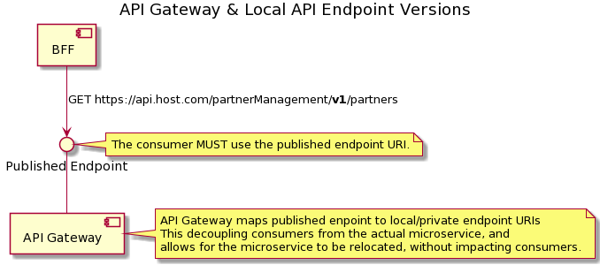
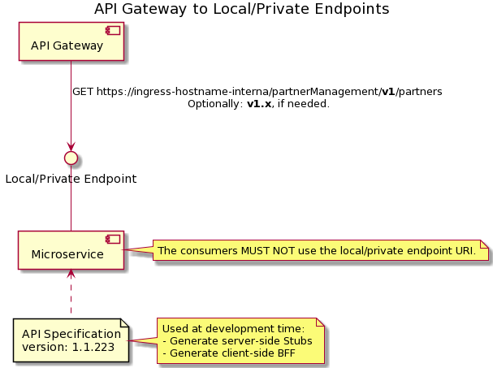

# Endpoints

## Published Endpoint On StarGate

The StarGate (API Gateway) acts as a proxy to the actual host that is executing the microservice with the REST endpoints. 

For more details, kindly refer REST Guideline section 
https://enterprise-api.pages.devops.telekom.de/api-guide/versioning/general/

!!! important 

    The published endpoint MUST contain only a v-prefixed major version (i.e. `v1`, `v2`, `v3`, etc.).  





## Local/Private Endpoint (Microservice)





The `host` and `basePath` fields in OpenAPI 2.x, and the `servers` field in OpenAPI 3.x, should be used to specify the default host and basePath that is appended to all path definitions.

!!! important

    The local/private basePath MUST contain at least a v-prefixed major version (i.e. `v1`, `v2`, `v3`, etc.).  
    Providers MAY use a v-prefixed major.minor version (i.e. `v1.1`, etc.), if needed.

The following specifications are exact equivalents in both OpenAPI 2.x and 3.x formats:

### OpenAPI 2.x

```yaml
swagger: '2.0'
info:
  title: Example
  version: 1.0.0                # <- (1) Specification version in SemVer format
host: 'localhost:3000'          # <- (2) Default host (development)
basePath: /v1                   # <- (3) Major version path
schemes:
  - http
produces:
  - application/json            # <- Produces application/json responses by default
consumes: []
paths:
  /partners:
    get:
      summary: Query partners
      tags: []
      responses:
        '200':
          description: OK
          schema:
            type: object
            properties: {}
      operationId: get-partners
definitions: {}
```

### OpenAPI 3.x

```yaml
openapi: 3.0.0
info:
  title: Example
  version: 1.0.0                # <- (1) Specification version in SemVer format
servers:
  - url: 'http://localhost:3000/v1' # <- (2) Default host (development) + (3) Major version path
    description: local
paths:
  /partners:
    get:
      summary: Query partners
      tags: []
      responses:
        '200':
          description: OK
          content:
            application/json:   # <- Produces application/json responses 
              schema:
                type: object
                properties: {}
      operationId: get-partners
components:
  schemas: {}
```
