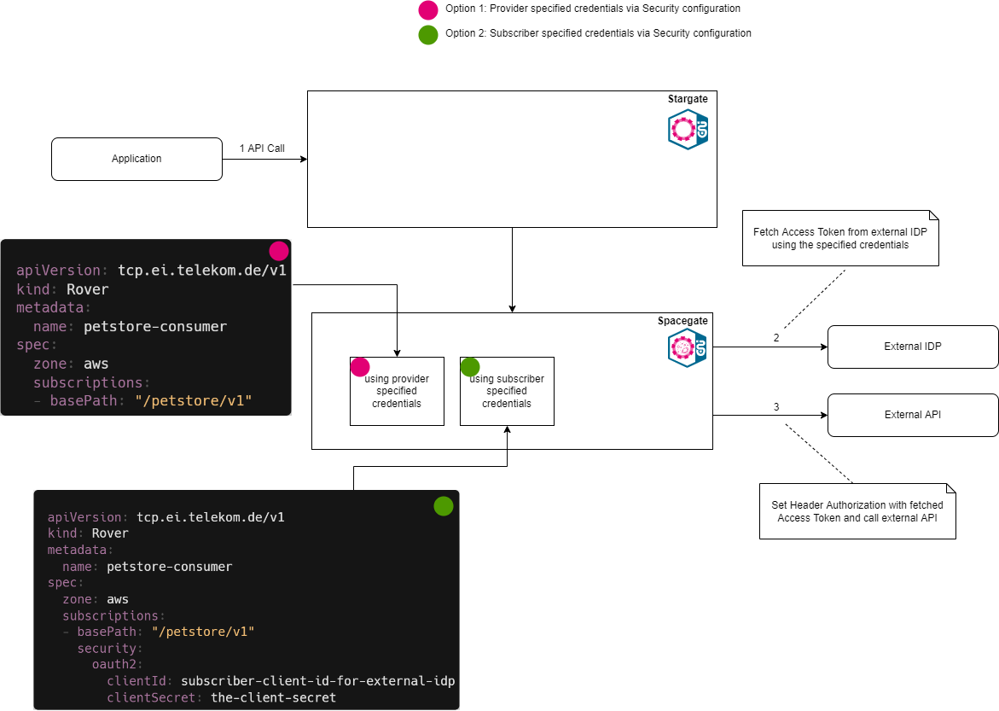

# T‧AR‧D‧I‧S for external partners
### A Step-By-Step Tutorial.

<!-- [[_TOC_]] -->

This tutorial will guide you, as a external partner of DTAG, through all the  neccessary steps to consume and expose APIs via T‧AR‧D‧I‧S Keep in mind that this guide only contains a glimpse of the features of T‧AR‧D‧I‧S More can be found in the official documentation.<br>

## Spacegate: Connecting DTAG to the world

{ width="250" }

For the communication with the internet, T‧AR‧D‧I‧S utilizes the so called Spacegate which enables external partners to use internal DTAG APIs or offering their APIs for DTAG.

### API Security on Spacegate

The communication over Spacegate is secured using [OAuth 2.0](https://oauth.net/2/) protocol.

**A standard OAuth 2.0 "Client credential flow" is used to secure the APIs exposed on the Spacegate.**

For further information please take a look at the [Stargate Security chapter](/docs/src/tardis_customer_handbook/StarGate/README.md#api-security-on-stargate) which is similar to the Spacegate one.

### Standard Headers set by Spacegate
The following headers are set by Spacegate automatically:

| Header                  | Value              | Further information |
| ----------------------- |:------------------:| -------------------:|
| X-Forwarded Information | Disclose information that is altered or lost when a proxy is involved in the path of the request | [Link](https://datatracker.ietf.org/doc/html/rfc7239) |
| X-B3-* ID's             | Trace IDs | [Link](https://zipkin.io/pages/instrumenting.html) |
| Realm                   | IDP Realm |
| Environment             | Environment of the API |
| X-Gateway-Token         | Gateway Token if the Enhanced variant is not used | [Link](/docs/src/tardis_customer_handbook/StarGate/README.md#last-mile-security-gateway-token) |

!!! tip
    Other headers set by the consumer of an API will be passed through Spacegate to the provider of an API.


<br>

!!! info

    If you need support, or found a bug, then  please use our [Support](https://developer.telekom.de/docs/src/tardis_customer_handbook/support/) channel.

## Onboarding via Developer Portal *(mandatory)*

### Step 1. Use Developer Portal to onboard your team on T‧AR‧D‧I‧S

*Login to [Developer Portal](https://developer.telekom.de/) --> MissionControl --> Teams --> Click NEW TEAM [Green box in the picture] --> Provide your team details and select as Hub your company (e.g. DTIT) associated with the Team*


!!! info

    Use your Telekom ZAM account for the login on the Developer Portal.

!!! info

    The environment can be changed on the top right corner, select the proper one for your usecase or depending on the exposure of the API you want to use. Please test your connection in PreProd before going to Production.

!!! note

    Search for your Company (Hub). If it is missing then simply create your company by typing the company name in the Hub section.

!!! warning ""

    Don't scroll! You can simply type to find the companies already listed on T‧AR‧D‧I‧S

### Step 2. Grab Rover Token associated with your team

*Developer Portal --> MissionControl --> Teams --> Select your team --> Expand the team info --> Copy the Rover Token [Green box in the picture]*

!!! note

    Rover Token is needed to execute Rover via your pipeline. This is your credential (token) to authenticate yourself to Rover.

The Rover Token associated to the team is created after the team has been listed on the Developer Portal.


### Step 3. Add members to your team

Below the Rover Token you can add members to your team.

!!! note

    Only listed members can view the APIs / applications associated to the team in the Developer Portal.

## Setup your Gitlab Pipeline for using Rover *(mandatory)*

!!! info

    The Gitlab used here is the [Telekom Magenta CICD Gitlab](https://gitlab.devops.telekom.de).
    Any other Gitlab will not work!

### Step 1: Copy our sample Rover pipeline

**Sample:** `.gitlab-ci.yml`

```yaml
variables:
  RESOURCE_PATH: "$CI_PROJECT_DIR/resource"
  ROVER_TOKEN: "$ROVER_TOKEN"
  
stages:
  - test
  - apply
  - cleanup
  
default:
  image: "mtr.devops.telekom.de/tardis-customer/roverctl:playground"
  tags: [ "run_sysbox" ]

Test-Variables:
  image: dwdraju/alpine-curl-jq
  stage: test
  script:
    - if [ -z $RESOURCE_PATH ]; then echo "RESOURCE_PATH not defined"; exit -1; fi
    - if [ -z $ROVER_TOKEN ]; then echo "ROVER_TOKEN not defined"; exit -1; fi
    - if [ -z $DOCKER_AUTH_CONFIG ]; then echo "DOCKER_AUTH_CONFIG not defined"; exit -1; fi
    - echo "all variables are ok"

# use this section for a subscription
Subscription-Apply:
  stage: apply
  when: manual
  needs:
    - Test-Variables
  script:
    - if [ ! -f $RESOURCE_PATH/subscribe.yaml ]; then echo "$RESOURCE_PATH/subscribe.yaml not found"; exit -1; fi
    - roverctl apply -f "subscribe.yaml"

Subscription-Delete:
  stage: cleanup
  when: manual
  needs:
    - Test-Variables
  script:
    - if [ ! -f $RESOURCE_PATH/subscribe.yaml ]; then echo "$RESOURCE_PATH/subscribe.yaml not found"; exit -1; fi
    - roverctl delete -f "subscribe.yaml"

# use this section for a exposure
API-Expose:
  stage: apply
  when: manual
  needs:
    - Test-Variables
  script:
    - if [ ! -f $RESOURCE_PATH/apispec.yaml ]; then echo "$RESOURCE_PATH/apispec.yaml not found"; exit -1; fi
    - if [ ! -f $RESOURCE_PATH/expose.yaml ]; then echo "$RESOURCE_PATH/expose.yaml not found"; exit -1; fi
    - roverctl apply -f "apispec.yaml"
    - roverctl apply -f "expose.yaml"

API-Delete:
  stage: cleanup
  when: manual
  needs:
    - Test-Variables
  script:
    - if [ ! -f $RESOURCE_PATH/apispec.yaml ]; then echo "$RESOURCE_PATH/apispec.yaml not found"; exit -1; fi
    - if [ ! -f $RESOURCE_PATH/expose.yaml ]; then echo "$RESOURCE_PATH/expose.yaml not found"; exit -1; fi
    - roverctl delete -f "expose.yaml"
    - roverctl delete -f "apispec.yaml"

```

### Step 2: Pull Rover Docker Image

The next step is to configure your secrets in Gitlab. After configuring them you need to define the Rover Docker image you want to use.

Regarding the MTR (Magenta Trusted Repository) service account for pulling the image, this json must be inserted into your **DOCKER_AUTH_CONFIG** CI/CD variable.

```json
{
    "auths": {
        "mtr.devops.telekom.de": {
            "auth": "dGFyZGlzLWN1c3RvbWVyK2VuaV9jdXN0b21lcjpDT1dRSDdQNjE5NFIyNzNFU0dQMUFaSEZJS0ZYSFoxMFpMVkY0MUtZMVM1VldWRTRVRERZSDU4TTJSODI0U01S",
            "email": ""
        }
    }
}
```

Looking at the sample `.gitlab-ci.yml`:

```yaml
default:
  image: "mtr.devops.telekom.de/tardis-customer/roverctl:playground"
  tags: [ "run_sysbox" ]
```

The following Tags are available:

- playground
- preprod
- prod

### Step 3: Create the CI/CD variables for your pipeline

The following variables need to be adapted:

| **Configuration variable**      | **Description**           |
| ------------- |-------------|
|**ROVER_TOKEN**|Your token to authenticate using Rover. This token is provided after the onboarding process (Rover Token which you downloaded in Step 2 of onboarding section|
|**RESOURCE_PATH**|The basepath to your resources (`-f` initial directory) *(optional)*|

Looking at the sample `.gitlab-ci.yml`:

```yaml
variables:
  RESOURCE_PATH: "$CI_PROJECT_DIR/resource"
  ROVER_TOKEN: "<your Rover Token/>"
```

!!! info

    Your pipeline is set now to apply or delete via "roverctl".

## Consume an API via SpaceGate (sample echo service) *(optional)*

We have registered a sample API which can be used by anyone on Playground. Feel free to use it for the remaining part of the tutorial.

### Step 1: Prepare a subscribe.yaml

*Login to the developer portal --> MissionControl --> Exposed APIs --> Search for API --> Type `eni-echo-v1`*

You can copy and use this example YAML below for subscription via Rover pipeline and store it as `subscribe.yaml`-file in your resource folder of your project.

As zone you must define "space", otherwise it will not be reachable via internet.

**Sample** `subscribe.yaml`

```yaml
apiVersion: tcp.ei.telekom.de/v1
kind: Rover
metadata:
  name: replace-with-your-application-name
spec:
  zone: space
  subscriptions:
  - basePath: /eni/echo/v1

```

`replace-with-your-application-name` can be replaced with your specific application name you want to choose. Everything should be in **lower-case** and **seperated-with-dashes**.

### Step 2: Execute **apply-subscription** in your pipeline

!!! success
    Hurray "You have your first subscription via Rover"

It could be, that your subscription will first be visible after some minutes.

### Step 3:  Check your subscription status

*Developer portal --> MissionControl --> Select the application name your stored in expose yaml from the left drop down panel --> Go to APIs --> Subscription --> Expand section* `eni-echo-v1`

Here you can see the status of your subscriptions.

### Step 4: Get SpaceGate Invocation URLs

Copy the SpaceGate URLs to call the API.

*Developer portal --> Select the application name your stored in `expose.yaml` from the left drop down panel --> Go to Subscription ->Expand section eni-echo-v1*

### Step 5: Get ClientID/Secret and Iris URL for your application

**Application Details** section to get the IRIS URL and the Client ID/Secret for your application. Those credentials are needed to get a token to call the API via OIDC.

*Developer portal --> MissionControl --> Select the application name your stored in expose yaml from the left drop down panel --> Go to Endpoints

### Step 6: Test against the subscribed API

Download [Postman](https://www.postman.com/downloads/) or any REST API test tool and set the URL's/Client ID/Secret collected in Steps 4 and 5.

### Step 7: Testing your API

!!! important
    Consumer systems need to send a `User-Agent` header with the request, otherwise it will be blocked by the Spacegate.

Get Access Token and then send the request with the Access token. <br>
The following errors could occur:

| HTTP Error  |  Error Message                                                      | Reason *Remedy*                                            |
|-----------------|-----------------------------------------------------------------|-------------------------------------------------------|
| 401 | Unauthorized         | *Token not send with Request or invalid token*                   |
| 403 | You cannot consume this service                                                     | The consumer doesn’t have subscription for the service *Check your subscription*                                                     |
| 404        | No Route matched with those values                                                             | The resource doesn’t exist on StarGate, *Checked the URI being called*           |

## Expose your API on Spacegate *(optional)*

In order to expose an external API, which is located somewhere in the Internet and can be called from within the Telekom, you may specify an external IDP. This Identity Provider is then used to fetch an oAuth-Token, when the external API is called via Spacegate. Credentials which are provided via the Exposure should apply to some kind of technical account. This account is used as a fallback, in case the subscriber did not want to or could not specify subscriber-specific credentials.

The flow for the technical account is illustrated below.

{ width="100%" }

To configure the oAuth-Settings, a new section in the `Spacegate: rover.yaml` is appended. It includes the external token endpoint, the client ID and the client secret. Optionally, you can also add *scopes*.

#### Step 1: Upload Open API Specification of your API

Prepare your Open API Specification (OAS) making sure it fulfills the following conditions:

 1. Add [API category](https://developer.telekom.de/docs/src/api_standards_conventions/2_basics/api-categories/) in the API Specification File, e.g. `x-api-category: G-API` under info Section into your API Specification.
 2. The major version must be set as a suffix. This must be mapped to the major Version defined in the info.version section.
 3. Make sure the basePath in OAS Spec has Company Name as prefix:

    Pattern for BasePath: `/{CompanyName}/[serviceName]/[majorVersion]`

    *CompanyName*: Please use value as used for while creating the Team`

    Example:  `/dtit/echo/v1`

##### Example API OAS 2.0

**Sample** `apispec.yaml`

```yaml
swagger: '2.0'
info:
  title: Test Service
  description: DTIT Test Service
  version: 1.0.0
  # API is of Category "G-API"
  x-api-category: G-API
  license:
    name: Deutsche Telekom AG
host: localhost
# where "dtit" is the company name
basePath: /dtit/echo/v1
schemes:
- https
```

##### Example API OAS 3.0

**Sample** `apispec.yaml`

```yaml
openapi: '3.0.0'
info:
  title: Test Service
  description: DTIT Test Service
  version: 1.0.0
  # API is of Category "G-API"
  x-api-category: G-API
  license:
    name: Deutsche Telekom AG
# where "dtit" is the company name + url without "https://serverRoot" part will be used as basePath
servers:
- url: https://serverRoot/dtit/echo/v1
```

To upload the API-Specification file you can use the `.gitlab-ci.yaml` file from the [chapter](/docs/src/tardis_customer_handbook/documentation-for-externals/#step-1:-copy-our-sample-rover pipeline) before.

#### Step 2: Run expose.yaml to expose your API

To expose an API you need to create a `expose.yaml` file for each of your applications that wants to expose or subscribe an API.  Here you can manage all meta-information as well as the subscriptions and exposures, as you can see in the following example of a `expose.yaml` file.

| **Attribute**      | **Description**           |
| ------------- |-------------|
|**name**|The name of your Application|
|**zone**| External partners should use the zone `space`.|
|**exposures**|A list of APIs that you want to expose. It is only possible to expose the entire API. It is not possible to expose a single resource. Therefore, every exposure needs the API basePath which you can find in the OAS file of your API and the upstream URL.|
|**basePath:**|basePath should always contain the company name as prefix. Also, basePath should match the path defined in OAS spec.|
|**upstream:**| service backend|
|**subscriptions**|A list of APIs that you want to subscribe. After an API is successful subscribed, you are able to use the API. It is only possible to subscribe to the entire API. It is not possible to subscribe only to a single resource.|

!!! important
    Rover validates the API from `expose.yaml` file against the API specification uploaded above. To ensure that Rover be able to assign the API specification, the basepath of the exposed API must match the basepath in the API specification.

**Layout:** `expose.yaml`

```yaml
apiVersion: tcp.ei.telekom.de/v1
kind: Rover
metadata:
  name: "Put your application name"
spec:
  zone: space
  exposures:
  - basePath: "Provide the base path as defined in OAS specification"
    upstream: "Provide the backend endpoint for the service"
    visibility: world
    security:
        oauth2:
          clientId: "Provide clientId for external IDP"
          clientSecret: "Provide clientSecret for external IDP"
          tokenEndpoint: "Provide external IDP endpoint"
          scopes:
          - scope1
          - scope2
```

**Example:** `expose.yaml`

```yaml
apiVersion: tcp.ei.telekom.de/v1
kind: Rover
metadata:
  name: testapp
spec:
  zone: space
  exposures:
  - basePath: /eni/systemTest/v1
    upstream: https://upstreamhost
    visibility: world
    security:
        oauth2:
          clientId: provider-client-id-for-external-idp
          clientSecret: ${PROVIDER_CLIENT_SECRET}
          tokenEndpoint: "https://external-idp/protocol/openid-connect/token"
          scopes:
          - scope1
          - scope2
```

!!! important

    The above `expose.yaml` should be stored in `resource` folder of your project

With the `expose.yaml` in place, execute the exposure in your pipeline:

**Example** `.gitlab-ci.yml`

```yaml
 apply-rover-yaml:
   stage: apply-application
   when: manual
   script:
     - roverctl apply -f "expose.yaml"
```

!!! success
    Hurray "You have your first exposure on SpaceGate via Rover"


##### Credential handling

Some remarks on the handling of the credentials: <br>

You can also provide the `security/oauth2` config in each subscription to your external API, so each subscriber uses different clientIds. Same goes for the scopes.
<br>
The flow which uses these subscriber credentials for an external IDP is illustrated below:

{ width="100%" }

!!! tip "Credentials handling"
    Credentials will be used in the following order:
    
    1.  Subscriber Credentials
    2.  Provider Credentials

    Same goes for the **scopes**.

#### Step 3: Check your exposed API on Mission Control

*Mission Control --> Select the **application name** your stored in `expose.yaml` from the left drop down panel-> Go to APIs --> You will see your exposed API*

You can also get a list of consumers associated with your APIs.
More details can be found in the Mission Control chapter of the T‧AR‧D‧I‧S Customer Handbook.

## Subscription Management

*Developer Portal --> MissionControl --> Approvals --> Select an API for approval and then you can do necessary actions.*

The Approvals tab visualizes all incoming subscriptions to APIs correlating to the selected application.


!!! note
    The approvals associated with your exposed APIs would be reflected under this section.
