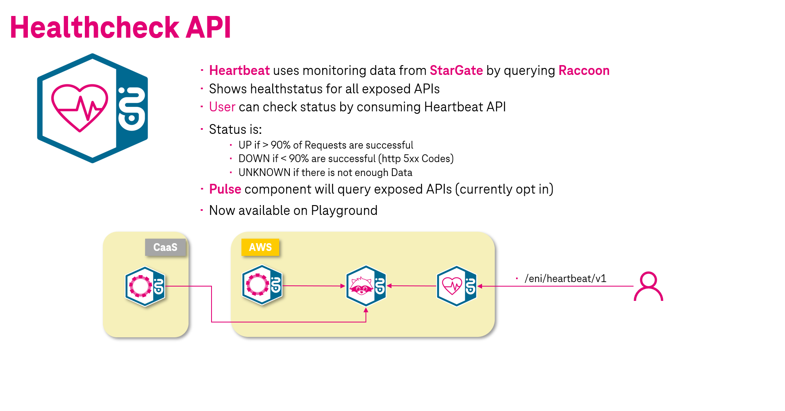

# Heartbeat

{ align=left width=200 }

## What is Heartbeat?

Heartbeat is a microservice for retrieving health status information about services exposed on T‧AR‧D‧I‧S  

Heartbeat requests monitoring data from our internal monitoring solution Raccoon and evaluates the data in order to make assumptions about the recent availability of an API registered on T‧AR‧D‧I‧S  
Heartbeat provides an REST API that can be used to easily check the health status for a specific API identified by their base path, where the health status can either be:

!!! info
    * :heavy_check_mark: `UP` if more than 90% of requests were successful
    * :x: `DOWN` if less than 90% of the requests were successful (5xx HTTP status codes)
    * :confused: `UNKNOWN` if there's not enough data to make an assumption within a time frame

!!! note
    For the evaluation of the monitoring data a time frame of **5 minutes** is currently used.

[](img/concept.png)

!!! info "Pulse"
    We've installed another component named "Pulse" that is responsible for periodically doing requests against APIs in order to generate montoring data that will be used for health status assumptions.  
    This allows us to provide you with health status information even if there's no real customer traffic yet.

!!! note "Pulse currently not active"
    Pulse is currently not enabled by default but at a later time we will provide it as an opt-in feature for your API that you will be able to enable in the familiar declarative way via Rover yaml.

## Where to start?

Before using the Heartbeat API you must be subscribed to it via Rover like any other API on T‧AR‧D‧I‧S With the pnly exception that you don't have to wait for the approval grant since this API will be auto-approved by us.

!!! note "Currently only available on Playground environment"
    Currently Heartbeat is only available on the Playground environment for you to try out. In the future Heartbeat will also be made available on all other environments. Note, that you can only retrieve health status information about APIs that are available on the Playground environment only.

When you are successfully subscribed to Heartbeat API you are fully set up and ready to test via cURL or Postman for example.

### Get health status for a specific API

Currently the API is very basic. You can either get all so-called heartbeats (tuple of basepath and status) for the respective environment or filter the data by using the `basepath` and `status` query parameter.  
In order to get the health status for a specific API you can try the request in the following example.

**`GET`** `/eni/heartbeat/v1/heartbeats?basepath=<Base path of an API>`

Example:

```bash
curl http://stargate-playground.live.dhei.telekom.de/eni/heartbeat/v1/heartbeats?basepath=/eni/echo/v1
```

Example output:

```json
[
  {
    "basepath": "/eni/echo/v1",
    "status": "UP"
  }
]
```

The current API specification of Heartbeat can be viewed [here](https://developer.telekom.de/catalog/eni/eni-heartbeat/system/production/1.0.0).

!!! note "Future improvements"
    As with all our T‧AR‧D‧I‧S services we will of course update the Heartbeat API in the future and make it more useful by adding new features.
