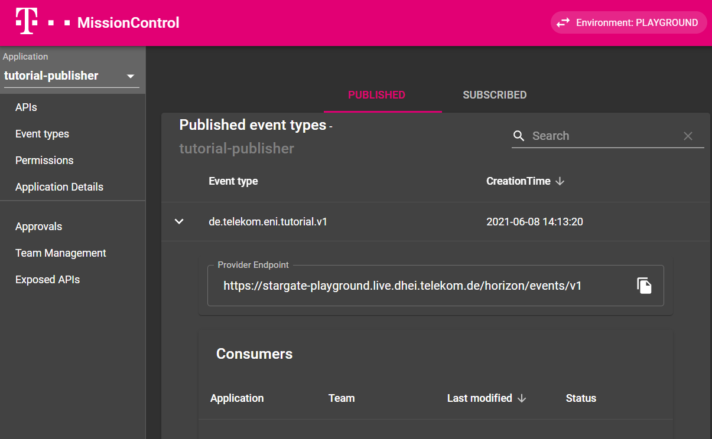
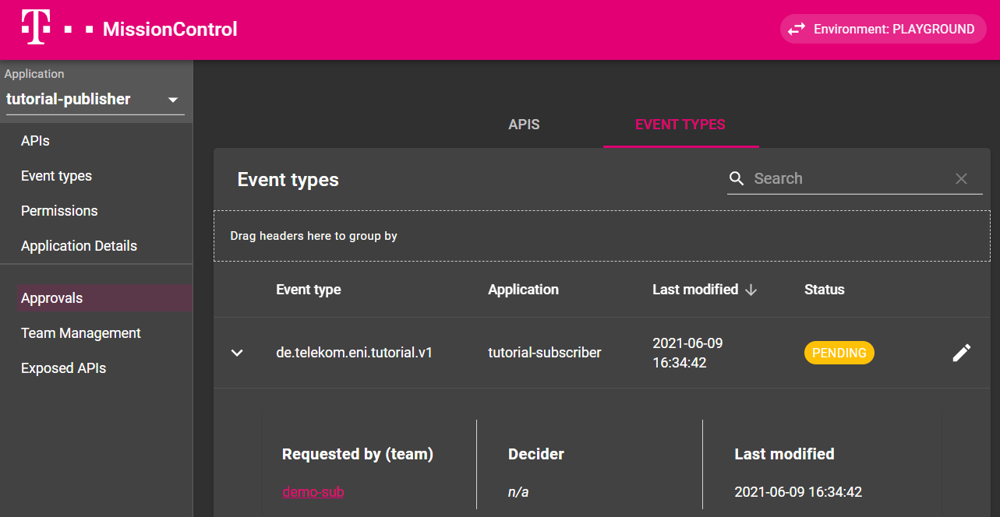
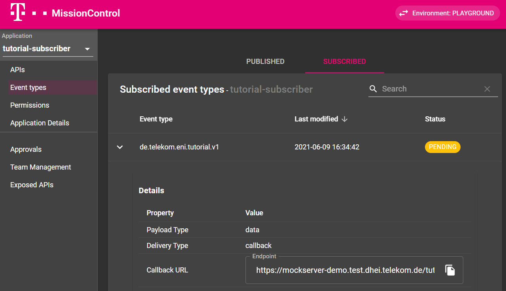

# Horizon Step-By-Step Tutorial

<!-- [[_TOC_]] -->

This tutorial will guide you through all the steps to publish and subscribe to events via Horizon.

!!! attention "Guide might be outdated"
   
      This guid was written for an older version of Horizon and might be out of date. We are working on updating this guide. If something does not directly work please consult our already updated [Reference Guide](README.md). If you still have questions please [contact us](README.md#contact).

!!! important

    Please follow the steps as mentioned and provide us a [Feedback](mailto:T.Ganter@telekom.de@telekom.de?body=Hi%20,%20).

    You can also address your questions, feature request or improvements towards.

!!! info
    If you need support, or found a bug, then  please use our [Support](../support/) channel.


## Onboarding via Mission Control and Setting Up Gitlab Pipeline

If you haven't onboarded your team and set up your gitlab pipeline yet, please follow the steps described in the [StarGate Tutorial](../StarGate/Stargate_Step-By-Step_Tutorial/#onboarding-via-mission-control), because the team onboarding and pipeline setup are identical for the use of Horizon.

## Publisher Use Cases

If you want to publish events via Horizon, in the following you will find a detailed guide for the relevant use cases.

### Register Event Type and Publishing Application

Before you can start publishing events, you have to register your event type and establish connectivity (i.e. retrieve an endpoint on the StarGate, where you can send the events to) in Rover. 

#### Prepare rover.yaml for Publishing Events

Depending on whether you already have a rover.yaml for your application or not, the next steps look slightly different.
Below is an example rover.yaml, which was used for this quickstart guide. You can change the few lines with comments to adapt to your use case. 

```yaml
kind: "EventSpecification"
apiVersion: "tcp.ei.telekom.de/v1"
metadata:
  name: "<your event type name (separated with dashes)>"  # e.g. de-telekom-eni-quickstart-v1
spec:
  type: "<your event type (separated with dots)>"  # e.g. de.telekom.eni.quickstart.v1
  version: "1.0.0"
  description: "<a short description for your events>"  # e.g. An event type for the quickstart guide
  specification: "<optional JSON scheme>"  # can be omitted for the start; otherwise you can find an example below

---

kind: Rover
apiVersion: tcp.ei.telekom.de/v1
metadata:
  name: "<the name of your application>"   # e.g. quickstart-publisher
spec:
  zone: "<the zone where your next StarGate is located>"   # e.g. aws
  exposures:
  - eventType: "<your event type>"    # e.g. de.telekom.eni.quickstart.v1
    visibility: "world"    # remove, if events should not be published to internet

```
An example of a JSON scheme can be found [here](README.md#schema-validation)

##### I have no rover.yaml yet

You can easily copy/paste above example, change the commented lines, remove the comments and you're ready to start your pipeline.


##### I already have a rover.yaml

If you already have a rover.yaml you only need to add following parts for each additional event type you want to publish.
1. The EventSpecification part needs to be added for each new event type. They can go into the same file as the Rover part as seen above or be stored in a separate file. Just make sure this part is processed within your pipeline.
2. For the Rover part you just need to add following lines to your exposures section of your application:
```yaml
  exposures:
  - eventType: "de.telekom.eni.quickstart.v1"
    visibility: "world"  # remove, if events should not be published to internet

```

#### Run the Pipeline and Check Mission Control

Start the according pipeline (`roverctl apply -f "<your rover.yaml>"`). If the run was successful you can check mission control: *Mission Control-> Select the application name you stored in Rover yaml from the left drop down panel-> Go to Event Types*

You should see a similar entry for your application. Note down the provider endpoint for later event sending.



### Grant New Subscriber Access to your Event Type

You will be notified that a new subscriber is requesting access to your event type via e-mail with a link to Mission Control. You can also login via *Mission Control-> Approvals -> Event Types* . In the example it looks like this:


After you have checked if the subscriber is known and eligible to receive your published events you can grant access to the event type by changing the status.


### Sending Events

#### Quick Test
If you want to send an event for the quickstart event type of this guide you can simply download and import this [Postman collection](Postman/Horizon Quickstart.postman_collection.json) and hit 'Send'. All required values are pre-filled.

If you want to test with your own event type, you just have to change a few values in the collection:
1. Replace the request URL with the value from *Mission Control-> Event Types -> Select your Type -> Provider Endpoint*
2. Replace the event type in the request body with your value
3. In the collection variables (select 'Horizon Quickstart', then Variables) replace
    1. keyCloakUrl with the value from *Mission Control-> Application Details -> Token issuer URL* 
    2. _clientId1 with the value from *Mission Control-> Application Details -> Client ID*
    3. _clientSecret1 with the value from *Mission Control-> Application Details -> Client secret*


#### Detailed Implementation Guideline
Here is a collection of important hints when you are starting to implement the Horizon interface into your publisher application.

1. You can find here the [Horizon API specification](openapi/stargate/horizon-producer.yaml). You can include this specification in your applications framework.
2. Your events need to be sent with a Bearer Token. It works the same as for APIs on the StarGate. You can read about it in the [StarGate Step-by-Step Guide](../StarGate/Stargate_Step-By-Step_Tutorial/#step-5-get-clientidsecret-for-your-application) or retrieve the values from the description of the previous chapter.
3. If your event was sent successfully, Horizon will respond with a HTTP 201 created.
4. If you did not provide a trace id in your call to Horizon, it will return a X-B3-TraceId in the response header, which can be used for [tracing](../drax/doc_Drax_README/).
5. In essence, a complete call for sending events to Horizon should look like this:

```
POST http://{stargate url}/horizon/events/v1
 
Header:
Authorization: Bearer {Token obtained from Iris}
content-type: application/json
``` 
Body:
``` json
{
   "id":"c38ce597-bca4-4bc9-9f00-0339c935568b",
   "source":"http://apihost/some/path/resource/1234",
   "specversion":"1.0",
   "type":"de.telekom.eni.quickstart.v1",
   "datacontenttype":"application/json",
   "dataref":"http://apihost/some/api/v1/resource/1234",
   "data":{
      "some":"data",
      "complex":{
         "some":"other2"
      }
   },
   "dataschema":"http://apihost/schema/definition.json"
}
```

## Subscriber Use Cases
If you want to receive events via Horizon, in the following you will find a detailed guide for the relevant use cases.


### Register Subscribing Application and Request Access to Event Type

Before you can start receiving events, you have to request access to the event type at the respective publisher and specify how exactly you want to receive the events. You do all that per rover.yaml file.

#### Prepare rover.yaml for Subscribing to Events

Below are a subscriber rover.yaml with all available values including short comments. You can read more about event subscriptions in the [Horizon Reference](README.md#receiving-events)

```yaml
apiVersion: tcp.ei.telekom.de/v1
kind: Rover
metadata:
  name: "quickstart-subscriber"  # the name of your application
spec:
  zone: "aws"  # the zone where your next StarGate is located
  subscriptions:
  - eventType: "de.telekom.eni.quickstart.v1"  # the event type you want to subscribe to
    callback: "https://mockserver-demo.test.dhei.telekom.de/quickstart"  # where do you want to receive the events (in case of callback)
    deliveryType: "callback | server_sent_event"  # how should the events be sent to you
    payloadType: "data | dataref"  # should the payload be in the event or only a reference
    trigger:  # optional filter settings. remove if not needed
      responseFilter:  # controls which parts of the response should be delivered
        - string
      selectionFilter:  # defines matching conditions, when the event should be delivered at all
        attribute1: value1
```

For your reference, below are two example rover.yamls, which were used for this quickstart guide. One was created for a callback subscription and one for server sent events.

Example callback subscriber rover.yaml
```yaml
apiVersion: tcp.ei.telekom.de/v1
kind: Rover
metadata:
  name: quickstart-cb-subscriber
spec:
  zone: aws
  subscriptions:
  - eventType: de.telekom.eni.quickstart.v1
    callback: https://mockserver-demo.test.dhei.telekom.de/quickstart
    deliveryType: callback
    payloadType: data
```

Example server sent event subscriber rover.yaml
```yaml
apiVersion: tcp.ei.telekom.de/v1
kind: Rover
metadata:
  name: quickstart-sse-subscriber
spec:
  zone: aws
  subscriptions:
  - eventType: de.telekom.eni.quickstart.v1
    deliveryType: server_sent_event
    payloadType: data
```

You can copy the relevant parts from these rover.yamls and integrate them into your projects. Specify delivery type, payload type, filters etc. according to your needs.

##### I have no rover.yaml yet

You can easily copy/paste one of above examples, change the commented lines, remove the comments and you're ready to start your pipeline.


##### I already have a rover.yaml

If you already have a rover.yaml you only need to add following parts to your subscriptions section for each additional event type you want to subscribe to.

```yaml
  subscriptions:
  - eventType: de.telekom.eni.quickstart.v1
    callback: https://mockserver-demo.test.dhei.telekom.de/quickstart
    deliveryType: callback
    payloadType: data
```

#### Run the Pipeline and Check Mission Control

Start the according pipeline (`roverctl apply -f "<your rover.yaml>"`). If the run was successful you can check mission control: *Mission Control-> Select the application name you stored in Rover yaml from the left drop down panel-> Go to Event Types*

You should see a similar entry for your application. You can review the endpoint where the events will be sent to.



#### Wait for Approval by Event Publisher

Now you have to wait until the publisher grants you access to the event type. You will be notified by mail, when the status of your request has changed.


### Receive Events via Callback ("push")
To receive events via callback method, you have to provide the endpoint of your application in the `callback` field of your rover.yaml. Horizon will send the events you subscribed to to the specified endpoint.

#### Quickstart
We are currently planning on providing a public mockserver application for everyone's use. Until this is available, you can provide a simple web server on your side to test the receiving of events.


#### Detailed Implementation Guideline
1. Your application must acknowledge the received event with a 2xx HTTP code.
2. If your application does not acknowledge an event, Horizon will attempt several retries.
3. Verify the integrity of the received event by [checking the gateway token](README.md#via-callback).


### Receive Events via Server Sent Events ("pull")
To receive events via server sent events method, you have to call the Horizon endpoint for your event type and the events will be delivered via the open connection. You can find it in Mission Control: *Mission Control -> Select the application name you stored in Rover yaml from the left drop down panel -> Go to Event Types -> Subscribed Events*

#### Quickstart
The SSE Endpoint in this example looks like this: `https://stargate-playground.live.dhei.telekom.de/horizon/sse/v1/de.telekom.eni.quickstart.v1/148e2ca7bf3ea6a3155c53c951e8338ccf3f14ab`
Unfortunately, a quick test is not possible with Postman or similar tools. However, below is a template command for Windows Powershell. It automatically fetches you a bearer token and opens a SSE connection. You just have to insert your applications values.
 
**Powershell + cURL**  

```powershell
curl.exe -N -H "Authorization:Bearer $((curl.exe -s --insecure -d 'client_id=<CLIENT_ID>&client_secret=<CLIENT_SECRET>&grant_type=client_credentials' -H 'content-type: application/x-www-form-urlencoded' <IRIS_URL> | ConvertFrom-Json).access_token)" <STARGATE_URL>

```

!!! important "use curl.exe"
   
      It's important that you write explicitly the .exe extension when executing the curl command. Otherwise Windows would use an alias instead of the real curl executable  

1. If you want to test with your own event type, you just have to change a few values in the command:
    1. CLIENT_ID with the value from *Mission Control-> Application Details -> Client ID*
    2. CLIENT_SECRET with the value from *Mission Control-> Application Details -> Client secret*
    3. IRIS_URL with the value from *Mission Control-> Application Details -> Token issuer URL* 
    4. STARGATE_URL with the value from *Mission Control-> Event Types -> Subscribed -> SSE endpoint*
2. If you want to re-iterate the quickstart guide, you can use following values:
    1. CLIENT_ID: eni--qs-sub-sse--quickstart-sse-subscriber
    2. CLIENT_SECRET: *****
    3. IRIS_URL: https://iris-playground.live.dhei.telekom.de/auth/realms/default/protocol/openid-connect/token
    4. STARGATE_URL: https://stargate-playground.live.dhei.telekom.de/horizon/sse/v1/de.telekom.eni.quickstart.v1/148e2ca7bf3ea6a3155c53c951e8338ccf3f14ab

#### Detailed Implementation Guideline

1. Your application has to send a GET request to the SSE endpoint on the StarGate including a Bearer Token from Iris.
2. Horizon will respond once with an HTTP 200 and keep the connection open. The events will be sent via this open connection.
3. Horizon will respond by default with the MIME type `application-stream/json`. This follows the [Spring Webflux implementation](https://www.baeldung.com/spring-server-sent-events). Other frameworks expect the MIME type `text/event-stream` according to the [W3C Standard](https://www.w3schools.com/html/html5_serversentevents.asp). Horizon caters for this standard, when the corresponding Accept header is set in the request. Please check, if your framework requires you to specifically enable this header.
4. StarGate will automatically close open connections after 60 seconds. You will see an HTTP 504, which is not an error. Your application has to open another connection against Horizon to receive further events.
5. If you open a new SSE connection and there exists already an open one, the latter one will be closed to prevent accidental double sending of events.
