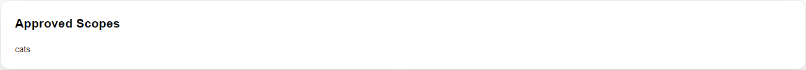
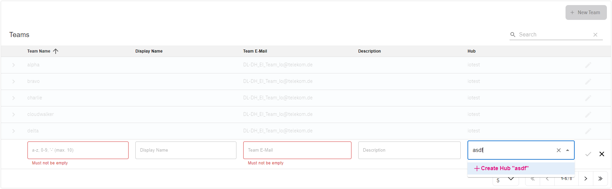

# Mission-Control

`MissionControl` is the central tool for creating and managing teams and StarGate subscriptions on T‧AR‧D‧I‧S Additionally, it provides associated information for your application(s), such as:

* APIs
* Approvals
* Teams
* Client ID/Secret

You can log in using your Windows credentials (email address and Windows password). If redirected, please select ADFS and then enter your Windows credentials.

## Mission Control Exposed APIs

| Environment | Mission Control                                                       | Purpose                     |
| ----------- | --------------------------------------------------------------------- | --------------------------- |
| playground  | <https://developer.telekom.de/missioncontrol/playground/exposedApis/> | APIs overview in Playground |
| preprod     | <https://developer.telekom.de/missioncontrol/preprod/exposedApis/>    | APIs overview in Preprod    |
| prod        | <https://developer.telekom.de/missioncontrol/prod/exposedApis/>       | APIs overview in Production |

## MissionControl

`MissionControl` can be accessed from the header, where you can find options such as My Application, Approvals, Teams, Exposed APIs, and Exposed EventTypes for a specific environment.

## My Applications

### Details

The Application Details tab provides an overview of your application, as well as all related endpoints, such as issuer, Chevron, and listener URL.

#### Overview

The Application Status tab provides an overview of the overall status of your application from Rover's perspective. In most cases, after successful deployment, the status may be BLOCKED, indicating that your Rover file could not be processed completely. This could be due to missing approvals for full functionality. Additional information on this page can be found in the error message and cause displayed below the status. If you have any questions, please provide the messages and details to our [Support](https://developer.telekom.de/docs/src/tardis_customer_handbook/support/) so that we can assist you as quickly as possible.

If the ICTO number is set, the application overview provides CAPE information such as:
* ICTO number
* Application name and description
* Owner (eg. hub)
* Application manager
* etc.

{ width="90%" }

#### Endpoints

The Application Endpoints tab provides an overview of the Client ID/Secret, Chevron URL, and listener URL associated with your application.

* The IRIS Token URL (Keycloak) can be used to retrieve an access token for your application. You can also regenerate your Client Secret from this location.
* The Chevron URL controls the access granted to your applications.
* The SSE-Endpoint is required for your application to receive all events (payload communication) for a route between a consumer and an API.

!!! warning
    Regenerating your Client Secret will cause issues for any application that attempts to retrieve a token using the old secret.

{ width="90%" }

### APIs

The APIs tab in MissionControl gives an overview of the APIs that are associated with the selected application.

#### Exposures

In this tab, you can find all information related to your exposed APIs. If you open a row of the table, you will find the upstream and a list of consumers for the API. Each consumer row provides information about:

* The application and the client ID that consumes your API.
* The team to which the application belongs.
* The listener state and listener-system, in case you approve listening to your API.
* The approval state 

For more information about the listener, you can open the listener view by clicking the 'Details' link.

##### Circuit Breaker

Circuit Breaker is a feature that secures T‧AR‧D‧I‧S against malfunctioning Upstreams. If the Upstreams respond with timeout or error codes without successful requests in between, the Circuit Breaker opens. The term Circuit Breaker is inspired by electric circuits, and the statuses are as follows:

- OPEN means that your API is currently not reachable via T‧AR‧D‧I‧S If you are certain that your Upstream is working again, you can click on the OPEN status, and the Circuit Breaker will be closed.
- CLOSED means everything is working correctly.
- UNKNOWN means there is no Circuit Breaker configured for your API.

!!! info HTTP status codes opening Circuit Breaker
    429 - Too Many Requests
    499 - Client Closed Request
    500 - Internal Server Error
    503 - Service Unavailable

##### Listener

The Listener (also known as Auto-Event) feature allows third-party teams to listen on your API calls. If active, the third party can listen to the entire payload communication route between your API and the consumer who approves the listening. To activate the listener, both the provider (you/your Team) and the consumer must approve the listener. Until then, the listener will show a status of REQUESTED.

#### Subscriptions

This tab provides an overview of all APIs your application is subscribed to. Additionally, the approval log is displayed, which allows you to track the flow of the approval process from the creation of the subscription to the present. You can also view the listener systems that are monitoring your communication to the subscribed API.

There is also a tracing icon added directly next to the application name. From here, you can directly jump into the tracing for your application.

### EventTypes

Similar to the APIs tab, you can find all the information about the EventTypes associated with the selected application.

#### Exposures

In this tab, you can find all information related to your exposed EventTypes. If you open a row of the table, you will find the Provider Endpoint and a list of Consumers for the EventType. Additionally, there is an icon to jump directly into the tracing of the exposed EventType.

#### Subscriptions

In this tab, you can view all EventTypes that your application is subscribed to. Additional details will be displayed when you open an item in the list of subscriptions, such as:

* Details to the subscribed EventType
* The filter that is used for responses
* The selection filter for messages
* Which team can be contacted for support regarding this EventType
* A history of the approvals for the subscription

On the table row, you can also find an icon that will take you to the tracing of your EventType subscription.

##### Approved Scopes

In this section of the page, you can see the scopes that were approved for the EventType. For more information about scopes, please visit the [Horizon Scopes](https://developer.telekom.de/docs/src/tardis_customer_handbook/horizon/#scopes) section.

##### Advanced Selection Filter

In this section of the page, the advanced selection filters that were set with the Rover file are displayed. You can expand each nested element to see the exact value saved inside Rover. For more information about advanced selection filters, please visit the [Horizon Selection Filter](https://developer.telekom.de/docs/src/tardis_customer_handbook/horizon/#selection-filter-when) section.

### FileTypes

Similar to the EventTypes tab, you can find all the information about the FileTypes associated with the selected application. For more information about FileTypes look into the [CloudWalker](https://developer.telekom.de/docs/src/tardis_customer_handbook/CloudWalker/#senderpublisher-exposing-files) documentation.

#### Exposures

In this tab, you will find all information related to the FileTypes you have exposed. If you open a row in the table, you will see the provider endpoint, a notification callback URL, and a list of consumers.

{ width="90%" }

#### Subscriptions

In this tab, you will find all information related to the FileTypes that you have subscribed to. If you open a row in the table, you will see the consumer endpoint, details of the subscribed FileType, including the notification URLs, contact information for your provider, and logs for the approval status.

{ width="90%" }

### MetricsTenants

Similar to the FilesTypes tab, you can find all the information about the MetricsTenants associated with the selected application.

#### Exposures

In this tab you will find all information related to the MetricsTenants you have exposed. If you open a row in the table, you will see a list of consumers.

{ width="90%" }

#### Subscriptions

In this tab, you will find all information related to the MetricsTenants that you have subscribed to. If you open a row in the table, you will see the details of the subscribed MetricTenant, including insert, select and observer urls, contact information for your provider, and logs for the approval status.

{ width="90%" }

### Listeners

If you want to listen to the traffic of a specific provider, you can check the status of your request in the Listeners view. In the details, you'll find the SSE-Endpoint for the events that contain the requests, the approval status, both teams you want to listen to, and your filters.

For more information about listening, please check the [Spectre](https://developer.telekom.de/docs/src/tardis_customer_handbook/spectre/) documentation.

{ width="90%" }

## Approvals

The Approvals view visualizes all incoming subscriptions for APIs, EventTypes, and listeners that correspond to your teams. You can switch between APIs, EventTypes, and Listeners using the tabs at the top of the table.
  
{ width="90%" }

In this view, you can edit the approval of a subscription. Additionally, you can add a comment to your approval step.

!!! info 
    Expanding an API, EventType, FileType, or Listener provides more information about the requested team, the person responsible for making the decision and CAPE information about the application such as the owner/hub, application manager, etc.
 
## 4-eyes principle

This feature allows API owners to control and manage a 4-eyes approval flow. If the approval strategy is set to "FOUREYES," the 4-eyes view will be displayed. Granting a subscription requires approval from two different team members.

Notes: 

* To use the 4-eyes principle, the team must have at least two members.
* The 4-eyes principle is enabled for every API exposure in the production environment and can be turned on or off for other environments.

### Semi-Granting and Granting

After receiving a subscription to your API, the first decider can 'semi-grant' or reject it. Once semi-granted, the first decider can only reject the subscription."

{ width="90%" }

The subscription is granted once the second decider approves it. The 'expired' column shows the expiration date.

{ width="90%" }

### Re-Granting 

This feature allows API providers to control the expiration date for the related approval. Note that the expiration date is shorter than 12 months and a warning interval is set to two weeks before expiration. If the team/deciders have expiring approvals, a large red badge will be displayed at the top of Mission Control.

{ width="90%" }
  
An exclamation mark will be displayed next to 'Expire Date':

* Yellow if it's in the warning interval.
* Red if it's past the expiration date.

After re-granting, the expiration date will reset, and the warning will disappear.

!!! note 
    Currently, the consumer can continue to use the API after the expiration date. This may change in the future.

## Exposed APIs

This tab provides a list of APIs currently exposed on StarGate.

{ width="90%" }

!!! info
    You can set a filter or search for APIs. Additionally, by expanding a selected API, you can obtain an example Subscription Rover.yaml file for AWS or CaaS for the corresponding API.

{ width="90%" }

You can add an ICTO number so that the provider of an API can obtain information about the application of the consumer that wants to use the API. The ICTO number is not mandatory but helps in approving your subscription and connecting to system owners. 

Additionally, based on the selected API, you can add scopes for your subscription.

## Exposed EventTypes

This tab provides a list of EventTypes currently exposed on StarGate.

{ width="90%" }

!!! info
    You can set a filter or search for EventTypes. Additionally, by expanding a selected EventType, you can obtain an example Subscription Rover.yaml file for AWS or CaaS for the corresponding EventType.

Just like the Exposed APIs view, you can add an ICTO number so that the provider of an EventType can obtain information about the application of the consumer that wants to use the EventType. The ICTO number is not mandatory but helps in approving your subscription and connecting to system owners.

## Exposed FileTypes

This tab provides a list of FileTypes currently exposed on StarGate.

{ width="90%" }

!!! info
    You can set a filter or search for FileTypes. Additionally, by expanding a selected FileType, you can obtain an example Subscription Rover.yaml file for AWS or CaaS for the corresponding FileType.

You can add an ICTO number so that the provider of a FileType can obtain information about the application of the consumer that wants to use the FileType. The ICTO number is not mandatory but will help in approving your subscription and connecting to system owners.

## Exposed MetricsTenants

This tab provides a list of MetricsTenants that are currently exposed.

{ width="90%" }

!!! info
    You can set a filter or search for MetricsTenants.

You can add an ICTO number so that the provider of an API can obtain information about the application of the consumer that wants to use the API. The ICTO number is not mandatory but helps in approving your subscription and connecting to system owners.

## Team Management

API Consumers and Providers who want to expose or consume any service available on StarGate need to first create a Team.

Under the Team management section, users can create a team and add additional team members.

For existing teams, you will find the Rover Deployer token (for the pipeline) in the team's details, as well as the team members. Select the team to get the deployer token.

!!! warning
    The deployer token associated with the team is created after the team has been listed on Mission Control. If you regenerate it, your pipelines won't be able to use roverctl until you use the new deployer token. Don't forget to inform all your team members about the change!

{ width="90%" }

### Create Team

When creating teams, the available hubs will be listed. If your hub isn't listed, you can create it by selecting [Create New Hub](https://developer.telekom.de/docs/src/tardis_customer_handbook/mission-control/#create-hub).

{ width="90%" }

To create resources on StarGate/IRIS, we need the hub abbreviation and a team short name with the following restrictions:

- only lowercase characters and digits and hyphens
- only one hyphen in sequence

### Create Hub

Teams are always associated with a Hub. If your Hub is not already listed on Mission Control, you can create a new Hub by typing the Hub name in the Hub section while creating the team.

!!! note
    You can easily find the Hubs already listed on StarGate by typing the name in the search bar. No need to scroll through the list.

{ width="90%" }

To create resources on StarGate/IRIS, we need the hub abbreviation and a team short name with the following restrictions:

- only lowercase characters and digits and hyphens
- only one hyphen in sequence

### Delete Team / Hub

You cannot delete teams or hubs yourself. For this, you need the support of the T‧AR‧D‧I‧S colleagues. Simply create a ticket in our [ServiceDesk](https://jira.telekom.de/servicedesk/customer/portal/522) and name the team/hub that should be deleted. You should also include the environment in which the deletion should take place.

!!! warning
    Only teams that do not contain referenced resources will be deleted. Therefore, the team must actively delete these themselves before the team/hub is deleted by T‧AR‧D‧I‧S Support."

### Regenerate Rover Token

In case you need to regenerate your RoverToken (also known as DeployerToken), just hit the Regenerate button and copy the new token. Due to some technical restrictions, please refresh the page after hitting the regenerate button.

{ width="90%" }

Finally you have to update the RoverToken in your CI/CD veriables in Gitlab. See [Step 3](https://developer.telekom.de/docs/src/tardis_customer_handbook/StarGate/Stargate_Step-By-Step_Tutorial/#step-3-create-the-cicd-variables-for-your-pipeline) of setting up your Gitlab Pipeline in T‧AR‧D‧I‧S Step-by-Step Tutorial.

