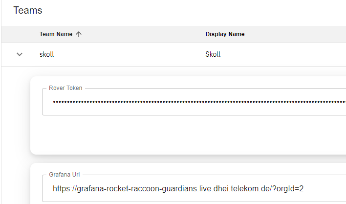
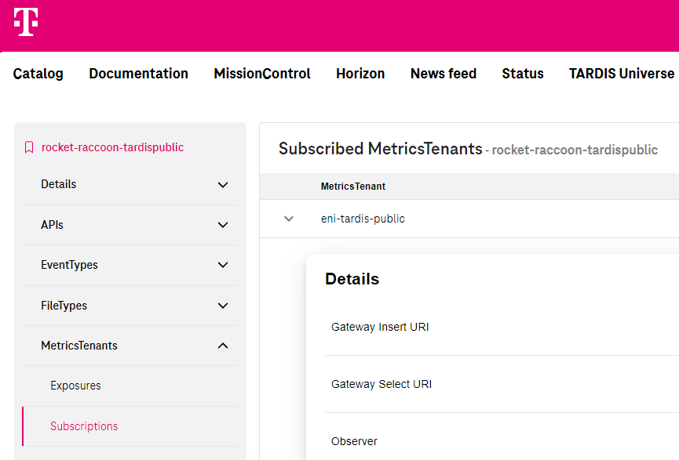

# Upgrade to Raccoon Self Service and Grafana 9

To upgrade to the new Raccoon self-service feature and Grafana 9, it is required that you migrate your existing RaaS installations (dashboards, alerts, metricsTenants). For reasons of operational feasibility on our side, we kindly ask you to accomplish this **until Friday, 12.05.2023**, when we envisage to retire the old Grafana instances.

You can read the details of Raccoon self-service [here](Raccoon_Self_Service.md).

## Tutorial: Migrate to the new Grafana instances

Raccoon self-service goes along with new Grafana instances with version 9. 

### Step 1: Initialize your Grafana organization in Grafana 9

Create/activate your Grafana organization in the Mission-Control team view.
[Here](Raccoon_Self_Service.md#grafana) you can read how to do this.

Your new Grafana URL can be found at your team section in Mission-Control:

### Step 2: Move your configuration

##### User- and team management

As previously all users who are not in your Mission-Control team need to login to the Grafana instance first.
After Grafana knows this user you can invite the user to the organization via email address in lowercase.

##### Datasources

All datasources must be re-connected in Grafana 9. Access to T‧AR‧D‧I‧S Public needs to be [subscribed via Rover](Raccoon_Self_Service.md#subscribing-to-public-tardis-metrics).

##### API-Keys

API key are directly creatable.

With Grafana 9 you can use service accounts to manage api keys in a more structured manner.

##### Dashboards and folders

To help migrating your dashboards we offer our [Grafana-CLI](products-as-enabler/Grafana_Cli.md). 
With this tool you can manage dashboards and alert rules via gitlab.

!!! Attention
    Alert configurations at time-series panels can´t be migrated.

##### Alerts configurations and notification channels

Grafana refactored the alerting. Thus alerts need to be set up from scratch.

You can find an overview on the Grafana 9 alerting [here](grafana/Unified_Alerting.md) 

#### Step 3: Inform us

After you have migrated everything from your organization, 
please [inform us](../support/README.md#tardis-monitoring-support-channel), so we can keep track of the progress.

## Tutorial: Migrate your metrics stores

This refers to those who already write their metrics to an isolated partition in our Raccoon time series database. 

### Step 1: Expose a new metricsTenant and subscribe to it

Now, with the Racoon self-service you´re able to `expose` and `subscribe` to a partion (now called `metricsTenant`) via Rover.
To do this please follow the [Step-By-Step Tutorial](Raccoon_Self_Service.md#step-by-step-tutorial).

### Step 2: Write to the insert API of your new metricsTenant

After you have exposed and subscribed to a new metricsTenant you´ll find the access details in the MetricsTenant section of your application in [Mission-Control](https://developer.telekom.de/missioncontrol/playground/applications/).

Use the **Gateway insert URI** as new endpoint to write your metrics to.

For a smooth transition it would be profitable to write the metrics both to your legacy RaaS endpoint and to the metricTenant endpoint in parallel, until the history of 30 days is available in the metricsTenant. Tools like Prometheus and VMAgent are able to write collected metrics to multiple endpoints. 

### Step 3: Remove Rover subscription(s) to the RaaS API endpoint(s)

After you successfully migrated, please remove your RaaS API subscription(s).
This automatically informs us about the progress of migration.

!!! Attention
    The removal of an API subscription has no impact on your RaaS Grafana 8 dashboards and alerts.
    This includes subscriptions to these API´s too:
    * eni-guardians-raas-onboarding-caas-v1
    * eni-guardians-raas-onboarding-aws-v1
