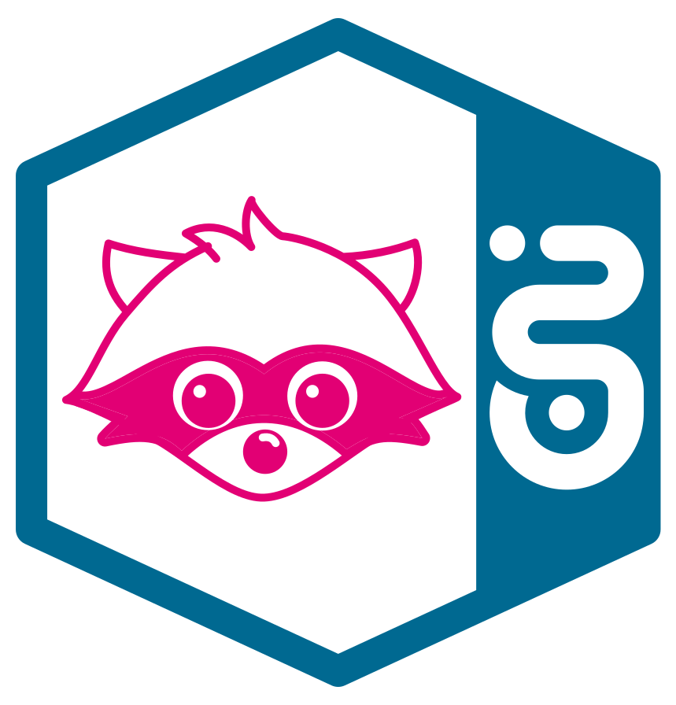
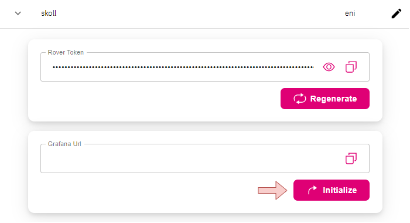
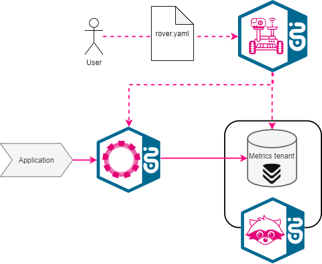
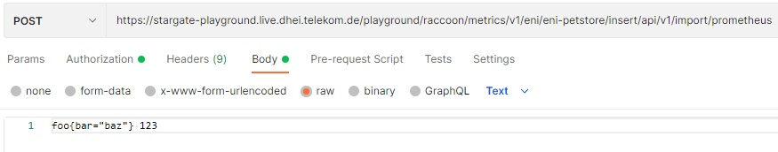
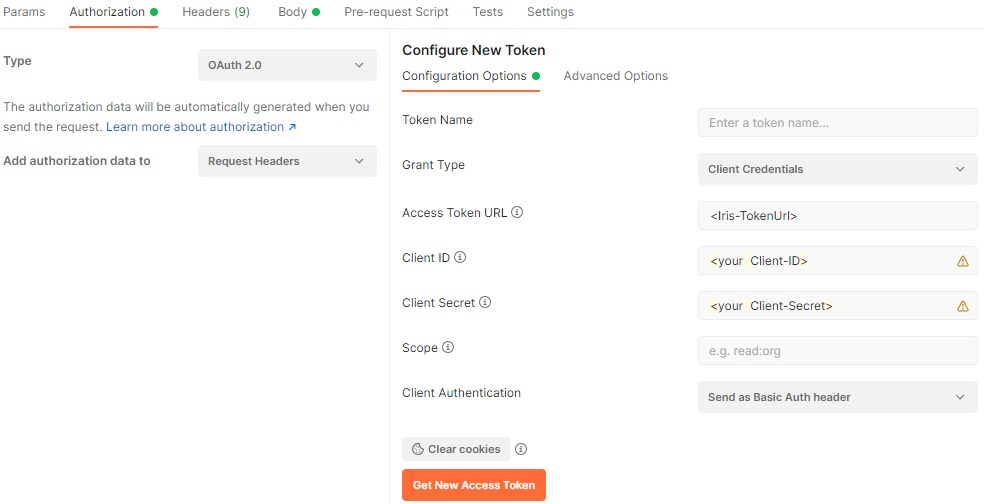
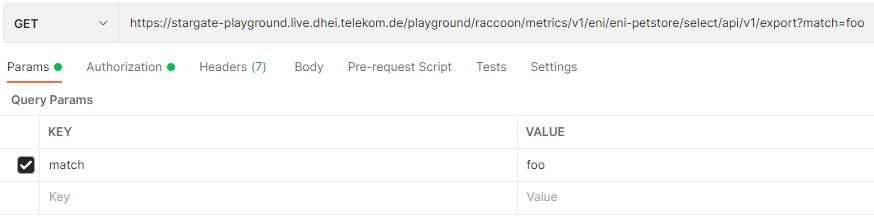
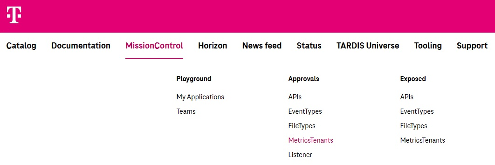

# Raccoon Self Service



Raccoon uses VictoriaMetrics as time series database and Grafana as the graphical user interface.

VictoriaMetrics supports multi tenancy to manage metrics data in different isolated partitions, called tenants (we call them `metricsTenants`). 
Using the Rover interface and its declarative approach, users are able to reserve a metricsTenant and expose and subscribe to its write and read access. 

Grafana can visualize time series and gives the option alerting on them. 
Additionally, it supports working in organizations where teams, dashboards and more can be managed in an isolated way. 
Raccoon allows users to create their own organizations. 

## Grafana  

In addition to the information below, you´ll find more details in our [documentations](grafana/README.md).

### Create an organization

If you haven't already set up your team in Mission-Control, please follow the steps described in the [StarGate Tutorial](../StarGate/Stargate_Step-By-Step_Tutorial.md#onboarding-via-mission-control).

Every team member in Mission-Control can initialize/create an organization for the currently selected environment by pressing the dedicated button in MissionControl:



!!! attention
    Currently the initialization process of an organization takes a couple of minutes! Please don't lose patience and continue with this guide in the meantime.

!!! About User Management
    On initialization, all members of the given Mission-Control team will become admins of your organization.
    Afterwards, Grafana's user management will be independent of team changes in Mission-Control.
    For more information about user management in Grafana, please take a look at: [User Management](grafana/HowTos.md#add-users-to-my-organization)

As an alternative to the management via Mission-Control, a Grafana organization can be initialized with your first granted subscription to a `metricsTenant` with `observe` rights via Rover.
For this option, please refer to [Step 3 Subscribe](#step-3-subscribe) of the Step-by-Step tutorial. 
Also you can query your Grafana configuration via [Rover](../rover/README.md#get-applications-information-with-rover).

### Environment Mapping

Raccoon can be initialized in each T‧AR‧D‧I‧S environment. However, we do not offer a separate Grafana instance for each environment.
Therefore, all test environments are mapped into a single Grafana instance.

!!! Note
    For more information about TARIDS environments, please take a look at: [StarGate Environment Overview](../StarGate_Environment_Overview.md)

Mapping environments avoids confusion with having to handle multiple Grafana instances and in particular has the following advantages:

- All data from the test environments are visible in one place, Grafana clients don't have to be switched. The name of each datasource contains its environment of origin, so you can distinguish between them with ease.
- Less effort for user management is needed. Once set up in the central Grafana, users can access metrics from all test environments.

!!! attention
    In order to successfully map environments together, both **hub name** and **team name** needs to be identical across different environments in [MissionControl](../mission-control/README.md).

The following table shows which environments are mapped together:

| Environment  | [Grafana Live](https://grafana-rocket-raccoon-guardians.live.dhei.telekom.de) | [Grafana Prod](https://grafana-rocket-raccoon-guardians.prod.dhei.telekom.de) |
|:-------------|:-----------------------------------------------------------------------------:|:-----------------------------------------------------------------------------:|
| playground   |                              :white_check_mark:                               |                                                                               |
| preprod      |                              :white_check_mark:                               |                                                                               |
| prod         |                                                                               |                              :white_check_mark:                               |
| av           |                              :white_check_mark:                               |                                                                               |
| bond         |                              :white_check_mark:                               |                                                                               |
| frv          |                              :white_check_mark:                               |                                                                               |
| cit2         |                              :white_check_mark:                               |                                                                               |
| cit4         |                              :white_check_mark:                               |                                                                               |
| rv           |                              :white_check_mark:                               |                                                                               |
| sit          |                              :white_check_mark:                               |                                                                               |


## MetricsTenants

MetricsTenant reservation and exposure is a combined step and in the following will be addressed only as exposure.

Every read or write access to the metricsTenant is controlled by the owner (who exposed it) by means of the standard approval handling of [Mission-Control](../mission-control/README.md).
Apart from access via Grafana, all connections to the metricsTenants will be via APIs and handled and secured by [StarGate](../StarGate/README.md).

### Step-By-Step Tutorial

The tutorial will guide you through all steps to expose and subscribe to so-called `metricsTenants` where the metrics data is managed in Raccoon.

#### Step 1: Onboarding

Exposures and subscriptions will be applied by [Rover](../rover/README.md) and follow its declarative approach.

If you haven't already set up your team in Mission-Control, please follow the steps described in the [StarGate Tutorial](../StarGate/Stargate_Step-By-Step_Tutorial.md#onboarding-via-mission-control).

!!! Note
    Actions under the same application will override previously applied actions (That´s the 'declarative approach').
    To prevent this, merge all actions to your final rover.yaml or use another application name.

Use the [RoverCtl](../rover/README.md#roverctl-binaries) to apply the `rover.yaml`. You can use the RoverCtl in your [Pipeline](../rover/README.md#how-to-use-rover-in-pipeline).


#### Step 2: Expose

Exposing a so-called `metricsTenant` means to exclusively reserve an isolated partition for storing metrics data in Raccoon.
You become owner of the `metricsTenant` with your exposure and get the responsibility to grant access to it.

The exposure has to be prepared like this:

**Example** `rover.yaml`

```yaml
apiVersion: tcp.ei.telekom.de/v1
kind: Rover
metadata:
  name: petstore  # the name of your application
spec:
  zone: aws # the zone where the metrics tenant is being hosted
  exposures:
    - metricsTenant: "eni-petstore" # your new name for the metricsTenant
```

!!! attention
    Metrics tenants are only hosted on aws. Therefore, only `zone: aws` is supported for metrics exposures. Subscriptions on different zones are, however, possible. 
    If your client application is on `zone:cetus`, you need **separate declarations** in the `rover.yaml` with `zone:aws` for your metrics exposure and `zone:cetus` for your subscriptions. 
    Make sure that in this case you **specify different applications in the metadata.name-fields**, lest the two declarations supersede each other!

**Example: separate declarations in the** `rover.yaml`

```yaml
apiVersion: tcp.ei.telekom.de/v1
kind: Rover
metadata:
  name: petstore-exposure  # the name of your application - choose a different application name compared to your subscription-rover!
spec:
  zone: aws # the zone where the metrics tenant is being hosted
  exposures:
    - metricsTenant: "eni-petstore" # your new name for the metricsTenant
---
apiVersion: tcp.ei.telekom.de/v1
kind: Rover
metadata:
  name: petstore # the name of your application
spec:
  zone: cetus # the zone from where you want to connect to StarGate
  subscriptions:
    - metricsTenant: "eni-petstore" # the name of the metricsTenant 
      access: # the list of access rights you want to request
        - read
        - write
        - observe
```

The name of the `metricsTenant` is to be chosen by you. It must start with your hub name as prefix and needs to be globally unique within an environment. 
The name will then also be the reference when subscribing to this `metricsTenant`.

#### Step 3: Subscribe

To subscribe to a `metricsTenant` means to request for access to the metrics stored in the respective partition.

There are a couple of different access rights, which can be requested:

| Access right | Description                           | Details                                                                                                                                                                                                    |
|--------------|---------------------------------------|------------------------------------------------------------------------------------------------------------------------------------------------------------------------------------------------------------|
| `read`       | Querying metrics over Stargate        | Enables access to `*/select/<>/prometheus` [http api](https://prometheus.io/docs/prometheus/latest/querying/api/) of VictoriaMetrics                                                                       |
| `write`      | Inserting metrics over Stargate       | Enables access to `*/insert/<>/prometheus` http api of VictoriaMetrics (e.g. to insert metrics with [remoteWrite](https://prometheus.io/docs/prometheus/latest/configuration/configuration/#remote_write)) |
| `observe`    | Querying metrics over Raccoon Grafana | A datasource will be created in your Grafana organization. Based on this datasource, you´re able to create dashboards and alerts by your own. An organization will be created, if not already in place.    |


All desired subscriptions can be listed together under the same application, which is the one you identify to Stargate when writing or reading data. 

**Example** `rover.yaml`

```yaml
apiVersion: tcp.ei.telekom.de/v1
kind: Rover
metadata:
  name: petstore # the name of your application
spec:
  zone: aws # the zone from where you want to connect to StarGate / the zone where you want to exposure the metricsTenant
  exposures:
    - metricsTenant: "eni-petstore" # your new name of the metricsTenant
  subscriptions:
    - metricsTenant: "eni-petstore" # the name of the metricsTenant 
      access: # the list of access rights you want to request
        - read
        - write
        - observe
```

#### Step 4: Start storing metrics data

Stargate is used as gateway in front of Raccoon and handles granted access for `metricsTenants` just like for all APIs.



So the metrics APIs are [secured](../StarGate/README.md#api-security-on-stargate) with the "Client Credentials Flow".

For example, this protocol is supported by [Prometheus](https://prometheus.io/docs/prometheus/latest/configuration/configuration/#oauth2) and [VictoriaMetrics-Agent](https://docs.victoriametrics.com/vmagent.html). They could be used by your application.

#### Step 5: Query your application information and test your configuration

You can retrieve all information related to your application by using the RoverCtl with the [get-info](../rover/README.md#get-applications-information-with-rover) command.


Example output of `rover get-info -f 'rover.yaml'`:

```yaml
apiVersion: "tcp.ei.telekom.de/v1"
kind: "TeamInfo"
applications:
  - name: "eni-guardians-demo"
    zone: "aws"
    observerUrl: "xxx"  # observe access
    subscriptions:
      - kind: "METRICS_TENANT"
        metricsTenantInsertUrl: "xxx" # write access
        metricsTenantSelectUrl: "xxx" # read access
    variables:
      - name: "tardis.raccoon.observer.url" # observe access
        value: "xxx"
      - name: "tardis.raccoon.insert.url"   # write access
        value: "xxx"
      - name: "tardis.raccoon.select.url"   # read access
        value: "xxx"
```

Now you can test the [insert](#insert-a-test-metric) and [select](#select-the-test-metric) connection with Postman.
For a fast start collecting metrics in your kubernetes cluster and sending them to your metricsTenant over Stargate you can use our [metrics collector](products-as-enabler/Metrics_Collector.md).

##### Insert a test metric

Call a POST request to the `insert` api for your `metricsTenant`:

- `https://<StarGate-Url>/<metricsTenant-insert-apiPath>/api/v1/import/prometheus`
- Write an example metric as raw text body like `foo{bar="baz"} 123`



- Choose the Authorization `OAuth 2.0` and configure:
    - Grant Type: `Client Credentials`
    - Access Token URL: `https://<Iris Token-Url>`
    - Client-ID: `<your Client-ID>`
    - Client-Secret: `<your Client-Secret>`
    - Client Authentication: `Send as Basic Auth header`
    - 'Get New Access Token' and 'Use Token'




##### Select the test metric

Call a GET request to the `select` api for your metricsTenant:

- `https://<StarGate-Url>/<metricsTenant-select-apiPath>/api/v1/export?match=foo`



- Choose the Authorization `OAuth 2.0` and configure:
    - Grant Type: `Client Credentials`
    - Access Token URL: `https://<Iris Token-Url>`
    - Client-ID: `<your Client-ID>`
    - Client-Secret: `<your Client-Secret>`
    - Client Authentication: `Send as Basic Auth header`
    - 'Get New Access Token' and 'Use Token'


### Subscribing to a foreign `metricsTenant`

You can as well subscribe to tenants exposed by other teams, provided they approve your subscription. 
Please be careful to always specify the whole set of exposures and subscriptions you want to maintain for a specific application (identified by the `name`in the metadata section) in your rover.yaml.

*Example*: rover.yaml
```yaml
apiVersion: "tcp.ei.telekom.de/v1"
kind: "Rover"
metadata:
  name: "eni-petstore"
spec:
  zone: "aws"
  subscriptions:
    - metricsTenant: "eni-tardis-public"
      access:
        - observe
```

Approvals of cross-application subscriptions are possible via MissionControl now.



### Subscribing to public T‧AR‧D‧I‧S metrics

You can subscribe to public T‧AR‧D‧I‧S metrics, so you are able to create dashboards and alerts by your own in your organization based on the T‧AR‧D‧I‧S traffic data as described [here](grafana/README.md#view-tardis-api-gateway-traffic). 
The datasource for the public T‧AR‧D‧I‧S metrics is just a special case of a  (['foreign metricsTenant'](#subscribing-to-a-foreign-metricstenant)). The tenant name you must subscribe to in this case is **eni-tardis-public**.

With access type `observe` you obtain a respective datasource in Grafana, with access type `read` you can retrieve metrics data via API. Access type `write` will not be granted to public T‧AR‧D‧I‧S data for obvious reasons.