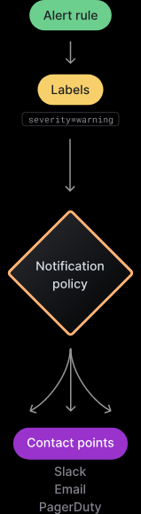
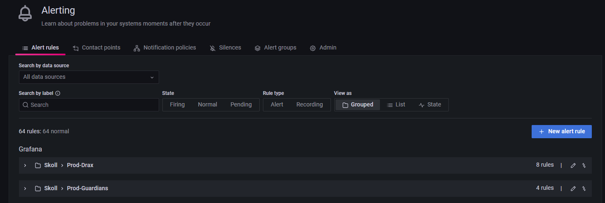

# Unified Alerting

Grafana 9 provides the new so-called Unified Alerting.

This description relates to Grafana version **v9.3.x**

Grafana itself documented [here](https://grafana.com/docs/grafana/latest/alerting/#alerting) everything.

## General innovations

Refactored handling of alert rules:



### Alert rule

With Grafana 8 it was necessary to configure a time-series panel. 
Within this panel a single alert could be defined by it´s conditions and some more configurations like one or more notification channels.
This concept has changed completely with recent Grafana versions. 
In Grafana 9, an alert rule can exist on its own and thus may or may not be related to a panel. And now also multiple rules are relatable to a single panel.

#### Grouping 

You are able to group configured alert rules to prevent duplicate alert events. 
A new view is available in the alerting section for grouping



To group, simply add a custom name in the `Group` field in every alert rule.

### Labels 

With Grafana 8 notification channels were connected to the alert configurations. 
The channel was configured for example as webhook and configured to the endpoint where to send the alert event to.
Now with the unified alerting, the channels (now replaced with `contact points`) are associated via labels, which are configured at the alert rules. 

### Notification policy

The newly available notification policies are placed as an additional layer to map between the alert rules and their endpoints. 
The notification policies are referred by the labels configured in the alert rules and in turn refer to so called contact points, which replace the legacy notification channels.
With a combination of labels you´re again able to send to one or more endpoints.

### Contact points

Contact points are the replacement of the old notification channels. They again offer channel type options like webhook, webex channels, smtp (email) channels.

#### Message Templating

Message templates can be used to define a standardized alert event for a contact point. 
They provide a dynamical way to iterate over the event details and can be used to improve the event format.

Here an example for a webex channel:
``` 
{{ define "WebExBotTestProd" }} 
  {{ if gt (len .Alerts.Firing) 0 }}
      <h2>💔 [Alerting] Prod environment status: Stargate Failure Rate alert</h2>
      <h4>The following routes had a failure rate above 10% within the last hour:</h4>
     {{ range .Alerts.Firing }} {{ template "WebExAlert" .}} {{ end }}
  {{ end }}
  {{ if gt (len .Alerts.Resolved) 0 }}
      💚 [Resolved] Prod environment:
     {{ range .Alerts.Resolved }} {{ template "WebExAlert" .}} {{ end }}
  {{ end }}
{{ end }}
```

### Silences

Silences can be used to mute specific or all alert instances. 
You can configure specific time ranges and durations which makes them very handy in case of maintenances. 

