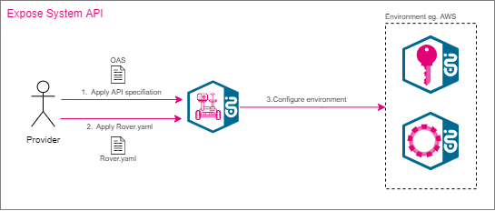

# Stargate & Rover Handbook

{ loading=lazy width="250" }

The following guide will give you a first insight into Rover.

Rover enables users to perform API Management functionalities on ENI provided StarGate (Gateway) and Iris (IDP).

With Rover you can expose an API and subscribe to an API. With the use of Mission-Control, you are able to see your APIs, Subscriptions and you are also able to approve or deny subscriptions on a UI.

In order to be able to operate the APIs in T‧AR‧D‧I‧S, many tasks have to be done. No worries, Rover will handle this for you.
This includes the configuration of the zone and thus the configuration of the individual system components such as StarGate and Iris. The configuration contains all the information that is required to operate the API. The configuration is summarized as `rover.yaml`.

Rover is a tool that can be used as a command tool directly in your pipeline. Rover processes the configuration file `rover.yaml`, connect to the specified zone and sets up the zone so that the API is operationally exposed and specified subscribers have appropriate access.
Depending on the configuration of the `rover.yaml`, Rover is also responsible for handling subscriptions for the consumer. Rover also initiates the necessary approval process, which can then be managed by the responsible team via the Rover Mission Control UI. After subscribing to an exposed API, the consumer application is able to use the API. The following image describes the m2m-flow when the consumer application calls a subscribed API.

{ loading=lazy width="70%" }

## User Roles

The API management can basically be faced with two different roles depending of the context.
Either you are a **provider** or a **consumer**.
The difference between provider and consumer is that the provider has all rights to perform operations on the zone. This includes exposing APIs and adding or removing subscriptions.
As a consumer, you are only able to subscribe and unsubscribe.

## Rover.yaml

To subscribe/expose an API you need to create a `rover.yaml` file for each of your applications that wants to expose or subscribe an API.  Here you can manage all meta-information as well as the subscriptions and exposures, as you can see in the following example of a `rover.yaml` File.

| **Attribute**      | **Description**           |
| ------------- |-------------|
| `name` |The name of your Application|
| `zone` |The zone in which the service in running (e.g. aws, caas) If your service is running in HITNET/CNTDTAG env as OTC or AppAgile or Sever farm then please select zone as CaaS|
| `icto` | The ICTO number is a unique identification number for an application or IT system. ICT and Operation (ICT: Information and Communication Technology) |
| `exposures` |A list of APIs that you want to expose. It is only possible to expose the entire API. It is not possible to expose a single resource. Therefore, every exposure needs the API Base Path which you can find in the Open API Specification File of your API and the upstream URL.
| `basePath:` | `basePath` as defined in OAS Specification
| `upstream:` | Service Backend|
| `approval:` | Set approval strategy. <br><br>Available strategies: "AUTO", "SIMPLE", "FOUREYES. <br><br> "AUTO" - that everybody can use the API without approval. <br>"SIMPLE" - the provider must first accept the approval request, before a consumer can use the API. <br> "FOUREYES" -  two decider ( four eyes priciple ) must accept the approval<br> <br> Default: **SIMPLE**|
| `visibility:` | Defines the visibility of the API. This can be used to specify whether the API is only visible in the exposed zone, internally or also externally. Set the visibility of your exposure to *ZONE* if you want to limit the subscriptions to your zone or to *WORLD* if you want to publish your API on Spacegate for external consumer so that the API is reachable via Internet. By default (*ENTERPRISE*), APIs are visible on all internal zones.|
| `subscriptions` |A list of APIs that you want to subscribe. After an API is successful subscribed, you are able to use the API. It is only possible to subscribe to the entire API. It isn´t possible to subscribe only to a single resource.|

!!! example "Example `rover.yaml`"

    ```yaml
    apiVersion: tcp.ei.telekom.de/v1
    kind: Rover
    metadata:
      name: petstore
    spec:
      zone: caas
      icto: icto-20575
      exposures:
      - basePath: "/petstore/v1"
        upstream: "http://petstore.preprod.tif.telekom.de/petstore"
        approval: "SIMPLE"
        visibility: WORLD
        accessTokenForwarding: true
      subscriptions:
      - basePath: "/petstore/v1"
    ```

Example can be found in [Examples Section](#examples).

## Onboarding

Before Rover can be used, an onboarding is required. This step is necessary to correctly configure the environment and to set up the user so that Rover can be used successfully.

The self-onboarding is provided by Mission Control. Please follow the [Team Management](../mission-control/#team-management) on Mission Control to create team/hubs.

!!! Note
    For creating resource on StarGate/IRIS, we need the hub abbreviation and a team short name with the following restriction

     - only lowercase characters and digits and hyphens
     - only one hyphen in sequence

After the Onboarding you will receive:

- an email with the links to the MissionControl-UI of every Environment
- for getting the Rover-Token for an Environment, please login to the appropriate MissionControl-UI
- Select Team-Management and you will be able to copy the Token from the 'Rover token' field.

In case you need any support for *Rover*, check our [Support](../support/) page and open a ticket if necessary.

## RoverCtl binaries

!!! tip
    Preferred way is to use Artifactory links in format: `https://artifactory.devops.telekom.de/artifactory/rover/environments/<ENV>/roverctl-<VERSION>.tar`.
    You can also refer to the  tag to use always latest version of `roverCTL` in format: `https://artifactory.devops.telekom.de/artifactory/rover/environments/<ENV>/roverctl-latest.tar`.

| Physical environment | Purpose                                             | Direct Download                                   | Artifactory Link |
| -------------------- | --------------------------------------------------- | ------------------------------------------------- | -------------------- |
| Playground           | SandBox environment                                 | [RoverCtl - 16.1.0](./binaries/roverctl-16.1.0.tar) | [RoverCtl - 16.1.0](https://artifactory.devops.telekom.de/artifactory/rover/environments/playground/roverctl-16.1.0.tar) |
| Preprod              | Integration/Testing environment with partner system | [RoverCtl - 16.1.0](./binaries/roverctl-16.1.0.tar) | [RoverCtl - 16.1.0](https://artifactory.devops.telekom.de/artifactory/rover/environments/preprod/roverctl-16.1.0.tar)    |
| Prod                 | Production environment                              | [RoverCtl - 16.1.0](./binaries/roverctl-16.1.0.tar) | [RoverCtl - 16.1.0](https://artifactory.devops.telekom.de/artifactory/rover/environments/prod/roverctl-16.1.0.tar)    |

| Virtual environment | Purpose                  | Download                                          | Artifactory Link |
| ------------------- | ------------------------ | ------------------------------------------------- | -------------------- |
| AV                  | Release Testing OSS      | [RoverCtl - 16.1.0](./binaries/roverctl-16.1.0.tar) | [RoverCtl - 16.1.0](https://artifactory.devops.telekom.de/artifactory/rover/environments/av/roverctl-16.1.0.tar) |
| FRV                 | Production Reference OSS | [RoverCtl - 16.1.0](./binaries/roverctl-16.1.0.tar) | [RoverCtl - 16.1.0](https://artifactory.devops.telekom.de/artifactory/rover/environments/frv/roverctl-16.1.0.tar) |
| RV                  | Last&Performance OSS     | [RoverCtl - 16.1.0](./binaries/roverctl-16.1.0.tar) | [RoverCtl - 16.1.0](https://artifactory.devops.telekom.de/artifactory/rover/environments/rv/roverctl-16.1.0.tar) |
| CIT2                | Release Testing BSS      | [RoverCtl - 16.1.0](./binaries/roverctl-16.1.0.tar) | [RoverCtl - 16.1.0](https://artifactory.devops.telekom.de/artifactory/rover/environments/cit2/roverctl-16.1.0.tar) |
| CIT4                | Production Reference BSS | [RoverCtl - 16.1.0](./binaries/roverctl-16.1.0.tar) | [RoverCtl - 16.1.0](https://artifactory.devops.telekom.de/artifactory/rover/environments/cit4/roverctl-16.1.0.tar) |
| SIT                 | Production Reference OSS | [RoverCtl - 16.1.0](./binaries/roverctl-16.1.0.tar) | [RoverCtl - 16.1.0](https://artifactory.devops.telekom.de/artifactory/rover/environments/sit/roverctl-16.1.0.tar) |
| Bond                | Testing Environment      | [RoverCtl - 16.1.0](./binaries/roverctl-16.1.0.tar) | [RoverCtl - 16.1.0](https://artifactory.devops.telekom.de/artifactory/rover/environments/bond/roverctl-16.1.0.tar) |

## How to use Rover in Pipeline

With Rover it is very easy to expose your own APIs and subscribe to other APIs. Expose an API means that you make your API and all the services behind it available to others. With a subscription, others can subscribe to your API and are able to use the services behind the API.

!!! info
    If you have not used Gitlab/Pipelines before you can check out our Gitlab guide which describes the basics needed for utilizing Rover via a pipeline [here](./../gitlab/getting-started.md).

### Create .gitlab-ci.yml

Create new `.gitlab-ci.yml` in the root folder of your repository.

{ loading=lazy width="900px" }

### Preparing Rover

First, you need to adapt the tool for your environment. For that, you must define some variables.
The following variables need to be adapted:

| **Configuration variable**      | **Description**           |
| ------------- |-------------|
| `ROVER_TOKEN` |Your Token to authenticate against Rover. This token is provided after the Onboarding process|
| `RESOURCE_PATH` |The Basepath to your resources (optional)|
| `ROVER_ENVIRONMENT` |The appropriate environment that you want to ensure (optional) [click here for more information](#ensure-the-right-environment)|

!!! example "Example: `.gitlab-ci.yml`"

    ```yaml
    variables:
      RESOURCE_PATH: "$CI_PROJECT_DIR/resource"
      ROVER_TOKEN: "<your rover token/>"
      ROVER_ENVIRONMENT: "playground"
    ```

### Pull Rover Docker Image

After configuring the configuration variables, you need to define the Rover Docker Image you want to use.

You can find the Rover Docker images here: `https://mtr.devops.telekom.de/repository/tardis-customer/roverctl`

MTR Service account for pulling the image. This `json` must be insert into your `DOCKER_AUTH_CONFIG` CICD variable.

```json
{
    "auths": {
        "mtr.devops.telekom.de": {
            "auth": "dGFyZGlzLWN1c3RvbWVyK2VuaV9jdXN0b21lcjpDT1dRSDdQNjE5NFIyNzNFU0dQMUFaSEZJS0ZYSFoxMFpMVkY0MUtZMVM1VldWRTRVRERZSDU4TTJSODI0U01S",
            "email": ""
        }
    }
}
```

!!! example "Example: `gitlab-ci.yml`"

    ```yaml
    default:
      image: "mtr.devops.telekom.de/tardis-customer/roverctl:playground"
      tags: [ "run_sysbox" ]
    ```

The following Tags are available:

- `:playground`
- `:preprod`
- `:prod`

Additionally you can use the following tags for the respective virtual QA environment:

- `:av`
- `:bond`
- `:frv`
- `:cit2`
- `:cit4`
- `:rv`
- `:sit`

### Provide Token: Configuration variables  

First, before you are able to use Rover, you must provide your credentials (token) to authenticate yourself to Rover. You should have received the credentials after the onboarding process. The variable assigned above in (#Preparing Rover) must be created. Therefore, open the section "*variables*" in "*Settings -/> CI/CD*" and create the variable for the user token as shown in the picture below.

{ loading=lazy width="90%" }

### Ensure the right environment

!!! info
    It is optional since Rover-9.12.0. Simply skip if you using later version.

To avoid mix-ups of the RoverToken / Environment combination, the following environment variable can be added to the pipeline. That ensures the appropriate environment.

!!! example "Example"

    ```yaml
    variables:
      ROVER_ENVIRONMENT: "playground"
    ```

With this specification, Rover will abort the operation if the given environment does not match.

### Providing confidential values

Especially when looking at features like [BasicAuth](#basic-auth) or [External IDP](#expose-external-api-to-spacegate) you have to provide confidential values like a `clientSecret` in your `rover.yaml`. It is in general a bad practice to commit these secrets in Git. 

However, you can use a placeholder value like `${CLIENT_SECRET}` to hide the real value in Git.
When applying this using `roverctl`, it will search and replace these values (matching the pattern `${...}`) with the value of the corresponding environment variable (e. g. provided using Gitlab CI/CD variable feature).

!!! attention "Important"
    Every placeholder value must have a corresponding environment variable. Otherwise `roverctl` will fail as it cannot replace the placeholder.
    This prevents inconsistent states if you forgot to configure the environment variable.

## Expose

After the onboarding process and successful initial configuration, APIs can be exposed on your API-Gateway by your Team via `rover.yaml`.

!!! attention
    It is no longer possible to expose **new** Enterprise APIs. You can still expose your available Enterprise API.
    Updating/uploading the Enterprise API-specification is currently disabled. If you need to update your specification file, please contact us!

!!! attention
    Each exposure must contain a valid ICTO number (i.e. TARDIS-ICTO: icto-20575). You find some examples below. Please make sure to always use your ICTO assigned to your application for Exposures and Subscriptions

### Expose an API internally

Steps to expose an API:

{ loading=lazy width="90%" }

#### Step 1: **Upload Open API Specification**

Prepare your OAS, making sure it fulfills the following conditions:

 1. Add [API category](https://developer.telekom.de/docs/src/api_standards_conventions/2_basics/api-categories/) in the API Specification File, e.g. **x-api-category: G-API** under info Section into your API Specification
 2. Make sure the basePath in OAS Spec has the Hub Name as prefix:

    Example: `/eni/echo/v1`

    Pattern for BasePath: `/{HubName}/[serviceName]/[majorVersion]`

    *HubName*: Please use value as used for while creating the Team

##### Example API OAS 2.0

```yaml
swagger: '2.0'
info:
  title: Test Service
  description: telekom.de account and password management
  version: 1.0.0
  # API is of Category "G-API"
  x-api-category: G-API
  license:
    name: Deutsche Telekom AG
host: localhost
# where "eni" is the hub name
basePath: /eni/servicemanagement/v1
schemes:
- https
```

##### Example API OAS 3.0

```yaml
openapi: '3.0.0'
info:
  title: Test Service
  description: telekom.de account and password management
  version: 1.0.0
  # API is of Category "G-API"
  x-api-category: G-API
  license:
    name: Deutsche Telekom AG
# where "eni" is the hub name + url without "https://serverRoot" part will be used as basePath
servers:
- url: https://serverRoot/eni/servicemanagement/v1
```

To upload the API-Specification file you can use the following command:

```bash
apply -f <absolute-path to api specification/>
```

**Example** `.gitlab-ci.yml`

```yaml
  apply-api-spec:
    stage: apply-application
    when: manual
    script:
      - roverctl apply -f "apispec"
```

#### Step 2: **Expose API via Rover.yaml**

Make sure your API Specification is uploaded before you expose the API via `rover.yaml`. If that is the case, the API can now be exposed by adding the API Basepath and the upstream URL to the *rover.yaml* in the "Exposures" section. The section can contain multiple entries. If an entry already exists, a new list entry can simply be added.

To expose the APIs defined in the `rover.yaml`, execute the following command:

```bash
apply -f <absolute-path to rover.yaml/>
```

!!! attention "Important"
    Rover validates the API from `rover.yaml` file against the API specification. To ensure that Rover be able to assign the API specification, **the basepath of the exposed API must match the basepath in the API specification**.

!!! example "Example `.gitlab-ci.yml`"

    ```yaml
    apply-rover-yaml:
      stage: apply-application
      when: manual
      script:
        - roverctl apply -f "rover.yaml"
    ```

### Expose API to Spacegate

Spacegate is the public gateway which is accessible from outside Telekom and is used to provide APIs for external customers.

To expose an API to Spacegate you need to define the visibility of the exposure in your `rover.yaml` File as *WORLD*. Rover will than configure Spacegate, so that external Costumers can subscribe to your API from internet.


!!! example "Example Spacegate: `rover.yaml`"

    ```yaml
    apiVersion: tcp.ei.telekom.de/v1
    kind: Rover
    metadata:
      name: petstore
    spec:
      zone: aws
      icto: icto-20575
      exposures:
      - basePath: "/petstore/v1"
        upstream: "http://petstore.preprod.tif.telekom.de/petstore"
        visibility: world
    ```

### Expose external API to Spacegate

Spacegate is the public gateway used to expose an external API, which is located somewhere in the Internet and can be called from within the Telekom.

To expose an API to Spacegate you need to define the visibility of the exposure in your `rover.yaml` file as *WORLD* and zone as *SPACE*. Rover will than configure Spacegate, so that external API can be accessed.

!!! Note
    For *ALL environments* Spacegate provider host needs to be whitelisted, check https://ccoe.pages.devops.telekom.de/teams/aws/website/docs/network/fpa-whitelist/ for more info.

!!! example "Example Spacegate: `rover.yaml`"

    ```yaml
    apiVersion: tcp.ei.telekom.de/v1
    kind: Rover
    metadata:
      name: petstore
    spec:
      zone: space
      icto: icto-20575
      exposures:
      - basePath: "/petstore/v1"
        upstream: "http://petstore.preprod.tif.telekom.de/petstore"
        visibility: world
    ```

### Expose external API to Spacegate using an external IDP

In order to expose an external API, which is located somewhere in the Internet and can be called from within the Telekom, you may specify an external IDP. This Identity Provider is then used to fetch an oAuth-Token, when the external API is called via Spacegate. Credentials which are provided via the Exposure should apply to some kind of technical account. This account is used as a fallback, in case the subscriber did not want to or could not specify subscriber-specific credentials.

The flow for the technical account is illustrated below.

{ loading=lazy width="100%" }

To configure the oAuth-Settings, a new section *Security* in the Spacegate: `rover.yaml` is appended. It includes the external token endpoint, the client ID and the client secret. Optionally, you can also add *scopes*.

```yaml hl_lines="11 12 13 14 15"
apiVersion: tcp.ei.telekom.de/v1
kind: Rover
metadata:
  name: petstore
spec:
  zone: space
  icto: icto-20575
  exposures:
  - basePath: "/petstore/v1"
    upstream: "http://petstore.internet.de/petstore"
    visibility: world
    security:
        oauth2:
          clientId: provider-client-id-for-external-idp
          clientSecret: ${PROVIDER_CLIENT_SECRET}
          tokenEndpoint: "https://external-idp/protocol/openid-connect/token"
          scopes:
          - scope1
          - scope2
```

!!! important "Oauthconfig is deprected"
    The old configuration in section `oauthConfig` is deprected and will be removed in future!

### Enable rate-limiting for your API

Rover is now able to enable rate-limiting for your APIs. The rate-limit will be applied just for your API and all calls from different consumers count towards the same rate-limit.
To enable rate-limiting you have to set the `rateLimit` configuration to the exposure of your API in the designated `rover.yaml`. As can be seen below:

!!! example "Example `rover.yaml`"

    ```yaml hl_lines="11 12 13 14"
    apiVersion: tcp.ei.telekom.de/v1
    kind: Rover
    metadata:
      name: petstore
    spec:
      zone: caas
      icto: icto-20575
      exposures:
      - basePath: "/petstore/v1"
        upstream: "http://petstore.preprod.tif.telekom.de/petstore"
        accessTokenForwarding: true
        rateLimit:
          second: 50
          minute: 100
          hour: 200
          hideClientHeaders: false (default)
    ```

The following values can be set:

| **Variable**      | **Description**           |
| ------------- |-------------|
|second, minute, hour|rate-limit for the specific time-frame|
|hideClientHeaders|Hides additional client headers which give information about the rate-limit, reset and remaining requests for consumers if set to `true`.|

!!! attention
    Second, minute or hour need to be set, otherwise the `rover.yaml` will fail. Further, if multiple are set the following order has to be there: `second` < `minute` < `hour`.<br>
    The rate-limit is applied on real-time and gets reset when a new second, minute or hour starts.<br>
    **Example:**<br>
    50 requests/hour is the rate-limit.<br>
    50 Requests are done at 9:15.<br>
    Now additional requests are blocked until 10:00.

## Subscribe

{ loading=lazy width="100%" }

After the onboarding process and successful initial configuration, APIs can be subscribed via `rover.yaml`. It is only possible to subscribe to the entire API. It is not possible to subscribe to individual API resources.
To protect the use of the APIs, each subscribe request must first be approved by the appropriate team that maintains the API. This means that the API cannot be used automatically after subscribing, only if the request is approved. You will receive the status of the request, as well as changes to the status by your team mail. The approval process is described in [Approve API](#approve-api)

To subscribe to an API you only need to provide the `rover.yaml` where your subscriptions are defined. Rover will then send an approval request to the responsible team of the API. As soon as the approval team accept the request, the environment will be configured, and you will be able to use the API.

!!! attention
    Each subscription must contain a valid ICTO number (i.e. TARDIS-ICTO: icto-20575). Please make sure to always use your ICTO assigned to your application for Exposures and Subscriptions.
    Mission Control provides support to create a proper `rover.yaml` including the ICTO number within the [Exposed](../mission-control/#exposed-apis) section.

Use the following command, to subscribe to the Resources defined in `rover.yaml`:

```bash
roverctl apply -f <absolute-path to rover.yaml/>
```

!!! example "Example `.gitlab-ci.yml`"

    ```yaml
    apply-rover-yaml:
      stage: apply-application
      when: manual
      script:
        - roverctl apply -f "rover.yaml"
    ```

!!! example "Example `rover.yaml`"

    ```yaml
    apiVersion: tcp.ei.telekom.de/v1
    kind: Rover
    metadata:
      name: petstore-consumer
    spec:
      zone: aws
      icto: icto-12345
      subscriptions:
      - basePath: "/petstore/v1"
    ```

### Subscribe to API for external usage

In order to call the API, you have to subscribe to the API like you are doing for APIs that are available on the Telekom Intranet.

!!! attention
    You as a Provider have to do the subscription for your external partners.

In order to do the subscription, you have to use the zone `space` in your `rover.yaml`.

!!! example "Example `rover.yaml`"

    ```yaml hl_lines="6"
    apiVersion: tcp.ei.telekom.de/v1
    kind: Rover
    metadata:
      name: petstore-consumer-internet
    spec:
      zone: space
      icto: icto-23456
      subscriptions:
      - basePath: "/petstore/v1"
    ```

### Subscribe to an external API via SpaceGate

While subscribing to an external API via SpaceGate, it is possible that you have to specify client credentials for the IDP of the external API.

These credentials ARE NOT the same as the credentials you obtain via MissionControl and have to use in order to call StarGate. The external credentials must be provided by your external partner, if it is applicable.

The flow which uses these subscriber credentials for an external IDP is illustrated below.

{ loading=lazy width="100%" }

To provide the credentials mentioned above, the following example can be used. Optionally, you can also add *scopes*.

```yaml
apiVersion: tcp.ei.telekom.de/v1
kind: Rover
metadata:
  name: petstore-consumer
spec:
  zone: aws
  icto: icto-12345
  subscriptions:
  - basePath: "/petstore/v1"
    security:
      oauth2:
        clientId: subscriber-client-id-for-external-idp
        clientSecret: the-client-secret
        scopes:
        - scope1
        - scope2
```

!!! tip "Credentials handling"
    Credentials will be used in the following order:
    
    1.  Subscriber Credentials
    2.  Provider Credentials

    Same goes for the **scopes**.

{ loading=lazy width="100%" }

## Security

### OAuth2.0 Scopes

Scope is a mechanism in OAuth 2.0 to limit access to an application. A consumer application can request one or more scopes, this information is then presented in the authorization token and can be validated by the provider service to allow or reject access to specific resources.

{ loading=lazy width="100%" }

1. fetch token from iris via clientCredentials flow
2. Iris will request the token (no scopes are in there)
3. Call Provider API
4. Stargate sends Gateway Token to the provider with added scopes (Enhanced last mile security)
5. Stargate calls provider service with Gateway Token
6. Provider service validates Gateway Token and checks if it is allowed to request the resource with provided scopes.

#### Expose API with scopes

As an API Provider you can define scopes which a consumer can use by subscribing to your API with specific set of scopes. To Protect your API with OAuth2.0 scopes, you need to adapt your API specification and add a security scheme with type oauth2 in there.

how it works is described here:

- OAS 3 - https://swagger.io/docs/specification/authentication/oauth2/
- OAS 2 - https://swagger.io/docs/specification/2-0/authentication/

!!! example "Example: Describing OAuth2.0 Scopes for OAS 3"

    ```yaml
    components:
      securitySchemes:
        oAuthSample:   
          type: oauth2
          description: This API uses OAuth 2 with the clientCredentials grant flow.
          flows:
            clientCredentials:   # only clientCredentials flow is supported
              tokenUrl: https://api.example.com/oauth2/token/
              scopes: # this scopes will be parsed by Rover
                read_pets: read your pets
                write_pets: modify pets in your account
    ```

!!! info "Only clientCredentials supported"
    T‧AR‧D‧I‧S only supports the clientCredentials flow. Therefore, all other flows specified in your API specification are ignored by Rover. 

Rover parses the API specification and stores all defined scopes specified under the OAuth2 section. There is nothing more to do in your Rover file!

!!! important "Only for Gateway Token"
    Scopes are only supported with activated **enhanced last mile security** feature -> **accessTokenForwarding: false**. Here you can find more information: https://developer.telekom.de/docs/src/tardis_customer_handbook/StarGate/#last-mile-security-gateway-token

After a consumer subscribes to your api with scopes, you will see the information about the requested scopes in the incoming approval (in MissionControl) as well as in the incoming approval mail. This allows you to determine if you want to allow the consumer access with these requested scopes or reject the approval if too many or the wrong scopes are requested.

#### Subscribe API with scopes

If an API provider supports OAuth2.0 scopes, you can subscribe to this API with specific scopes. Which scopes are available for the exposed API can be seen in MissionControl via the menu item "exposed APIs". Here a list of all available scopes is displayed in a dropdown, which can be selected to generate the Rover.yaml directly with scopes.

To Subscribe the API with certain scopes, you need to add a new "Security" section, as visible in the example.

!!! example "Example: Subscribe with oauth2 scopes"

    ```yaml
    apiVersion: tcp.ei.telekom.de/v1
    kind: Rover
    metadata:
      name: scope-consumer
    spec:
      zone: caas
      icto: icto-34567
      subscriptions:
      - basePath: "/eni/scope-echo/v1"
        security:
          oauth2:
            scopes:
            - scope:file:admin
            - scope:file:read
            - scope:file:write
    ```

After the approval is granted, the scopes will automatically be added to the access token (Gateway Token) which will be sent to the provider application. It is not necessary to request the scopes from Iris by yourself.

!!! info "Request scopes"
    Request only the scopes that your application really needs. If you request more scopes, the provider may reject the approval because unnecessary scopes are requested.

### Basic auth

Basic auth is a simple authentication mechanism. The username and password are passed as a colon separated, Base64 encoded **Authorization** header value. For example Authorization: Basic base64(username:password) 

Please note that basic auth is only allowed for external zones.

#### Expose API with basic auth

As an API provider, you can expose your API with basic auth. Unless the API consumer configures their basic auth in the subscription, these credentials will be used in the Authorization header. This can serve the purpose of a default service account. To configure it, simply add a basic auth section under security. Like in this example:

!!! example "Example: Exposing API with basic auth"

    ```yaml
    apiVersion: tcp.ei.telekom.de/v1
    kind: Rover
    metadata:
        name: provider-with-basic-auth
    spec:
        zone: space
        icto: icto-45678
        exposures:
        - basePath: /eni/basicauth/v1
          upstream: https://httpbin.org/anything
          visibility: world
          security:
            basicAuth:
              username: defaultUserName
              password: defaultPassword
    ```

#### Subscribe to API with basic auth

As an API consumer, you can subscribe to an API that supports basic auth. You can provide your own username and password in the security section of the rover file. These credentials will then be sent to the API providers endpoints as a basic auth Authorization header. See the example below:

!!! example "Example: Subscribing to API with basic auth"

    ```yaml
    apiVersion: tcp.ei.telekom.de/v1
    kind: Rover
    metadata:
        name: consumer-with-basic-auth
    spec:
        zone: space
        icto: icto-45678
        subscriptions:
        - basePath: /eni/basicauth/v1
          security:
            basicAuth:
              username: myUserName
              password: myPassword
    ```

## Clearing

If you want to clear some of your exposures and subscriptions, please perform the following task.

!!! warning
    Following Command will remove **all** Exposures and Subscriptions listed in the rover.yaml. Please use with care!

```bash
roverctl delete -f <absolute-path to rover.yaml/>
```

Afterwards, all exposures and subscriptions listed in the rover.yaml are deleted.

!!! info
    Following Command will remove **the API in the Catalog**, no harm to your Exposures and Subscriptions. The base-path is the key for deletion.

If you want to delete a specific OAS. Please perform the task

```bash
roverctl delete -f <absolute-path to api specification file/>
```

Afterwards, the API mentioned in the specification file is deleted in catalog.

## Approve API

With the help of Rover a consumer is basically able to subscribe to an API from a Provider. However, the API cannot be used afterwards because the provider must approve the subscription. Here comes the approval flow in action.
When the consumer performs the subscription, Rover automatically creates an approval object for this subscription and sends an email to the provider's approval team. The consumer is only able to use the requested API once the subscription has been approved.

### Approval States

{ loading=lazy width="100%" }

### Approval Flow

{ loading=lazy width="100%" }

!!! info "How to do in MissionControl"
    You can find the documentation to it [here](https://developer.telekom.de/docs/src/tardis_customer_handbook/mission-control/#approvals-overview).

### Testing your API

To test your API now, you need to request an AccessToken from the IRIS IDP that will be used to authorize your request.

You can use a sample Echo service provided by us for testing.

Please follow our [step by step guide](https://developer.telekom.de/docs/src/tardis_customer_handbook/StarGate/Stargate_Step-By-Step_Tutorial/#consume-an-api-via-stargate-sample-echo-service)

The Postman collection can be found under [link](https://developer.telekom.de/docs/src/tardis_customer_handbook/StarGate/Stargate_Step-By-Step_Tutorial/#postman-collection-for-echo-api-on-playground-environment)

To use this collection in the *playground* environment following environment variables should be configured in Postman

| variable        | value                                          | comment                                               |
|-----------------|------------------------------------------------|-------------------------------------------------------|
| `IRIS_URL`      | IRIS URL                                       | *used for issuing an Access Token*                    |
| `StarGate_URL`  | StarGate URL                                   | StarGate URL                                          |
| `clientId`      | *ClientID associated to your application*      | *see MissionControl->Application details*             |
| `clientSecret`  | *ClientSecret associated to your application*  | *see MissionControl->Application details*             |

You can view and change the collection-scoped variables by clicking the button with the three dots at your collection and choosing "Edit".  
Note, that these variables will overwrite environment variables.

{ loading=lazy width="90%" }

| HTTP Error  |  Error Message                                                      | Reason *Remedy*                                            |
|-----------------|-----------------------------------------------------------------|-------------------------------------------------------|
| 401 | Unauthorized         | *Token not send with Request or invalid*                   |
| 403 | You cannot consume this service                                                     | The consumer doesn’t have subscription for the service *Check your subscription*                                                     |
| 404        | No Route matched with those values | The resource doesn’t exist on StarGate, *Checked the URI being called*  |

## Get applications information with Rover

Rover also offers you to get all information that was created with Rover via your team to be retrieved as an output file. That includes also `clientSecrets`.
To utilize this Rover offers the following command:

```bash
roverctl get-info -f {rover.yaml} -o {output directory} --format {YAML | JSON | SECRET}
```

| Parameter | value | optional |
|---------- |-------|:--------:|
| `f` | `rover.yaml` if you only want that specific application |   **X**   |
| `o` | Output directory |  |
| `format` | `JSON`, `YAML` or `SECRET` (K8s Secret) |  |

!!! info
    If `-f` is not provided all applications will be returned in the output of the used team.

## Reset secret for an application with Rover
Rover also offers you to reset your client-secret that is used by your application to retrieve an OAuth Token.
To utilize this Rover offers the following command:

```bash
roverctl reset-secret -a <application-name>
```

| Parameter | value | optional |
|---------- |-------|:--------:|
| `a` | your `application-name` (name from your rover file) |    |

## Examples

!!! example "Sample `.gitlab-ci.yml`"

    ```yaml
    variables:
      RESOURCE_PATH: "$CI_PROJECT_DIR/resource"
      ROVER_TOKEN: "$ONBOARDING_ROVER_TOKEN_PLAYGROUND"
      ROVER_ENVIRONMENT: "playground"

    stages:
      - expose
      - subscribe
      - cleanup

    default:
      image: "mtr.devops.telekom.de/tardis-customer/roverctl:playground"
      tags: [ "run_sysbox" ]

    Expose-Dummy-API:
      stage: expose
      when: manual
      script:
        - roverctl apply -f "expose"

    Subscribe-to-Dummy-API:
      stage: subscribe
      when: manual
      script:
        - roverctl apply -f "subscribe"

    Delete-API:
      stage: cleanup
      when: manual
      script:
        - roverctl delete -f "expose"

    Delete-Subscription:
      stage: cleanup
      when: manual
      script:
        - roverctl delete -f "subscribe"
    ```

!!! example "Sample `Rover.yaml`"

    ```yaml
    apiVersion: tcp.ei.telekom.de/v1
    kind: Rover
    metadata:
      name: petstore
    spec:
      zone: caas
      icto: icto-20575
      exposures:
      - basePath: "/petstore/v1"
        upstream: "https://petstore.preprod.tardis.telekom.de/petstore"
        approval: "SIMPLE"
        visibility: WORLD
        accessTokenForwarding: true
      - basePath: "/petfoodCatalog/v3"
        upstream: "http://food.petstore.tardis.telekom.de/catalog"
      subscriptions:
      - basePath: "/petstore/v1"
      - basePath: "/catalog/catfood/v3"
    ```
