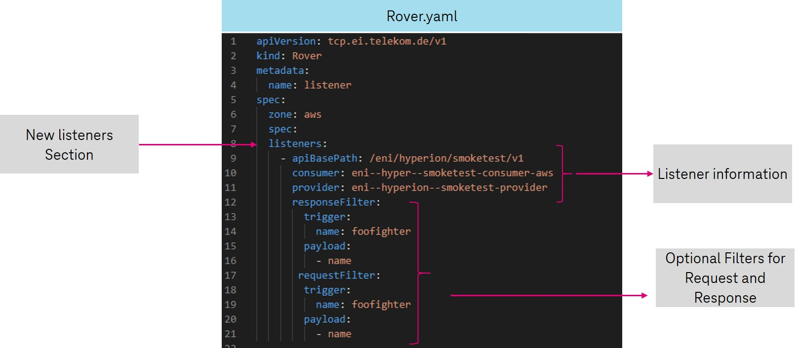

# Spectre Payload listening

{ width="250" }

## What is it?

Spectre enables a third party, the so-called listener application, to listen to the payload of a communication between consumer and provider for a specific API or also for an event.

If an application is interested in the data exchanged via an API or an event, it can define a so-called *listening* for this. If both sides, consumer and provider, approve this, a copy of the payload is sent to the listener application via an event for each communication on this route.

## How to use

Listenings are defined and configured using Rover and the Rover.yaml. To do this, simply specify the *listeners* section in the *spec* of your Rover.yaml. Within this section it is possible to specify a list of several listenings.

Each *listener* consists of at least the triple consumer, provider and baseptah or eventType. Filters can be defined optionally.



| Attribute | Description                        |
| ------------------- | ------------------------ |
| consumer            | The consumer client id which use the api you want to listen        |
| provider            | The provider client id which provides the api                      |
| apiBasePath         | The basepath of the API you are interested in  (API listening)     |
| eventType           | The eventType of the API you are interested in (Event listening)   |
| trigger             | Determines when Spectre should trigger the Listening Event. This can be used to define that listening only is performed when the corresponding filter is met.      |
| payload             | This filter can be used to determine which part of the data the listening event should contain. This makes it possible to listen only to the "data" that you are interested in.                                                                             |

It is only possible to specify either the apiBasePath (for API listening) or the eventType (for event listening) in a listening entry. these two attributes are mutually exclusive. If an event listening as well as an api listening should be created for a consumer provider pair, simply two listener entries must be defined.

**Example:** several listener entries

```yaml
apiVersion: tcp.ei.telekom.de/v1
kind: Rover
metadata:
    name: listener
spec:
  listeners:
    - apiBasePath: /eni/api/v1
      consumer: eni--hyperion--consumer
      provider: eni--hyperion--provider
    - eventType: de.telekom.ei.hyperion.demo.v1
      consumer: eni--hyperiont--consumer
      provider: eni--hyperion--provider
```

!!! Info
    Defining listenings in Rover.yaml does not exclude defining exposures or subsciptions in the same Rover.yaml. The same application can therefore expose APIs/events, subscribe to APIs/events and also listen to APIs/events.

### Rovern

To configure the defined listenings in the desired environment, only the Rover.yaml has to be applied. More information can be found in [Rover documentation](https://developer.telekom.de/docs/src/tardis_customer_handbook/rover/#how-to-use-rover-in-pipeline).

```bash
apply -f <absolute-path to rover.yaml/>
```


After the Rover.yaml has been successfully applied, the consumer and provider are first informed about the listening and an approval request is created. If the listening is approved by both the consumer and the provider, Rover begins configuring the environment.

One SSE route is created per application (per rover file), via which the listener application can receive the events for all specified listeners. This SSE Endpoint Information can be found in MissionControl under the Section *Listeners*. All information about the created listeners is displayed here.


### API listening

For API listening, Spectre listens to every request and response  between a consumer and provider for a specific baseptah and creates a copy with all header information and the payload of the communication and sends it to the listener application via Server Sent Event (SSE). Spectre is placed behind Stargate. That means, that requests/responses which are blocked before or in Stargate can not be listned on. Therefor no events are send to listener application


To receive the events via SSE, the application must establish a connection to the SSE Endpoint created for the application. As long there is a established connection, the application can receive the events.

More information about Server Sent Event can be found here: <https://developer.telekom.de/docs/src/tardis_customer_handbook/horizon/#sending-events>

#### Filter

For an API Listing, optional trigger and payload filters can be specified for both the request and the response.

| Filter              | Description                        |
| ------------------- | ------------------------ |
| ResponseFilter      | Possible filter to filter the desired payload data and filter only relevant response messages. For example, if you want to receive events only if the response contains a certain value. (trigger)      |
| RequestFilter       | Possible filter to filter the desired payload data and filter only relevant request messages. For example, if you want to receive events only if the request specifies certain parameters in the body.  (trigger)     |

#### Event structure

The event strcture you will receive from Spectre is described below.

the fields under *data* section always have the same structure. First, some metadata such as the *issue* is listed. In addition, under *data* you will find the copy of all header information as well as the copy of the exchanged payload data.

| Value               | Description                                                   |
| ------------------- | ------------------------------------------------------------- |
| consumer            |  Consumer id                                                  |
| provider            |  Provider id                                                  |
| issue               |  The issue on which spectre listen (apiBasePath)              |
| kind                |  Kind of communication (REQUEST, RESPONSE)                    |
| method              |  The http method of Rest call which is used                   |
| status              |  Http status code - only for response messages                |
| header              |  Copy of header information                                   |
| payload             |  Copy of payload information. If payload is json, json is embedded. Otherwise payload is embedded as String |

```json
{
    "id": "8f0629cc-d982-4c16-a9e4-90cdb39d363b",
    "type": "de.telekom.ei.listener.eni--tardis---listener-aws",
    "source": "https://stargate-integration.test.dhei.telekom.de",
    "specversion": "1.0",
    "datacontenttype": "application/json",
    "time": "2021-11-10T09:06:05.240Z",
    "data": {
        "consumer": "eni--tardis--con-space",
        "provider": "eni--tardis--pro-aws",
        "issue": "/api-aws/v1",
        "kind": "RESPONSE",
        "method": "POST",
        "status": 200,
        "header": {
            "Pragma": "no-cache",
            "Date": "Wed, 10 Nov 2021 09:06:05 GMT",
            "X-Tardis-Traceid": "5c635ce72232dsdsd8382332303537"
        },
        "payload": {
            "payload": "copy"
        }

    }
}
```

### Event listening

Not supported yet!

## Filtering

!!! Note
    Filters can only be applied on payload data. It is not possible to define filters for the event structure metadata oder header information.

!!! Note
    Filters are supported only for the content type json. If the payload being listened to is not json, no filters can be applied.

### Trigger filter

Defines matching conditions, when the event should be delivered at all.

The trigger filter is specified as a key-value pair (String,String), where the key is a jsonpath object  describing a (nested) property in the data. The filters are all linked with AND and are therefore applied when all entries of the filter match.

The trigger filter can be used to limit when the listening event should really be triggered, so that you only listen to the communication that really interests you.

**Example:**

Data structure (payload)

```json
{
  "squadName": "Super hero squad",
  "homeTown": "Metro City",
  "sights":{
      "superTower":{
         "hight":"15000",
         "constructionYear":"2016"
      },
      "wilsonTower":{
         "hight":"150",
         "constructionYear":"2018"
      }
   }  
}
```

for this example data structure, the following defined filter applies:

```yaml
trigger:
    sights.wilsonTower.hight: 150
    homeTown: Metro City
```

### Payload filter

Controls which parts of the response should be delivered.

The response filter consists of a list of strings where each string is a path to an element of the event data that should be kept in.

Allowed are only simple nested properties like *sights.supertower*. Properties that cannot be resolved are simply ignored. So for the example data above we can define the following payload filter:

```yaml
payload:
    - squadName
    - sights.superTower
    - does.not.exist
```

the resulting data that the listener application receives would look like the following example

```json
{
  "squadName": "Super hero squad",
  "sights":{
      "superTower":{
         "hight":"15000",
         "constructionYear":"2016"
      }
   }  
}
```

## Approval flow

Both the consumer and the provider must always agree to the listening. If a listening is created, both parties are informed about it and receive an approval request. Only when the consumer and provider agree to the listening, Spectre will configure the environment so that the listener application can listen on this route.

The status of a listening and also whether an api is being listened can be viewed via MissionControll.
