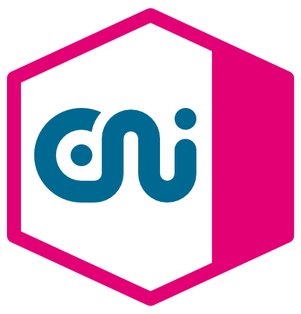

# Service Hub Enterprise Integration, T‧AR‧D‧I‧S Support Information

## T‧AR‧D‧I‧S Support Information

!!! Note
    Please check our product documentation before creating a ticket - a lot of answers can be found there.

### FAQ

You can find solutions for some product specific questions in our **FAQ section**:  
**https://developer.telekom.de/docs/src/tardis_faqs/**

###  T‧AR‧D‧I‧S Community Channel

There you can place your common question and will get an answer from the community.  
Everybody can join the **Webex Channel**:  
Self register here: **https://eurl.io/#d8jeoHkTZ**

###  T‧AR‧D‧I‧S Monitoring Support Channel

There you can place your question and will get an answer from monitoring team.  
Everybody can join the **Webex Channel**:  
Self register here: **https://eurl.io/#c9BLGEX70**

### Open Hours & Onboarding sessions

* Please check our **YAM Page** for upcoming events:  
**https://yam-united.telekom.com/pages/eni-hub/apps/events/tardis-events**

* Recording of previous sessions are stored on **YAM-Tube**:  
**https://yamtube.telekom.de/channel/TARDIS+%28TIF%29/29677**

### Firewall clearance issues

More details are stored there:   
https://developer.telekom.de/docs/src/tardis_customer_handbook/support/ip-addresses-env/

###  Gard Service Desk

You should also check our HowTo's in **Gard Knowledge Base**:  
**https://gard.telekom.de/gardwiki/display/SDDHEI/How-to+articles**

Or create a ticket there: **https://jira.telekom.de/servicedesk/customer/portal/522**

A Jira/Gard account is required for use.  
If this does not yet exist, it can easily be created in a self-registration process.  
https://jira.telekom.de/secure/UssSelfRegistrationRequest!default.jspa

This process requires a ZAM account.  
There is also a self-registration process here:   
https://zam.telekom.de   --> Register  
**Note**: Please only use email addresses with telekom.de, telekom.com and t-systems.com

### ITIL Ticket Tool

Users of the **ITIL** ticket tool "HPE Service Manager (HPE SM)" can reach the support team with the following assignment group for incidents or changes:  
`TIT.HUB.INT.ENI.TARDIS` 

### Support Class and Time

**Servicetime:**  
5 x 8 Hour, Operation of the application from Monday to Friday (9a.m. - 5 p.m.).

**Support category Full Time:**  
Mo. - So. 00:00 - 24:00
  
We have 24x7 on-call support outside business hours.  
In case of emergencies please use the LiM-Service (+49 800 7663 483) to get in contact with the On-Call Duty.

### DARWIN Information

Here are some **DARWIN** Information:  
The currently valid product names with association to different cloud providers are: `TARDIS-AWS(P)`and `TARDIS-CaaS-DTIT(P)`.  
The **ICTO**-No. is: `ICTO-20575`

