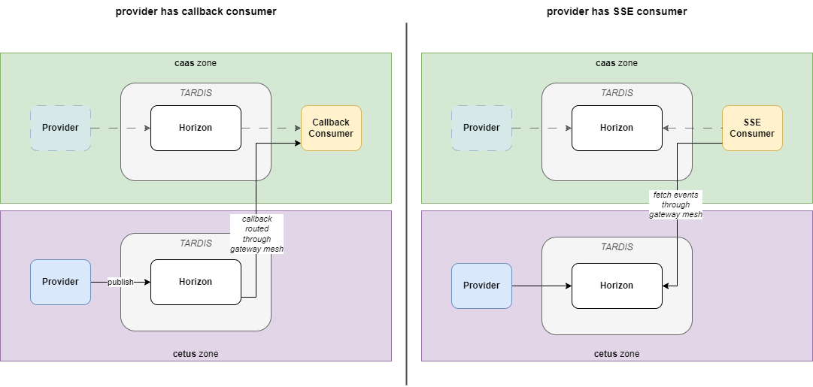

# Zone Concept

T‧AR‧D‧I‧S is available on various cloud environments, such as AWS and CaaS. When you register an application in T‧AR‧D‧I‧S, you have to specify, with which instance your application should communicate. It is recommended to choose the instance with the least induced latency and least amount of firewall clearances, e.g. if your application is running on AWS, then select also a T‧AR‧D‧I‧S instance on AWS as your *nearest gateway*.

## What is a Zone?
You can specify which instance to use, by setting the *zone* attribute in your rover.yaml. Each available zone can be mapped to a physical cloud instance, e.g. AWS. However there are a few more criteria associated with each zone, based on which you have to make your decision. Here is a full list:

1. **Cloud Instance**: each zone is located on a given cloud environment
2. **Connectivity**: due to security reasons, there are zones which are restricted to internal (hitnet) communication and zones with external (internet) connectivity
3. **Security Classification**: based on the underlying infrastructure, the zones support different operating models, such as DE3 and DE4
4. **Organization**: as T‧AR‧D‧I‧S is being rolled out to more subsidiaries and natcos, there can be dedicated zones
5. **Functional Aspects**: for technical reasons, there might be the necessity to provide additional zones

What else is there to know?

1. All zones are connected via the **Gateway Mesh**. You don't need to care, in which zone your counterpart resides.
2. Depending on the selected zone, the URLs on the gateway (StarGate) and identity provider (Iris) will be different.
3. An application can only have one zone. It is not possible to use the same client credentials for different zones.
4. While for each zone, there are specific instances of the StarGate and Iris, this is not the case for other components, e.g. Horizon and CloudWalker. To reduce cost, some zones on the same infrastructure "share" these components. Example: events published to the *aws* and *space* zone will both be processed by the same Horizon instance on AWS.

Below is a schematic overview of how zones are organized on the various clusters:

## List of Availabale Zones

Please consider following criteria when choosing a zone for your application:

| Zone   | Created | EOL | Cloud         | Internet | Security | Organization |
|--------|---------|-----|---------------|----------|----------|--------------|
| aws    | 20Q2    |     | AWS           | no       | DE3      | General      |
| caas   | 20Q3    | [2023](https://yam-united.telekom.com/pages/7f935f2b-0f34-4755-8147-39c39d1ea6f4/apps/wiki/dea63b9a-394a-4202-b38b-423b7c251af0/list/view/264dc21f-ab95-4e87-99bc-d8a433df5d55) | CaaS (x86 SF) | no       | DE4      | General      |
| space  | 20Q4    |     | AWS           | yes      | DE3      | General      |
| spacex | 21Q4    | [2023](https://yam-united.telekom.com/pages/7f935f2b-0f34-4755-8147-39c39d1ea6f4/apps/wiki/dea63b9a-394a-4202-b38b-423b7c251af0/list/view/264dc21f-ab95-4e87-99bc-d8a433df5d55) | CaaS (x86 SF) | yes      | DE4      | General      |
| cetus  | 22Q2    |     | CaaS (TPC)    | no       | DE4      | General      |
| canis  | 22Q2    |     | CaaS (TPC)    | yes      | DE4      | General      |

!!! info "Why are the new zones named like stellar constellations?"
    Excellent question! As you can see, over time the number of zones is only growing and each zone has various properties with all sorts of possible combinations. We did not want to end up with zone names as complex as *caas-tpc-de6-int-tmpl*, so we needed to find some kind of abstraction. And as T‧AR‧D‧I‧S is at home in the universe, we decided to name our new zones after stellar constellations. **Hint**: it is no coincidence that the new zones on CaaS also start with a "C".

## How to switch zones

If you need your application(s) to switch zones, there are different ways you can choose depending on

* whether you are provider or consumer
* whether you transfer API calls (StarGate), events (Horizon) or files (CloudWalker) and
* what is the migration strategy of your counterpart

Please read thoroughly, the steps varies for API, events and filetypes.

### Migrating APIs

**Case: "In place Update"**

With this usecase, you are chaning the zone from e.g. caas to cetus.

Required changes for Consumer

1. Change the zone (e.g. caas -> cetus) in your rover.yaml
2. Apply the new rover.yaml. Check Mission Control
3. change client-secret, token-URL, Gateway-URL of your application

Changes for consumer

* client-secret
* token URL
* gateway URL

Required changes for Provider

1. Change the zone (e.g. caas -> cetus) in your rover.yaml
2. Apply the new rover.yaml. Check Mission Control
3. change your public key verification URL and trusted issuer URL of your application

Changes for provider

* Public key URL / Certificate URL / Trusted Issuer

!!! info
    This usecase has a short service interruption, depending on how "fast" you are changing your required changes of the step 3 above.

**Case: "Parallel Usage"**

With this usecase, you are cloning your existing Rover file and renaming your application

Required changes for Consumer

1. Clone your rover.yaml, but change the application name (e.g. myapp-new) and the zone
2. Apply the new rover.yaml. Check Mission Control
!!! info "BLOCKED"
    Your application is in state BLOCKED.
3. Get all the approvals for your new subscriptions
4. Reconfigure your application to work with new and old Rover configuration
5. Delete the old Rover file with `roverctl delete -f <my-old-rover-file>`

Changes for consumer

* client-secret
* token URL
* gateway URL

Required changes for Provider

1. Clone your rover.yaml, but change the application name (e.g. myapp-new) and the zone
2. Apply the new rover.yaml. Check Mission Control
3. Reconfigure your application to work with new and old Rover configuration
4. Delete the old Exposure with `roverctl delete -f <my-old-rover-file>`
5. Subscriptions will remain approved to the new application

Changes for provider

* Public key URL / Certificate URL / trusted Issuer

!!! info
    This usecase has a short service interruption, depending on how "fast" you are changing your required changes of the step 3 above.

### Migrating Events

**Migration of event consumers:**

**Case: Callback consumer moves to new zone**  

Required changes for callback consumer

* zone in rover.yaml
* trusted issuer (if needed: public key URL, certificate URL)

Note:  
As soon as the consumer applies the rover configuration with the new zone, incoming events are not trusted as long as the trusted issuer has not been adjusted. If the gateway token doesn't match the configured trusted issuer the consumer service might respond with 401 which is a retryable error for Horizon. It's possible that this will lead to an open circuit-breaker.
As soon as the trusted issuer is changed to match the new zone, the circuit-breaker would close again assuming head requests are supported on the callback endpoint.
You can circumvent this by additionally creating a new consumer application with a different name in the new zone that also subscribes to the eventType (parallel consumer).
But if it's technically possible for you, we recommend to just configure the consumer service both trusted issuers, one for the old zone and one for the new zone.  

Service interruption:  
Delays in event consumption expected (open circuit-breaker). No service interruption expected when service has been configured to trust issuers from both zones or if having two consumer applications registered in parallel.  

**Case: SSE consumer moves to new zone**  

Required changes for SSE consumer

* zone in rover.yaml
* client ID and client secret (client credentials)
* token URL
* SSE endpoint

Note:  
As soon as the consumer applies the rover configuration with the new zone, fetching new events will fail as long as the client credentials, the token URL and the SSE endpoint have not been adjusted according to the new zone (details in MissionControl). This will most likely lead to an unexpected delay in event consumption depending on the SSE consumer's fetching frequency.
You can circumvent this by additionally creating a new consumer application with a different name in the new zone that also subscribes to the eventType (parallel consumer).

Service interruption:  
Delays in event consumption expected depending on SSE fetching frequency. No service interruption if having two consumer applications registered in parallel.   

**Migration of event providers:**

**Case: Provider moves to new zone**  

Required changes for provider

* zone in rover.yaml
* client ID and client secret (client credentials)
* token URL
* publishing endpoint

Note:  
As soon as the provider applies the rover configuration with the new zone, publishing new events will fail as long as the client credentials, the token URL and the publishing endpoint have not been adjusted according to the new zone (details in MissionControl). This would most likely lead to a service interruption.  
If this risk cannot be taken, creating a new provider application with a different name and a different eventType in the new zone could solve this problem (parallel provider). In this case it's important that provider notifies the consumer about this new eventType and grants new approvals accordingly. Consumer would need to subscribe to the old and new eventType while the relocation process is ongoing.

Service interruption:  
Yes, if not having two provider applications/eventTypes registered in parallel.  

Important note regarding SSE:  
If an event provider should move to a new zone, it is important to pay attention during the relocation whether the existing consumers of the corresponding event type fetch the events via SSE.  
If this is the case, it might be possible that the SSE consumer will lose events, depending on the publishing or consuming frequency. This is because the event data is always temporarily stored in the provider's zone and as soon as the provider has moved to a different zone, the SSE consumer won't fetch any events from the provider's old zone anymore. If there were events in the old zone which have not been fetched yet, the SSE consumer won't have chance anymore to receive them.  
To solve this problem, the event provider needs to create a new application and event type in the new zone which makes it possible for SSE consumers to consume data from both zones in parallel.   
Provider and consumer need to get in contact with each other in order to align on a point in time at which the old application/eventType can be removed safely so that no event will be missing out on the consumer side.  

As event provider please check in advance whether your consumers use SSE and might be affected from possible event loss.  

### Migrating Files

**Option "Parallel Usage"**

1. Service interruption: no
2. Steps:
    1. Clone your rover.yaml, but change the application name (e.g. myapp-new), the fileType and the zone
    2. Apply the new rover.yaml. Check Mission Control
    3. If your app is a receiver, get all the approvals for your subscriptions
    4. When you have all approvals, switch to your new client credentials, StarGate- and Iris-URL
    5. If your app is a sender, tell all your recipients to switch to your cloned app with new fileType

Changes for sender

* client-id
* client-secret
* token URL
* Gateway URL

Changes for receiver

* Public key URL / Certificate URL / trusted Issuer
* SSE URL (if used)

**Option "In place Update recipient" (recommended for recipient only)**

1. Service interruption: yes (needs reapproval)
2. Steps:
    1. Change the zone (e.g. caas -> cetus) in your rover.yaml
    2. Change the filetype name in case sender migrated in parallel run and created new filetype
    3. Apply the new rover.yaml. Check Mission Control
    4. Get all the approvals for your subscriptions
    5. Switch to new public key URL / trusted Issuer (and SSE URL + credentials if used)

Changes for recipient

* Public key URL / Certificate URL / trusted Issuer
* SSE URL + credentials (if used)

**Option "In place Update sender" (although not recommended)**

We do not recommend to migrate sender via "in place update". In case you did migrate sender in similar way as recipient, do contact team Deimos to manually trigger necessarry background jobs otherwise the transfer will not work after migration.
