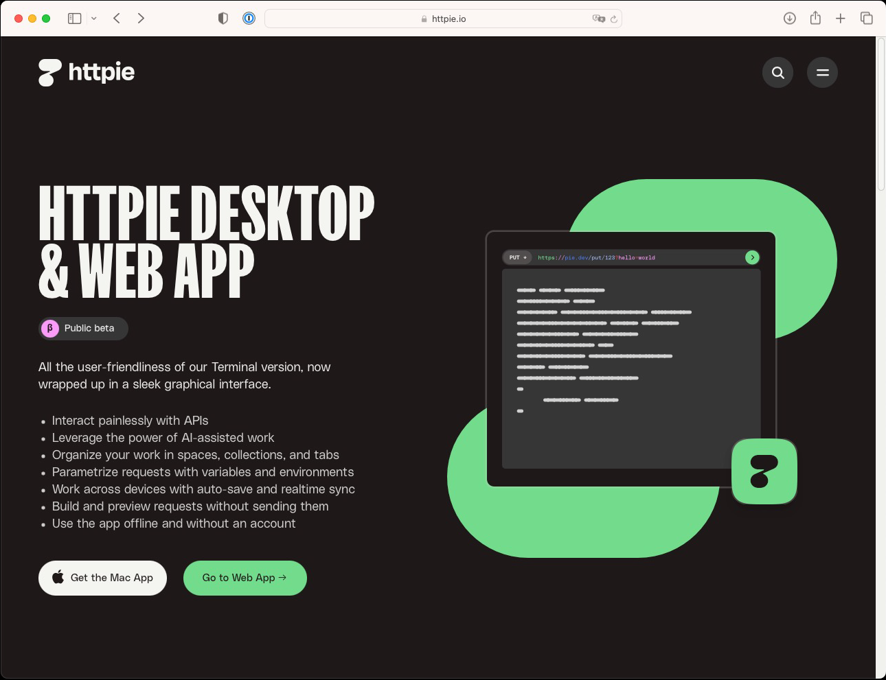
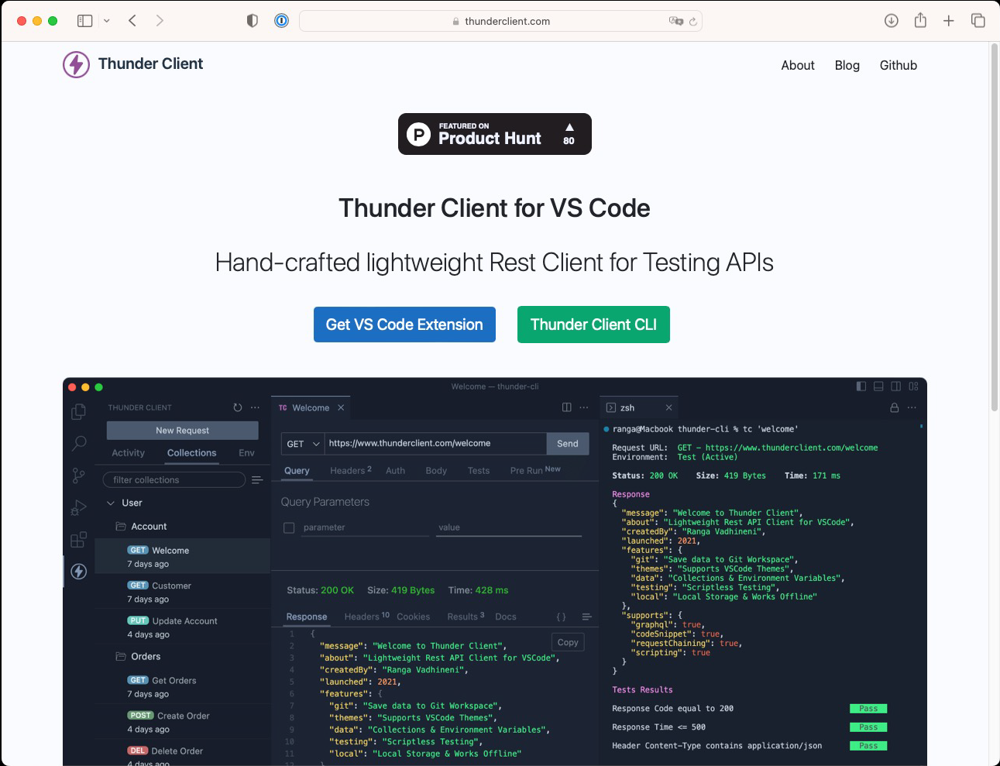
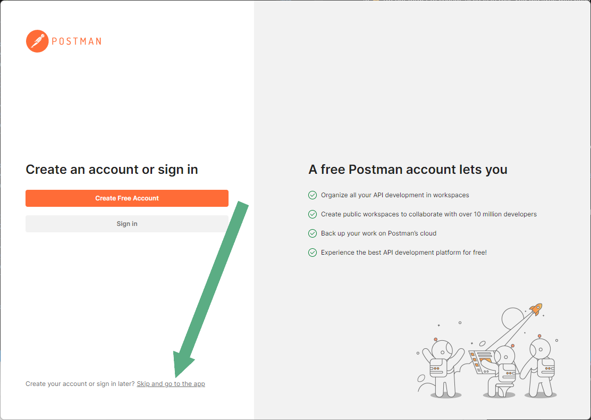
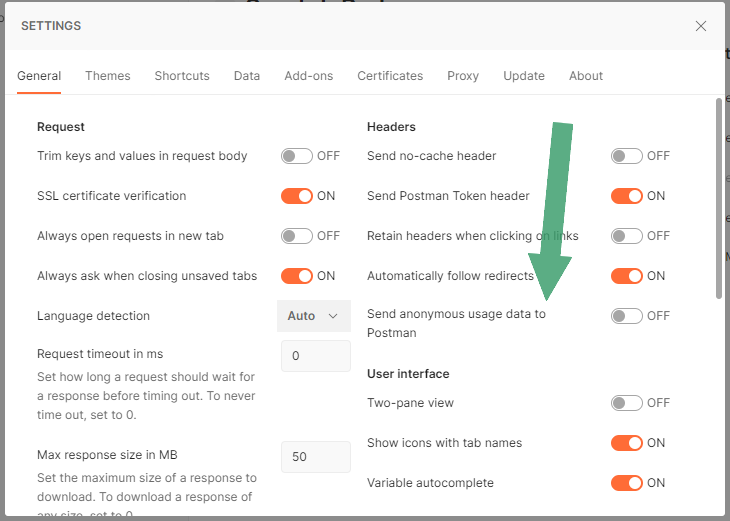
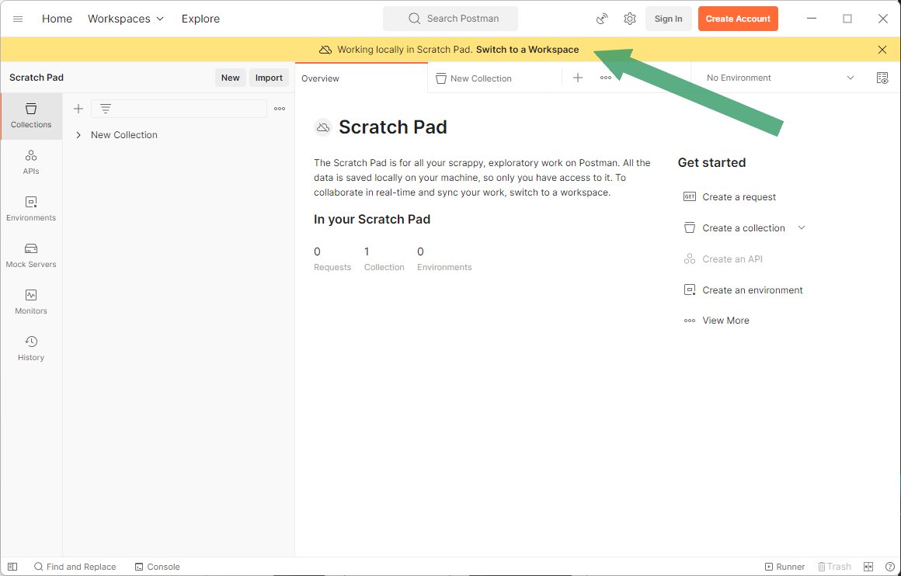

# General about APIs

Here we will collect General API Questions for you.

## What Data can be stored in Cloud?

There is a "tool" (German only) that will help you to understand if your data could be stored in Cloud or not. Please visit [YAM - GEO oder VS-NfD-Daten & Cloud…geht das?](https://yam-united.telekom.com/pages/src-dt-it/apps/blog/blog/view/2f1db1a2-11fd-45df-b091-a6cf6b5226b7)

## What kind of APIs supported by T‧AR‧D‧I‧S

We are focused on REST APIs.

!!! Note
    Even if you have other API type, but use OAS as Documentation, than you can register your API in T‧AR‧D‧I‧S and upload OAS only.

## Can I have an overview of all APIs in T‧AR‧D‧I‧S?

Sure! Visit [T‧AR‧D‧I‧S Universe](/tardis-connections) it is created by our great Colleagues (Hans-Christian Fuchs and Christian Sledz) and shows you real time data.

## Use of Postman

Using of Postman is a big topic. Currently it is not finally clear if this software forbidden or not, so you can use it if you follow those points:

1. Can we still use it until it’s clarified?
   ✅ Yes, IF you use it **without Account** and ⚠️ Disable all Sync and Telemetry ⚠️.
2. ⚠️ [How to delete your Postman Account](https://support.postman.com/hc/en-us/articles/115003348025-How-to-delete-my-Postman-account)?
3. ⚠️ Do not forget to change Secrets in case you did sync with postman earlier.

!!! danger
    You must change Secrets in case you did sync with postman / have had an account earlier.

### What is an alternative to Postman?

!!! important "Other GUI Products."
    There are a few hundred API testing tools out there, and currently there is not one recommended tool as the issue only surfaced.
    When looking around, look for tools **without account** and for **offline usage**.

!!! note "Using the Terminal"
    Sounds crazy, but curl or HTTPie can be easily scripted to create API tests that are reliable and repeatable.

    

!!! note "IDE Integration"
    In many IDEs, API testing plugins exist and can be used with the same caveats as for other GUI products:

    - no account and no synchronization.
    - A very popular plugin for VSCode is thunder client:
    
    

### Installing Postman

!!! note
    Here you can find [Official statement about Postman](img/Postman%20Named%20Accounts.pdf). Please share it with your teams!

When you install postman e.g. with `scoop` or by downloading it from the official page, please decline create of new account.

!!! important
    If you have an existing account, please [follow this guide to remove it](https://support.postman.com/hc/en-us/articles/115003348025-How-to-delete-my-Postman-account).

Please check that sending of statistic is disabled. Visit *Settings --> General --> Send anonymous usage data to Postman* is **off**.

!!! note
    You can't use **Workplace** and related features any more, such as:

    1. API
    2. Mock Servers
    3. Monitors

    

## I still have a Question

!!! Note
    Please use our [Support channel](/docs/src/tardis_customer_handbook/support/) to address your Question - we will do our best to help you.
