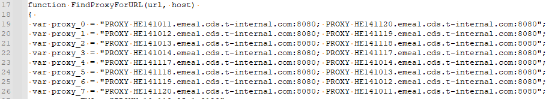

# Proxy settings in DT

!!! info
    There are multiple proxies exist in DT ecosystem, depends on Natco it could be different, but general idea remains the same:

    1. Get Proxy URL
    2. Configure it in a Service
    3. Authorize yourself

!!! tip "Working via SIA in :flag_de:"
    For Germany it is recommended to order SIA and enable access for each 12 Hours by onetime Authorization in a Browser via http://sia.telekom.de/. SIA - Special Internet Access, only for :flag_de:. [Read more how to order and use here](https://yam-united.telekom.com/pages/internet-connect/apps/wiki/wiki/list/view/c808105e-9103-4b49-91a0-fa1d0c7444b3).

    For all other colleagues (German without SIA as well) please follow this guide.

<!--

## Proxy setup without SIA[^1]

!!! danger "Potentially Security risk without SIA[^1], can be solved only for :flag_de:"
    This configuration requires to save your A-User and Windows Password in a clear text, so that it can be read by any application, and this can be potentially **security risk**.
    It could be solved only for Germany via SIA.
    Therefore for Germany it is recommended to order SIA[^1] and enable access for each 12 Hours by onetime Authorization in a Browser via http://sia.telekom.de/.
    For all other colleagues please refer to [PX Section](#setup-px)

To set any Program working with Proxy and without **SIA**[^1] you need to download PAC file from: http://pac-adminlan-iei.de.t-internal.com:3132/proxy.pac for :flag_de:, or e.g. http://wpad.sk-kosice.t-systems.sk:3128/proxy-fmo.pac if you are in Slovak Telekom :flag_sk:, select any URL from `var proxy_X`. Example from PAC file, please **use updated values from the downloaded PAC**:

[^1]: SIA - Special Internet Access, only for :flag_de:. [Read more how to order and use here](https://yam-united.telekom.com/pages/internet-connect/apps/wiki/wiki/list/view/c808105e-9103-4b49-91a0-fa1d0c7444b3).



??? hint "How to find your PAC file link?"
    To find out where is your poxy settings PAC file, use following command in PowerShell:

    ```powershell
    Get-ItemProperty -Path "Registry::HKCU\Software\Microsoft\Windows\CurrentVersion\Internet Settings"
    ```

    Here is important to find `AutoConfigURL` with a link to your PAC file. E.g.

    ```powershell
    PS C:\Users\Axxxxx\> Get-ItemProperty -Path "Registry::HKCU\Software\Microsoft\Windows\CurrentVersion\Internet Settings"
    ...
    AutoConfigURL            : http://pac-iei.de.t-internal.com:3132/proxy.pac
    ...
    ```

E.g. use `HE14yyyy.emea1.cds.t-internal.com:8080` and run command to setup proxy with your account (A-Kennung) and password (your windows password).

-->

## Setup PX

[PX official Repository](https://github.com/genotrance/px).

!!! Note "What is PX?"
    Px is a HTTP(s) proxy server that allows applications to authenticate through an NTLM or Kerberos proxy server, typically used in corporate deployments, without having to deal with the actual handshake. Px leverages Windows SSPI or single sign-on and automatically authenticates using the currently logged in Windows user account. It is also possible to run Px on Windows, Linux and MacOS without single sign-on by configuring the domain, username and password to authenticate with.

### Download and install PX

You can install it via:

1. Downloading from official Repository https://github.com/genotrance/px/releases/tag/v0.8.3.
2. Via [`scoop`](https://scoop.sh/) with command:
```bash
scoop install px@0.8.3
```
3. Via [`pip`](https://pypi.org/project/px-proxy/) with commad:
```bash
python -m pip install px-proxy
```
4. Check [official Documentation](https://github.com/genotrance/px#installation).

!!! Important "Please use Version 0.8.3"
    Please use [Version 0.8.3](https://github.com/genotrance/px/releases/tag/v0.8.3), the latest 0.8.4 have some [False Positive Virus](https://github.com/genotrance/px/issues/182) detections and will be automatically removed from the system by antivirus. You can find SHA256 of archive in [github](https://github.com/genotrance/px/releases/tag/v0.8.3), for `px.exe` itself it is:

    ```bash
    069b56550a518e772cdd3f927c6bfd54c86823c13afba4201c781a49a0a8d144  px.exe
    ```

### Configure PX

According [official Documentation](https://github.com/genotrance/px#configuration): Px requires only one piece of information in order to function - the server name and port of the proxy server. This needs to be configured in px.ini. If not specified, Px **will check Internet Options or environment variables for any proxy definitions and use them**. Without this, Px will try to connect to sites directly.

Only that you have to provide is allow IP address to avoid Ports exposure:

```bash
px --allow=127.0.0.1
```

When you run `px` you will have a proxy listening on a `http://localhost:3128`.

!!! info "Start PX On startup"
    You have to find your `px.ini` location, update with needed configuration if any and execute command to install px:

    ```bash
    px --install
    ```

??? info "And what if it does not work?"
    Only if automatic detection does not work you need to find or create you `px.ini` with following context:

    ```ini
    [proxy]
    server = 
    ; Link to PAC file
    pac = http://pac-iei.de.t-internal.com:3132/proxy.pac
    ; Your Proxy Port on Localhost
    port = 3128
    ; Your IP addr of Localhost
    listen = 127.0.0.1
    allow = 127.0.0.1
    gateway = 0
    hostonly = 0
    noproxy = localhost
    useragent = 
    username = 
    auth = 

    [settings]
    workers = 2
    threads = 5
    idle = 30
    socktimeout = 20.0
    proxyreload = 60
    foreground = 0
    log = 0
    ```

    !!! hint "How to find your PAC file link?"
        To find out where is your poxy settings PAC file, use following command in PowerShell:

        ```powershell
        Get-ItemProperty -Path "Registry::HKCU\Software\Microsoft\Windows\CurrentVersion\Internet Settings"
        ```

        Here is important to find `AutoConfigURL` with a link to your PAC file. E.g.

        ```powershell
        PS C:\Users\Axxxxx\> Get-ItemProperty -Path "Registry::HKCU\Software\Microsoft\Windows\CurrentVersion\Internet Settings"
        ...
        AutoConfigURL            : http://pac-iei.de.t-internal.com:3132/proxy.pac
        ...
        ```

## Git / VSCode

### Git Proxy setup without SIA

Run command to setup proxy with `px` globally in git:

```bash
git config --global http.proxy http://localhost:3128
```

<!--
```bash
git config --global http.proxy http://<proxy>:<port>
git config --global credential.http://<proxy>:<port>.provider generic
```

E.g.:

```bash
git config --global http.proxy http://HE14yyyy.emea1.cds.t-internal.com:8080
git config --global credential.http://he141011.emea1.cds.t-internal.com:8080.provider generic
```
-->

As alternative you can edit your config directly. Add to your `.gitconfig` (usually saved on Drive `T:`) file following configuration:

```ini
[http]
    proxy = http://localhost:3128
```

!!! Note
    You can move your global git configuration file from "T Drive" to any place that you need. E.g. as per [Stackoverflow](https://stackoverflow.com/questions/4050905/changing-gitconfig-location-on-windows):
    
     - Simply copy your `.gitconfig` to needed location, e.g. to the `C:\Users\Axxxx\.gitconfig`
     - Set location via Env. Variable with **PowerShell** command:

    ```powershell
    [System.Environment]::SetEnvironmentVariable('GIT_CONFIG_GLOBAL',$env:USERPROFILE + '\.gitconfig','User')
    ```

     - Do not forget to close all VCSs and Console and start it again to apply modified Variables.

### Git Proxy setup with SIA

Please follow [Guide from above](#git-proxy-setup-without-sia) and replace proxy link with provided by SIA, e.g.: `http://specialinternetaccess-lb.telekom.de:8080`.

## NPM

### NPM Proxy setup without SIA

To get Proxy Host, please follow [Guide from above](#configure-px) and ether:

 - Use command to edit settings 
 ```bash
 npm config edit
 ```
 - Use command to set Proxy for NPM
 ```bash
 npm config set proxy http://localhost:3128
 ```

### NPM Proxy setup with SIA

Please follow [Guide from above](#npm-proxy-setup-without-sia) and replace proxy link with provided by SIA, e.g.: `http://specialinternetaccess-lb.telekom.de:8080`.

## Gradle

### Gradle Proxy setup without SIA

To get Proxy Host, please follow [Guide from above](#configure-px).
You can ether use command to setup `http` and `https` proxies with User and Password as per [Stackoverflow](https://stackoverflow.com/questions/5991194/gradle-proxy-configuration). E.g. your link is `localhost:3128` and run command to setup proxy:

```bash
gradlew -Dhttp.proxyHost=localhost -Dhttp.proxyPort=3128 -Dhttps.proxyHost=localhost -Dhttps.proxyPort=3128 -Dhttp.nonProxyHosts=host1.com|host2.com
```

Or save configuration in the file by following [official guide](https://docs.gradle.org/current/userguide/build_environment.html#sec:accessing_the_web_via_a_proxy).

!!! note "Example of `gradle.properties`"
    ```ini
    systemProp.http.proxyHost=127.0.0.1
    systemProp.http.proxyPort=3128
    systemProp.https.proxyHost=127.0.0.1
    systemProp.https.proxyPort=3128
    ```

### Gradle Proxy setup with SIA

Please follow [Guide from above](#gradle-proxy-setup-without-sia) and replace proxy link with provided by SIA, e.g.: `http://specialinternetaccess-lb.telekom.de:8080`.
