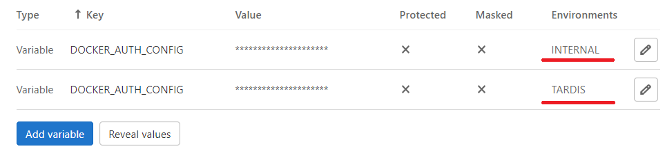

# Rover FAQ

## How to use two DOCKER_AUTH_CONFIG in one Pipeline
According to the TARDIS documentation, one have to specify the CI/CD variable DOCKER_AUTH_CONFIG in order to use the Rover docker image, 
Our hub is often asked question like:

- *I've already used this variable to access my own repository. How can I access both repositories, my own and yours, in the same pipeline?*

:information_source: How to do so? Please see below

1. declare two environments TARDIS and your own (eg. INTERNAL) in Gitlab deployment settings
2. define the DOCKER_AUTH_CONFIG variable twice. Limit the scope to the appropriate environment like in the picture below 
3. assign each pipeline job to the corresponding environment, like in this [.gitlab-ci.yml](examples/sample.gitlab-ci.yml)
```
job1:
  image: 'mtr.devops.telekom.de/tardis-customer/roverctl:prod'
  environment:
    name: TARDIS
```

Picture:


## How to move an API from one team to another team

If you want to move an API from one team to another team you can proceed as the following:

1. Apply the same `Rover.yaml` using the **new** team.
2. Delete the same `Rover.yaml` using the **old** team.

The subscribers of the API will be remembered.

!!! tip
    After applying it with the **new** team you should receive the following message in the Rover log:
    ```
    API '/your/ api/v1' is not processed -> API already specified by Team 'old-team' of Hub 'hub'. It will be automatic processed, if the other API is deleted
    ```
    In that case, the **new** `Rover.yaml` will automatically be activated if the **old** one gets deleted.

## How to remove my old API or OAS only from the Rover

Depends on if you have registered API with `rover.yaml`, or only did [OAS upload](/docs/src/tardis_customer_handbook/rover/#step-1-upload-open-api-specification) 2 command could help you:

```shell
roverctl delete -f <absolute-path to rover.yaml/>
```

OR

```shell
roverctl delete -f <absolute-path to api specification file/>
```

Read more in [T‧AR‧D‧I‧S Customer Handbook](/docs/src/tardis_customer_handbook/rover/#clearing).

## Common errors

### I just consumed my 2nd API and the 1st subscription vanished. Why is this?

You need to include all exposures and consumptions for your application into the same `Rover.yaml` file.

```yaml
apiVersion: tcp.ei.telekom.de/v1
kind: Rover
metadata:
  name: my-great-app
spec:
  zone: caas
  exposures:
  - basePath: /greathub/greatapi/v1
    upstream: https://upstreamhost
  subscriptions:
  - basePath: /greathub/someapi/v1
  - basePath: /otherhub/otherapi/v1
  - basePath: /anotherhub/anotherapi/v1
```

### Version in basePath must match with specification version

The version value in the info-section of your Open API Specification must match the version which is included in the defined basePath of your OAS.

```yaml
swagger: "2.0"
info:
  title: Sample API
  description: API description in Markdown.
  version: 1.0.0  # API version
host: api.example.com
basePath: ping/v1 # API major version must match API version
schemes:
  - https
```

### RoverCtl version does not match environment version

Most commonly, your `Rover-Token` from your team does not correlate with the designated environment chosen in the image used to handle Rover files.

## I still have a Question

!!! Note
    Please use our [Support channel](/docs/src/tardis_customer_handbook/support/) to address your Question - we will do our best to help you.
