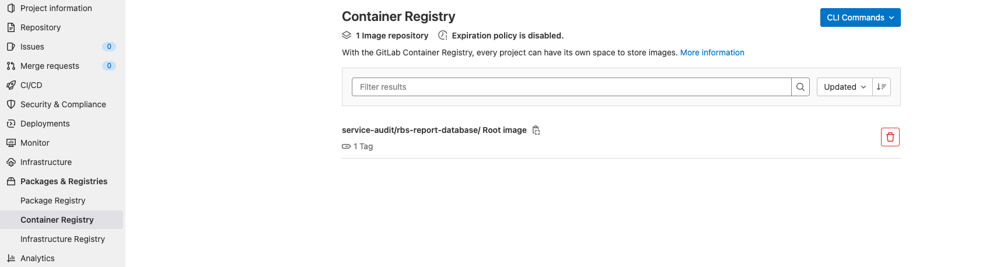

# Setup Group Database

This project provide a mariadb database and load all projects with content (source code and configuration files) from your gitlab project group and perform an analysis. It is a pre condition to run a service audit report generation, to get an overview about for your project with statistics in prod environment. 

## Getting started

First, clone this project in your project namespace.


### Create Group Access Token (you need Owner Permission)

To have access to Gitlab API you must create a Group Access Token. In your Gitlab Group click on `Settings` -> `Access Token`. Type a name for the token and select a role as `Owner` with permission `read_api`. Click on `Create group access token` and copy the token, which ist displayed to your clipboard or a secure space. 


### Manage CI/CD Variables

The codelens tool is receiving data (source code + configuration files) from your project group, you have to add some CI/CD Variables for your forked database project.

!!! tip
    Open `Settings` -> `CI/CD` and expand `Variables`.
    Click `Add variable`


Create a new variable with name `GITLAB_TOKEN` and copy the value from the previous step `Create Group Access Token`. Please masked your variable (masked variables are not display in Gitlab job logs)

To have access to predefined images you need a `DOCKER_AUTH_CONFIG` variable, too. The predefined images are located in private area of new `Magenta Trusted Registry` [mtr.devops.telekom.de](https://mtr.devops.telekom.de/).  

```json
{
  "auths": {
    "mtr.devops.telekom.de": {
      "auth": "c2VydmljZWF1ZGl0K3JlYWRpbWFnZXM6TzgwUlJYVVpFUVRDVlhLVjRIVVpLNlZKWUdYOEpTM0c0UEhXRDlKVUVYTERYN0VSMkNaU0M3NVpXMjYzSlo2Nw==",
      "email": ""
    }
  }
}
```

|Type|Key|Value|Protected|Masked|Environments|
|---|---|---|---|---|---|
| Variable|`GITLAB_TOKEN`|your group access token|:x:|:heavy_check_mark:| |
| Variable|`DOCKER_AUTH_CONFIG`| Docker auth configuration as .json file |:x:|:x:| |

### Schedule database pipeline - keep your data up-to-date

Create a schedule for your project `database` to keep your data up-to-date. We recommend to run report database pipeline once a day. To create a  new schedule click on `CI/CD` -> `Schedules`and click the button `new schedule`


Create a new schedule with your favorite settings.


When you are finished, click on `Save pipeline schedule`.

### Run your CICD - Pipeline

To test your configuration, please run your pipeline. Click in the left menu `CI/CD` -> `Pipelines`


Click on `Run pipeline` in the upper right corner.


Select the `main` branch and click on `Run pipeline`.

If the pipeline succeeded you can find a new docker image in your group container registry.

Click on `Packages & registries` -> `Container Registry`. You should find an image with your Project Namespace and database project name. 



!!! tip
If you want to create a subgroup based report database, you can overwrite `GROUP` variable with e.g. `<Top-Layer-Domain/subgroup>` `mh/apps`.
 
