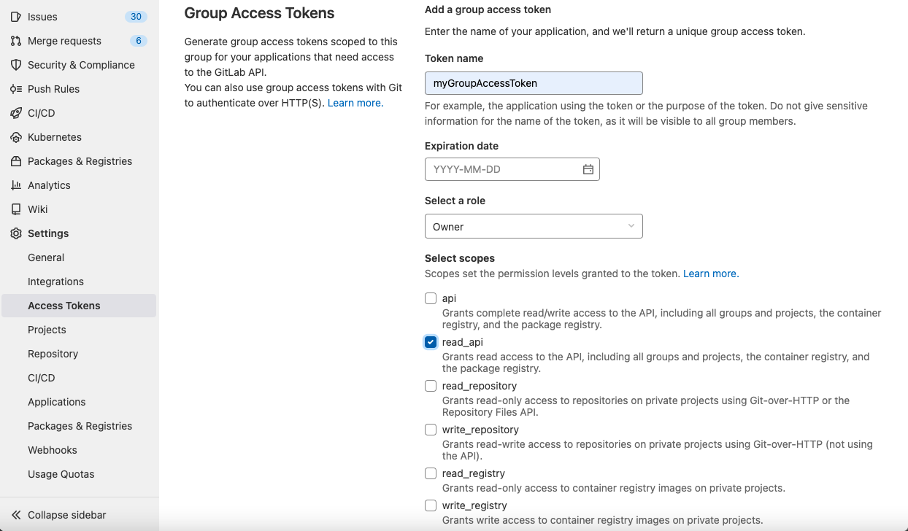
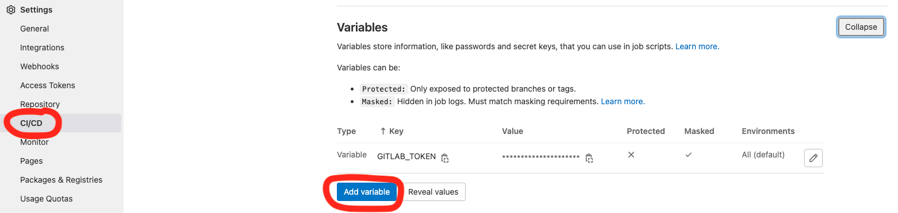

# Include report generation in your pipeline

This project describe how you can include the Service Audit Report in your project. The Service Audit Report provide an overview about traffic, latency, server errors and vulnerabilities.

## Getting started

Open your `.gitlab-ci.yml` and add the following snippet.

```yaml
stages:         
  - deploy

include: 
  - project: service-audit/templates/report
    file: .gitlab-ci.yml
```

In the variables section of your `.gitlab-ci.yml` you can choose your report database, which you can manage by yourself. When your report database project is not located in your gitlab root group, you can overwrite the `REPORT_DATABASE_IMAGE` variable. The `GROUP` default is `$CI_PROJECT_ROOT_NAMESPACE`

```yaml
variables:
  REPORT_DATABASE_IMAGE: registry.devops.telekom.de/$CI_PROJECT_ROOT_NAMESPACE/$REPORT_DATABASE_PROJECT:$GROUP 
```

If your root group `$CI_PROJECT_ROOT_NAMESPACE` in the following list

- rbs
- mh
- pktwo
- asf
- dhcc

You can use a predefined database. If you want to use it please replace with:

```yaml
variables:
  REPORT_DATABASE_IMAGE: mtr.devops.telekom.de/serviceaudit/service-audit/maria-db:$GROUP   
```

When your report database project is not located in your gitlab root group, you can overwrite the `REPORT_DATABASE_IMAGE` variable. 

```yaml
variables:
  REPORT_DATABASE_IMAGE: registry.devops.telekom.de/<subgroup>/<report-database>:$GROUP 
```

### Setup Hub and SDC information

It is important to know your Digital Hub ID and your SDC Level1. Please set these information in variables section of your `.gitlab-ci.yml` file.

```yaml
variables:
  HUB_ID: <your-digital-hub-id>
  SDC_LEVEL1: <your-sdc-level-1>
```
e.g CI/CD Hub  
```yaml
variables:
  HUB_ID: XH002
  SDC_LEVEL1: SDC9
```
If you don't know your SDC Level1 or Digital Hub Ramp up ID, please click [Link](https://telekom.sharepoint.de/sites/fct_telit/04_FCT%20FC/HUB%20Status%20List/Lists/Stammdaten%20Digt%20HubsServices/AllItems.aspx)

!!! Note
    We need this information to generate the report. If you don't set this information, the report will not be interpreted correctly.

### Define your rover file

The report need a valid `rover.yml` file with basepaths as input. You must specified the `$ROVER_FILE` variable. Start your path by your top-layer-domain (gitlab-group)

```yaml
variables:
  ROVER_FILE: /<group-name>/src/main/resources/rover-prod.yml 
```

If you want to generate a report for another top layer domain (Gitlab group), you have specified the `$GROUP` variable in variables section of your `.gitlab-ci.yml`

```yaml
variables:
  GROUP: <gitlab group> #e.g. mh - magenta haus
```

!!! tip
    If you want to generate a subgroup based `Service-Audit-Report`, you have to set to `$GROUP` Variable to the subgroup name without leading top-layer-domain name. 
    In this case you have to generate a subgroup based `Service audit-Report` database.
    e.g: Your subgroup is named `<top-layer-domain-group/subgroup` -> Generate a `Service Audit Report` database with `$GROUP` `<top-layer-domain-group/subgroup`.
    See [Create own Database](https://developer.telekom.de/docs/src/tardis_faqs/ServiceAudit/Database)

### Force local SAST scan

If you want to execute local SAST scan, you can set `FORCE_SAST` variable to `-f`. This will run the semgrep scanner per default.

```yaml
variables:
    FORCE_SAST: "-f"
```

The SAST Scan need access to your repository over gitlab API. You have to set `GITLAB_TOKEN` variable in your `CI/CD` Variables.

[See - how you can add CI/CD Variables](#manage-cicd-variables)

### Create Group Access Token (you need Owner Permission)

To have access to Gitlab API you must create a Group Access Token. In your Gitlab Group click on `Settings` -> `Access Token`. Type a name for the token and select a role as `Owner` with permission `read_api`. Click on `Create group access token`and copy the token, which ist displayed to your clipboard or a secure space. 



### Manage CI/CD Variables

The codelens tool is receiving data (source code + configuration files) from your project group, you have to add some CI/CD Variables for your forked database project.

!!! tip
    Open `Settings` -> `CI/CD` and expand `Variables`.
    Click `Add variable`



Create a new variable with name `GITLAB_TOKEN` and copy the value from the previous step `Create Group Access Token`. Please masked your variable (masked variables are not display in gitlab job logs)

To have access to predefined images you need a `DOCKER_AUTH_CONFIG` variable, too. The predefined images are located in private area of new `Magenta Trusted Registry` [mtr.devops.telekom.de](https://mtr.devops.telekom.de/).  

```json
{
  "auths": {
    "mtr.devops.telekom.de": {
      "auth": "c2VydmljZWF1ZGl0K3JlYWRpbWFnZXM6TzgwUlJYVVpFUVRDVlhLVjRIVVpLNlZKWUdYOEpTM0c0UEhXRDlKVUVYTERYN0VSMkNaU0M3NVpXMjYzSlo2Nw==",
      "email": ""
    }
  }
}
```

|Type|Key| Value                                   |Protected| Masked             |Environments|
|---|---|-----------------------------------------|---|--------------------|---|
| Variable|`GITLAB_TOKEN`| your group access token                 |:x:| :heavy_check_mark: | |
| Variable|`DOCKER_AUTH_CONFIG`| Docker auth configuration as .json file |:x:|:x:|service-audit-report|

!!! tip
    If you have trouble with `DOCKER_AUTH_CONFIG` variable, because you are using it for another account to access image from a docker registry, 
    you can set the environment `service-audit-report` as preferred scope. This allows you to define the `DOCKER_AUTH_CONFIG` variable twice.


If you want to replace the default environment for `service-audit-report` `pages` job, you can set the `CUSTOM_ENVIRONMENT` variable in your `.gitlab-ci.yml`.

```yaml
variables:
  CUSTOM_ENVIRONMENT: <your preferred environment name>
```

### Run a set of SAST Scanners

You are able to overwrite the predefined sast scanners, which are execute if `FORCE_SAST` variable in your project is set to `-f`.

```yaml
variables:
    FORCE_SAST: "-f"
    SAST_SCANNER: "semgrep-sast bandit-sast kubesec-sast" 
```

The entire list of available sast scanners are:

```yaml
  sast-analyzer
  bandit-sast
  brakeman-sast
  eslint-sast
  flawfinder-sast
  kubesec-sast
  gosec-sast
  mobsf-sast
  mobsf-android-sast
  mobsf-ios-sast
  nodejs-scan-sast
  phpcs-security-audit-sast
  pmd-apex-sast
  security-code-scan-sast
  semgrep-sast
  sobelow-sast
  spotbugs-sast
```

### Open your Service Audit Report

If pipeline succeeded, your report is available on your gitlab pages:

You can find the related URL in `Settings` -> `Pages`


## I still have a Question

!!! Note
    Please use our [Support channel](/docs/src/tardis_customer_handbook/support/) to address your Question - we will do our best to help you.
