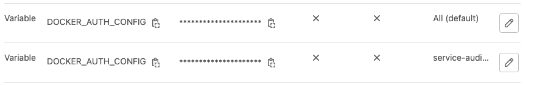

# Vulnerability Fixing with GPT-4 (Beta)

This article describes how to incorporate the Service Audit Vulnerability Fixing using GPT-4. The Python script behind 
it collects GitLab SAST Reports and sends source code files with vulnerabilities to the Azure GPT-4 API. GPT-4 generates 
a fix proposal for each vulnerability, which results in a commit. This commit can be verified in both GitLab Issues and 
Merge Requests.

You can provide feedback by using thumbs up/down in the corresponding Merge Request.
## Getting started

Open your `.gitlab-ci.yml` and add the following snippet.

```yaml
stages:         
  - test
  - optimize

include: 
  - project: service-audit/templates/vulnerability-fixing
    file: .gitlab-ci.yml
```

### Setup CI/CD Variables

To gain access to the OpenAI Azure subscription, please get in touch with the Service Audit team by sending an email 
with your request to
[api-review@telekom.de](mailto:api-review.telekom.de?subject=Request%20OpenAI%20Key%20for%20Vulnerability%20Fixing)   

```yaml
variables:
  GITLAB_TOKEN: <your-group-access-token> - with API permission and at least Developer role
  OPENAI_KEY: <openai-key>
  OPENAI_URL: https://openai-telekom.openai.azure.com
```

The Vulnerability Fixing Tool requires access to your repository through the GitLab API. You need to set the 
`GITLAB_TOKEN` variable in your `CI/CD` variables.

[See - how you can add CI/CD Variables](#manage-cicd-variables)

### Create Group Access Token (you need Owner Permission)

To have access to Gitlab API you must create a Group Access Token. In your Gitlab Group click on 
`Settings` -> `Access Token`. Type a name for the token and select a role at least `Developer` with permission `api`. 
Click on `Create group access token`and copy the token, which ist displayed to your clipboard or a secure space. 


### Manage CI/CD Variables

The codelens tool is receiving data (source code + configuration files) from your project group, you have to add some 
CI/CD Variables for your forked database project.

!!! tip
    Open `Settings` -> `CI/CD` and expand `Variables`.
    Click `Add variable`


Create a new variable with name `GITLAB_TOKEN` and copy the value from the previous step `Create Group Access Token`. 
Please masked your variable (masked variables are not display in gitlab job logs)


|Type|Key| Value                                   |Protected| Masked             |Environments|
|---|---|-----------------------------------------|---|--------------------|---|
| Variable|`GITLAB_TOKEN`| your group access token                 |:x:| :heavy_check_mark: | |


