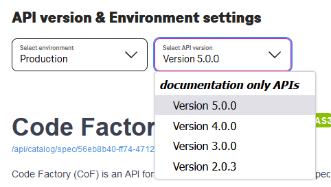
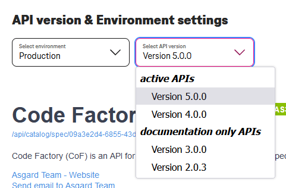

# Maverick Changelog

We recommend you visit our System Demo and Stakeholders Forum to be on track with latest changes.

## v2

### v 2.8.0

- [X] Enhanced Search with labels and free text.
- [X] We do support [Privat and Public OAS](/docs/src/tardis_customer_handbook/Maverick/ApiVisibility/) access levels now.
- [X] Meet the new tool - [Rover Online](/tooling/rover-online), you can use it in UI directly without installing Software.
- [X] You can disable Translation Popup and enable it again in your [User account Settings](/user-account/overview). Known Bug: Currently you can't disable it directly from the "Docs".
- [X] Enhanced Sync with Playground and PreProd - your OAS should be imported within few minutes maximum.

??? note "Related information"
    - [X] Technical API Category `T‧AR‧D‧I‧S` will not be shown in catalog anymore.

### v 2.6.3

- [X] Enhanced API Specification webhook import

??? note "Related information"
    - [X] Enhanced API Exposure processing

### v 2.6.2

- [X] Enhanced API Specification webhook import

??? note "Related information"
    - [X] Enhanced API Exposure processing

### v 2.6.0

- [X] API Changelogs
- [X] API Deprecation
- [X] Enhanced Notifications - get updated when Docs are updated
- [X] Enhanced Notifications - notify all API Subscribers when API was marked as Deprecated

### v 2.5.0

- [X] Linting of new and existing APIs
- [X] OAS Linting management support for different API Types
- [X] Various UI Update, add Tabs Support on an API view Page
- [X] New JSON Path tool
- [X] ENI API update - Sync with rover on webhook -> Your APIs are quicker on the Portal
- [X] ENI API update - add sync with Playground
- [X] CoF v4 Retirement - Now you will use CoF v5 everywhere!
- [X] Enhance Security and logging

??? note "Related information"
    - [X] CoF v4 Specifications temp storage still enabled with 24 Hours file rotation
    - [X] Enahanced Monitoring and add Alerting
    - [X] Various optimizations and code refactoring

### v 2.4.1

- [X] E-mail Notifications patch - not all OAS hashes were pre-generated.

### v 2.4.0

- [X] E-mail Notifications templates updated, add new notification types
- [X] API Roadmap Release
- [X] Dark mode support
- [X] Replace in UI all "Subscribe" to "watch" to avoid users misunderstanding

??? note "Related information"
    - [X] UUID bug solved
    - [X] CodeFactory Custom OAS Files TTL increased to 24 Hours to support CoF v5.
    - [X] Restrict connections to not Telekom domains via CSP

### v 2.3.2

- [X] Security k8s configurations update

### v 2.3.1

- [X] Our Frontend Container is now fully Templated, different Environments are managed via k8s configurations on the fly

### v 2.3.0

- [X] E-mail Notifications are back, simply use "Bell" sign to get notified about API updates
- [X] UI Update to k8s Configuration Validator, now it is easy to see your lines and spaces in YAML file
- [X] Dynamic Menu in UI
- [X] Portal Administration

??? note "Related information"
    - [X] Dynamic Menu - now we will manage our Portal Menu via Service and deliver Controlled information overall of the Services
    - [X] Portal Administration - we can manage Portal Users and Roles via UI.

### v 2.2.1

- [X] Temporary Force Light only mode!
- [X] Tools, tools, tools! [k8s Configuration Validator](https://developer.telekom.de/tooling/kube-analysis)!
- [X] Swagger Editor updated to v4.4.0

??? note "Related information"
    - [X] New Service for k8s Configuration Validator
    - [X] Temporary Workaround on Ingress due to Cookies and Headers drives to JSON error for not logged in users

### v 2.2.0

- [X] Documentation upload via UI for API Owner
- [X] Tools, tools, tools! [Base64](https://developer.telekom.de/tooling/base64) and [JWT decoders](https://developer.telekom.de/tooling/jwt) in your Browser!
- [X] Updated Admin panel - you will not see it, but we will work faster with it :D
- [X] Security: we do apply CSP so that external Content linking is limited for now.

??? note "Related information"
    - [X] New MTR
    - [X] Refactoring and remove orphans

### v 2.1.3

- [X] Documentation Only Feature released
- [X] Updated T‧AR‧D‧I‧S Universe - now you can see some history data!

??? note "Related information"
    - [X] Now user can see if there is any backend exist behind this API or this swagger presented as documentation only.
    
    

### v 2.1.2

- [X] Bug solving. APIs Titles and Descriptions are updated with a data from the most recent OAS Version
- [X] Increase Rover Sync frequency - now it is like in a Post Office Mon-Fri from 8 till 20 with Lunch pause :D

### v 2.1.1

- [X] Workaround for E-API

### v 2.1.0

- [X] Add Links to Logging and Monitoring of particular APIs
- [X] Enable PreRelease and Playground ENVs.
- [X] Menu update
- [X] Make Blame page more human friendly

### v 2.0.0

- [X] Add Rover Support
- [X] Deprecate Artifactory solution
- [X] Add User Cabinet
- [X] Add T‧AR‧D‧I‧S Universe

??? done "Older Releases"

    ## v1

    ### v 1.2.0

    - [X] Add Exposed API from the Mission Control - Production
    - [X] Add User Account Sections
    - [X] Move E-Mail Subscriptions to the User Account

    ??? note "Related information"
        - [X] Move to Magenta CI CD Plant UML

    ### v 1.1.0

    - [X] Add News Feed
    - [X] Add Notifications bar to inform users about something good
    - [X] Going to Internet
    - [X] Integrate Mission Control to the UI

    ??? note "Related information"
        - [X] PSA Orchestrator, Requirement 17
        - [X] Add Scope Public/Internal to Notifications
        - [X] Add Cloud Shepherd link

    ### v 1.0.0

    - [X] Add Main Page
    - [X] Login via Magenta CICD
    - [X] Adjusted TLS Settings
    - [X] Enhance Catalog Search function

    ??? note "Related information"
        - [X] Add Security GW to protect all endpoints
        - [X] Add Scope Public/Internal settings to Catalog

    ## v0

    ### v 0.8.0

    - [X] New Common UI Header with Menu and Footer based on [Scale](https://www.brand-design.telekom.com/scale/)
    - [X] Connection to the Magenta CICD Gitlab as "Maverick the Developer Portal"
    - [X] Code Factory v4 API with new features
    - [X] Quick feedback button direct to Code Factory Team Asgard
    - [X] Harmonized Documentation Images - all features are similar to all Docs
    - [X] New Documentations menu with clear grouping
    - [X] Get rid of "Different Documentations Arts" - replaced by new Menu
    - [X] Wiremock: test your API now, build your service tomorrow. Please contact [Team-Atlas](mailto:fmb_tardis_support@telekom.de?subject=Participate%20in%20Wiremock%20Beta%20Testing) to participate our Friendly user Beta Testing
    - [X] Minor bug fixing

    ??? note "Related information"
        - [X] PSA Orchestrator, Requirement 17
        - [X] Display all user groups in 1 list
        - [X] Refresh access token if access granted, but token expired. Aka Error handling
        - [X] Code Factory local storge - keep prefilled data when user goes to Gitlab and drop it when user goes somewhere else

    ### v 0.7.0

    - [X] `subdomain` being replaced by `api_name` in `metadata.yaml`
    - [X] New Resource Model, now APIs could be reached via `https://developer.telekom.de/catalog/<enterprise|system>/<TMFDomain|HubName>/<API Name>/<Exact Version>`
    - [X] Documentation - now all tables could be simply sorted
    - [X] Move to New Status Page API
    - [X] Minor bug fixing

    ??? note "Related information"
        - [X] Potential issue with Sync between Sys. and Ent. APIs - Move API Type to higher LvL
        - [X] Moved to new Status Page endpoints and disable our own cache
        - [X] Generate PDF not for whole Docu, but per repository

    ### v 0.6.1

    - [X] Code Factory API v2, now custom uploaded specifications going directly into Archive
    - [X] Code Factory Error Handling, finally you will see message about an error
    - [X] PSA Requirement - Encoding on content types
    - [X] Frequency of sync between Maverick API catalog and Artifactory is set to once a day
    - [X] Minor bug fixing

    ??? note "Related information"
        - [X] CoF Error when upload file with space in name
        - [X] CoF Error 400 when upload file with upper case in file extension
        - [X] Highlighted with using "*" words, stick to word goes after it

    ### v 0.6.0

    - [X] Accessibility in UI - Keyboard navigation on Code-Factory, Search and Status pages
    - [X] System API documentation service has been added. Sync with Artifactory every 30 mins
    - [X] System API delivery pipeline is finalized and went live
    - [X] Intranet Swagger Editor is added to Maverick
    - [X] Intranet Plant UML is added to Maverick
    - [X] Frequency of sync between Maverick API catalog and Artifactory is increased to once a 15 mins
    - [X] storeSpecLocally feature is added in Code-Factory service.

    ??? note "Related information"
        - [X] Swagger UI preview stage is added to System API publish pipeline
        - [X] Swagger Editor is rebuilt with disabled possibility to send requests out of intranet
        - [X] Swagger Editor is connected with local instance of Swagger Converter (OAS2 to OAS3)
        - [X] Cof version 2 is live on Maverick
        - [X] Special characters from API/Subdomain/Domain name are removed
        - [X] Bug fixes

    ### v 0.5.0

    - [X] Support for custom OAS in Code Factory, simple upload from PC
    - [X] Accessibility in UI - Use keyboard to navigate via Catalog
    - [X] Remove Artifacts from Catalog Description
    - [X] System API full Automated delivery via Pipeline

    ??? note "Related information"
        - [X] Upload with UUID
        - [X] Cleanup uploaded files and unique links after 15 min
        - [X] Automatic Lambda deploy
        - [X] DB import without markdown artifacts
        - [X] Minor Bug fixing: Description being updated with latest OAS.
        - [X] Open Documentation page in the same window

    ### v 0.4.1

    - [X] Add Search for System API
    - [X] Move PDFs from external sites to the Maverick
    - [X] Minor bug fixing

    ??? note "Related information"
        - [X] Fix update index after metadata changing
        - [X] Updated k8s Portal config

    ### v 0.4.0

    - [X] MVP for Project, System API
    - [X] MVP with Code Factory - You can generate code for selected APIs with few clicks
    - [X] Retire Documentation page with fully automated MkDocs served via Gitlab
    - [X] Add API Labels to metadata.yaml and Catalog
    - [X] Add fully automated Enhanced API Documentation via MkDocs
    - [X] Add fully automated API Changelog via MkDocs
    - [X] Add automatic periodical changes update from the Artifactory due to the webhook Problems
    - [X] Make metadata parser more error tolerant - will not fail on error, only put your API to the Group "Other"
    - [X] Minor bug fixing

    ??? note "Related information"
        - [X] Generate List of 10 recent Enterprise Specifications updates ones per day
        - [X] Updated k8s Portal config
        - [X] Remove some Legacy Names and information
        - [X] When API being moved/renamed move Notifications Subscribers with it

    ### v 0.3.0

    - [x] Migration from MVP to the Production cluster
    - [x] Add API E-Mail Notifications subscription
    - [x] Add Metrics for the Guardians
    - [x] Add Status Page to show different Services Statuses
    - [x] Fully automate API Catalog
    - [x] Retire Admin Panel
    - [x] Get new Certificate due to Chrome issue
    - [x] Minor bug fixing

    ### v 0.2.0

    - [x] MVP for API Catalog
    - [x] MVP for Admin Panel: Documentation and Catalog
    - [x] Get new Domain and Certificate
    - [x] Minor bug fixing

    ### v 0.1.0

    - [x] Initial Portal with Documentation only
    - [x] Add possibility to fetch data from the Confluence
    - [x] Add possibility to fetch data from the Gitlab
    - [x] New Design
