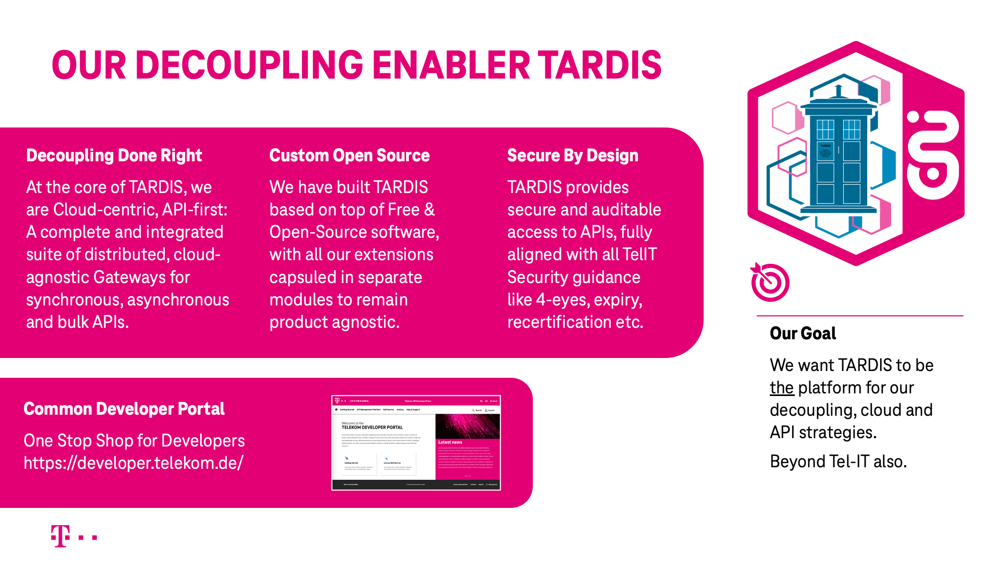

# T‧AR‧D‧I‧S FAQ

## What is this API thing about?

First of all — **API** simply de-acronyms to <b>A</b>pplication <b>P</b>rogramming <b>I</B>nterface. API did have this meaning since the early years of computing, to designate the means of interacting with a system or an application by means of another application of system. Over time, as technologies evolved, technical methods to interface have changed, as have the means to describe and document an API.

Over the past decades, the evolution of the Internet has brought forward concepts like RESTful APIs as well as Web APIs, along with standards for documenting such APIs as well as conventions on how to implement APIs in a robust, expandable way.

We use **API** in this modern interpretation, to designate [RESTful APIs](https://developer.telekom.de/docs/src/api_standards_conventions/) implemented accross Web technologies.

## What is T‧AR‧D‧I‧S about?

T‧AR‧D‧I‧S is a family of integrated tools that is our key lever to drive decoupling. It’s key attributes are:

1. **Decoupling Done Right**  
   At the core of T‧AR‧D‧I‧S, we are Cloud-centric, API-first: 
   A complete and integrated suite of distributed, cloud-agnostic Gateways for synchronous, asynchronous and bulk APIs.
1. **Custom Open Source**  
   We have built T‧AR‧D‧I‧S based on top of Free & Open-Source software,
   with all our extensions capsuled in separate modules to remain product agnostic.  
1. **Secure By Design**  
   T‧AR‧D‧I‧S provides secure and auditable access to APIs,
   fully aligned with all TelIT Security guidance like 4-eyes, expiry,
   recertification etc.

The premier products within T‧AR‧D‧I‧S are

* [StarGate](https://developer.telekom.de/docs/src/tardis_customer_handbook/StarGate/), a Gateway for synchronous APIs  
   (Request-Response Pattern)
* [Horizon](https://developer.telekom.de/docs/src/tardis_customer_handbook/horizon/#what-it-is), a Gateway for asynchronous APIs  
   (Publish-Subscribe Pattern)
* [Drax](https://developer.telekom.de/docs/src/tardis_customer_handbook/drax/doc_Drax_README/), a Tracing-as-a-Service solution  
   for easy following call-flow though services and backends

But there are many more tools explored in our documentation.

## Do you have a slide for that?

Yes, we do:  

## What does T‧AR‧D‧I‧S mean?

T‧AR‧D‧I‧S is the <b>T</b>elekom <b>Ar</b>chitecture for <b>D</b>ecoupling and <b>I</b>ntegration of <b>S</b>ervices.

And yes — it is [bigger on the inside](https://tvtropes.org/pmwiki/pmwiki.php/Main/BiggerOnTheInside).

## Where can I find your System Demos?

We recorded them for you, simply visit our YamTube --> 

## I need Support

You can find [Support here](/docs/src/tardis_customer_handbook/support/).

## Do you have an Overview?

Sure, please visit our [Product-Overview](/docs/src/tardis_customer_handbook/) Section.

## Which Environment should I use?

The `Playground` is our entry drug: Please start your **T‧AR‧D‧I‧S** Journey here.

Then, please follow this [guidance from environment management teams fixed and mobile](https://mywiki.telekom.de/x/zQj_Rw): <https://mywiki.telekom.de/x/zQj_Rw>

In addition, there is the **T‧AR‧D‧I‧S** `PreProd` environment. This runs on a separate infrastructure compared to the other environments and hence is a good fit to run your *Load & Performance Tests*.  
We would appreciate your telling us upfront so we can monitor and learn from your testing.

If non of the above fits, consider using `Bond` — which is our secret weapon for special uses (Martini not included).

## I have external collague - how to give him an access?

If you need to Request Access for your external Colleague - please use this guide: https://docs.devops.telekom.de/documentation/mcicd/userdocumentation-magentacicd/mcicd-zam/

## I still have a Question

!!! Note
    Please use our [Support channel](/docs/src/tardis_customer_handbook/support/) to address your Question - we will do our best to help you.
