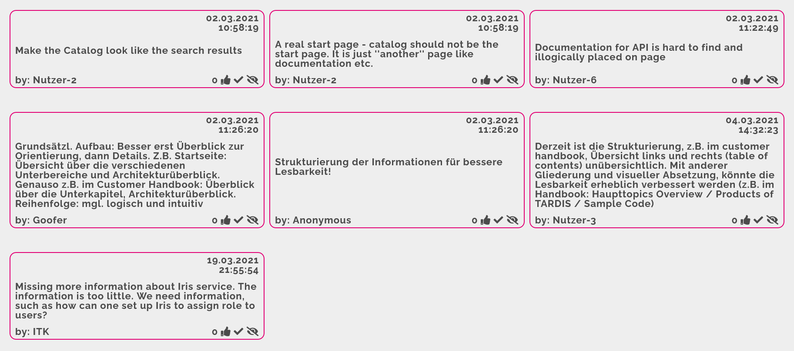
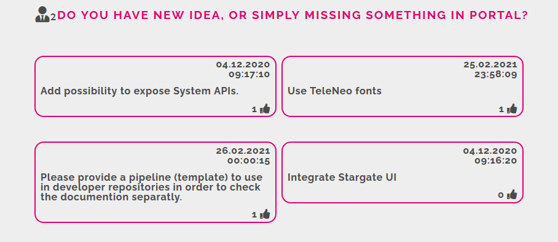

# Maverick Portal new Ideas and Features

!!! info
    This Board is deprecated

We are listening to our customers, thanks you that you are with us!

You have multiple possibilities to give us feedback and write suggestions about new Features or Functions.

**New** Board for PI8 you can find here: https://vote.telekom.net/874139. Simple Voting for already posted requests is here: https://vote.telekom.net/analysis/874139

## What was already requested and possible integrated

| Date | Request | Comment |
|:-----|:--------|:--------|
| 02.03.2021 | Missing more information about Iris service. The information is too little. We need information, such as how can one set up Iris to assign role to users?  | |
| 04.03.2021 | Derzeit ist die Strukturierung, z.B. im customer handbook, Übersicht links und rechts (table of contents) unübersichtlich. Mit anderer Gliederung und visueller Absetzung, könnte die Lesbarkeit erheblich verbessert werden (z.B. im Handbook: Haupttopics Overview / Products of T‧AR‧D‧I‧S / Sample Code) | |
| 02.03.2021 | Strukturierung der Informationen für bessere Lesbarkeit!  | |
| 02.03.2021 | Grundsätzl. Aufbau: Besser erst Überblick zur Orientierung, dann Details. Z.B. Startseite: Übersicht über die verschiedenen Unterbereiche und Architekturüberblick. Genauso z.B. im Customer Handbook: Überblick über die Unterkapitel, Architekturüberblick. Reihenfolge: mgl. logisch und intuitiv | |
| 02.03.2021 | Documentation for API is hard to find and illogically placed on page | :white_check_mark: We add API documentation references on main Documentation page, so you can easily switch between different documentation arts. |
| 02.03.2021 | A real start page - catalog should not be the start page. It is just ''another'' page like documentation etc. | |
| 02.03.2021 | Make the Catalog look like the search results | |
| 26.02.2021 | Please provide a pipeline (template) to use in developer repositories in order to check the documention separatly. | :white_check_mark: You can find [reference here](/docs/src/developer_portal_howtos/Documentation/#project-configuration). We will work to make it publicly accessible |
| 25.02.2021 | Use TeleNeo fonts |  |
| 04.12.2020 | Integrate Stargate UI |  |
| 04.12.2020 | Add possibility to expose System APIs. | :white_check_mark: Yes, we did it! You can find [System API](https://developer.telekom.de/catalog?type=system) on our Portal and be [simply onboarded](/docs/src/developer_portal_howtos/catalog/System/). |

=== "PI7"

    Here you can find Board from PI7 https://vote.telekom.net/analysis/629312. Please use following screenshot for reference:
    

=== "PI6"

    Here you can find Board from PI6 https://vote.telekom.net/analysis/683905. Please use following screenshot for reference:
    

!!! note
    Here you can find Boards from older PIs. It is impossible to save them longer than for a 3 Month, so please use following screenshot for reference.
