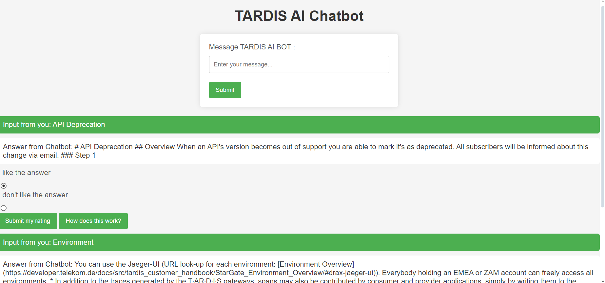

# TARDIS AI Chatbot

The TARDIS AI Chatbot is a simple web-based chatbot application that uses natural language processing (NLP) to provide answers based on a set of predefined documents. The chat history is displayed on the web page, and users can rate the chatbot's answers.

## Features

- User-friendly web interface.
- Chat history display with user inputs and chatbot responses.
- Ability to rate chatbot answers.

## Prerequisites

Before running the application, make sure you have the following installed:

- Python 3.x
- Flask (`pip install Flask`)
- spaCy (`pip install spacy`)
- scikit-learn (`pip install scikit-learn`)

## Structure

app.py: The main Flask application file.
docs/: Folder containing the documents used for chatbot responses.
static/: Folder containing static assets such as images.
templates/: Folder containing HTML templates for rendering web pages.

## Localhost adress
```bash
http://127.0.0.1:5000
```
## Chatbot design


