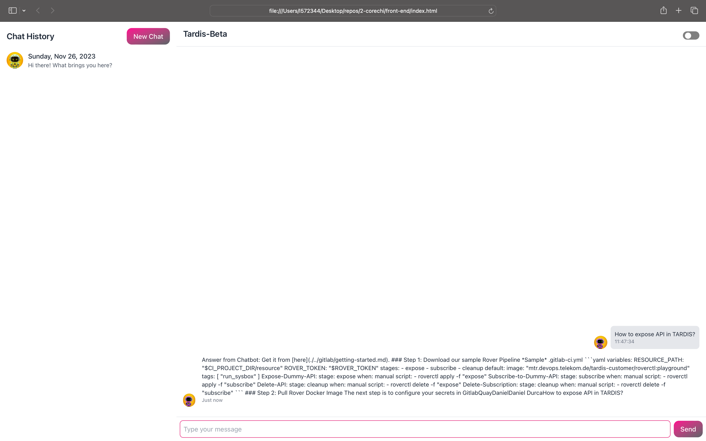
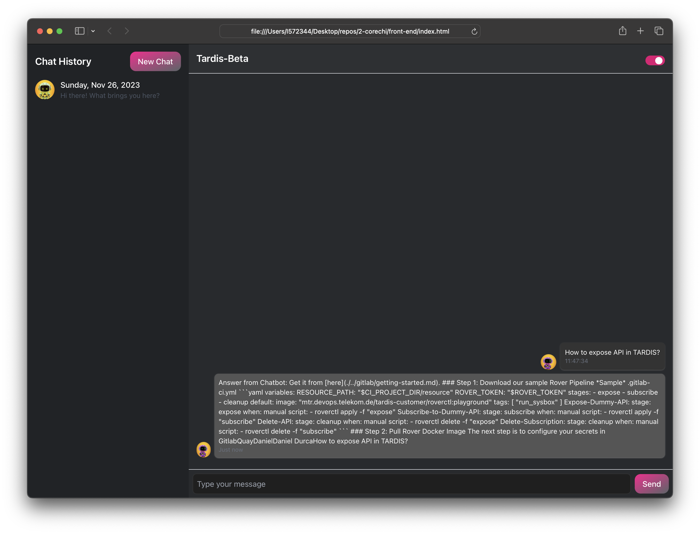

# TARDIS AI Chatbot

The TARDIS AI Chatbot is a simple web-based chatbot application that uses natural language processing (NLP) to provide answers based on a set of predefined documents. The chat history is displayed on the web page, and users can rate the chatbot's answers.

## Chatbot design




## Features

- User-friendly web interface.
- Chat history display with user inputs and chatbot responses.
- Ability to rate chatbot answers.
- Ability to create Jira Ticket automatically.
- API Documentation in form of Swagger

## Prerequisites

Before running the application, make sure you have the following installed:

- Python 3.x
- Flask (`pip install Flask`)
- spaCy (`pip install spacy`)
- scikit-learn (`pip install scikit-learn`)
- en_core_web_md (`python -m spacy download en_core_web_md`)

## Structure

main.py: The main Flask application file.
docs/: Folder containing the documents used for chatbot responses.
static/: Folder containing static assets such as images.
templates/: Folder containing HTML templates for rendering web pages.

## Starting app - via terminal

cd "2-CORECHI" ##changing directory to current project
souce venv/bin/activate ##starting virtual python enviroment to run flask
python3 main.py ##starting app

## Closing app and virtual enviroment
CTRL + C 
deactivate

## Localhost address
```bash
http://127.0.0.1:5000
```
