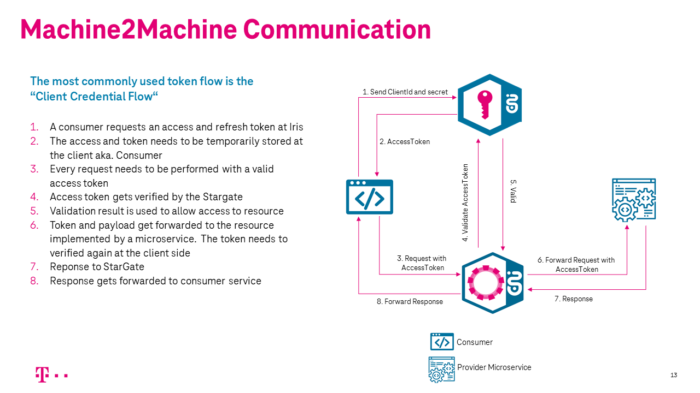

# API Security on StarGate

**Table of Contents** 

[[_TOC_]]

**The communication is secured using standard Open ID connect protocol on T‧AR‧D‧I‧S**

**A standard OAuth 2.0 "Client credential flow" is used to secure the APIs exposed on the Gateway.**

### Communication between two services

