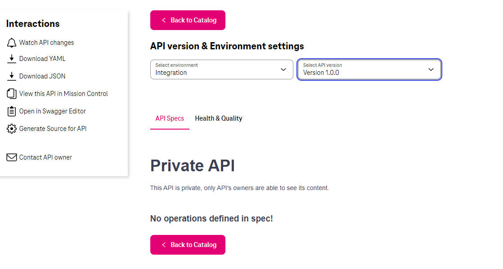

# API Visibility

## Overview

API Visibility is a feature that allows to share specifications for everyone (throw the Internet) 
or to make it visible only for API maintainers.

### Start using

All what you need is to add `x-api-visibility` attribute inside `info` section

An example is below:

```yaml hl_lines="6"
swagger: "2.0"
info:
  title: "API's title"
  description: "API's description"
  version: "1.0.0"
  x-api-visibility: "private"
host: "serverRoot"
```

If `x-api-visibility` doesn't exist in a specification, `internal` level will be set.

### Visibility levels

There are three supporter visibility's levels.

| **Level**  | **Required** | **Description**                                                                                                        |
|------------|--------------|------------------------------------------------------------------------------------------------------------------------|
| `public`   | Yes          | API specifications will be shown for everyone (users from the Intranet and not-logged-in users from the Internet).     |
| `internal` | No           | Default level. API specifications will be shown only for users from the Intranet or logged-in users from the Internet. |
| `private`  | Yes          | API specifications will be shown only for logged-in API maintainers.                                                    |

### Private API

Private APIs will be shown on the main catalog page with it's title and short description. 
But if you are not logged-in API's maintainer on the API detail page a dummy API will be shown.



To see it's content you have to be in the list of team members in MissionControl for an environment where this API was applied 
and to be logged-in on the portal.

Some of the API's data will be also hidden.

| **Tab name**       | **Will be shown?** |
|--------------------|--------------------|
| `Health & Quality` | Yes                |
| `Changelog`        | No                 |
| `RoadMap`          | No                 |
| `Labels`           | No                 |

!!! note
    It's possible to have different API versions (e.g. v1 and v2) with different visibility levels. But if at least one version is private, then the data will be shown according to the table above.
