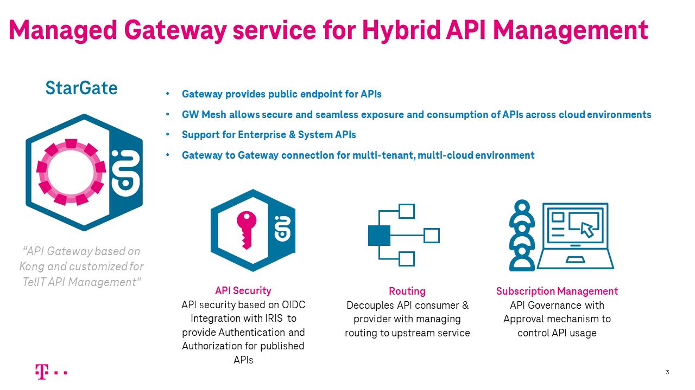
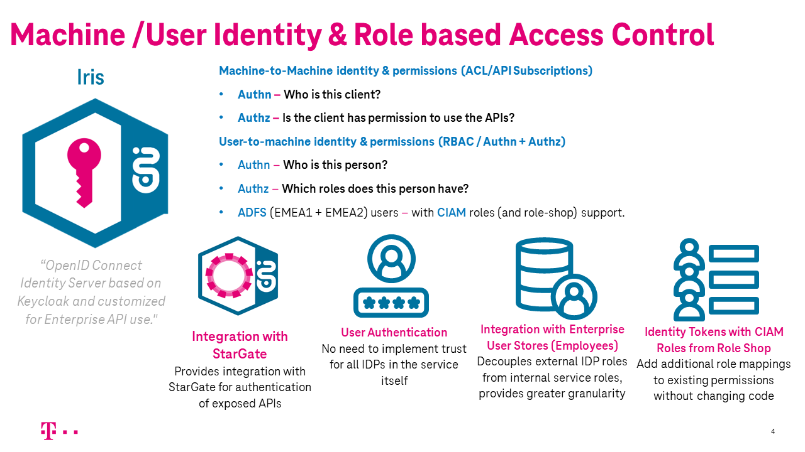
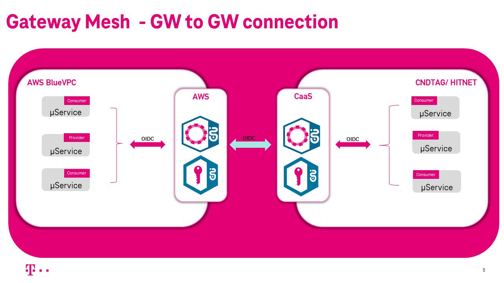
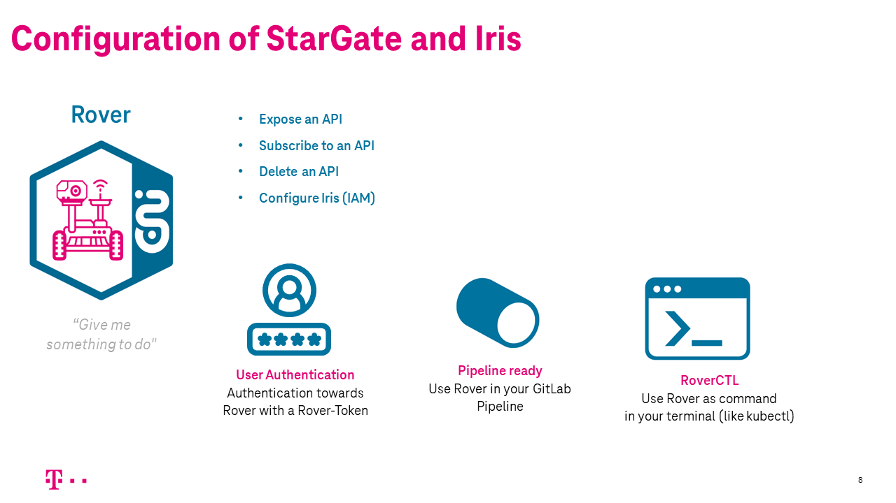
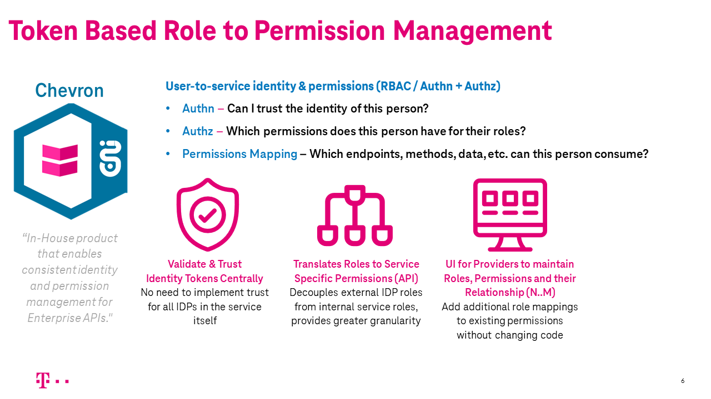
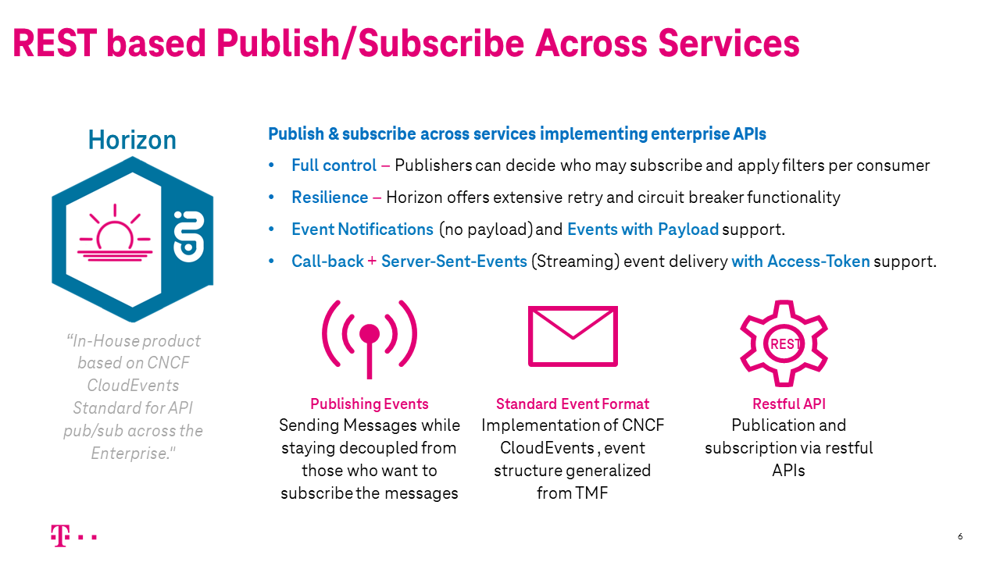
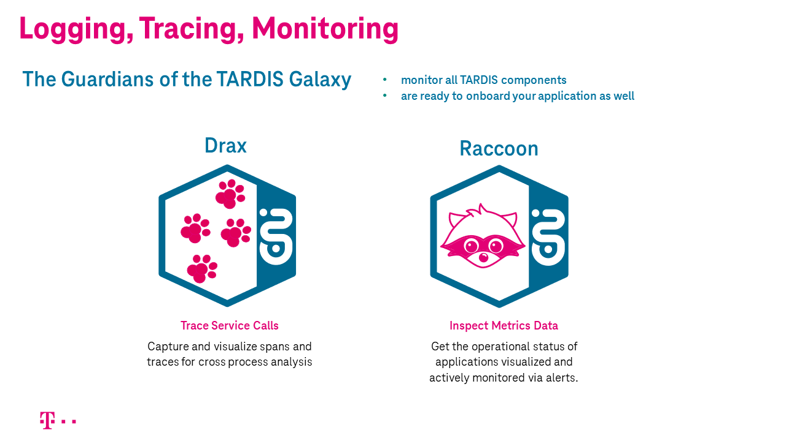
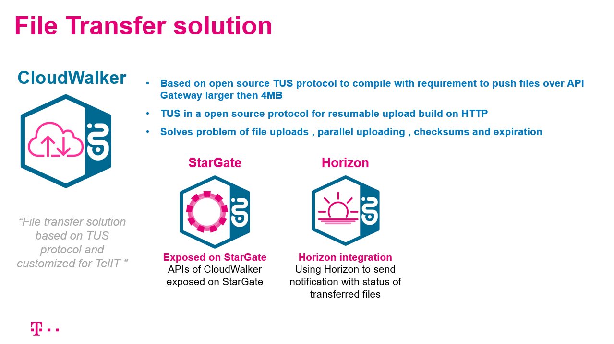
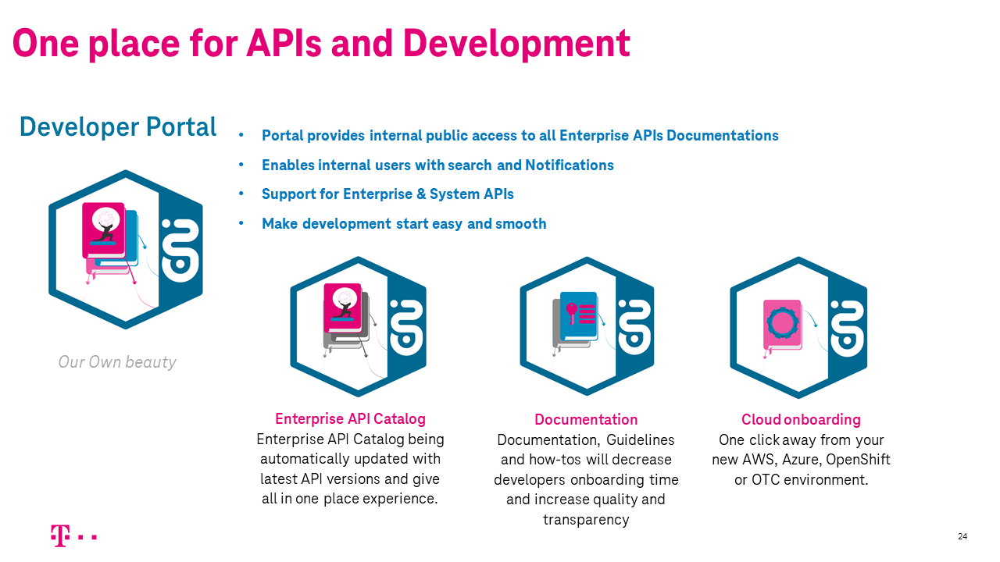
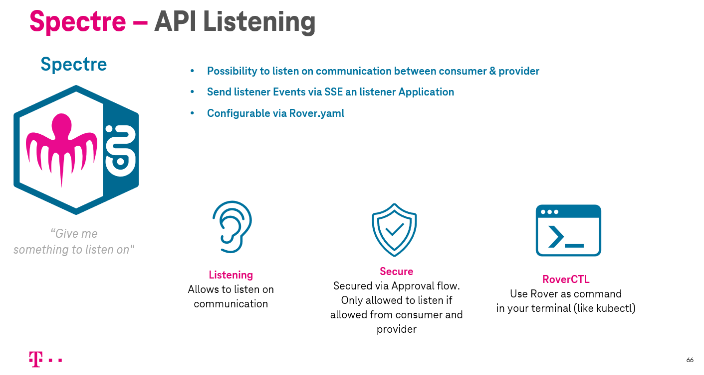

# T‧AR‧D‧I‧S

!!! info "Upcoming T‧AR‧D‧I‧S Events"
    Upcoming deep dives, system demos and open calls can be found [here](https://yam-united.telekom.com/pages/eni-hub/apps/events/tardis-events).
    The latest recording of `Stargate Onboarding Technical Deep Dive` can be found [here](https://yam-united.telekom.com/pages/eni-hub/apps/blog/tardis-blog/view/17f8e05a-1915-43f2-954b-5bde8cb7688f).

**Telekom Architecture for Decoupling and Integration of Service.**

A suite of product components providing solutions for common and recurring aspect.

## StarGate

**StarGate is a managed gateway to cater Hybrid API management in DT-IT**

Provides gateway mesh functionality to offer seamless exposure and consumption of APIs even cross clouds.

This means a service exposed on AWS, CaaS (DE4 Env), AppAgile, Biere … can be seamless consumed from all those cloud environments with approved security.

API security based on OpenID Connect.

Rover ctl tool to facilitate the automation of endpoint publishing and Subscription from CI/CD pipelines.

Integration between StarGate and IRIS (M2M IDP) to enable Authentication and Authorization for published APIs.

## IRIS

**OpenID Connect Identity Server based on Keycloak and customized for API use**

Keycloak in two flavors.

**M2M(Machine2Machine) Keycloak** integrated with the Stargate for self service onboarding of APIs.

**H2M(Human to Machine) Keykloak** integrated with ADFS (Active Directory Federation Service) which provides out of the box login and CIAM Roles for Telekom (emea1 & emea2)

## Gateway Mesh

GW Mesh allows secure and seamless exposure and consumption of APIs across cloud environments.

## Stargate & Rover

Command line tool to facilitate runtime configuration of APIs on StarGate & IRIS from CI/CD pipelines.

## Chevron

**In-House product that enables consistent identity and permission management for APIs**

Permission service which to resolve CIAM Roles into fine grained RBAC (Role based access control)

## Horizon

**Pub/Sub integration pattern exposed via Rest APIs**
Powerful and flexible: Event types, selection filter, response filter, Delivery via callback or server send events (streaming)

## Guardians

**Logging, Monitoring and Tracing infrastructure based on EFK stack, Prometheus/Grafana and Jaeger**

Provides endpoints for writing, managed target databases ("Elasticsearch as a Service") and controlled data access via sophisticated UIs

Running on CaaS (currently DE3 only, DE4 under construction) and AWS

## CloudWalker

**File transfer solution that allows transfer of large files over gateway**

## Maverick

Maverick is our Developer Portal

## Spectre

Spectre is our API listening solution.

## Support

**T‧AR‧D‧I‧S Support Information**

For Support Information please visit [Support Section](support/).
