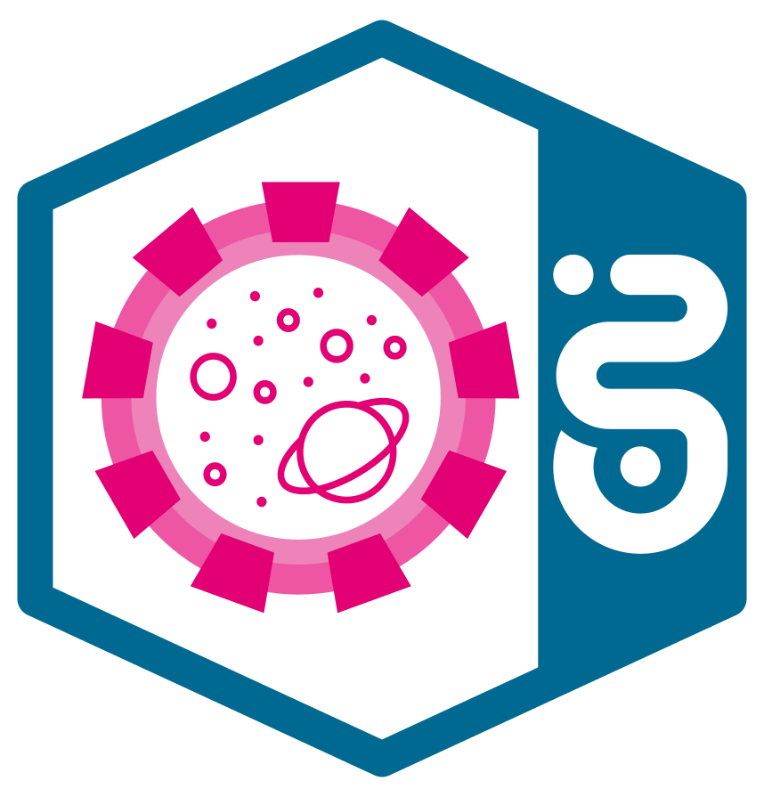
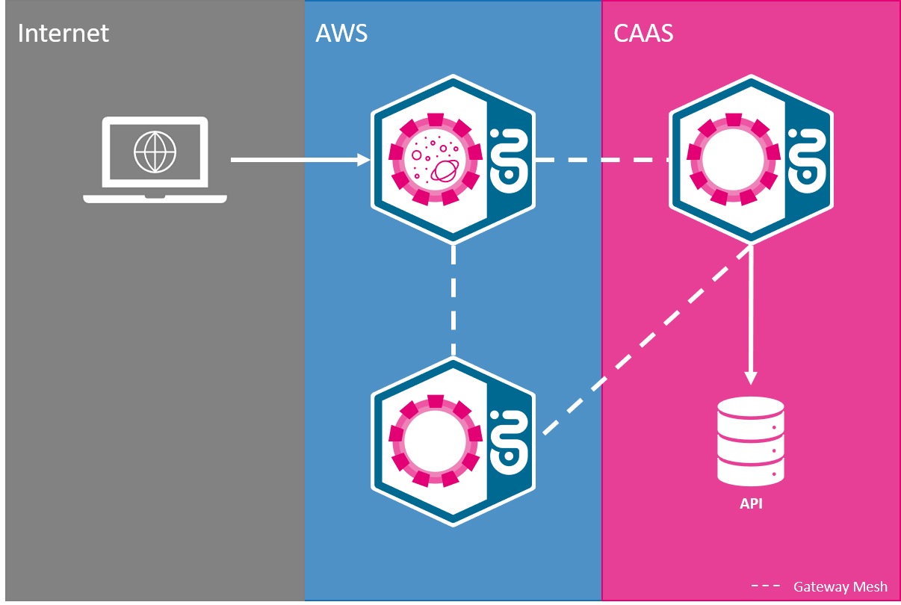
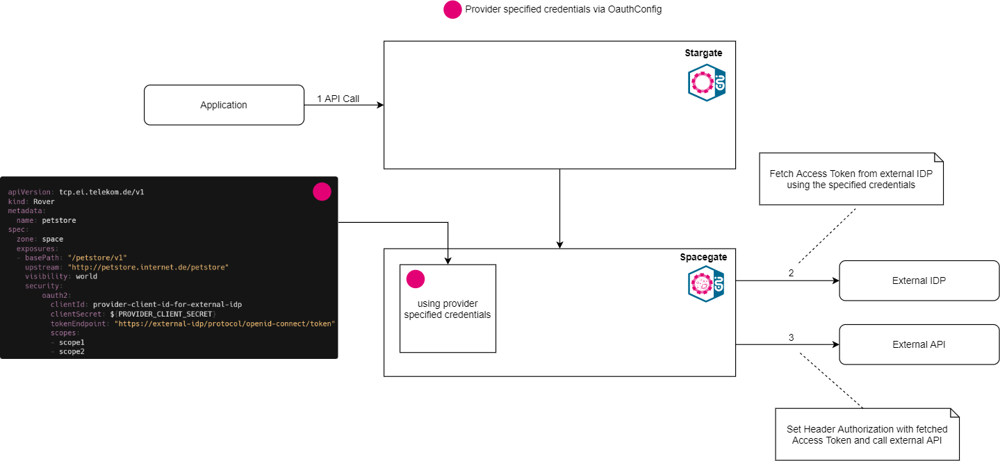
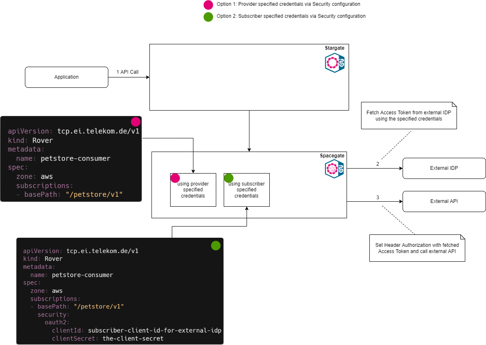

# Spacegate

{ width="250" }

**Spacegate is the Internet connection of T‧AR‧D‧I‧S**

Expose internal APIs on Stargate for external partners or expose external APIs for internal usage.

## Features:
- Gateway Mesh: Spacegate provides Gateway Mesh functionality to expose APIs from other clouds to the internet
This means a service exposed on AWS, CaaS (DE4 Env), AppAgile, Biere … can be seamlessly used to provide it to external customers.
- OpenID Connect based communication: Spacegate is integrated with IRIS (M2M IDP) to provide Authentication for published APIs. The Iris is exposed to external customers via Spacegate - so only one point of connection is needed to communicate with DT APIs.
- CI/CD driven deployment: To expose/subcscribe service on Spacegate, we prodive a Rover Tool which can be used by customers via their CI/CD pipeline. The Rover ctl tool facilitates the automation of endpoint publishing and Subscription from CI/CD pipelines.
- Routing: Decouples API consumer & provider with managing routing to upstream service.
- Subscription Management: API Governance with Approval mechanism to control API usage via [MissionControl](Stargate_Step-By-Step_Tutorial.md#onboarding-via-mission-control)

!!! important
    Request message size on Spacegate is limited to 4 MB. Also, the request headers size is limited to 16 KB (The **sum** of all header sizes cannot exceed this).
    In case you want to send larger files, please use [CloudWalker](../CloudWalker/README.md)

## Spacegate in a picture

{ width="600" }

!!! info
    Spacegate runs on AWS

## API Security on Spacegate

The communication over StarGate is secured using standard Open ID connect protocol.

**A standard Open ID Connect "Client credential flow" is used to secure the APIs exposed on the StarGate.**

For further information please take a look at the [Stargate Security chapter](README.md#api-security-on-stargate) which is similar to the Spacegate one.

## Standard Headers set by Spacegate
The following headers are set by Spacegate automatically:

| Header                  | Value              | Further information |
| ----------------------- |:------------------:| -------------------:|
| X-Forwarded Information | Disclose information that is altered or lost when a proxy is involved in the path of the request | [Link](https://datatracker.ietf.org/doc/html/rfc7239) |
| X-B3-* ID's             | Trace IDs | [Link](https://zipkin.io/pages/instrumenting.html) |
| Realm                   | IDP Realm |
| Environment             | Environment of the API |
| X-Gateway-Token         | Gateway Token if the Enhanced variant is not used | [Link](README.md#last-mile-security-gateway-token) |
| x-spacegate-token       | Original Spacegate authorization Token (in case of Gateway mesh scenario with subscription on space zone) |

!!! tip
    Other headers set by the consumer of an API will be passed through Spacegate to the provider of an API.

## How to use Spacegate to provide internal APIs for external partners
Spacegate enables customers to utilize the Gateway Mesh to use APIs exposed on Stargate via the Internet. For this some steps are necessary for both parties.

### Provider
The provider needs to add an `visibility` tag to the exposure in the Rover.yaml. This needs to be set to `world` which makes the API reachable from the Spacegate.

**Example** `Spacegate: rover.yaml`

```yaml
apiVersion: tcp.ei.telekom.de/v1
kind: Rover
metadata:
  name: petstore
spec:
  zone: aws
  exposures:
  - basePath: "/petstore/v1"
    upstream: "http://petstore.preprod.tif.telekom.de/petstore"
    visibility: world
```

### Consumer

Consumers need to subscribe to APIs on the Spacegate similar to the ones used on Stargate.

!!! attention
    You as a Provider/Contact person have to do the subscription for your external partners since external partners do not have access to it.
    Additionally, you have to use another `Rover.yaml` since consumer and provider cannot be both on `space` zone.

In order to subscribe, you have to use the zone `space` in your `rover.yaml`.

  **Example** rover.yaml

```yaml
apiVersion: tcp.ei.telekom.de/v1
kind: Rover
metadata:
  name: petstore-consumer-internet
spec:
  zone: space
  subscriptions:
  - basePath: "/petstore/v1"
```

!!! important
    Consumer systems need to send a `User-Agent` header with the request, otherwise it will be blocked by the Spacegate

## How to use Spacegate to provide external APIs for internal usage
Spacegate enables customers to utilize the Gateway Mesh to use APIs exposed on the Internet internally. For this some steps are necessary for both parties.

### Provider

In order to expose an external API, which is located somewhere in the Internet and can be called from within the Telekom, you may specify an external IDP. This Identity Provider is then used to fetch an oAuth-Token, when the external API is called via Spacegate. Credentials which are provided via the Exposure should apply to some kind of technical account. This account is used as a fallback, in case the subscriber did not want to or could not specify subscriber-specific credentials.

The flow for the technical account is illustrated below.

{ width="100%" }

To configure the oAuth-Settings, a new section in the `Spacegate: rover.yaml` is appended. It includes the external token endpoint, the client ID and the client secret. Optionally, you can also add *scopes*.

```yaml
apiVersion: tcp.ei.telekom.de/v1
kind: Rover
metadata:
  name: petstore
spec:
  zone: space
  exposures:
  - basePath: "/petstore/v1"
    upstream: "http://petstore.internet.de/petstore"
    visibility: world
    security:
        oauth2:
          clientId: provider-client-id-for-external-idp
          clientSecret: ${PROVIDER_CLIENT_SECRET}
          tokenEndpoint: "https://external-idp/protocol/openid-connect/token"
          scopes:
          - scope1
          - scope2
```

### Consumer

While subscribing to an external API via Spacegate, it is possible that you have to specify client credentials for the IDP of the external API.

These credentials **ARE NOT** the same as the credentials you obtain via MissionControl and have to use in order to call StarGate. The external credentials must be provided by your external partner, if it is applicable.

The flow which uses these subscriber credentials for an external IDP is illustrated below.

{ width="100%" }

To provide the credentials mentioned above, the following example can be used. Optionally, you can also add *scopes*.

```yaml
apiVersion: tcp.ei.telekom.de/v1
kind: Rover
metadata:
  name: petstore-consumer
spec:
  zone: aws
  subscriptions:
  - basePath: "/petstore/v1"
    security:
      oauth2:
        clientId: subscriber-client-id-for-external-idp
        clientSecret: the-client-secret
        scopes:
        - scope1
        - scope2
```


!!! tip "Credentials handling"
    Credentials will be used in the following order:
    
    1.  Subscriber Credentials
    2.  Provider Credentials

    Same goes for the **scopes**.
