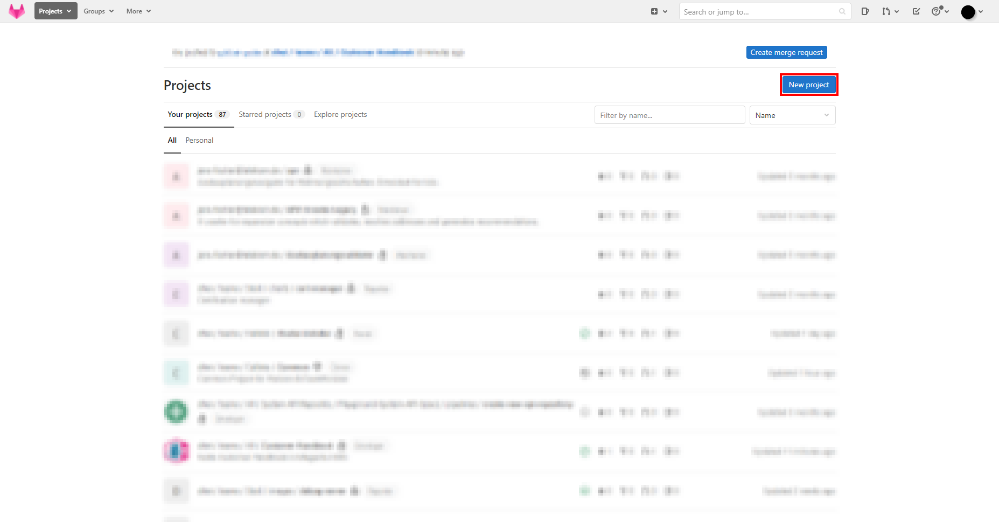
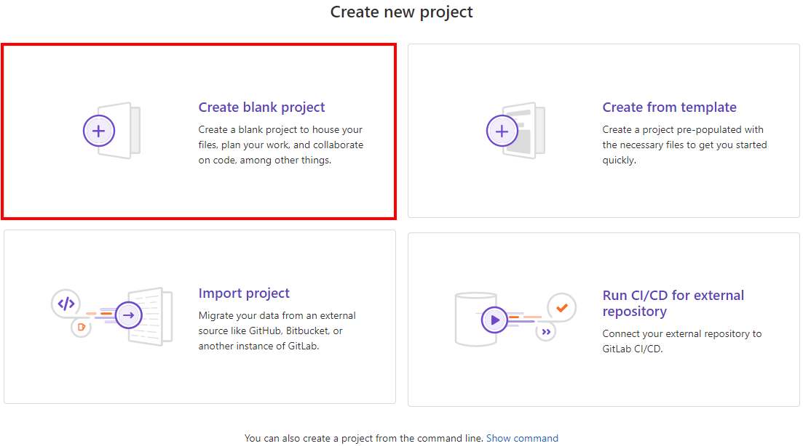
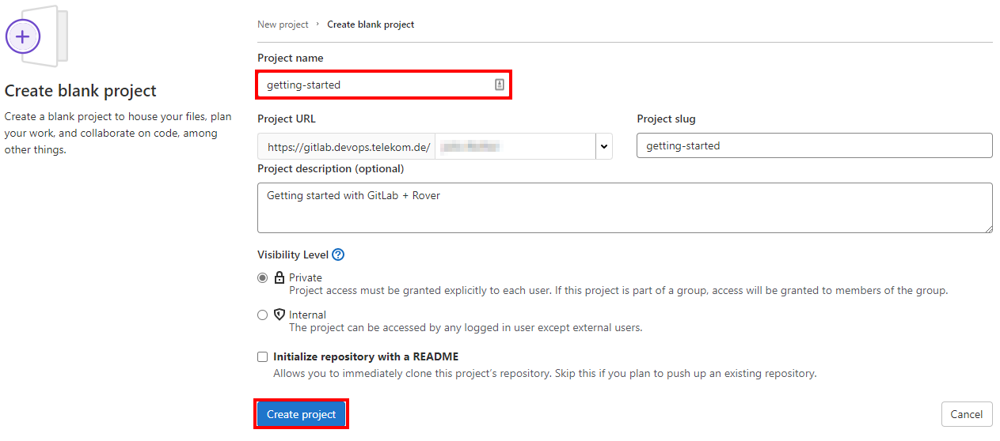
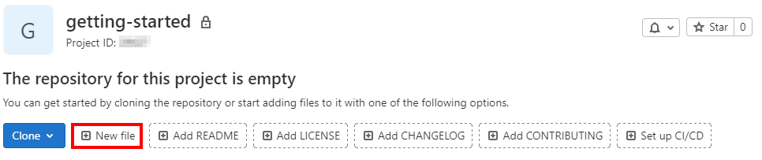
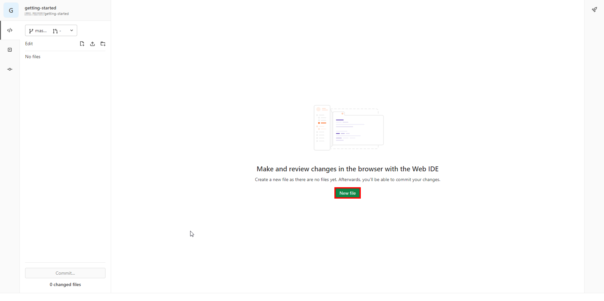
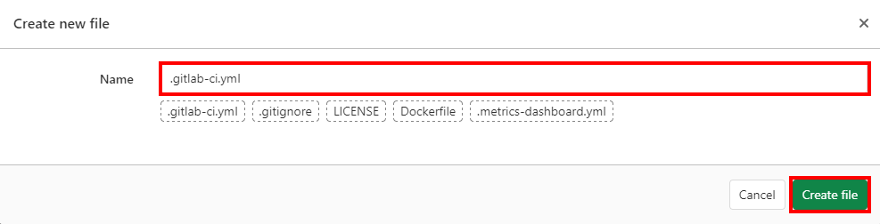
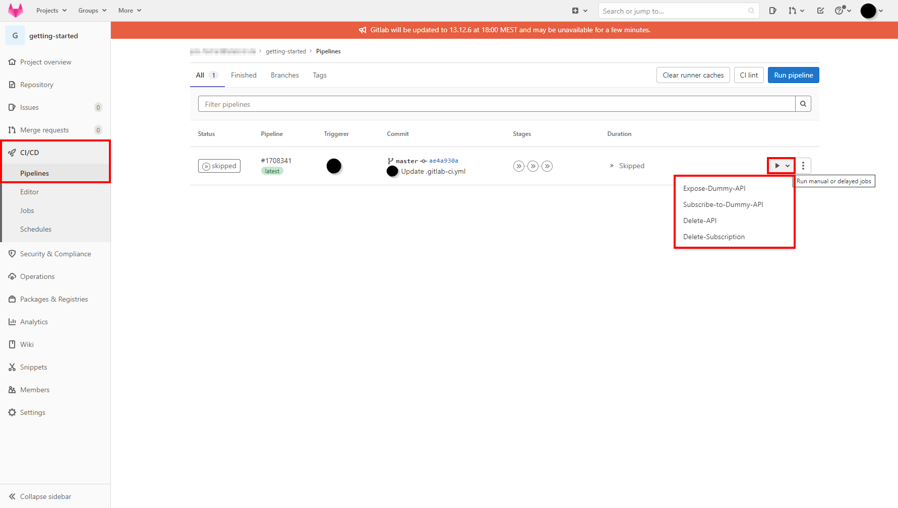

# Getting started with GitLab
GitLab is a git based version-control platform.

## Accessing GitLab

### Prerequisites
- App for 2 factor authentication
    - Android
        - [Google Authenticator](https://play.google.com/store/apps/details?id=com.google.android.apps.authenticator2)
        - [FreeOTP](https://play.google.com/store/apps/details?id=org.fedorahosted.freeotp)
    - iOS: 
        - [Google Authenticator](https://apps.apple.com/de/app/google-authenticator/id388497605)
        - [FreeOTP](https://apps.apple.com/de/app/freeotp-authenticator/id872559395)

### Creating your account
To use GitLab you'll have to set up a new account at [gitlab.devops.telekom.de](https://gitlab.devops.telekom.de/). Internals can use their EMEA1 or EMEA2 account, while externals have to use their ZAM account. In accordance with the platforms security policies, you'll then be led through the process of adding a token for 2 factor authentication via your mobile device (You can find a list of suitable apps in the [prerequisites](#Prerequisites)). This token will provide a second level of security to your account.

### Creating your first project
After logging in you'll be redirected to the [dashboard](https://gitlab.devops.telekom.de/). Here you can create your first project by clicking the `New project` button.


For most cases, a blank project is absolutely sufficent.


Once you've selected the `Create blank project` option just enter your project name and click on `Create project`.


### Setting up the pipeline
This section will feature a high-level explaination on setting up a rover pipeline using `roverctl`. A complete guide on Rover can be found [here](../rover/README.md).

1. We'll start by creating a new file that goes by the name of `.gitlab-ci.yml` using the GitLab UI




2. Once you've created the file you can paste the `.gitlab-ci.yml` from [here](./../StarGate/Stargate_Step-By-Step_Tutorial.md#step-1-download-our-sample-rover-pipeline) and adjust it to your liking.
```yaml
variables:
  RESOURCE_PATH: "$CI_PROJECT_DIR/resource"
  ROVER_TOKEN: "$ROVER_TOKEN"

stages:
  - expose
  - subscribe
  - cleanup

default:
  image: "mtr.devops.telekom.de/tardis-customer/roverctl:<environment>"
  tags: [ "run_sysbox" ]

Expose-Dummy-API:
  stage: expose
  when: manual
  script:
    - roverctl apply -f "expose"

Subscribe-to-Dummy-API:
  stage: subscribe
  when: manual
  script:
    - roverctl apply -f "subscribe"

Delete-API:
  stage: cleanup
  when: manual
  script:
    - roverctl delete -f "expose"

Delete-Subscription:
  stage: cleanup
  when: manual
  script:
    - roverctl delete -f "subscribe"
```

3. Once your pipeline is set up, you're ready to configure rover. A detailed guide on Rover and its configuration can be found [here](../rover/README.md).

### Running your pipeline
Pipelines can be run from the `CI/CD` section. You can use the `play` icon on the right to run the jobs you've previously defined when you created the `.gitlab-ci.yml` 

