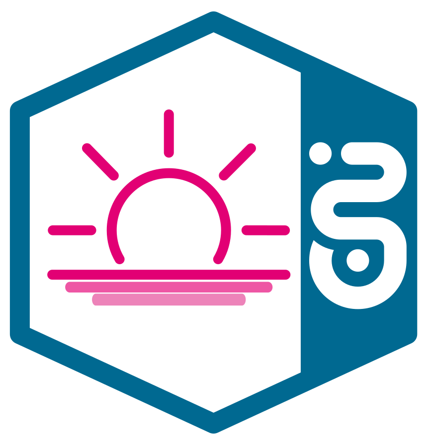
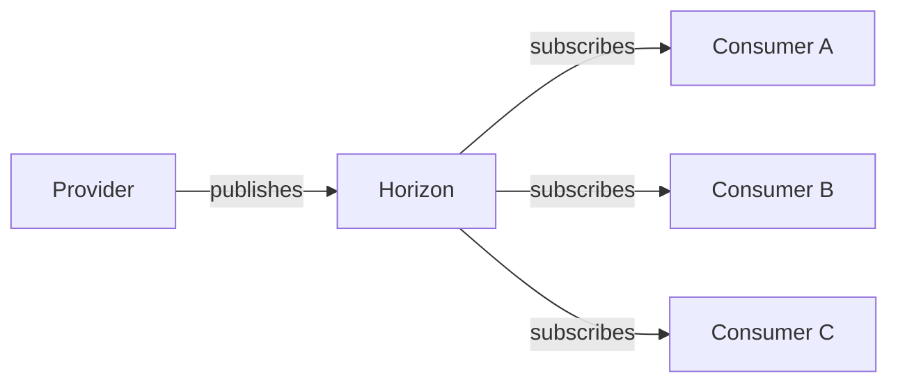
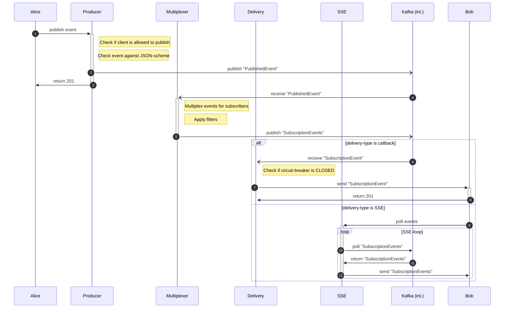
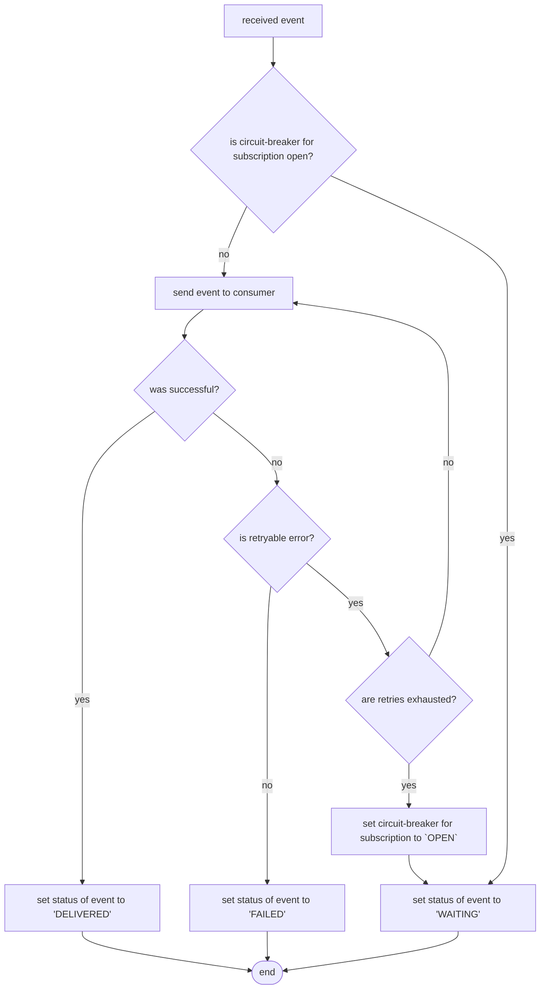
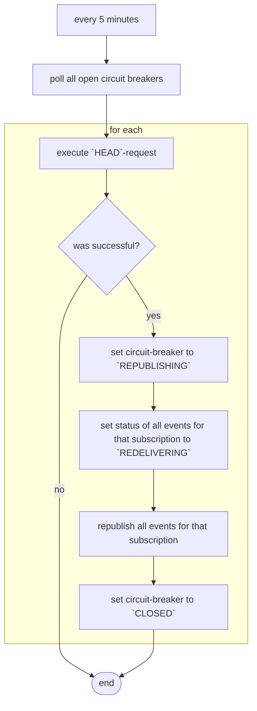

# Horizon


## Overview
### What is Horizon?
Horizon is a cloud intermediary which handles the asynchronous communication between systems through well defined messages ('events').

A system can take the role of a ==provider== or ==consumer== or both. 

When a provider publishes an event of a certain event-type, horizon will distribute this event to consumers that are subscribed to this event-type. Event-types are the de-facto equivalent to topics in a regular Kafka-instance.

Due to this terminology, Horizon is often referred to as a 'Publish/Subscribe-component' or 'Pub/Sub-component' in short. Horizon is a ReST-based, standalone IaaS-component. Horizon does not provide a Kafka-as-a-service.



### When Should I Use Horizon?
You can use Horizon

* when you have systems that publish events and one or more systems who should receive these events
* when the provider should not worry about how many systems receive their events and in which order

You should **not** use Horizon

* when the provider needs an acknowledgement if/when the events arrived at certain consumers
* when you have to guarantee that the events are processed in a given time

### Prerequisites for Using Horizon
All systems using Horizon need to 

* support ReST-based communication
* support OpenID-connect
* send requests to/receive requests from StarGate (Also see [T‧AR‧D‧I‧S IP-addresses](../support/ip-addresses-env.md#common-remarks-about-ip-addresses-per-environment))


=== "As a Provider"

    Providers additionally must

    * establish a workflow for handling approvals in MissionControl for subscriptions of consuming systems

=== "As a Consumer"

    Consumers additionally must
    
    * provide a callback-endpoint that supports `POST`-requests for receiving events and `HEAD`-requests for checking the health-status of the consuming system (also see [Via Callback](#via-callback)) **OR**
    * open a sse-stream to Horizon's SSE-Component (also see [Via SSE](#via-sse))
    
    !!! danger "`HEAD`-requests for checking health-status"
    
        Implementing support for `HEAD`-requests at the callback-endpoint is **mandatory** for consuming systems that receive events via callback. `HEAD`-requests are used by Horizon to check the health of the consuming systems and decides if events are sent to the system. If the `HEAD`-support is not implemented (correctly), consuming systems might not recieve events. Also see section [Error-Handling - Callback](#callback).

### Limitations of Horizon
Horizon also has a few limitations that might influence if and how other systems might use it:

- **Horizon does not guarantee to deliver events in the order they were sent.** However, it is likely that events arrive in the order they were sent, but e.g. due to error-handling this cannot be guaranteed
- **Horizon has a default retention time of max. seven days.** All events older than that will be deleted. If a consuming system was not reachable (for callback) or did not collect events (for SSE) for more that seven days, events might get lost. Via configuration the retention time can be lowered but it can not be set to a value greater than 7 days due to security requirements.
- **Horizon does not provide feedback if an event has arrived at a certain consumer.** Horizon only provides an acknowledgement that the event has been received and will be processed.
- **Horizon uses at-least once delivery.** Horizon currently does not support exactly-once delivery. We cannot guarantee, that the same event will not be delivered more than once, however this should not happen often.

## Usage
Below you can find a simplified sequence-diagram of an asynchronous communication between Alice and Bob (excluding StarGate) both via callback and SSE. Only the good-case is shown here.

!!! info 

    Please note that the whitespace around the diagram cannot be avoided due to a bug.



### Sending Events
In order to send events via Horizon, first an event-exposure and -specification must be defined in the rover.yaml and applied via the rover-cli-tool (also see [Stargate & Rover Handbook](../rover/README.md)). The event-specification can also be defined in a separate file. 

!!! info "Versioning of event-types"

    In order to enable versioning of event-types an event-type always must contain a version (i.e. `foo.bar.v1` or `foo.v1.bar`).

#### Event-specification
The event-specification is a separate resource of type `EventSpecification`. The name of the resource must be the event-type with dashes instead of the dots. In the table below are the fields described that can be set in the `spec`-object.

| Field           | Mandatory | Description                                                                                                                             |
|-----------------|-----------|-----------------------------------------------------------------------------------------------------------------------------------------|
| `type`          | ✅         | The event-type that the exposure is for                                                                                                 |
| `version`       | ✅         | The version of the event-type (i.e. `1.0.0`)                                                                                            |
| `description`   | ✅         | A short description of the event-type                                                                                                   |
| `specification` | ❌         | A JSON-schema which all incoming events are checked against while publishing <br/> Also see [json-schema.org](https://json-schema.org/specification-links.html#draft-2019-09-formerly-known-as-draft-8) |

Below is an example of an event-specification:
```yaml
kind: EventSpecification
apiVersion: tcp.ei.telekom.de/v1
metadata:
  name: order-check-v1
spec:
  type: order.check.v1
  version: '1.0.12'
  description: Events for order fraught detection
```

!!! info ""

    The event-specification can be added to the rover.yaml as a seperate YAML-document, however, it is recommended to put the specifiation in a seperate file within the same folder and execute `roverctl apply -f` on the entire folder.
    If you have a multi-event scenario, you have to apply a seperate event-specification file for every event-type.


#### Event-exposure
The event-exposure is defined in the `spec`-object and follows the schema that can be found [here](additionalFiles/exposure-schema.json).

| Field          | Mandatory | Description                                                                                                  |
|----------------|-----------|--------------------------------------------------------------------------------------------------------------|
| `eventType`    | ✅         | The event-type that the exposure is for                                                                      |
| `visibility`   | ❌         | Can be `world`. <br/> If set to `world` events can also be received by consumers in the internet.            |

Below is an example of a rover.yaml with one exposure:
```yaml
apiVersion: tcp.ei.telekom.de/v1
kind: Rover
metadata:
  name: foo
spec:
  zone: caas
  exposures:
    - eventType: order.check.v1
      visibility: "world"
```


### Receiving Events
In order to receive events via Horizon, first a subscription must be defined in the rover.yaml and applied via the rover-cli-tool (also see [Stargate & Rover Handbook](../rover/README.md)). The subscription is defined in the `spec`-object and follows the schema that can be found [here](additionalFiles/subscription-schema.json). 

| Field                                    | Mandatory                                 | Description                                                                                                                                                |
|------------------------------------------|-------------------------------------------|------------------------------------------------------------------------------------------------------------------------------------------------------------|
| `eventType`                              | ✅                                         | The event-type that the subscription is for                                                                                                                |
| `deliveryType`                           | ✅                                         | Can be `callback` or `server_sent_event`. <br/> How you want to receive the events. Also see [Via Callback](###Via Callback) or [Via SSE]((###Via SSE))    |
| `payload`                                | ✅                                         | Can be `data` or `dataref`. <br/> Use `data` if you want to receive the payload in the event, `dataref` if you want to receive a reference to the payload. |
| `callback`                               | ✅ <br/>(when `deliveryType` = `callback`) | The endpoint that will be called by Horizon to deliver events **and check the health-status of the system**                                                |
| `trigger.`<br/>`responseFilter`          | ❌                                         | The filter that states which fields should be sent to the consumer <br/> Also see [Response-Filter (what)](#response-filter-what)                          |
| `trigger.`<br/>`selectionFilter` | ❌                                         | The filter that states when an event should be sent to the consumer <br/> Also see [Selection-Filter (when)](#selection-filter-when)                       |
| `trigger.`<br/>`advancedSelectionFilter` | ❌                                         | Same as selectionFilter but more advanced, supporting logical operators for complex comparison logic <br/> Also see [Selection-Filter (when)](#selection-filter-when)                       |

Below is an example of a rover.yaml with one subscription:
```yaml
apiVersion: tcp.ei.telekom.de/v1
kind: Rover
metadata:
  name: bar
spec:
  zone: caas
  subscriptions:
    - eventType: order.check.v1
      deliveryType: callback
      payloadType: data
      callback: https://foo.telekom.de/check-order-callback
      trigger:
        advancedSelectionFilter:
          and:
            - eq:
                field: $.processing.state
                value: IN_PROGRESS
            - or:
                - ge:
                    field: $.total.amount
                    value: 100000
                - in:
                    field: $.notify.policy
                    value:
                      - ALWAYS
                      - UNDEFINED
```
#### Approval-process
Once the consumer has applied a subscription, the provider needs to approve the subscription. This way it can be ensured that events are only sent to eligible consumers. However, if a subscription is created where the consumer and provider are within the same team an approval is not necessary.

!!! info ""

    When the consumer applies changes to an already existing subscription a re-approval might be necessary.  

#### Via Callback
(when *`deliveryType` = callback*)

When the consumer wants to receive events via callback, Horizon will send them to the endpoint specified in `callback`. When the consumer returns `200` (fcr) or `201`, Horizon marks the event as delivered successfully. If the consumer returns a different status-code Horizon's error-handling will become active (also see [Errorhandling - Callback](#callback)).

The callback request will contain a gateway token in the `Authorization` header which must be checked by the event consumer service for security reasons. Note that Horizon uses [Enhanced Last Mile Security](../StarGate/#enhanced-last-mile-security-gateway-token) by default.    
It is extremely important that the gateway token is checked carefully by the event consumer. In addition to the basic validty check (expiration and signature) other claims of the token must also be checked to ensure the greatest possible security.  

!!! tip "Mandatory token validation steps for Horizon callbacks"

    1. verify issuer (iss claim) against trusted issuer
    2. verify signature of token
    3. verify, if the token expired
    4. verify requestPath or clientId
    5. verify publisherId claim
    6. verify subscriberId claim

This slightly differs from the [API provider validation steps](../StarGate/README.md#to-do-for-api-provider). For Horizon callbacks the `requestPath` claim does not point to the callback URL, instead it points to a special Horizon callback route on the Stargate gateway, e.g either one of:

* /horizon-aws/callback/v1
* /horizon-caas/callback/v1
* /horizon-cetus/callback/v1
* /horizon-space/callback/v1
* /horizon-canis/callback/v1

For example if your event consumer is in the aws zone you would see a requestPath equal to "/horizon-aws/callback/v1".  
By checking the requestPath you can ensure, that the request is a Horizon callback.  
However, it is easier to check the `clientId` instead of the he `requestPath`: The `clientId` will always be "eventstore" with the only exception that the `clientId` on Prod environments will be "gateway" (*we apologize at this point that this is not yet consistent. This will be addressed in the future.*).  

Tokens sent with Horizon callbacks contain two additional claims: `publisherId` and `subscriberId`.  
Checking the `publisherId` claim ensures, that the event consumer only consumes events from trusted event publishers. The `publisherId` is equal to the client ID which can be found in the provider's application details in MissionControl. If you unsure what to check here, please get in contact with the event provider.  
Checking the `subscriberId` claim is also important since it ensures that only events with the right addressee are getting consumed.  
Both additional checks are important to prevent potential manipulation attacks.  

In order to ensure that only events sent by Horizon (via StarGate) will be processed, it is **mandatory** to add StarGate's issuers to the list of trusted issuers (similar to when providing a regular API). Also see [To Do For API Provider](../StarGate/README.md#to-do-for-api-provider). The list of issuers can be found [here](../StarGate/README.md#issuer-for-last-mile-security-tokens).

!!! danger "`HEAD`-requests for checking health-status"

    Implementing support for `HEAD`-requests at the callback-endpoint is **mandatory** for consuming systems that receive events via callback. `HEAD`-requests are used by Horizon to check the health of the consuming systems and decides if events are sent to the system. If the `HEAD`-support is not implemented (correctly) consuming systems might not recieve events. Also see section [Error-Handling - Callback](#callback).

!!! attention "Stargate-/Spacegate-URLs as callback"

    Currently it is not possible to use Stargate-/Spacegate-URLs as the callback-URL for a subscription.

#### Via SSE
(when *`deliveryType` = server_sent_event*)

When the consumer wants to receive events via SSE, it actively needs to connect to Horizon's SSE-endpoint and stream the events.

Once an event has been streamed to the consumer, Horizon marks this event as delivered successfully.

!!! danger "Retention time"

    Horizon's default retention time of seven days also applies to events sent via SSE. Therefore, a consumer must collect events at least every seven days to prevent events from being lost. To prevent unnecessary load on Horizon and the consuming system, however, it is highly recommended to collect events more often.

!!! info "Timeouts for SSE"

    Horizon will keep the SSE-connection open for approx. 60 seconds. When an event is received during this time, the timeout will be reset. This allows consumers to receive all queued events in one connection. After approx. 60 seconds without any event being sent, the connection will be closed and you will receive an 504 Gateway Timeout error. If you receive this error you can react to that by establishing a new connection if needed.

!!! info "Multiple consuming service-instances / Cutout"
    
    When the consuming system has more than one instance, it can be the case that multiple instances try to call the SSE-endpoint. If that is the case, the older connection will be "cut-out". This way Horizon ensures that only one connection is kept alive per subscription at any time.

Horizon supports two data-formats for streaming events, [W3C-standard](https://www.w3.org/standards/history/eventsource) and plain json-streaming. 

=== "Streaming-example according to the W3C-standard"

    ```json
    data: {"foo": "bar"}
    
    data: {"foo": "bar"}
    ```

=== "Streaming-example with plain json-streaming"

    ```json
    {"foo": "bar"}
    {"foo": "bar"}
    ```

To get events formatted according to the W3C-standard, set the `Accept`-header to `text/event-stream`, for plain json-streaming set the `Accept`-header to `application/stream+json`. If no `Accept`-header is set, Horizon will default to `application/stream+json`.

Below is an overview of all SSE-endpoints per environment. A consumer can also find the SSE-route in MissionControl after the subscription has been applied and approved.

=== "Playground"

    | Zone | SSE-Endpoint                                                                                   |
    |------|------------------------------------------------------------------------------------------------|
    | AWS  | `https://stargate-playground.live.dhei.telekom.de/horizon/sse/v1/<eventType>/<subscriptionId>` |
    | CaaS | `https://stargate-playground.caas-t01.telekom.de/horizon/sse/v1/<eventType>/<subscriptionId>`  |

=== "QA"

    | Zone | SSE-Endpoint                                                                                       |
    |------|----------------------------------------------------------------------------------------------------|
    | AWS  | `https://stargate.qa.dhei.telekom.de/<virtualEnv>/horizon/sse/v1/<eventType>/<subscriptionId>`     |
    | CaaS | `https://stargate-qa.caas-t01.telekom.de/<virtualEnv>/horizon/sse/v1/<eventType>/<subscriptionId>` |

=== "PreProd"

    | Zone | SSE-Endpoint                                                                                |
    |------|---------------------------------------------------------------------------------------------|
    | AWS  | `https://stargate-preprod.live.dhei.telekom.de/horizon/sse/v1/<eventType>/<subscriptionId>` |
    | CaaS | `https://stargate-preprod.caas-t01.telekom.de/horizon/sse/v1/<eventType>/<subscriptionId>`  |

=== "Prod"

    | Zone | SSE-Endpoint                                                                        |
    |------|-------------------------------------------------------------------------------------|
    | AWS  | `https://stargate.prod.dhei.telekom.de/horizon/sse/v1/<eventType>/<subscriptionId>` |
    | CaaS | `https://stargate.caas-p01.telekom.de/horizon/sse/v1/<eventType>/<subscriptionId>`  |


#### Callback vs. SSE

Whether to use callback or SSE depends on the use-case and general conditions like the accessibility of the event consumer.  
Have a look at the following table, which might ease the decision:

|                                                         | Callback | SSE |
|---------------------------------------------------------|----------|-----|
| Consumer must allow inbound traffic                     | yes      | no  |
| Consumer must provide an endpoint reachable from T‧AR‧D‧I‧S | yes      | no  |
| Consumer must validate Gateway token                    | yes      | no  |
| Consumer musst issue Iris token                         | no       | yes |
| Circuit-Breaker and retry functionality                 | yes      | no  |
| Events can be fetched using a cronjob or serverless     | no       | yes |
| Events can be processed in parallel                     | yes      | no  |

In addition we want to point out, that currently you will likely get less delay in delivery when using callback compared to SSE, because of the way our architecture is implemented.

#### Adjusting the retention times (TTL)

It is possible to lower the default retention time of 7 days, which might be necessary for some use cases. You can achieve that by specifying the optional field `eventRetentionTime` for your subscription.   
Possible values are currently `1h` (one hour), `1d` (one day), `3d` (3 days), `5d` (5 days), `7d` (7 days, which is the current default). If you omit this field, the default of 7 days will be applied.  

```yaml
apiVersion: tcp.ei.telekom.de/v1
kind: Rover
metadata:
  name: quickstart
spec:
  zone: aws
  subscriptions:
  - eventType: de.telekom.eni.quickstart.v1
    callback: https://mockserver-demo.test.dhei.telekom.de/quickstart
    deliveryType: callback
    payloadType: data
    eventRetentionTime: 1h # possible values 1h, 1d, 3d, 5d, 7d (7d=default)
```
The rentention time currently only applies to the event message itself not to any meta data, this is why it's still possible to list events in the user interface that are older than configured retention time. Therefore you will be still able to track these events for the time period of 7 days but you might not be able to access the payload of the events. Also keep in mind, that there is no chance that already deleted events can be re-delivered.

!!! info "When to lower the event retention time"
   
      There might be use cases that do not require a retention time of 7 days which is being used by default, for example if the events contain data that is only relevant for several minutes or hours. If the event is just a simple notification directed to end-users to inform about time-limited campaigns, it might not be necessary to keep them in Horizon for a whole week.  
      We recommend to lower the event retention time if your use case does not require default retention time of 7 days. This saves resources on the TARDIS side and takes load off the Horizon components.  
      If you do not care at all about redelivery in case your consumer service experiences a downtime or if you rather want to use Horizon in a fire and forget manner, `1h` might be suitable for you.

!!! info "Events might never reach the consumer"
    
    In case a consumer service suffers a downtime and if the circuit-breaker is enabled (default configuration), please keep in mind that, as soon as the consumer service is up again, Horizon won't be able to re-deliver events that have been deleted already according to the configured retention time. 

!!! attention "Retention times cannot be changed for already published events"

    Note, that you cannot currently change the retention time of events stuck in WAITING state due to an open circuit-breaker. Likewise it's currently not possible to change the retention time of events that have not been fetched yet via SSE.

While adjusting the retention time is currently completely optional, we could think of dynamically lowering it depending on the published volume and payload size of events for an event type, in the future.

### Consumer-side filtering
In order to customize which events are received by a consumer, Horizon allows two types of filters that can be defined on a subscription-basis.

!!! attention "Filter changes might happemn without being noticed by the provider"

    Consumer-side filters can be changed by the consumer without being noticed by the event provider. Currently event providers won't be notified when consumer-side filters are being changed by the consumer.  
    If it's necessary for security reasons to restrict the data sent to the consumer by using filters, we advise you to define [scopes](#Scopes) on the event provider side to remain in control over the data at all times.

#### Response-Filter (what)
The first type of filter is the response-filter that defines *what* fields should be sent to the consumer. This can come in handy i.e. when the event contains customer-data that should not be sent to the consumer. 

A response-filter is defined by providing an array of JSON-paths of the fields that *should* be sent to the consumer in the `responseFilter`-field in the `trigger`. Fields that cannot be resolved will be ignored during the runtime. Below you can find an example of a response-filter in the rover.yaml:
```yaml
[...]
spec:
  zone: aws
  subscriptions:
    - eventType: foo.bar
      [...]
      trigger:
        responseFilter:
          - total.amount
          - total.currency
          - order.number
```
With the filter above the following event sent by the provider...
```json
{
  "order": {
    "number": 2389848,
    "shoppingCartRef": "/shoppingCart/b717b88c-ba6d-43be-b4f9-ad0316a60755"
  },
  "customer": {
    [...]
  },
  "total": {
    "amount": 39.99,
    "currency": "EUR",
    "taxRate": 19
  }
}
```
...would result in the following event being sent to the consumer.
```json
{
  "order": {
    "number": 2389848
  },
  "total": {
    "amount": 39.99,
    "currency": "EUR"
  }
}
```

#### Selection-Filter (when)
In addition to the response-filter one can also set a selection-filter that defines *when* an event should be sent to the consumer.

A selection-filter is defined by providing a map of string to string in the `selectionFilter`-field in the `trigger`, where the key is a jsonpath object describing a (nested) property in the data, and the value is the expected value.  
Below you can find an example of a selection-filter in the rover.yaml:

```yaml
[...]
spec:
  zone: aws
  subscriptions:
    - eventType: pets.v1
      [...]
      trigger:
        selectionFilter:
          pets.cat.color: tabby
          pets.dog.teeth: long
```

**Event data example**
``` json
{
   "pets":{
      "cat":{
         "color":"tabby",
         "gender":"female",
         "fur":"long"
      },
      "dog":{
         "color":"black",
         "teeth":"long"
      }
   },
   "toys":[
      "ball",
      "car",
      "bicycle"
   ]
}
```

For this example, the following selection filter applies:
``` yaml
trigger:
  selectionFilter:
    pets.cat.color: tabby
    pets.dog.teeth: long
```
but the following does not apply because the dog has no information about its fur:
``` yaml
trigger:
  selectionFilter:
    pets.cat.color: tabby
    pets.dog.fur: short
```

The slection-filter described above only allows for simple equal comparisons, that why another selection-filter called "Advanced Selection Filter" has been introduced which supports several operators for comparisons including logical operators like "and" and "or" and therefor allows for more complex filtering scenarios.  
This more advanced selection-filter can be defined by adding a filter-operator to the `advancedSelectionFilter`-field in the `trigger`. The syntax for filter-operators can be found [here](Filter_Operators.md). Below you can find an example of a selection-filter in the rover.yaml:

```yaml
[...]
spec:
  zone: aws
  subscriptions:
    - eventType: foo.bar
      [...]
      trigger:
        advancedSelectionFilter:
          and:
            - eq:
                field: $.processing.state
                value: IN_PROGRESS
            - or:
                - ge:
                    field: $.total.amount
                    value: 100000
                - eq:
                    field: $.notify.policy
                    value: ALWAYS
```
!!! info ""
    
    Currently a maxium of 42 (nested) operators is supported.

!!! attention "Deprecation"

    Although we still support the simple `selectionFilter`, we suggest using the new `advancedSelectionFilter` which can be used for almost every filtering scenario. In the future `selectionFilter` might be depricated.

### Scopes

Scopes allow the publisher of events to define filters within a certain scope that will only be applied when the consumer specified the respective scope in the event type subscription.  
Scopes give event publishers full control over their data since publishers are now able to define filters according to multiple target audiences which will be mapped to a scope. These filters are controlled and applied by the provider side and still can be combined with filters defined by the consumer-side.  

Scopes are configured by adding the `scopes` list field to an event type exposure. Each entry of the list requires a `name` and `trigger` fied. The `trigger` field syntax is the same as descirbed in the consumer-side filtering section above.  
The following shows an example where two scopes ("device-orders" and "service-orders") are defined for an event type exposures:  

```yaml
apiVersion: tcp.ei.telekom.de/v1
kind: Rover
metadata:
  name: orders-provider
spec:
  zone: caas
  exposures:  
  - eventType: orders.v1
    scopes:
    - name: billing
      trigger: 
        responseFilter:
        - orderId
        - customerId
        - orderItem.productid
        - orderItem.quantity
    - name: device-orders
      trigger: 
        advancedSelectionFilter:
          eq:
            field: type
            value: DEVICE
        responseFilter:
        - orderItem.productid
        - orderItem.quantity 
    - name: service-orders
      trigger: 
        advancedSelectionFilter:
          eq:
            field: type
            value: SERVICE
        responseFilter:
        - orderItem.productid
        - orderItem.quantity 
```

The configuration for consumers, that are only interested in statistics about device orders but not in customer related data could look like this:  

```yaml
apiVersion: tcp.ei.telekom.de/v1
kind: Rover
metadata:
  name: deviceorders-consumer
spec:
  zone: caas
  subsciptions:  
  - eventType: orders.v1
    deliveryType: server_sent_event
    scopes:
    - deviceorders
```

The consumer can list as many scopes as they like and are allowed to additionally specify consumer-side filters which Horizon will evaluate after the provider-side filters have been applied.

!!! attention "Scope changes on consumer side are restricted"

    To ensure that the event provider retains control over its data at all times, it is not possible for the event consumer to simply change previously configured scopes again. The scopes as they were originally configured when the subscription was created must remain unchanged. There is one exception: You can always remove previously configured scopes but you won't be able to add them again or add different ones.   
    In order to subscribe with a different set of scopes you as consumer will need to remove the subscription completely and create a new subscription with the new set of scopes. This will start the approval flow once again and the event provider will need to approve this new subscription again.  
    Note, that this restriction does not apply to consumer-side filters, which can be changed any time.

#### Default scopes

Event publishers can also overwrite a special scope named `default` which always applies when a consumer did not specify a scope. With a default scope the publisher can specify a most restrictive default filter.  Note, that default filters won't be evaluated at all when the consumer specifies a scope. So, filters of scopes won't be combined with the default filter.  

Here's an example how the default filter can be overwritten:

```yaml
apiVersion: tcp.ei.telekom.de/v1
kind: Rover
metadata:
  name: orders-provider
spec:
  zone: caas
  exposures:  
  - eventType: orders.v1
    scopes:
    - name: default
      trigger:
        responseFilter:
        - orderItem.productid
        - orderItem.quantity     
```

If the publisher does not overwrite the default filter, it will be always (no filtering at all):

```yaml
- name: default
  trigger: {}
```

### Multiple publishers

In general there can be only one owner of an event type and usually only the owner is allowed to publish events for this event type. Any other publisher would receive a `403 forbidden` error code for trying to publish an event for an event type that is not owned by the publisher.  
For scenarios where multiple applications should be able to publish events of the same event type, the "Multiple publishers" features has been introduced.  
This feature allows owners of an event type to specify which other clients should also be allowed to publish events of that type. This can be easily controlled by the list field `additionalPublisherIds` as you can see in the following example:

```yaml
apiVersion: tcp.ei.telekom.de/v1
kind: Rover
metadata:
  name: orders-provider
spec:
  zone: caas
  exposures:  
  - eventType: orders.v1
    additionalPublisherIds:
    - hub--team--additional-orders-provider-x
    - hub--team--additional-orders-provider-y
```

The `additionalPublisherIds` list takes clientIds as values. You will find the clientId in the details of your application in MissionControl.


!!! attention "All publisher applications must be in the same zone"
   
      Note, that the multiple publishers feature only works when the specified additional publishers are configured in the same zone as the original owner of the event type otherwise the will still get a `403 forbidden` error.

!!! attention "Additional publishers do not need to configure anything for this feature"
   
      The applications named in `additionalPublisherIds` do not have to expose the EventType additionally - this is not possible anyway, because it is still valid that only one application can expose a certain EventType within an environment.

Applications that have been specified as additional publishers technically have no ownership over the event type and also have no direct relationship to the application that exposes the event type. Therefore additional publishers won't be able to track the published events in Horizon's user interface.  
In addition to this limitation the true owner of the event type currently is not able to differentiate in the UI which publisher has sent an event. This is something we will be working on in the future.  

## Error-Handling
### Callback
In order to keep Horizon and the subscribing system safe, Horizon has two mechanisms in place for error-handling.

The first one are direct retries performed by the delivery-component. When the subscribing system is not reachable for a short period of time or returns a retryable return-code (also see table below), the delivery-component will try to send the event periodically to the subscribed system. This can also be seen in the subgraph "Delivery" below. If the subscribing system returns a non-retryable return-code, the event will be set in status `FAILED` and a redelivery will not be attempted.

!!! info "Backoff-period"

    The delivery-component will increase the time between retries exponentially.

If the direct retry-mechanism does not succeed (i.e. the subscribing system was unreachable for a longer period of time), the circuit-breaker for that subscription will be opened. Newly published events that also should be delivered to this subscription will then be directly set to the status `WAITING`. Other subscribers for that event-type will still receive events.

!!! danger "Retention time"

    Events in status `WAITING` are also effected by Horizon's default retention time of seven days. When a subscribing system is not reachable for seven days events might be lost.

Simultaneously the circuit-breaking-component will check all open circuit-breaker every 5 minutes and send a HEAD-request to all subscribing systems with an open circuit-breaker. When the subscribing system answers with a successful return-code, the circuit-breaker for that subscription will be set to `REPUBLISHING` and all events that are in status `WAITING` will be delivered to the subscribing system. This can also be seen in the subgraph "CircuitBreaker" below.

| Successful (for `POST`) | Successful (for `HEAD`) | Retryable                 |
|-------------------------|-------------------------|---------------------------|
| `200, 201`              | `200, 201, 204`         | `401, 429, 502, 503, 504` |
_HTTP-codes returned by subscribing system_

!!! danger "`HEAD`-requests for checking health-status"

    Implementing support for `HEAD`-requests at the callback-endpoint is **mandatory** for consuming systems. If the `HEAD`-support is not implemented (correctly) consuming systems might not recieve events.

Error handling in the delivery-component:


Error handling in the circuit-breaking-component:


#### Disable circuit-breaker functionality

It is possible to opt-out from the circuit-breaker functionality completely by using the flag `circuitBreakerOptOut: true`, for example:

```yaml
apiVersion: tcp.ei.telekom.de/v1
kind: Rover
metadata:
  name: quickstart
spec:
  zone: aws
  subscriptions:
  - eventType: de.telekom.eni.quickstart.v1
    callback: https://mockserver-demo.test.dhei.telekom.de/quickstart
    deliveryType: callback
    payloadType: data
    circuitBreakerOptOut: true
```
By default `circuitBreakerOptOut` is set to false, which means that the circuit-breaker functionality is enabled by default. When set to true, no circuit-breaker will be opened when a event could not be sent to the consumer service after several retries.  
Even if opted out from circuit-breaker functionality Horizon will still have retries with exponential backoff periods in place. If the circuit-breaker has been disabled and all retries did not succeed the event will be marked as `FAILED` instead of `WAITING`.

!!! info "When to disable the circuit-breaker"
   
      There might be use cases that do not require the circuit-breaker functionality, for example if you expect end-users to restart a (non-ciritical) process on their own if it has been terminated, ran into an error, or showed no feedback at all. You might also want to ask yourself: "Is the event still relevant when my service has been down for some minutes?". It pretty much depends on the use-case whether it makes sense to disable the circuit-breaker or not.  
      We recommend to switch off the circuit-breaker if your use case does not require this feature. This saves resources on the TARDIS side and takes load off the Horizon components.

!!! attention "Be careful when disabling the circuit-breaker"
   
      When the circuit-breaker functionality has been disabled and the consumer service has a downtime of several minutes which exceed the retry period, events during that time won't be delivered and the delivery won't be retried automatically at a later time.  
      In the future, there will be a way to redeliver these failed events via API, but this feature is not currently available. Please keep that in mind.

### SSE
When the delivery-type for a subscription is set to `SSE`, the subscribing system is responsible for fetching the events from Horizon. Therefore, a dedicated error-handling is not implemented. 

!!! danger "Retention time"

    Horizon's default retention time of seven days also applies to events sent via SSE. Therefore, a consumer must collect events at least every seven days to prevent events from being lost. To prevent unnecessary load on Horizon and the consuming system, however, it is highly recommended to collect events more often.

## FAQ

The Horizon FAQs moved to the central [FAQ page](https://developer.telekom.de/docs/src/tardis_faqs/Horizon/).

## Contact
For questions or problems regarding Horizon please contact us via our [ServiceDesk](https://jira.telekom.de/servicedesk/customer/portal/522/group/2775).

For feature-requests contact Horizon's PO [Mike Herwig](mailto:mike.herwig@telekom.de).

*[fcr]: For compatability reasons
*[sse]: Server-sent events
*[SSE]: Server-sent events
