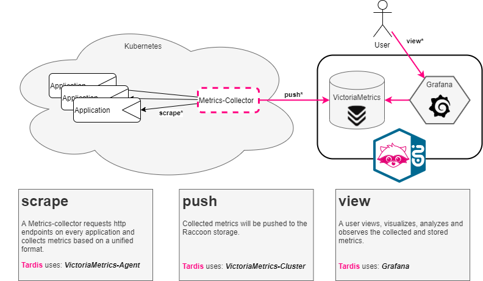

# Raccoon

## What it is

Raccoon is a managed service to store and/or visualize metrics data from platforms and applications to enable up-to-date insight into their operational health status.

The tool stack is based on VictoriaMetrics (VM) as metrics store and Grafana as user interface.

 _How it looks in Kubernetes:_

## How Raccoon supports me

Applying self service ([check out the guide](Raccoon_Self_Service.md)) users can

* acquire a dedicated VM data store where they can push to and store metrics data
* get access to their own Grafana organization and [graphical user interface](grafana/README.md) where they can...
    * visualize data from their VM store or from additional remote *Grafana datasources*
    * attach the [T‧AR‧D‧I‧S public traffic metrics](Raccoon_Self_Service.md#subscribing-to-public-tardis-metrics) as datasource
    * create dashboards and alerts on top of these datasources and 
    * manage users and permissions within the context of their organization

* view [metrics of the T‧AR‧D‧I‧S API Gateway traffic](../StarGate_Environment_Overview.md#raccoon-grafana-ui) per environment via public dashboards.
* utilise [metrics collector](products-as-enabler/Metrics_Collector.md) and/or [grafana-cli](products-as-enabler/Grafana_Cli.md) for a faster start into Monitoring.
