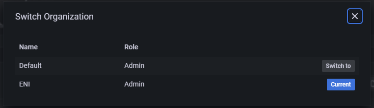
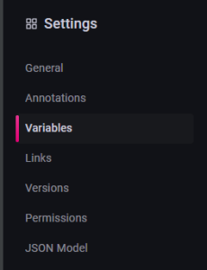
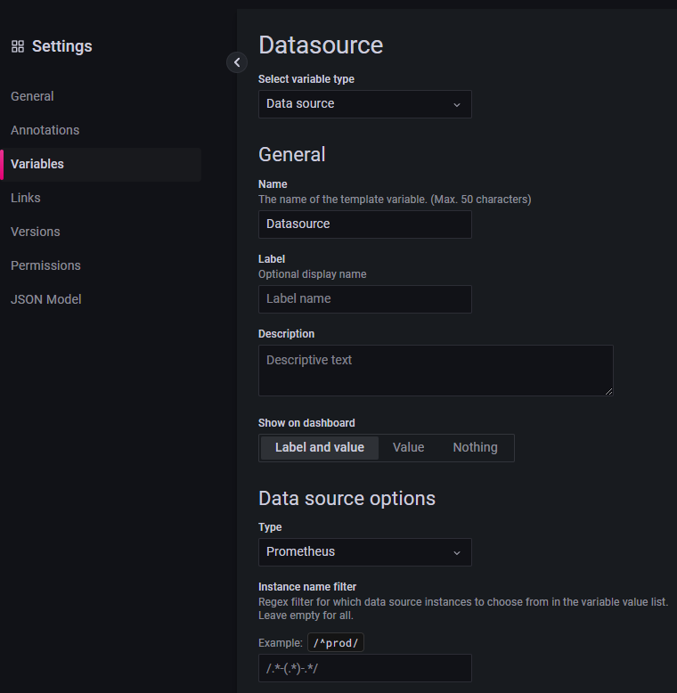
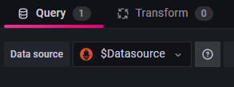
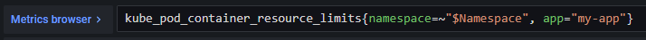
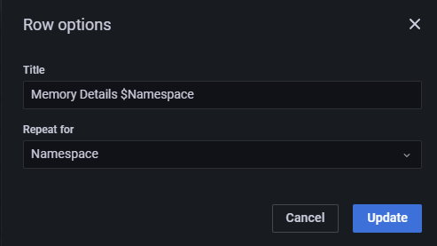
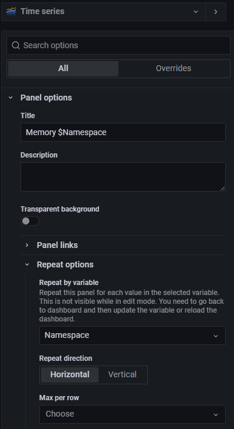

# HowTo´s

## Switch an organization

* Hover over the profile icon at the bottom left corner (could look different from illustration below).
* Click on 'Switch organization' item at the top of the list.
* Now a pop-up should appear, showing current active and available organizations. Select the desired organization by clicking 'Switch to' next to it.

## Add users to my organization

New users need to login to Grafana initially.

Then following steps are possible:
* Invoke Grafana and switch to your organization.
* Hover over the **gear wheel** and select **Users**.
* Click on the blue **Invite** button.
* Now enter the mail address of the user into **Email or username** in **lowercase** and uncheck **Send invite email**.
* After pressing the blue **Submit** button, the user needs to refresh the page and switch the organization.

## Manage dashboards and alert rules via Gitlab

Grafana can be managed by [HTTP-API](https://grafana.com/docs/grafana/latest/developers/http_api/). It´s the same API Grafana itself is using.

To store and manage dashboards or alert rules from Gitlab we created the [grafana-cli](../products-as-enabler/Grafana_Cli.md).

## Create dynamic dashboards

A dynamic dashboard is not another type of dashboard. 
It´s more how to configure/design querys in panels.

### Using variables

Variables are creatable in the dashboard configurations:

#### Switch environments based on datasources

Depending on the use case you can for example use variables as switch between environments.
For example you work with multiple metricsTenants of the Raccoon-Self-Service you will get a datasource per metricsTenant.

Grafana gives the option to create variables from type **data source** with combination to set the datasource type like **Prometheus**:

After creation this variable will be shown at the top of your dashboard.

Now to use this variable you have to update every existing panel:

Every panel can use different datasources. 
To unify them and enable switching easily between environments you set your created datasource in the **Data source** field and apply the panel.

#### Filter for specific lables

Another use case could be to filter for kubernetes namespaces:

This variable uses a dynamic datasource from the `$Datasource` variable, 
queries every metric with `up{app="my-app"}` and filters with a regex `/namespace='([^"]*).*/` for available namespaces.
This variable will be shown at the top of your dashboard after creation.

Now with this variable you are able to filter in every query:

You are to use multiple variables in a query as well. 

#### Repeating rows and panels

##### Rows

Variables are also usable in rows. To do this configure in the settings of a row which variable to repeat for:

Now every generated row contains the same panels and filters the chosen variable for one of the values.
The querys in your panels need to use this variables too, so that the result will be filtered to the related value of the generated row.

##### Panels

As with the rows you can repeat panels by configure it in the panel options:

Add the variable to your queries in the panel too, so that the result will be filtered to the related value of the generated panel.
