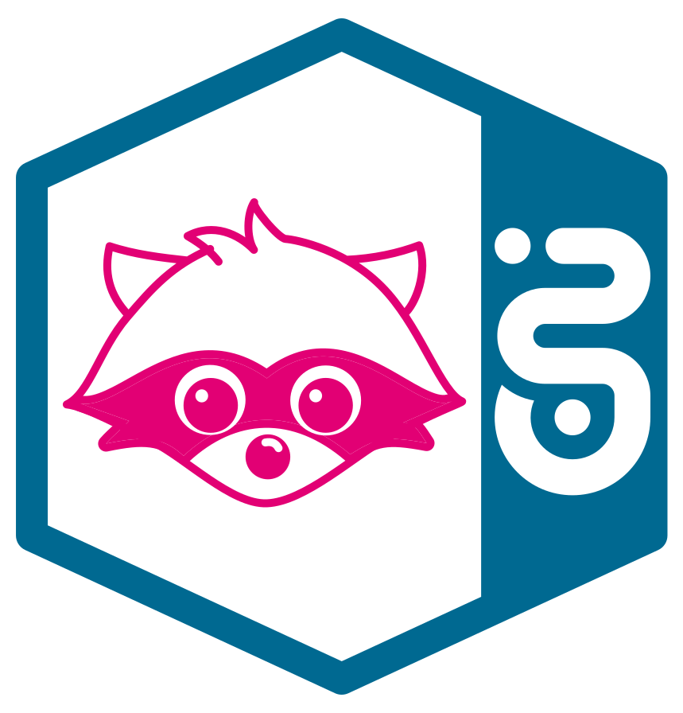

# Grafana

Grafana is the UI of Raccoon and also of Raccoon-as-a-Service and Raccoon-Self-Service.

Use Grafana to visualize metrics in your metric store (when used) or create *Grafana datasources* to access metric stores from external sources.

## Access 

Grafana is connected to [Iris](../../Iris/README.md). Iris let´s you login by an EMEA account. On our new Grafana 9 instances ZAM is possible too. 

## Organizations

Grafana enables managing teams or bigger communities in organizations.
Every organization is isolated and allows to manage teams, folders, dashboards, alert rules and more. 

### Using Raccoon-Self-Service

With initializing an organization you and your Mission-Control team members obtain admin rights for the initialized organization.
Afterwards, Grafana's user management will be independent of team changes in Mission-Control.

Becoming admin of the organization enables you to manage existing and new members and their rights. 

### Default organization

The default organization with name 'Main Org.', 'Default' or 'public' is always available on Grafana and has the `orgId=1`. 
Every user gets the viewer rights after first login to a Grafana instance.
With the viewer role you aren´t able to create, update or delete dashboards or something else.

T‧AR‧D‧I‧S is using the default organization to provide public dashboards.

## Folders and dashboards

Grafana allows to create folders as an additional layer to split dashboards between teams, topics or other criteria.
Users and teams can get the viewer, editor or admin role of a folder and a dashboard. Roles on folder layer will be inherited to the dashboards within the folders.

A dashboard can have several panels with different types of visualizations.

Refer to the official [Grafana docs](https://grafana.com/docs/grafana/latest/dashboards/) for more details.

## Alerting

Grafana enables to create alerts on metrics. There are a number of alert channels (''contact points'' in Grafana 9) available to send the alert messages, like webhooks, WebEx, SMTP. We as T‧AR‧D‧I‧S are using the [CEIS](https://ceis.telekom.de/) integration.

!!! Attention 
    With Grafana 9 much of the alert management changed. 
     Check out the [unified-alerting](Unified_Alerting.md).
     With Grafana 8 the [legacy-alerting](Legacy_Alerting.md) is important. 

## Datasources

Datasources connect Grafana to data stores. Many different stores are supported.

More details you´ll find [here](https://grafana.com/docs/grafana/latest/datasources/).

### Datasources to metricsTenants of Raccoon-Self-Service

To get access to metricsTenants of Raccoon you have to subscribe to it and request the `observe` right.
After the subscription is granted you´ll get a new datasource in your grafana organization.

## View T‧AR‧D‧I‧S API Gateway traffic

T‧AR‧D‧I‧S provides T‧AR‧D‧I‧S API gateway traffic metrics in the [default organization](#default-organization) of Grafana. 
The instances are linked [here](../../StarGate_Environment_Overview.md#raccoon-grafana-ui).

