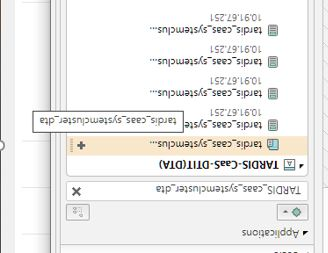
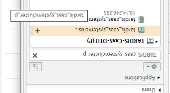
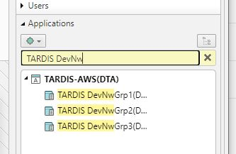
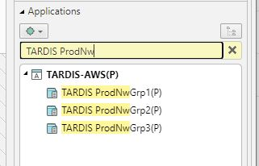
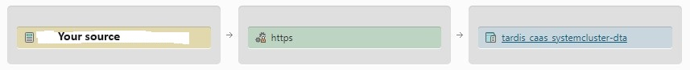
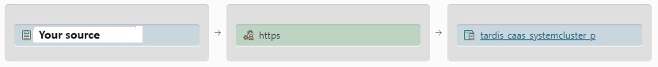
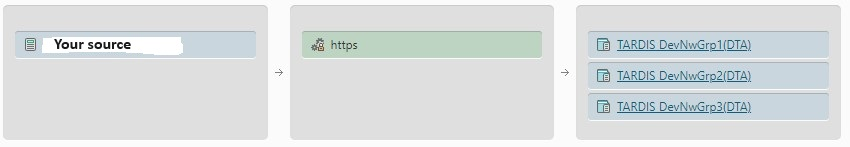
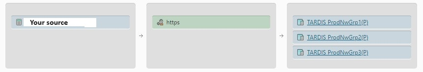

# Connectivity and firewall 

## 1. Internal Access (Hitnet/CNDTAG)

On connection side there are two directions possible (incoming/outgoing).   
This description is written from the customer's point of view.

### Application as API consumer
 
This clearance should be done on consumer side and needs not be done from T‧AR‧D‧I‧S team.  
In Fiat/Tufin you need to add your system as source and T‧AR‧D‧I‧S as target and connect them with the desired port (usually it is https).

For the different environments here are pictures of the prepared application groups you can use in your request.

| **CaaS Non-Prod** | **CaaS Prod** | 
| ----------------  | ------------- | 
|  |  | 

| **AWS Non-Prod** | **AWS Prod** | 
| ---------------  | ------------ | 
|  |  |

Here are a few example of what the request should look like:

Caas Non-Prod    
  
Caas Prod  
  
AWS Non-Prod  
  
AWS Prod  
  

### Application as API provider  

When you want to expose an API on T‧AR‧D‧I‧S then the upstream url/IP's needs to be opened on firewall side from the T‧AR‧D‧I‧S team.  
For that case please open a ticket at our [Service Desk](https://jira.telekom.de/servicedesk/customer/portal/522/create/5878).

### Common remarks about IP addresses per environment  

Below you will find a list of IP addresses of the T‧AR‧D‧I‧S environments. All IP addresses are related to Stargate, Iris and Horizon.

* *Incoming* in these tables means that these are the IP addresses were the requests to Stargate or Iris will **be placed**.
* *Outgoing* in these tables means that these are the IP addresses were the responses from Stargate or Iris are **coming from**.  

### Platform AWS  (Zone aws)

*Table A:*

In the following table you can find the whole subnets for our AWS environment, which we recommend to apply for firewall clearances.  
Thats keeps you safe for any modifications in the future. If it's not possible, please get in contact with us.

| . . . . . . . .  --> To T‧AR‧D‧I‧S  /  **incoming**   . . . . . . . . . | | . . . . . . . . . . . From T‧AR‧D‧I‧S  /  **outgoing**  -->   . . . . . . . .  |   
| ----------------  | ------ | ---------------- | 

| Non-Production   | Production       |             | Non-Production   | Production       |   Port |
| ---------------- | ---------------- |-------------| ---------------- | ---------------- |--------|
| |         |             |           |        |  | 
| 10.125.115.0/25   10.125.114.0/25   10.125.114.128/25  | 10.175.130.0/27   10.175.130.32/27 |             | 10.125.115.0/25   10.125.114.0/25   10.125.114.128/25  | 10.175.130.0/27   10.175.130.32/27  | 443 |
|  |  |             | **AWS & OCP@AWS** located customer need to apply the private IP ranges to their security groups:     100.70.32.0/21   100.70.40.0/21   100.70.48.0/21| **AWS & OCP@AWS** located customer need to apply the private IP ranges to  their security groups:     100.65.0.0/18   100.65.64.0/18   100.65.128.0/18 |  443  |

### Platform CAAS@DTIT (Zone cetus) 

*Table B:*

In the following table you can find the assignment of the *Physical Envionments* of application T‧AR‧D‧I‧S to the physical IP addresses of the platform:

| Physical Environment | Purpose                                             | IP-Address (incoming) | IP-Address (outgoing) | Port |
| -------------------- | --------------------------------------------------- | --------------------- | --------------------- | ---- |
| Playground           | SandBox environment                                 | recent t01: 10.91.67.251/32   **new t21/cetus: 10.103.66.254/32**     | recent t01: 10.169.88.0/22    **new t21/cetus: 10.103.66.0/24**     | 443  |
| Preprod              | Integration/Testing environment with partner system | recent t01: 10.91.67.251/32   **new t21/cetus: 10.103.66.254/32**     | recent t01: 10.169.88.0/22    **new t21/cetus: 10.103.66.0/24**     | 443  |
| Prod                 | Production environment                              | recent p01: 10.14.246.235/32   **new p21/cetus: 10.103.67.254/32**     | recent p01: 10.105.222.0/23    **new p21/cetus: 10.103.67.0/24**    | 443  |

*Table C:*

In the following table you can find the assignment of the *Virtual Envionments* of the partner applications to the physical IP addresses of the platform:

| Virtual Environment | Purpose                  | IP-Address (incoming) | IP-Address (outgoing) | Port |
| ------------------- | ------------------------ | --------------------- | --------------------- | ---- |
| AV                  | Release Testing OSS      | recent t01: 10.91.67.251/32      **new t21/cetus: 10.103.66.254/32**   | recent t01: 10.169.88.0/22    **new t21/cetus: 10.103.66.0/24**   | 443  |
| FRV                 | Production Reference OSS | recent t01: 10.91.67.251/32      **new t21/cetus: 10.103.66.254/32**   | recent t01: 10.169.88.0/22    **new t21/cetus: 10.103.66.0/24**   | 443  |
| FRV                 | Production Reference OSS | recent t01: 10.91.67.251/32      **new t21/cetus: 10.103.66.254/32**   | recent t01: 10.169.88.0/22    **new t21/cetus: 10.103.66.0/2**4   | 443  |
| RV                  | Last&Performance OSS     | recent t01: 10.91.67.251/32      **new t21/cetus: 10.103.66.254/32**   | recent t01: 10.169.88.0/22    **new t21/cetus: 10.103.66.0/24**   | 443  |
| CIT2                | Release Testing BSS      | recent t01: 10.91.67.251/32      **new t21/cetus: 10.103.66.254/32**   | recent t01: 10.169.88.0/22    **new t21/cetus: 10.103.66.0/24**   | 443  |
| CIT4                | Production Reference BSS | recent t01: 10.91.67.251/32      **new t21/cetus: 10.103.66.254/32**   | recent t01: 10.169.88.0/22    **new t21/cetus: 10.103.66.0/24**   | 443  |
| SIT                 | Production Reference OSS | recent t01: 10.91.67.251/32      **new t21/cetus: 10.103.66.254/32**   | recent t01: 10.169.88.0/22    **new t21/cetus: 10.103.66.0/24**   | 443  |  
  

## 2. External Access - Spacegate (Internet)  

Attention: Whitelisting may be necessary.

### Outgoing IP's (AWS) (Zone space)

Spacegate communication is using a FPA (Forward Proxy Area).  
There are fixed IP's given for it.  

CCOE introduced the FPAv2 in summer 2023   
(https://ccoe.pages.devops.telekom.de/teams/aws/website/docs/network/fpav2).  
Therefore comes a change with the outgoing IP's.  

The new ones are these:  
 **FPAv2 data:**  
| Environment |  First IP-Address  | Second IP-Address | Third IP-Address |      
| ----------- | ------------------ | ----------------- | -----------------|  
| Prod: | 3.64.233.199 | 3.77.173.57 | 52.29.230.29 (new from 30.09.23 )  |  
| Non-Prod: | 3.77.26.88 | 18.157.189.121 |  18.192.174.224  |  
  
 **(Old) FPAv1 data:**  
| Environment |  First IP-Address  | Second IP-Address |  
| ----------- | ------------------ | ----------------- |  
| Deprecated-Prod: | 52.57.81.56 | 18.156.108.28 |  
| Deprecated-Non-Prod: | 18.156.62.122 | 18.156.110.165 |  
  
### Outgoing IP's (CaaS@DTIT) (Zone canies)

Please raise a ticket when there are some requirements on your/api providers side.

Detailed information is provided on WiKi Page of CaaS Team:  
https://wiki.telekom.de/pages/viewpage.action?pageId=998281917
